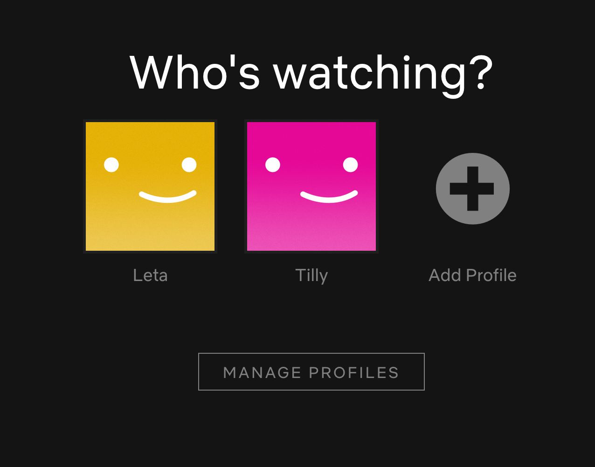

## Learning Goals

* Be able to correctly identify all the parts of the box model
* Use the box model to position elements on a webpage

## Vocab

- `Box Model` In CSS, this can be thought of as a box that wraps every HTML Element
- `Content` The content of the box, where images and text appear.
- `Padding` Creates a cleared space around the content.
- `Border` A border that goes around the padding and content.
- `Margin` Creates a cleared space outside the border.

## Getting started

In HTML, all elements are considered boxes. In CSS, we use the box model to
determine the size of our content, and to create space around 
elements with padding, borders, and margin. Try adjusting the sliders 
below to see how changing the values of each of these properties will 
effect the look of the 'box'. Note: The 'width' of the content in this case is
dynamic, and will take up the available space.

  See the Pen <a href="https://codepen.io/wvmitchell/pen/ExjOKLB">
  The Box Model</a> by Will Mitchell (<a href="https://codepen.io/wvmitchell">@wvmitchell</a>)
  on <a href="https://codepen.io">CodePen</a>.

## What affects the dimensions of our box?

### Content size

This might seem like a no brainer, but it easy to forget that the content itself
has a major impact in the size of our box. Adding more text, images, or videos
will increase the size of the box. Additionally, changing font sizes or image
sizes will cause them to take up more space, also increasing the size of the
box.

### Padding

Padding will create a transparent cleared space around our content. Imagine you
had a custom button you were designing, and wanted to make sure that all the
text of the button was at least 10px from the edges. We could set a padding of
10px on the element to make that happen.

### Border

Borders can seem like an afterthought, but they do take up space in the box
model, so forgetting about them can lead to some elements that seem *just* off.
The border wraps our content and padding sections of the box.

### Margin

Finally, margin allows us to clear a space outside the border. Most frequently,
this is used to give an element visual space away from other elements on the
page.

## Lets get some practice!

On your own, open up a codepen and try to recreate the Netflix page below. Try
to use the various elements of the box model in your recreation. This challenge
is just HTML & CSS, so you shouldn't need to be writing any JavaScript!

