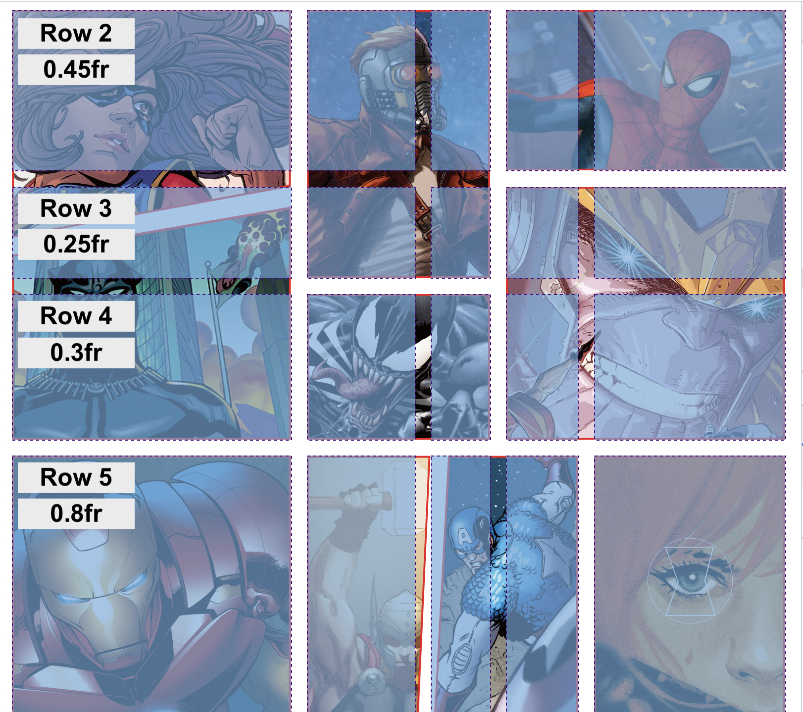

## Overview

In this tutorial, we will start off by walking through the big-picture things you need to know about grid, then get into _some_ ways to get more detailed in how you control your layout with it. This is meant to be an introduction that positions you to implement Grid for a simple layout. It should also equip you with some resources for exploring more on your own.

As you read through each section and look at the associated CodePen, make sure to stop and read the CSS in each CodePen even if you aren't given a task for it.

As you work through this, please keep in mind that there are always _many_ ways of solving a problem in programming. There may be cases where one developer solves a problem with Flexbox, another solves the same problem with Grid and another doesn't use either. Here's another very possible situation: both developers choose to use Grid, but implement Grid differently to achieve the same layout. There is no **one** or **right** way. That makes the learning goals of this feel a little vague; you can implement Grid without knowing much or even writing much code. It will be up to you on how deep you want to go!

## Can I even use Grid?

[Can I Use?](https://caniuse.com/#feat=css-grid) provides data on support for various features across the major browsers.</p>

## Why use Grid?

CSS has always been used to layout web pages, but was never very good at it.
Flexbox helped out, but it's intended for simpler one-dimensional layouts, not complex two-dimensional ones
(Flexbox and Grid actually work very well together). Can you imagine building [this](https://codepen.io/dannievinther/pen/EvVggR) with Flexbox? Or [this](http://grid-masterclass.webflow.io)?

## Set Up

Download and open the [Firefox](https://www.mozilla.org/en-US/firefox/new/) browser. Firefox has better developer tools for Grid, so we'd recommend using this anytime you are using Grid in development.

## Normal Block Elements

Normal block level elements, like the `section`s and `article`s we've all come to know and love, will take up the entire width of the page and the height they need to fit content (unless specified otherwise). They would look like this:

**Note:** Another stylesheet was imported into the CodePens we will be using today - that's why you don't see the rules for the colors and background colors!

<p class="codepen" data-height="300" data-theme-id="37918" data-default-tab="html,result" data-user="turing-school" data-slug-hash="vYYNywM" style="height: 300px; box-sizing: border-box; display: flex; align-items: center; justify-content: center; border: 2px solid; margin: 1em 0; padding: 1em;" data-pen-title="Grid Lab">
  <span>See the Pen <a href="https://codepen.io/turing-school/pen/vYYNywM">
  Grid Lab</a> by Turing School (<a href="https://codepen.io/turing-school">@turing-school</a>)
  on <a href="https://codepen.io">CodePen</a>.</span>
</p>
<script async src="https://static.codepen.io/assets/embed/ei.js"></script>

## What happens if we turn on Grid?

Similar to implementing Flexbox, we apply `display: grid;` to the parent element, whose direct children we want to control using Grid. Applying it alone does **nothing**, as you can see in the CodePen below. We need to specify our grid-template.

<p class="codepen" data-height="300" data-theme-id="37918" data-default-tab="html,result" data-user="turing-school" data-slug-hash="MWWabMo" style="height: 300px; box-sizing: border-box; display: flex; align-items: center; justify-content: center; border: 2px solid; margin: 1em 0; padding: 1em;" data-pen-title="Grid Lab 2">
  <span>See the Pen <a href="https://codepen.io/turing-school/pen/MWWabMo">
  Grid Lab 2</a> by Turing School (<a href="https://codepen.io/turing-school">@turing-school</a>)
  on <a href="https://codepen.io">CodePen</a>.</span>
</p>
<script async src="https://static.codepen.io/assets/embed/ei.js"></script>

## The `grid-template-columns` Property

We can give each column fixed units.

<p class="codepen" data-height="300" data-theme-id="37918" data-default-tab="html,result" data-user="turing-school" data-slug-hash="ExxVNBL" style="height: 300px; box-sizing: border-box; display: flex; align-items: center; justify-content: center; border: 2px solid; margin: 1em 0; padding: 1em;" data-pen-title="Grid Lab 3">
  <span>See the Pen <a href="https://codepen.io/turing-school/pen/ExxVNBL">
  Grid Lab 3</a> by Turing School (<a href="https://codepen.io/turing-school">@turing-school</a>)
  on <a href="https://codepen.io">CodePen</a>.</span>
</p>
<script async src="https://static.codepen.io/assets/embed/ei.js"></script>

## Investigate Marvel

This declaration is applied to the div that holds all the images.
`grid-template-columns: minmax(200px, 1.167fr) 0.45fr 0.25fr 0.3fr 0.8fr;`

This tells us there are 5 columns, because 5 different values are making up the value for the `grid-template-columns` property. When using the inspector, we can see them:

Two new things you probably noticed here:
- [`minmax()`](https://developer.mozilla.org/en-US/docs/Web/CSS/minmax)
- `fr` (read about in the next section)


## The `fr` Unit

We can also use a unit that will take up a fraction of the grid - `fr`. In the example below, we have `grid-template-columns: 1fr 1fr 3fr;` - this means we will have 3 columns total. The first will be one fraction of the width of the container, the second will also be one fraction, and the third will be three fractions. Together, we have 5 fractions - so the first two columns will take up 1/5 or 20% each, and the third will take up 3/5 or 60% each.

<p class="codepen" data-height="300" data-theme-id="37918" data-default-tab="html,result" data-user="turing-school" data-slug-hash="OJJybKV" style="height: 300px; box-sizing: border-box; display: flex; align-items: center; justify-content: center; border: 2px solid; margin: 1em 0; padding: 1em;" data-pen-title="Grid Lab 4">
  <span>See the Pen <a href="https://codepen.io/turing-school/pen/OJJybKV">
  Grid Lab 4</a> by Turing School (<a href="https://codepen.io/turing-school">@turing-school</a>)
  on <a href="https://codepen.io">CodePen</a>.</span>
</p>
<script async src="https://static.codepen.io/assets/embed/ei.js"></script>

<section class="call-to-action">
## Try It

Fork the CodePen above.
- Change the value provided to `grid-template-columns` to `2fr 2fr 2fr`. What happens?
- Change the value a few more times until you feel like you understand how the `fr` unit works.

If you need some more time with it, [here](https://gridbyexample.com/video/series-the-fr-unit/) is a great video and [here](https://www.geeksforgeeks.org/css-grid-layout-the-fr-unit/) is another written explanation.
</section>

## The `grid-template-rows` Property

So far, our grid rows have been implicitly set. But you can also explicitly set them using this property! In the example above, we provided the `grid-template-rows` with three units in the value: `100px 50px 200px`. The first unit defines the height of the first row, the second the second row, and the third the third row.

<p class="codepen" data-height="300" data-theme-id="37918" data-default-tab="html,result" data-user="turing-school" data-slug-hash="MWWabNv" style="height: 300px; box-sizing: border-box; display: flex; align-items: center; justify-content: center; border: 2px solid; margin: 1em 0; padding: 1em;" data-pen-title="grid-template-rows">
  <span>See the Pen <a href="https://codepen.io/turing-school/pen/MWWabNv">
  grid-template-rows</a> by Turing School (<a href="https://codepen.io/turing-school">@turing-school</a>)
  on <a href="https://codepen.io">CodePen</a>.</span>
</p>
<script async src="https://static.codepen.io/assets/embed/ei.js"></script>

### Marvel's Rows

Take a look at the way the Marvel site used `grid-template-row`:

```css
.grid-2 {
  grid-template-columns: minmax(200px, 1.167fr) 0.45fr 0.25fr 0.3fr 0.8fr;
}
```


<br>
The image above leaves out the first row which is why we start with row 2 rather than 1. Notice that the image on the far left-top took up three rows, but the bottom row all had one-row-high images. This is why Grid is so powerful! It also means it's **essential to plan out** how Grid will be used before writing any code.

<section class="call-to-action">
## Try It

Fork the CodePen above.
- Change the value provided to `grid-template-rows` to `1fr 3fr 1fr`. You should see that `fr` works the same way here.
- Change the value to `100px 200px`. What happens to the height of the third row? Why do you think that is?
</section>

## Control individual items with `grid-template-areas`

Now that we have explored a simple layout of columns and row, let's get into some of the fun details that really make grid powerful.

The `grid-template-areas` property allows you to specify areas of your page. It doesn't automatically associate specific elements with a given area.

First, we set up our template:

```css
.container {
  grid-template-areas:
   "sidebar main main"
   "sidebar footer footer";
}
```

The code snippet above creates 6 template areas made up of 2 rows, each with three columns. Each area has a name attached to it. Notice that the same name can be used more than once.

We will use that name to reference it from the item we want to live in that area:

```css
.box1 {
  grid-area: sidebar;
}

.box2 {
  grid-area: main;
}

.box3 {
  grid-area: footer;
}
```

`.box1` will take up the entire first column since it's `grid-area` is assigned to sidebar. `.box2` will take up the rest of the top row, and `.box3` will take up the rest of the bottom row.

**Note:** sidebar, main, and footer were not special or reserved keywords of any kind. The developer who creates the grid has full control over what to name these. We could use a, b, and c. We generally choose names that describe the content that will fit it, or location if dealing with dynamic content!

<p class="codepen" data-height="300" data-theme-id="37918" data-default-tab="css,result" data-user="turing-school" data-slug-hash="RwwWoXz" style="height: 300px; box-sizing: border-box; display: flex; align-items: center; justify-content: center; border: 2px solid; margin: 1em 0; padding: 1em;" data-pen-title="Grid Lab 13">
  <span>See the Pen <a href="https://codepen.io/turing-school/pen/RwwWoXz">
  Grid Lab 13</a> by Turing School (<a href="https://codepen.io/turing-school">@turing-school</a>)
  on <a href="https://codepen.io">CodePen</a>.</span>
</p>
<script async src="https://static.codepen.io/assets/embed/ei.js"></script>

<section class="call-to-action">
## Try It

Fork the CodePen above.
- Change the "sidebar" in the second row to "footer". What happens? Is that what you expected?
- In the HTML, add `<article class="box box4">new box!</article>` above the footer. Modify your template to have three rows, the middle row being "middle middle middle". Then, write the code necessary to have `.box4` take up the entire middle row.
- Now, add another article to your HTML, this time with the `.box5` class. `.box4` should take up the first two columns of the middle row, and `.box5` should live in the last column of the middle row.
</section>

## Take a Pom

Maybe watch a video about [Dog Grooming](https://www.theatlantic.com/video/index/549953/competitive-dog-grooming/)? Or take a walk around the block?

Before moving on to the next section - asses your level of comfort with the content up until now. If you are feeling foggy or nervous to go deeper, whip up your own CodePen and start from scratch. Referencing docs or this document is **great** but copy and pasting won't help you much! If you do feel ready to move on - that's cool too! The next section will provide some ways you can establish even more control over your layout.

## The `grid-gap` Properties

`grid-gap` provides some breathing room around grid items. This can be handy! `grid-gap` is a little generic, as you can see in the CodePen above, this adds a gap to both columns and rows. To be more specific, we can use `grid-column-gap` and `grid-row-gap`.

<p class="codepen" data-height="300" data-theme-id="37918" data-default-tab="html,result" data-user="turing-school" data-slug-hash="QWWjdLG" style="height: 300px; box-sizing: border-box; display: flex; align-items: center; justify-content: center; border: 2px solid; margin: 1em 0; padding: 1em;" data-pen-title="Grid Lab 7">
  <span>See the Pen <a href="https://codepen.io/turing-school/pen/QWWjdLG">
  Grid Lab 7</a> by Turing School (<a href="https://codepen.io/turing-school">@turing-school</a>)
  on <a href="https://codepen.io">CodePen</a>.</span>
</p>
<script async src="https://static.codepen.io/assets/embed/ei.js"></script>

<section class="call-to-action">
## Try It

In the CodePen above,
- Change the value provided to `grid-gap` to see how that changes the appearance.
- Remove the `grid-gap` declaration and add `grid-column-gap: 20px;` - what happens? Try using `grid-row-gap`, too!
</section>

## Changing the size and position of elements

In the CodePen below, we can see that `.box1` is taking up the first two "cells" of the far-left column. Let's look at the rule for `.box1`:

```css
.box1 {
  grid-row: span 2;
}
```

Let's break this down:
- `grid-row` is a property on the specific item we want to control. It allows us to define how much of the row we want this item to take up.
- `span 2` tells this item to take up two columns of the row it was originally in
- We can see that it `.box1` is now taking up it's original "space" as well as the space below it

Similiarly, we see that `.box8` is taking up the left and middle "cells" of the bottom row.

```css
.box8 {
  grid-column: span 2;
}
```

<p class="codepen" data-height="300" data-theme-id="37918" data-default-tab="html,result" data-user="turing-school" data-slug-hash="yLLYgBX" style="height: 300px; box-sizing: border-box; display: flex; align-items: center; justify-content: center; border: 2px solid; margin: 1em 0; padding: 1em;" data-pen-title="Grid Lab 8">
  <span>See the Pen <a href="https://codepen.io/turing-school/pen/yLLYgBX">
  Grid Lab 8</a> by Turing School (<a href="https://codepen.io/turing-school">@turing-school</a>)
  on <a href="https://codepen.io">CodePen</a>.</span>
</p>
<script async src="https://static.codepen.io/assets/embed/ei.js"></script>

Next Up - we can provide **two values**! Here's an example:

```css
.box1 {
  grid-row: 2 / span 2;
}
```

Let's break it down:
- the `2` before the slash indicates the row that the element should _start_ on
- the `span 2` after the slash indicates the row should end on, or how long it should span

**Note:** `-1` will refer to the end of the column or row, no matter the number of columns or rows.

<p class="codepen" data-height="300" data-theme-id="37918" data-default-tab="html,result" data-user="turing-school" data-slug-hash="ExxVZYL" style="height: 300px; box-sizing: border-box; display: flex; align-items: center; justify-content: center; border: 2px solid; margin: 1em 0; padding: 1em;" data-pen-title="Grid Lab 9">
  <span>See the Pen <a href="https://codepen.io/turing-school/pen/ExxVZYL">
  Grid Lab 9</a> by Turing School (<a href="https://codepen.io/turing-school">@turing-school</a>)
  on <a href="https://codepen.io">CodePen</a>.</span>
</p>
<script async src="https://static.codepen.io/assets/embed/ei.js"></script>

<section class="call-to-action">
## Try It

In the CodePen above,
- Change the value provided to `grid-row` for `.box1` to `1 / span 2`.
- Now try `1 / span 3`
- Now try `2 / span 1`
- What happens when you try `2 / span 3`? Not what you expected maybe? Why did that happen?
</section>

## Dry it up using `repeat()`

If you are going to sett all columns or all rows to the same height/width, `repeat` can be a clean way to communicate that (especially if you have a big grid)!

<p class="codepen" data-height="300" data-theme-id="37918" data-default-tab="html,result" data-user="turing-school" data-slug-hash="YzzyNKM" style="height: 300px; box-sizing: border-box; display: flex; align-items: center; justify-content: center; border: 2px solid; margin: 1em 0; padding: 1em;" data-pen-title="Grid Lab 5">
  <span>See the Pen <a href="https://codepen.io/turing-school/pen/YzzyNKM">
  Grid Lab 5</a> by Turing School (<a href="https://codepen.io/turing-school">@turing-school</a>)
  on <a href="https://codepen.io">CodePen</a>.</span>
</p>
<script async src="https://static.codepen.io/assets/embed/ei.js"></script>

## Fill in the gaps using `grid-auto-flow: dense`

Note that this will change the position of elements and therefore may not be great for accessibility.

<p class="codepen" data-height="300" data-theme-id="37918" data-default-tab="html,result" data-user="turing-school" data-slug-hash="Baaopao" style="height: 300px; box-sizing: border-box; display: flex; align-items: center; justify-content: center; border: 2px solid; margin: 1em 0; padding: 1em;" data-pen-title="Grid Lab 10">
  <span>See the Pen <a href="https://codepen.io/turing-school/pen/Baaopao">
  Grid Lab 10</a> by Turing School (<a href="https://codepen.io/turing-school">@turing-school</a>)
  on <a href="https://codepen.io">CodePen</a>.</span>
</p>
<script async src="https://static.codepen.io/assets/embed/ei.js"></script>

## Utilizing `auto-fit`

`auto-fit` allows us to make our grid adaptive!

<p class="codepen" data-height="300" data-theme-id="37918" data-default-tab="html,result" data-user="turing-school" data-slug-hash="MWWaJWE" style="height: 300px; box-sizing: border-box; display: flex; align-items: center; justify-content: center; border: 2px solid; margin: 1em 0; padding: 1em;" data-pen-title="Grid Lab 11">
  <span>See the Pen <a href="https://codepen.io/turing-school/pen/MWWaJWE">
  Grid Lab 11</a> by Turing School (<a href="https://codepen.io/turing-school">@turing-school</a>)
  on <a href="https://codepen.io">CodePen</a>.</span>
</p>
<script async src="https://static.codepen.io/assets/embed/ei.js"></script>

## Adding `minmax`

The addition of `minmax` makes things responsive!

<p class="codepen" data-height="300" data-theme-id="37918" data-default-tab="html,result" data-user="turing-school" data-slug-hash="zYYvNYj" style="height: 300px; box-sizing: border-box; display: flex; align-items: center; justify-content: center; border: 2px solid; margin: 1em 0; padding: 1em;" data-pen-title="Grid Lab 12">
  <span>See the Pen <a href="https://codepen.io/turing-school/pen/zYYvNYj">
  Grid Lab 12</a> by Turing School (<a href="https://codepen.io/turing-school">@turing-school</a>)
  on <a href="https://codepen.io">CodePen</a>.</span>
</p>
<script async src="https://static.codepen.io/assets/embed/ei.js"></script>

## Additional Resources
- [Grid Garden](https://cssgridgarden.com/)
- [CSS Tricks - Complete Guide To Grid](https://css-tricks.com/snippets/css/complete-guide-grid/)
- [Wes Bos video tutorial series on Grid](https://cssgrid.io/)
