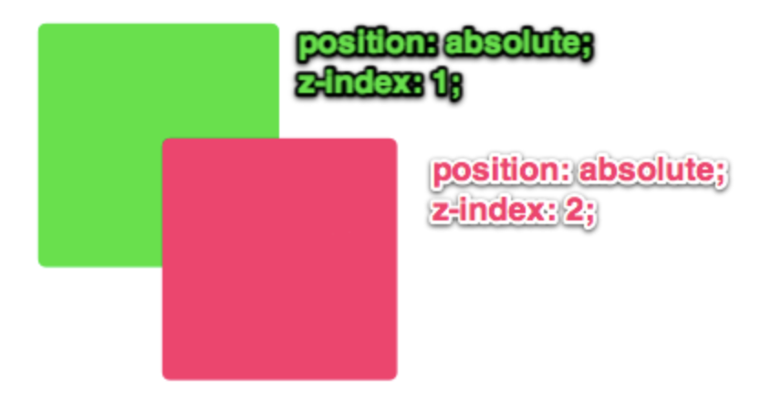
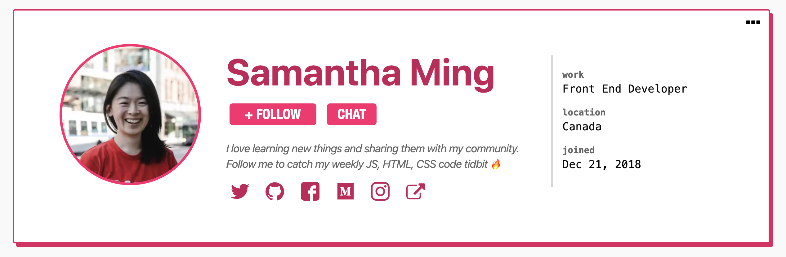

## Learning Goals

* Understand and utilize the various positioning properties you have available
* Use floats to handle more difficult layouts
* Understand how specificity rules can impact your CSS rules
* Be able to implement complex CSS selectors

But first, the road to enlightenment: [CSS Zen Garden](http://www.csszengarden.com/)

## Pre-Work

Come prepared to class by reading [CSS Specificity + Combinators](https://frontend.turing.edu/lessons/module-1/css-specificity-combinators.html)

## Warm Up

[Instructor Resource](https://docs.google.com/presentation/d/1lKOoG9BPFM1xjUGZNPJXzX6ifnWOm2fCvpCzLbkat5Y/edit?usp=sharing)

## Display

The display property allows us to manipulate the layout of elements on a page without taking them out of the normal page flow. The default value for all elements is inline. Most "User Agent stylesheets" (the default styles the browser applies to all sites) reset many elements to "block".

- **Inline:** `<span>`, `<em>` Text wraps around anything in these elements. Inline elements margin and padding, and push things horizontally, not vertically, but ignore height and width instructions.
- **Inline-Block:** An element set to `inline-block` is very similar to inline in that it will set inline with the natural flow of text (on the "baseline"). The difference is that you are able to set a `width` and `height` which will be respected. They also apply 2px of margin that does not register in dev tools.
- **Block:**  A number of elements are set to block by UA (user agent) stylesheets, usually container elements. `<div>`, `<ul>`, `<section>`, and more. Also, text blocks like: `<p>`, `<h1>`. These elements take up as much space, horizontally, as available.

```css
div {
  display: 'inline';        /* Default of all elements, unless UA stylesheet overrides */
  display: 'inline-block';  /* Characteristics of block, but sits in a line */
  display: 'block';         /* UA stylesheet makes things like <div> and <section> block */
  display: 'none';          /* Hide */
}
```

**Quick tip:** If you want to center an element, you can give the `margin` property a value of `auto` to center a block-like element. The element must have a declared width for this to work.

## Position

<!-- - We can manipulate this [CodePen](https://codepen.io/turing-school/pen/XWWmNyz) to play around with the following values for our position property. -->
The `position` property in CSS will take elements out of the normal page flow, and should therefore be used sparingly.

- **static**: Every element, by default, has a static position. When `position: static` is applied, the element will stick to the normal page flow.
- **relative**: The element is positioned relative to its normal position. When `position: relative` is applied, and no other positioning attributes are, nothing will happen. It is mainly used in conjunction with `position: absolute` on a child element.
- **absolute**: An absolutely positioned element is completely removed from the normal flow. The adjacent sibling elements occupy its space.
  - An element whose position property is set to absolute or fixed is called an absolutely positioned element.
  - We can position an element to a specific place on the page, relative to one of its ancestor elements.
  - We can determine which ancestor we can to position it in relation to.
  - To establish this relationship, the ancestor must have `position: relative` applied to it.
  - You specify the position of your element via offset properties: `auto` (default), `top`, `bottom`, `right`, `left`
- **fixed**: A fixed positioned element (subcategory of the absolute positioning) is positioned relative to the viewport. It will stick in place despite any scrolling or resizing of the viewport.
- **sticky**: A sticky element will behave a lot like an absolutely positioned element. But, if the user scrolls beyond the view of the element, the element will be "stuck" and remain in the users view (where an absolutely positioned element will scroll off the page). Many times this is used for headers or footers on a page. There are a couple of great examples in [this blog post](https://medium.com/@elad/css-position-sticky-how-it-really-works-54cd01dc2d46).

We can play around in [this CodePen](https://codepen.io/turing-school/pen/XWWGJqz) to build a better understanding of position.

<section class="call-to-action">
### Try It:

Over the course of today's class, we will work to re-create the top part of a Twitter profile. It will _not_ be perfect by the end of class! The goal is just to see how these concepts can be used in real applications, and get some practice. Start with one step at a time:
  * Fork [this CodePen](https://codepen.io/turing-school/pen/ZEEVpYy?editors=1100) for your starter kit and check out what a Twitter Profile looks like [here](https://twitter.com/TaelurAlexis). Notice that the round profile photo (photo) is layered over the rectangular background photo (header photo).
  * With your partner, talk about how you can use `position` to achieve a layout like that. Once we discuss as a class, you will implement a solution.
</section>

## Floats

"Floating" an element takes it out of the normal flow, and places it as far to the left or right of its containing element as possible. Any other elements, such as paragraphs or lists, will wrap around the floated element as seen [here](https://codepen.io/LouisaBarrett/pen/GwwKGN).

Always specify a width when floating an element, otherwise the element is likely to take up the whole page and not appear floated.

You can specify a) whether an element is floated or not, and b) which side it floats on.
- `none`: the element does not float. This is the initial value.
- `left`: floats the element to the left of its container.
- `right`: floats the element to the right of its container.
- `inherit`: the element inherits the float direction of its parent.
- `clear`: Float's sister property. An element that has the clear property set on it will not move up adjacent to the float like the float desires, but will move itself down past the float.

We can play around with this [CodePen](https://codepen.io/turing-school/pen/wvvOaNP) to see how float and clear work with one another.

The code snippet below is known as the `clearfix hack`. It prevents the container from collapsing when all of its contents are floated. In order for this specific snippet to work, the class `clearfix` must be applied to the container element in question.

```css
.clearfix:after {
  content: ' ';
  display: table;
  clear: both;
}
```

<section class="call-to-action">
### Try It:

Back in your Twitter profile CodePen:
  * Use `float` to move the div that holds the three buttons over to the right side of the profile.

**Extra Time?** Apply the necessary margin and padding to get a few of those little details just right. Consider the amount of space between the name and handle, the amount of space between the handle and description, the amount of space between the "following" button and the edge of the profile card.
</section>

## z-index

The `z-index` property controls the third dimension of elements - how the stack on top of each other. It only affects elements that have a position value other than static (the default).

Without applying any `z-index`, elements will appear in the browser in the order they are placed in the DOM. The `z-index` of every element, by default, is 0.



The ins-and-outs of `z-index` can be a bit complicated; we won't go into it today. But if you do need to stack or layer something, you now know where to start!


<section class="checks-for-understanding">
### Practice

The only true way to get familiar with the tools CSS gives us in relation to layout, is to practice using them. The more you finagle, tweak, experiment, the better of an understanding you will build! Get some more practice by re-creating a [dev.to](https://dev.to/) profile card!

For now, don't worry about the social media icons; focus on the bigger elements first! You also don't need to use an actual image yet.


</section>

## Additional Resources

* [Turing CSS Style Guide](https://github.com/turingschool-examples/css)
