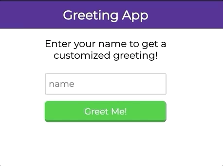
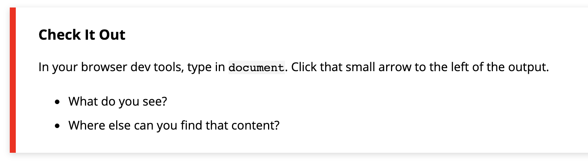
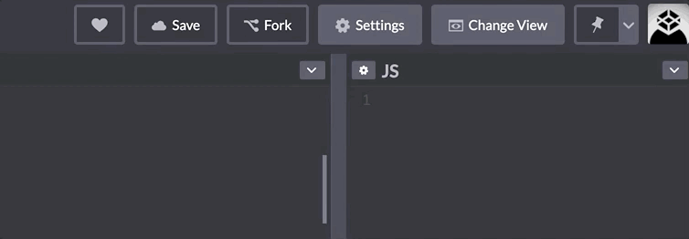

## Learning Goals

* Continue to learn how to access and use the Chrome Developer Tools
* Continue to develop a basic understanding for JavaScript syntax
* Understand how to query and update a page after its been loaded

By the end of this lesson, you'll be able to customize a user's experience on a small site based on some input they provide. Below is a giphy of this type of experience in action:



Before we can implement functionality like this though, we're going to build a strong foundation and understanding of the tools that help us do that.

## Vocabulary

- `HTML Element` A building block that makes up the structure of a web page.
- `CSS Selector` A way to identify a set elements, typically using a tag, class or id.
- `Interface` a shared boundary across which two separate components exchange information.
- `DOM` Document Object Model, the JS interface used to interact with HTML
- `Event` Any event which takes place in the DOM, these can be generated by users or the browser.
- `Event Handler` A function that will run when a specific event occurs
- `Method` A type of function for a specific object

## Warm Up

On your own, answer the questions associated with each stage of the Greeting App. If you aren't sure - it's ok - but take a try. You'll have time to chat with your partner afterward.

[Instructor Resource](https://docs.google.com/document/d/1NmlZD0IlsInu4zjpCey9MI2GdV-Zd_jlIcnLdcvnTEo/edit)

## Document Object Model

The Document Object Model, DOM, is an interface for HTML. It is what allows us to use JavaScript to manipulate the elements or content of elements on a page. Think back to our Greeting App example - somehow, JavaScript has to know what was typed into that input field, know that the button was clicked, and be able to add content below the button. If we didn't have the DOM, this wouldn't be possible.

Once the browser runs our HTML, it creates the DOM. The DOM represents what is in the HTML, but it is formatted in a way that we can interact with those elements via JavaScript. It is _not_ the exact same thing as your HTML document.

Here's a small HTML file:


Here's the DOM tree that would be created:


Image credit: [bitsofcode](https://bitsofco.de/what-exactly-is-the-dom/).

This is an abstract concept and can be hard to wrap your mind around - we'll come back to it. For now, you need to know two things:
1. The DOM is essential to building functionality on a page
2. We can use the `document` variable in our JavaScript file to interact with the DOM. From there, we can travel through the DOM and ask for specific elements, or instruct the program to change elements.

<section class="call-to-action">
### Check It Out

In your browser dev tools, type in `document`. Click that small arrow to the left of the output.  
- What do you see?
- Where else can you find that content?
</section>

At any time, you can call `document` to access the DOM. This is very close to the same thing as viewing the document in the Elements panel of the Dev Tools. We won't get into the details of those small differences; if you are interested, start by reading [this blog post](https://bitsofco.de/what-exactly-is-the-dom/).

## Accessing a Specific Element

Our `document` object comes built-in with a lot of methods we can use. Today, we will learn about `.querySelector()`. This method allows us to request a specific element from the DOM tree, by its selector. It uses the same syntax for selectors as CSS does. Here's an example:

```javascript
var title = document.querySelector('h1');

title;

//=> <h1>Intro to DOM Manipulation</h1>
```

<section class="call-to-action">
### Explore

Open the Dev Tools while you are looking at this lesson. In the console, paste this in:

`var box = document.querySelector('.call-to-action');`

Then, call the `box` variable (by typing in `box`, then hitting `return`).

**Discuss with your partner:**
- What is returned?
- Where does that element appear in the browser?
- There are several sections with that class name on this page - why do you think that only _one_ of them is stored in the `box` variable?
</section>

## Updating Content of an Element

So far, we haven't made much headway in terms of _doing_ anything - but we've built some important foundations. It is now time to learn how to update the content of an element we've accessed.

We'll continue using our `title` variable for this example.

```javascript
var title = document.querySelector('h1');
```

Since our `title` variable stores a DOM element, we now have access to another set of properties methods that are built for DOM elements. We won't learn about all of them today. We'll focus on `innerText`, and time permitting `innerHTML`.

### `innerText`

This is a property which holds the text that lives inside of a given element. Right now, the content inside of the `h1` on this page is `Intro to DOM Manipulation` so that is what the `innerText` is. We can use the assignment operator to change it.


After running the code in the console that is pictured above, the text of the `h1` changed from `Intro to DOM Manipulation` to `Hello, World!`. Now, this may feel a bit disconnected because we know that we usually write our JavaScript in a file in atom, not in the Dev Tools. **If we wrote this in the JavaScript file associated with the page, we'd have the exact same result.** To reinforce this, you're going to have some time to practice applying this concept.

<section class="call-to-action">
### Try It

Fork [this CodePen](https://codepen.io/turing-school/pen/bGGmOrR) and complete the steps listed below.

- Declare a variable `name` and assign it to the value of the element with the class of `student-1`
- Declare a variable `schoolName` and assign it to the value of the `h3` element
- Declare a variable `bestGrade` and assign it to the value of the element with a class of `grade-2`
- Change the `innerText` of the `.student-1` to your name
- Change the `innerText` of the `h3` to be the name of a school you've attended
- Change the `innerText` of the `.grade-2` to be an `A+`!
</section>

### `innerHTML`

This property essentially works the same, but has the capacity to do something a little more complex for us.

It can not only insert plain text, but it can insert HTML elements. For the example below, we will go back to using the "call to action" box.

```javascript
var box = document.querySelector('.call-to-action');

box.innerHTML = `
  <h3>Title</h3>
  <p>a bunch of text here</p>
`;
```

Try running this code in the browser and see what happens to the first "call to action" box that appears on the page!

## Changing Styles Programmatically

It isn't rare to see an application change the color of something after a user interacts with it.

We see things like...
- Toggling light and dark mode
- A grey check mark turn into a green one
- A box or button changing colors once we've already clicked it, or visited that link
... on almost a daily basis!

We talked earlier about how powerful the DOM is because it allows us to interact with HTML elements via JavaScript. This also gives us the power to **modify the styles applied to said elements** via JavaScript.

We will briefly discuss two ways to do this:
1. Directly manipulate the style of the element through inline styles
2. **Add or remove classes from the element** (the preferred way).

### Directly Manipulate the Style of the Element

We can call the `.style` property on an element, then any CSS property:

```javascript
var box = document.querySelector('.call-to-action');

box.style.borderColor = "red";
```

This will result in:



The reason this is not preferred is we usually want to make more than one tiny change; and each change requires one line of code. This can make for long functions that are difficult to read. Adding or removing classes (examples below) is strongly preferred.

<section class="note">
### Then Why Bring It Up?

Often times, your instructors at Turing will share with you an overview of something, including the multiple ways something can be done, but tell you that one is preferred. Why do we bother to bring up the less-than-ideal approaches?

As a developer, a huge part of your job is researching and learning on your own. That will also be a huge part of being a student at Turing. You'll sift through documentation, blog posts, and Stack Overflow posts. It's important to be familiar with the multiple ways of doing things, different syntax, best practices, etc. so you can more easily sift through those resources and determine what is good and helpful.
</section>

### Add or Remove Classes from the Element

Since it's common to need to change multiple CSS declarations, we can instead add or remove a class from the list of classes a given element has on it.

<section class="call-to-action">
### Check It Out

Fork [this CodePen](https://codepen.io/turing-school/pen/MWWPLYx) and follow the directions below:
- Read through the code that is currently written, and observe the result in the mini-browser
- Un-comment line 3. What changed about the button? What remained the same?
- Un-comment line 4. What changed about the button? What remained the same?
</section>

Typically, if you are going to add/remove a class via JavaScript, that class should be declared **below** the class that originally styled the given element. This is because of the cascading nature of CSS; any time rules conflict, the rule declared lower on the sheet will take precedence.

Read up on [this documentation](https://developer.mozilla.org/en-US/docs/Web/API/Element/classList) to learn how to **remove** a class from an elements classList! Hint: `toggle` may soon be a friend of yours, as well!

## Event Listeners

Changing stuff on the page with JavaScript is great, but you might as well have just written it in the markup to begin with. The real power of JavaScript comes into play when we write code that **responds to user input**.

This power emerges when we start **listening for user events**. This is the crux of front-end engineering. We present a user interface and then as the user interacts with the UI, we change and update what they see.

Let's take a look at the syntax and then we'll talk about what's happening.

<p class="codepen" data-height="300" data-theme-id="37918" data-default-tab="js,result" data-user="turing-school" data-slug-hash="MWWzMre" style="height: 300px; box-sizing: border-box; display: flex; align-items: center; justify-content: center; border: 2px solid; margin: 1em 0; padding: 1em;" data-pen-title="A First Event Listener">
  <span>See the Pen <a href="https://codepen.io/turing-school/pen/MWWzMre">
  A First Event Listener</a> by Turing School (<a href="https://codepen.io/turing-school">@turing-school</a>)
  on <a href="https://codepen.io">CodePen</a>.</span>
</p>
<script async src="https://static.codepen.io/assets/embed/ei.js"></script>

1. We're querying for all of the elements we need and we're storing them in variables.
2. We're adding an event listener to the `<button>` with the class of `.change-text`.
3. We're passing `addEventListener()` two arguments:
  - The type of event we're interested in listening for.
  - The name of a function that should be called whenever that event happens.
4. We declare the function that will be called when the button is clicked.

<section class="call-to-action">
### Pair Practice

Go back into your Report Card CodePen.
* Create a function called `changeMessage` that updates the content inside of the element with the class `message`. You can choose the message!
* Add a `<button>` to the HTML markup of the page.
* Attach an event listener to that button.
* When the button is clicked, have your `changeMessage` function fire!

**Extra Time?**
* Create a second button, function, and event listener, that work together to change the paragraph at the bottom of the page. _Hint: You many need to add a class attribute to that element._
</section>

### Style Change on Button Click

Like we mentioned earlier, it's pretty common for a user to experience helpful feedback from an application after they've taken some sort of action.

Take for example the "heart" icon on CodePen. CodePen has 4 levels of "love" - 0, 1, 2, and 3. Each time a heart is clicked, the user increments their love up by one. (Until the click when it is read and at level 3 - at that point, it goes back to 0). While the "love leveling" is a bit confusing, this is still a great example of **styles changing based on user interaction**.



To do this, we need to combine what we just learned about event listeners with what we learned about changing styles programmatically earlier in this lesson.

<section class="call-to-action">
### Pair Challenge

We are putting a few pieces together now, so this may seem a bit more challenging. That's when it is especially important to pseudo-code, or write human-readable notes that give you a roadmap for the code you will later write.

Your task is to add a new button the the Report Card markup. When the button is clicked on, the CSS rule on lines 15 should be applied to the `section` that wraps all the content in the HTML.

In your notebook:
* List the directions, as specially as possible, that you want to give to the computer.
* What are the DOM elements that this program will need to know about? What variable names will you use for them?

Now, implement your ideas in code.
</section>

### Get User Input

We can use the `.value` property available on an `input` DOM element to get the value that a user has typed into it.

<section class="call-to-action">
### Explore

Follow the steps below to explore how `.value` works!
1. Open your dev tools and inspect this box, specifically, the input field below. What is its class name?
2. In the console, call `document.querySelector('.check-me');`
3. In the console. call `document.querySelector('.check-me').value;`
4. Type your favorite food into the input
5. In the console. call `document.querySelector('.check-me').value;`

<input type="text" class="check-me" placeholder="this is the input!">

</section>

When called, the `.value` property on an input element will return the **current value**.

<section class="note">
One of the top misconceptions/mistakes we see students make while in Mod 1 is attempt to capture the value of an input while the input is empty. If you want to get a user's input, we have to get the value **inside of some event listener** - on an event that happens after the user has typed into the input field.
</section>

Below is an example of a small application that takes a user input, then changes the color of a box based on that input:

<p class="codepen" data-height="300" data-theme-id="37918" data-default-tab="html,result" data-user="turing-school" data-slug-hash="bGGeKVa" style="height: 300px; box-sizing: border-box; display: flex; align-items: center; justify-content: center; border: 2px solid; margin: 1em 0; padding: 1em;" data-pen-title="Color Box">
  <span>See the Pen <a href="https://codepen.io/turing-school/pen/bGGeKVa">
  Color Box</a> by Turing School (<a href="https://codepen.io/turing-school">@turing-school</a>)
  on <a href="https://codepen.io">CodePen</a>.</span>
</p>
<script async src="https://static.codepen.io/assets/embed/ei.js"></script>

Let's break down what's happening in the CodePen above:
- **Lines 1-3:** Declare variables for the DOM elements that we will need (box, input field, button)
- **Line 5:** Attach an event listener to the button
- **Line 7:** Declare a function that will execute when the button is clicked
  - Declare a variable, `color` that takes the value the user selected and stores it
  - Applies an inline style, `backgroundColor` with that newly selected color

<section class="call-to-action">
## Solo Practice

Fork [this CodePen](https://codepen.io/turing-school/pen/abbQeoG) and implement these two features:
* When the user clicks on the "Change Text!" button, the `innerText` of the `h1` should change to be the contents of the input field.
* When the user clicks the "Change Styles!" button, it should adjust that property on the box.
<br>

Here is an example of the second task:


</section>

<!-- <section class="checks-for-understanding">
</section> -->
