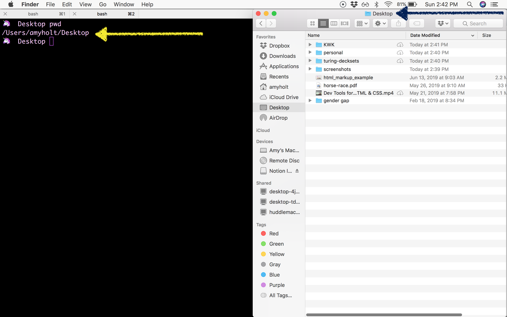
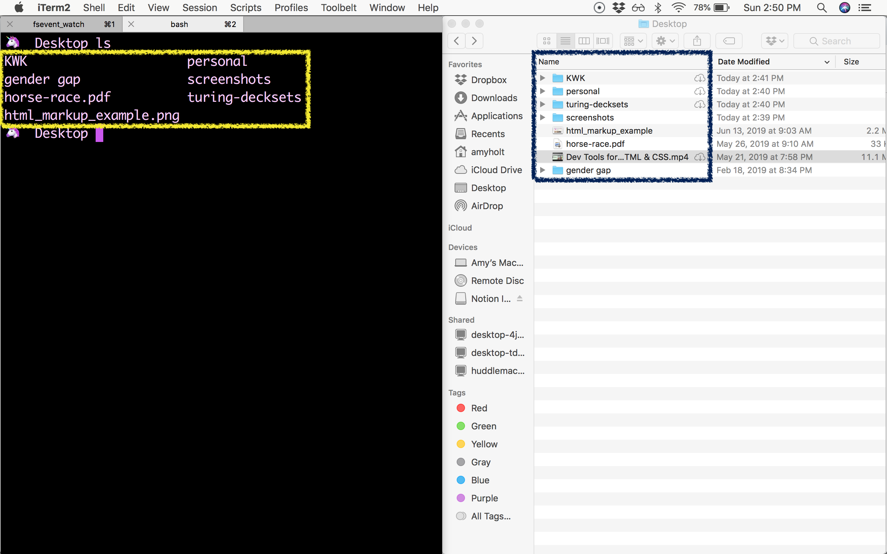
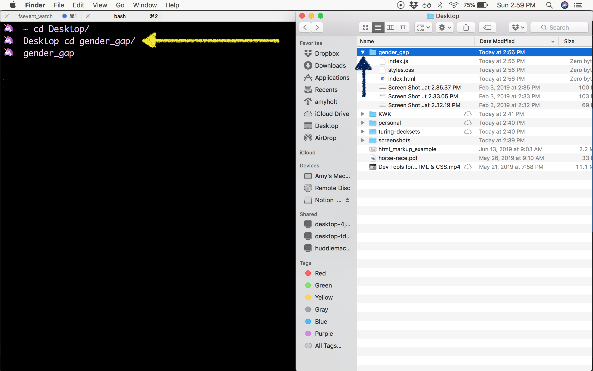
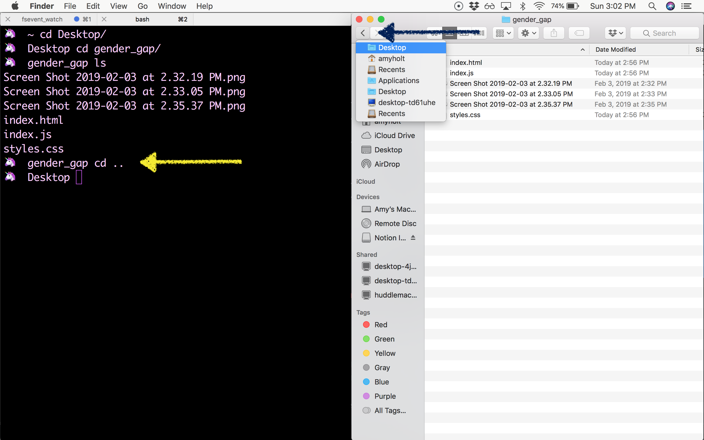
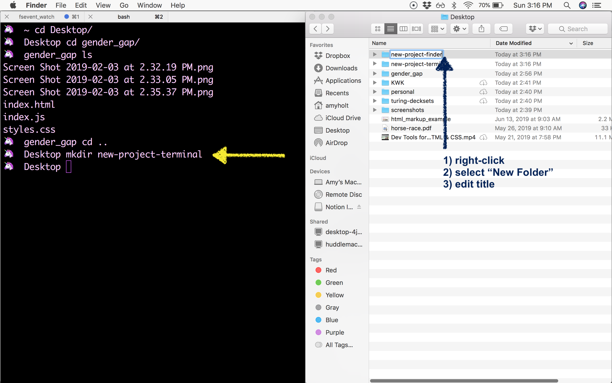
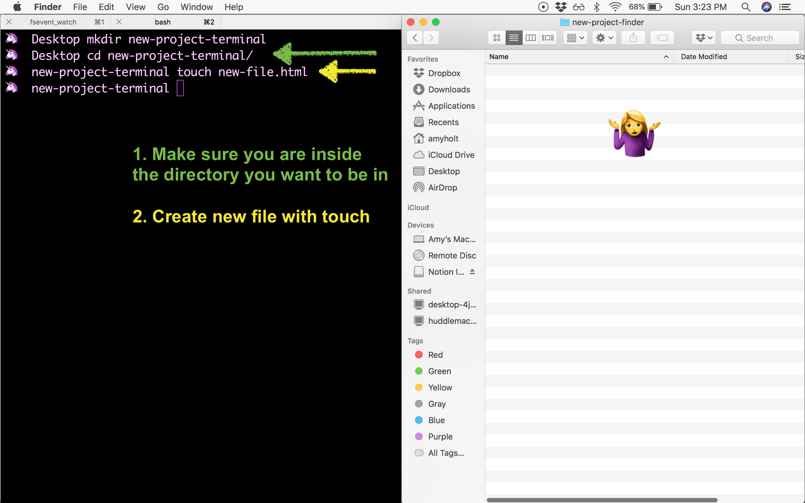
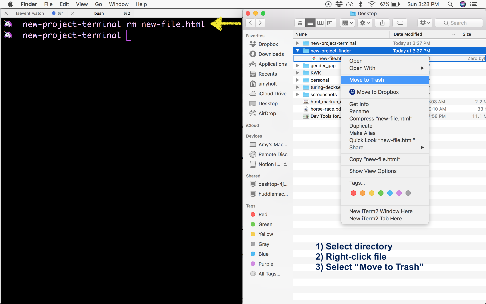

<a href="./introduction-to-terminal-presentation.html" target="blank">Slides for class</a>

## Learning Goals

* Understand what the terminal is and use of it is essential
* Fluently navigate a directory structure with bash commands
* Fluently create and remove directories and files with bash commands

## Vocabulary

- `Terminal` A program that allows a user to interact with The Command Line
- `Shell` A low level interface for your computer. Instead of pointing and clicking on things, you type words and run commands
- `The Command Line` The same thing as a shell - often used interchangeably
- `bash` A particular type of shell found on Unix systems
- `Directory` Same thing as a Folder
- `command` - A set of instructions for the computer to execute - provided via the command line
- `argument` - A piece of information needed to run a certain command ie. `touch sample.txt` where sample.txt is the argument

### A note on interchangeable terms above

Most people use the terms `terminal`, `shell`, `command line`, and `bash` interchangeably.
That's okay! The problem comes when they're used _incorrectly_.

Here's a few examples of correct usage:
- "Can you increase the font size of **your terminal**?"
- "We need to open up **the command line** here."
- "Let's use **the shell** for this task."
- "I don't like using **bash** - I think fish is better"

Additionally, there's a Mac application just called `Terminal`. That's a specific program that accesses the command line.

## Why Programmers Use The Terminal

### You're not as fast as you think

You probably grew up around computers, but if you're like most of the non-developer population, you may have never touched the terminal. Why would you need to? Everything you need to do can be done on the desktop or through the Finder, and only super nerds use the terminal anyway. Right?

Well, no...

You might be thinking to yourself "Hey, wait a minute! I'm pretty fast when it comes to using my mouse to get around. Why do you think I need to use the terminal?"

### Efficiency and Competency Show

It turns out you actually aren't fast enough. As a developer, everything you do should be based on speed and efficiency. When any part of your work flow is lacking, you are wasting time. Over the course of a day, every extra second compounds into time you aren't spending doing productive work. Not being a fluent user of your command line is a pain point that may not be terribly noticeable as you first start writing code and you're still gaining momentum, but over time as you work more quickly you (and your pairing partners) will absolutely feel it.

Additionally, in an interview or workplace environment not being able to effectively use your terminal is a red flag. That is why it's important to start flexing your command line muscles right away to build understanding and comfort with this tool.

### Terminal-Only Tools

Additionally, some of the tools you will use as a developer can _only_ be used through the terminal and not by clicking in a program.

## Getting Started

The terminal seems scary at first - no graphics, all text, little to no feedback, and you might be worried about deleting everything in your computer.

Don't worry! You are not going to break your computer. It's easy to fear the unknown and let it keep you from learning how to efficiently use the terminal. But if you push past the first day or two of feeling uncomfortable, you'll become great at using the terminal in no time.

When you're first starting to learn anything coding related, you have to build up your muscle memory. It's totally normal to start slow and improve with focused practice and repetition. You're not going to learn unless you actually get your hands dirty and dive right in!

Let's actually start working on some basic interactions with our files using the terminal. We're going to assume that you're using a Mac for this lesson.

Open your terminal using `cmd + spacebar`, then type `terminal`, and press `enter`. The mysterious black window appears...

### Side Note - Keyboard Shortcuts for Efficiency

- `cmd + spacebar` will open your spotlight search
- `cmd + tab` will take you to your most recent open application

## Observe the File Structure: `pwd`, `ls`

When you open up your terminal, you aren't greeted with much. It just says your name and that's about it. Typically when you open up your terminal you are brought to your root directory. `Directory` is just another word for folder. Your root directory usually contains:

```bash
|- Applications
|- Documents
|- Desktop
|- Music
|- Pictures
```
(and other directories depending on your computer)

## Must-Know Commands

We will dive into the details shortly, but here's a quick preview of the commands you should be fluent with by the end of this lesson:

- `pwd`
- `ls`
- `cd`
- `mkdir`
- `touch`
- `rm`

### `pwd` (print working directory)

Let's first get a handle of where we are in our computer's file structure. To see where you are located in the file structure, enter `pwd` in the terminal. This stands for your present working directory. If you are in the root directory, it will most like say `/Users/[your name]`. If you ever forget or are confused about where you are, then use `pwd` to find out!

The return from this command will be the name of the directory you are currently in.

This is equivalent to referencing the top bar in the finder:



### `ls` (list)

In the terminal, we don't have Finder to graphically tell us what is contained within a directory or nested directories, but we do have commands to help us.

We can use the command `ls` to list the content in our current directory. You can see directories and files in the current directory, but you cannot see directories and files that are inside other directories.

The return from this command will be a list of all contents inside your current working directory.



`ls` doesn't explicitly tell us what is a directory and what is a file, as compared to the finder which provides an icon the the left of each item inside a directory. We can, however, determine this by observing if a specific item in a directory has a file extension or now. For example, `.png`, `.js`, etc.

<div class="turn-and-talk">
  <h3>Try It</h3>
  <ul>
    <li>Open your terminal and enter the command <code>pwd</code>. What do you see? Can you find this same location using Finder?</li>
    <li>Enter the command <code>ls</code>. What directories and files do you see?</li>
    <li>Enter <code>ls -la</code>. How does this list change? Do you see the same files and directories when you use Finder?</li>
  </ul>
</div>

For a more detailed list of content, we can use `ls -la` - note the space between the characters. The addition of `-la` gives more information about when that file or directory was last modified, permissions, and also lists [hidden files/directories](https://en.wikipedia.org/wiki/Hidden_file_and_hidden_directory).

## Move Through the File Structure: `cd`

### `cd` (change directory)

If we are in our root directory and we want to see what files are within the Desktop directory, we currently don't have a way to do that. For instance, if we are in the root directory, and we enter `ls` in the terminal, it will just list the files and directories in the root directory, but we cannot see what is inside Desktop by only using `ls`.

To see what is in other directories, we can move around and navigate through our file structure. We want to change into the Desktop directory to see what is inside it.

To change our current directory, we use the command `cd [directory name]`. This is the equivalent to double-clicking a file in Finder, or clicking the little arrow to the left of the folder icon.

There is **no return value** for this command.



We can move through directories in two directions: up or down - to a previous directory or to a nested directory. If you want to go back to the `gender_gap` directory, then use a space two periods after the `cd` command: `cd ..` to go back up one level. With the previous example where you are currently in the notes directory, you would type `cd ..` to get to the `Desktop` directory. This is the equivalent to clicking the back button or clicking that arrow to the left of the folder icon again, to collapse the contents of that folder.

There is **no return value** for this command.



## Make Folders & Create/Remove Files: `mkdir`, `touch`, `rm`

### `mkdir` (make directory)

Creating a folder/directory is something that you will be doing often. A way to create a new folder is using the `mkdir [dir name]` command. What this will do is create a new folder for us with whatever name you want to give it.

Note: A common way to document how to use a command is the command name, `mkdir`, and then something within square brackets, `[dir name]`. The first part, `mkdir`, is the text that the terminal recognizes as a command. The second part, `[dir name]`, is the part where you will specify the new directory's name. The square brackets mean that this is a place for you to fill in your own information, but you do not include the square brackets.

There is **no return value** for this command.



How do we check that the directory was made? Use `ls` to check that it is listed.

Keep in mind that even though you've created this folder, it doesn't mean you are inside of that folder you've just created. To actually go into our new folder, you need to change into that new directory.

### `touch` (create file)

Similar to directories, we also need to be able to create new files. The command we are going to use to do this is the `touch [file name]` command. There doesn't seem to be a Finder "equivalent" for this command!

There is **no return value** for this command.



### `rm` (remove)

So we can make directories and new files, but we want to be able to remove them. That is where the `rm` command comes in. If we're not happy with our `new-file.html` file, then we can delete it.

There is **no return value** for this command.



As you can see there was no warning such as, "Are you sure you want to delete this file?..." Be careful with this command because **you can't undo it**.

<div class="turn-and-talk">
  <h3>Try It</h3>
  <ul>
    <li>Open a new terminal window. Create a directory called <code>terminal-practice</code>. Navigate into that directory, then follow the steps below.</li>
    <li>Create three different directories (with different names). Double check that all of the directories are listed in your current directory. Delete all the directories.</li>
    <li>Create five new files with different file names. Double check that all the files are listed in your current directory. Delete all the files you just created.</li>
    <li>Now, create three new directories, each with 2 files inside of them. Then delete both files in a directory, then the directory. Repeat until your <code>terminal-practice</code> is empty!</li>
  </ul>
</div>

### Tab Autocomplete

Tab completion is your friend when you don't want to type an entire directory name or you don't quite remember how something is spelled. To utilize this tool, start typing the first part of a file or directory, then hit `tab`. The terminal will auto-complete the rest of the desired file or directory name for you.


### Nested Directories

What if you want to change to a directory that is inside another directory? You can imagine that using `cd` multiple times would get tiring and slow. If we have something multiple levels deep we can keep adding directories to our `cd` command. Say we have:

```bash
|- Desktop
  |- turing
    |-- class-work
      |--- terminal-practice
```

If we're in `Desktop` and we want to get to `terminal-practice` quickly, then we can do this with one command: `cd turing/class-work/terminal-practice`

Likewise, we can also go back up multiple directories using one command. If you are in the `terminal-practice` directory and you want to go back to the `turing` directory, then you can use the double dots as before with the slash separator: `cd ../..`

<div class="turn-and-talk">
  <h3>Try It</h3>
  <ul>
    <li>In your terminal, change to your root directory. Your root directory is noted as a <code>~</code> symbol. So the change directory command would be <code>cd ~</code>. From there, <code>cd</code> into your Documents directory.</li>
    <li>Now, list the contents of the Documents directory.</li>
    <li>In your Documents directory, make a new directory of your choosing. Change into that directory, and make another new directory. Repeat this three times. When you are done, delete the directories you just made, one directory at a time.</li>
  </ul>
</div>

## Commands From Your Present Working Directory

Using `cd`, you can move around directories and add files in the directories where we need them. However, moving around to other directories can get tedious and time consuming.

From our present working directory, you can add files or directories anywhere in our file system by adding our "directory path" in our terminal commands.

### Create Files

Going back to `mkdir` and `touch`, you can chain on directories if you want to add files inside other directories. Say you have these directories:

```bash
|- turing (your present working directory)
  |-- mod1
```

If your present working directory is `turing`, then you can create a new file inside `mod1` using one command: `touch mod1/new-file.txt`. This command includes the directory and then the new file you want to create. You don't have to `cd` into `mod1`. With this command, you end up with:

```bash
|- turing
  |-- mod1
    |--- new-file.txt
```

### Create Directories

The same can be done with making new directories. With our current running example, let's add a directory inside the `mod1` directory. Again, if your present working directory is `turing`, then you can do this with one command:

```bash
mkdir mod1/new-directory
```

We end up with:

```bash
|- turing
  |-- mod1
    |--- new-directory
    |--- new-file.txt
```

<div class="turn-and-talk">
  <h3>Try It</h3>
  <ul>
    <li>Change to your root directory if you are not there already. How did you do this? With these next tasks, do _not_ change into other directories. Keep your root directory as your present working directory.</li>
    <li>Make three nested directories.</li>
    <li>In each nested directory, create a file.</li>
    <li>Remove all of the directories and files that you just created - one directory at a time.</li>
  </ul>
</div>

## Move and Copy Files/Directories: `mv`, `cp`

Now that we can create and remove files, let's add to our toolbox the ability to copy or move files. At a high level, `mv` takes the source file and moves it to a new location. `cp` keeps the source file and copies the file to a new location.

### `mv` (move)

If we want to move a file, then we use the `mv` command with `mv [source] [destination]`. It will take file that was provided as the first argument and move it to live in the directory that was provided as the second argument.

Let's say we have the directory structure below:

```bash
|- turing
  |-- notes
  |-- projects
  |--- project-1.html
```

Oops - `project-1.html` should live _inside_ the `projects` directory. While inside the `turing` directory, we can run:

```bash
mv project-1.html projects
```

and the `project-1.html` file will be moved into the `projects` directory.

<div class="turn-and-talk">
  <h3>Try It</h3>
  <ul>
    <li>Make a few nested directories with blank <code>html</code> files in them, and move files around from directory to directory to practice using <code>mv</code>.</li>
  </ul>
</div>

### `cp` (copy)

The copy command, `cp`, has two options you need to enter: `cp [the thing you want to copy] [where you want to copy it to]`, or more simply `cp [source] [destination]`.

If we have a file named `sample.txt` in this `turing` directory, and we want to copy it inside the notes directory, then we can use this series of terminal commands.

Current state:

```bash
|- turing
  |-- sample.txt
  |-- notes
```

Goal:

```bash
|- turing
  |-- sample.txt
  |-- notes
    |--- sample.txt
```

If we are in the `turing` directory, then this is how we move the file:

```bash
cp sample.txt notes/
```

# Wrap Up

From this point forward, you should not be using the Finder. Challenge yourself to use the terminal for navigation. It will be painful at first, but you can't get fast without starting slow!

Working efficiently in the terminal is an essential skill for developers, and we're going to support you in building it now. We expect that you use the terminal only while working alone, pairing, and in evaluations.

Take some time to review this [cheatsheet of commands](https://gist.github.com/poopsplat/7195274)

You don't need all of the commands, or even most of them - but try out a few that seem interesting to you.

The documentation for each command in the terminal is available if you type `man [command]`. For instance, `man cd`. Once you're done viewing the manual page, enter `q` to exit.

<br>
<br>
<br>

## If You Are Feeling Like You Need More Practice

Use this short course to practice: [Learn the Command Line from Code Academy](https://www.codecademy.com/learn/learn-the-command-line)

## If You Are Feeling Pretty Comfortable

Continue on and complete the advance topics, listed below:

## Copy Paste for File Contents: `pbcopy`, `pbpaste`

It's likely that copy-and-pasting is a big part of your life. You might think that doing something like this is in the terminal could be frustrating. In actuality it's not that difficult.

In this case `pbcopy < [file]` & `pbpaste > [file]` copies the context of one file and pastes the contents into another file.

For example, let's say we have a file `hello.txt` with the content `Hello World!` written inside of it, and we want to copy that text into a file named `aloha.txt`.

- Copy the contents from `hello.txt`: `pbcopy < hello.txt`
- Paste it into the `aloha.txt` file: `pbpaste > aloha.txt`

Now the `aloha.txt` file has the contents `Hello World!`.

## Customizing Your Terminal

A little bit of increased efficiency in your use of the Unix environment and your editor can pay significant dividends over time. Let's experiment with customizing and adding to your terminal and editor.

You can check out dotfiles on GitHub to see how serious people get: [http://dotfiles.github.com/](http://dotfiles.github.com/)

## The Essentials

* `export` to set environment variables
* `alias` for shorthand commands, like I define `e` to launch my editor
* `source` to run scripts of bash commands

## Using Export

Snippets from Jeff's `.bash_profile` are below.
The top three lines setup a yellow lightning bolt as my prompt because, well, it's awesome.

```bash
export PS1="\W \[\033[0;33m\]⚡\[\033[0;39m\] "
export CLICOLOR=1
export LSCOLORS=ExFxBxDxCxegedabagacad
```

### Your Turn

Check out this [ezprompt generator](http://ezprompt.net/) and try to create a prompt for yourself. Can you add emoticons? Yes, yes [you can](http://osxdaily.com/2013/04/08/add-emoji-command-line-bash-prompt/).

## Persisting Your Changes

Open `~/.bash_profile` in a text editor (ex: `sublime ~/.bash_profile`)

Anything that you type into your terminal will only persist for the lifetime of the terminal session. If you want to save your bash prompt, you'll do so by adding the commands you put in your terminal to your .bash_profile file.

### Your Turn

Try adding your bash prompt to the to the `~/.bash_profile`. Close your terminal and reopen, see if it still works!

## Using `alias`

A shortcut for getting back to our "Module 1" directory

```bash
alias m1="cd ~/turing/1module"
```

Test it out by typing `m1` into your terminal

### Your Turn

Create a shortcut to the file path that you actually use to store your coursework!

Note: Make sure you get a specific alias that isn't already being used for something else. You can find out if it's already used by just typing it into your terminal and making sure you get a `command not found` back!

## Using `source`

Enable git's tab-completion library

`source /usr/local/etc/bash_completion.d/git-completion.bash`

You can also create aliases for git if you are so inclined

Example shortcuts for git:

```bash
alias ga="git add"
alias gb="git branch"
alias gd="git diff --patience --ignore-space-change"
alias gh="git log --pretty=format:\"%Cgreen%h%Creset %Cblue%ad%Creset %s%C(yellow)%d%Creset %Cblue[%an]%Creset\" --graph --date=short"
alias gc="git checkout"
alias gs="git status"
```
