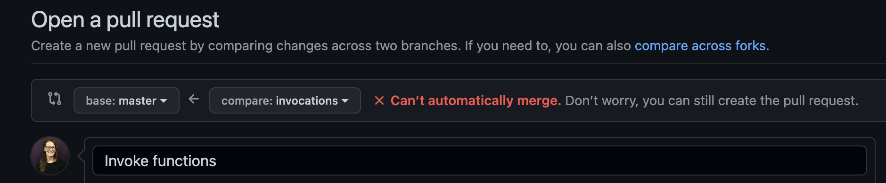
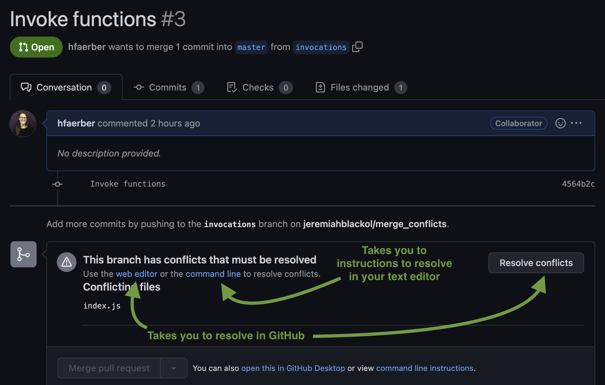

## Learning Goals
- Understand what a merge conflict is
- Be exposed to resolution steps
- Identify ways to prevent merge conflicts

## Merge Conflicts

<!-- Watch [this merge conflict demo video](https://youtu.be/j0MW7jSc25I?t=0h00m00s) -->
Watch <a href="https://youtu.be/j0MW7jSc25I?t=0h00m00s" target="_blank">this merge conflict demo video</a> (33 minutes) which will walk through a merge conflict and how to resolve it.   Then read through the key points which are outlined in the lesson content below.

### What are they and how do they happen?  
Merge conflicts will happen to you at some point, and its important to learn how to resolve them successfully. A merge conflict happens when two branches change code in the same spot of a file and are attempted to be merged. Git isn't sure how to cleanly merge them, and needs our help to resolve the conflict.  

Merge conflicts don't necessarily mean someone 'messed up'.  Sometimes two devs are working on code that has some overlap.  Thats ok!  Running into a merge conflict means you get to take the reins and be explicit about exactly what changes you want to keep.  This is a good safety net to have!  

### How will I know and what does it look like?
You will usually run into a merge conflict when you push up a branch and create the PR on GitHub.  

As soon as you start to create a PR in GitHub, you might see this red indicator stating "can't automatically merge".  But you can continue to create the PR anyways.  
  

After you've created the PR, you will notice that the "Merge pull request" button is greyed out instead of green.  GitHub will offer you options to resolve the conflict in the GitHub GUI, or instructions for how to resolve it with the command line and your text editor (recommended).

Sometimes you won't even be able to push the branch up to GitHub because you will encounter an error like this in your terminal when you try:  
  `error: failed to push some refs to github`  
This is another situation where branches have gotten out of sync. You can use the same steps below to resolve. The only difference is that when you push the conflict-resolved changes up, you won't already have a PR open and will need to create one as usual.

## Resolving Merge Conflicts
Merge conflicts can be resolved in the GitHub GUI (there on the GitHub web interface) or in your text editor.  Either option is fine.  However, as a developer, you might find it valuable to know how to resolve merge conflicts in your text editor.  When you get a job, who knows if your company will use GitHub, BitBucket or some other tool.  If you only know how to resolve merge conflicts on the GitHub GUI, that might be problematic.  For that reason, we encourage you to resolve merge conflicts in your text editor right from the start.

### Steps to resolve using your text editor
When you run into the merge conflict on GitHub, go ahead and create the PR, then follow these steps in your text editor:  
  1. Checkout the `main` branch using `git checkout main`  
  1. Pull down the most up-to-date code from the remote repo's main branch (your "source of truth") using `git pull origin main`  
  1. Checkout your feature branch using `git checkout yourFeatureBranchName`  
  1. Bring the updated code from the main branch into your feature branch using `git merge main`  
    * You will likely run into the merge conflict at this point  
  1. In your text editor, select exactly which lines of code you want to keep  
  1. After resolving the conflict, stage and commit the file(s)  
  1. Push up the updated/conflict-resolved files using `git push origin yourFeatureBranchName`.  Those changes will go into the already-open PR which should then be able to be merged.

GitHub offers instructions for how to resolve a merge conflict through the command line (using your text editor).  They are essentially the same steps as outlined above.  Test out these instructions when you encounter a merge conflict.  

## Best practices to avoid merge conflicts
- Do your edits/work on branches.  Do not edit the main branch directly. Do not push to main.
  - If you accidentally start coding on main, don't worry!  You can create a new branch and it will bring those edits to the new branch.
- Create pull requests and do thorough code review before merging them.
- Always be sure to pull down the most up-to-date code from your remote repo's main branch before creating a new branch and starting to add/edit code yourself.
- Communicate with your collaboration partners to ensure everyone knows who is working on what, and when.

## Best practices when you encounter a merge conflict
- Pause, breathe, remember this is a GOOD thing - chance for you to make sure everything merges exactly how you want it to.
- Get in touch with your project team.  Especially in Mod 1, it's best to get everyone on the call together to make sure you are keeping the correct code and avoiding errors as you resolve the conflict.  Plus, you all need as much exposure and practice as possible when it comes to resolving merge conflicts.
- Triple check your work, including the adjacent code that may not be directly highlighted as part of the conflict.  This is the time for extreme attention to detail.
- Ask for help.  Use your classmates, mentors, etc.  Any extra set of eyes is helpful.
