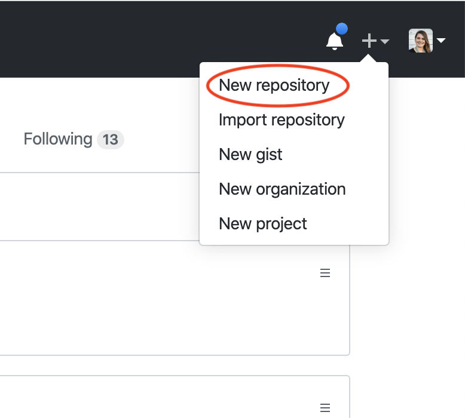
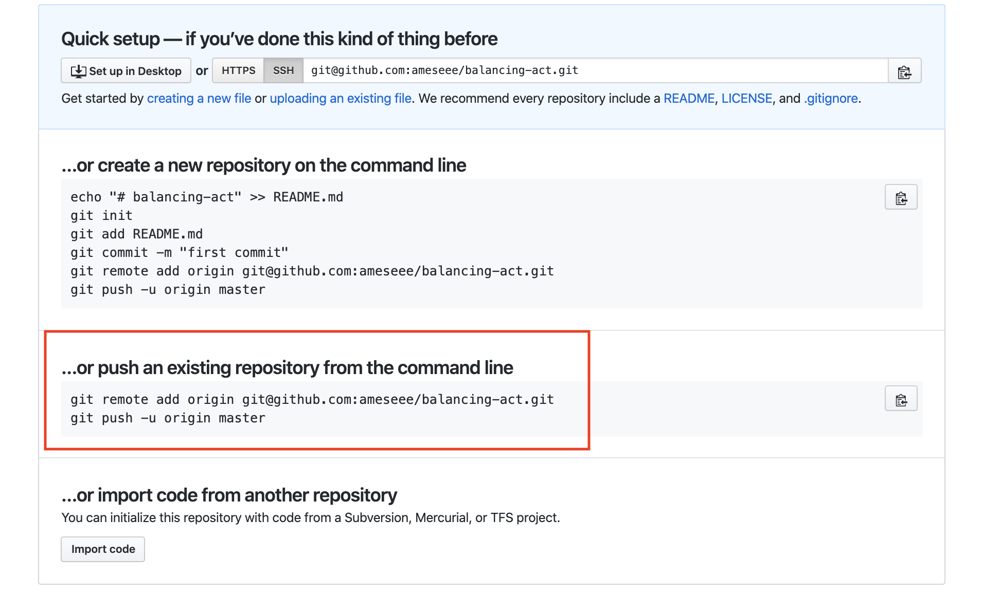
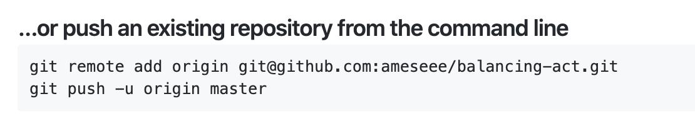
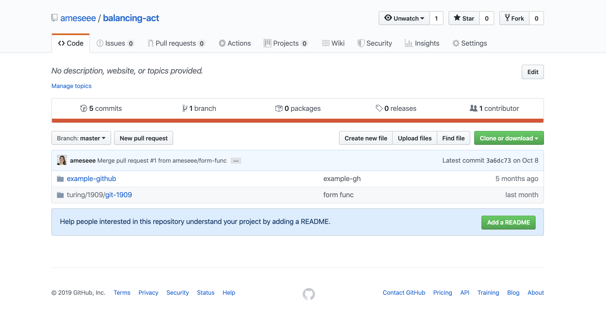
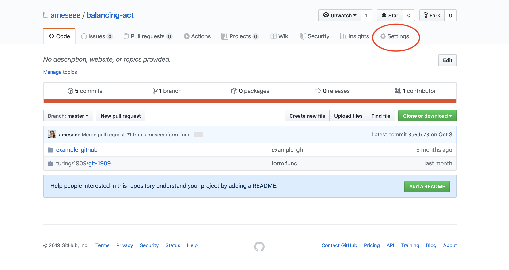
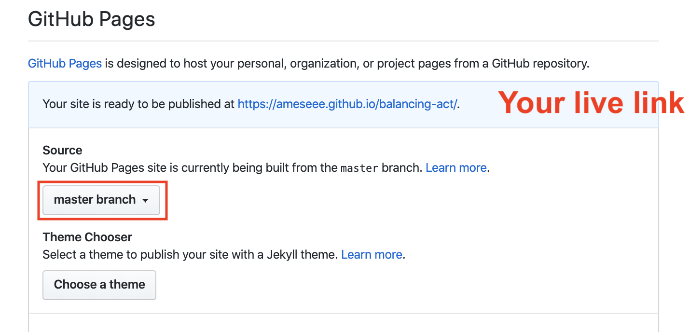

## Overview

This is a quick tutorial that will walk you through how to connect a project on your computer to a GitHub repository.

## Local vs. Remote Repositories

Despite their similar names, Git and GitHub are not the same thing. They work together, but they are their own distinct beasts.
* Git allows us to save specific versions of our work in a _local_ repository on our computer.
* GitHub is an online Git project repository hosting service, which means it holds the directories that contain all the files and folders that make up our projects.

GitHub also allows teams to work seamlessly together (most of the time) on the same codebase. Everyone on a team can pull down a local version of the repo on GitHub, and then, as work is done, the code is committed and pushed from the developer’s local repo and added to the repo on GitHub.

## Step 1: Create a Local Repository

Before we can connect a project on your computer to a GitHub repository, we have to have a local repository. Make sure you've taken the steps below to create the local git repository.

In your terminal, navigate to the project directory. You can check you've done this correctly by running `pwd` and reading the output. (The output will not be exactly like what you see below, but should show _your_ file path).

```bash
$ pwd
my-macbook-pro/turing/1module/balancing-act
```

Now, initialize the repository:

```bash
git init
```

Add and commit the files:

```
git add [filename]
git add [filename]

git commit -m "Initial commit"
```

**NOTE:** Once and only once, the very first time you make a commit on a project, you should make your commit message "Initial commit".

## Step 2: Create a GitHub Repository

Follow the steps listed below. Below this set of steps are screenshots that may provide additional support.
1. When logged into GitHub, **click the plus icon** in the top right corner, then **select "New repository"** from the drop down.
2. **Complete the form:** Add a name in the input field and click submit.
3. After click submit, you'll be taken to a new page. This is a menu of options GitHub provides for how you can start a repository with them. Since we already created a project, we will follow the second set of directions.
4. Under the "...or push from an existing repository from the command line" directions, **copy that first line, then paste it in your terminal and hit return.** You will not get any feedback/output after running that.
5. **Copy that second line, then paste it in your terminal and hit return.** This will take a few seconds, and you'll see about 8-10 lines of output.
6. Back in GitHub, **refresh the page**. You should see a page similar to what is below.

Your local and remote repositories are now connected!











## Step 3: Deploy to GitHub Pages

GitHub pages is a free service provided by GitHub that allows you to deploy your small sites. You can send the URL link to friends and family and they can see the awesome projects you build during Mod 1!

**Follow the directions below to set this up:**

1. From the main repository page, click "Settings"
2. Scroll about 80% of the way down, until you see the "GitHub Pages" section
3. From the "Source" dropdown, select "master"
4. When the page refreshes, scroll back down. In the light blue header section of the "GitHub Pages" section, you will be given a URL. That is the link to your deployed project. You may click on it and see a 404 for the first few minutes or hours depending on how busy GitHub is. Don't panic. This is why we require you to set up GitHub Pages immediately!

From now on, when you push a change up to your master branch, GitHub pages will automatically read those updates and update your live link as soon as possible. Keep in mind those changes sometimes take a few hours.




