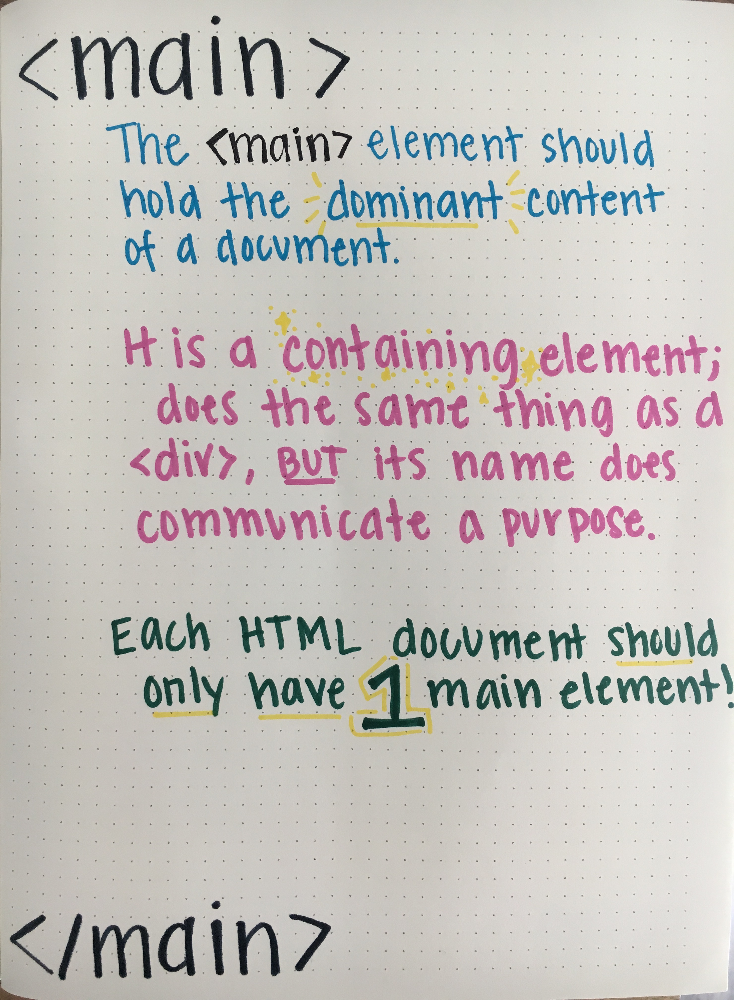

## Learning Goals

* Understand what HTML stands for and it's purpose
* Identify and use attributes for appropriate elements
* Understand the importance of writing semantic HTML

## Pre-Work

Spend 15-20 minutes reading, watching, and completing the content in the [Chrome Dev Tools](./chrome-dev-tools) resource before attending class.

## Vocabulary

- `HTML` HyperText Markup Language
- `CSS` Cascading Style Sheet
- `HTML Element` A building block that makes up the structure of a web page. Encompasses tags and content
- `HTML Tag` Used to create HTML elements. Some elements have an opening and closing tag, others only have an opening tag
- `Attribute` Additional values that configure HTML elements and adjust their behavior
- `Hyperlink` A reference to an external resource
- `Nesting` when an element lives inside of another element

## Warm Up

Open up the Chrome Dev Tools in your browser. In your notebook, jot down the answers to the following as you explore:
- How did you open the Dev Tools?
- How do you move the Dev Tools "dock" to the bottom or side?
- How do you increase the size of the font in the Dev Tools?
- How do you open the inspector tool?
- How can you search for a specific HTML element in the HTML document? For example, `<nav>`.
- How can you change the Dev Tool to dark or light mode?

Now, share/compare discoveries with your partner. Be ready to share out your answers in the large group.


## Overview

The front-end of the web is based on three major technologies:

* __HTML aka "STRUCTURE"__:  HyperText Markup Language (HTML) defines the structure and semantics of web pages on the web.
* __CSS aka "PRESENTATION"__:  Cascading Style Sheets (CSS) sets the look and style of a web page. CSS provides style to the structure provided by HTML.
* __JavaScript aka "BEHAVIOR"__:  JavaScript allows us to define interaction in our pages. What happens when a user clicks on a certain area?

Today, we will build a foundation of HTML knowledge and skills.

## What is HTML?

HTML is used to create electronic documents (pages) that are displayed on the Web.  

HTML ensures the proper formatting of content (text, images, video) so that your internet browser can display them as intended.  As a result, HTML is made up of many elements.  These elements are used to hold our content and define how the browser must format and display the content. The term `markup` refers to the set of tags used to structure a page.

## Elements & Tags

Elements are created with either one or more tags and are used to describe and hold our content. These tags are created by using angle brackets `<>`.  Most elements consist of an opening and closing tag which wraps content like text.

Elements which are created with only one tag are called [empty elements](https://developer.mozilla.org/en-US/docs/Glossary/Empty_element) (also known as self-closing elements) and cannot have any child elements. Examples of this are `` and `<input>`.

Elements which can contain child elements are created with an opening and closing tag which surround the child elements and/or text content. `<h1>Text Content</h1>`

### Example

Let's say that we had some text and we wanted to denote that this text was a paragraph.

```
This is an example paragraph. We should probably place this inside of a tag. If we place it in a tag it will be easier to access and style.
```

We'd wrap the text in paragraph tags.

```html
<p>This is an example paragraph. We should probably place this inside of a tag. If we place it in a tag it will be easier to access and style.</p>
```

### Anatomy of a Tag


We use `<p>` to signal to the browser that everything that's about to follow is part of a paragraph and `</p>` to let the browser know that this paragraph is done. When a user visits our application, the browser loads up the HTML and parses it into the elements that will eventually make up our user interface.

<section class="note">
### Pro Tip

Type both opening and closing tags before typing content to avoid making silly mistakes that are hard to hunt down later.
</section>

Here is an example of a slightly more robust document:

<p class="codepen" data-height="300" data-theme-id="37918" data-default-tab="html,result" data-user="turing-school" data-slug-hash="oNNjYqM" style="height: 300px; box-sizing: border-box; display: flex; align-items: center; justify-content: center; border: 2px solid; margin: 1em 0; padding: 1em;" data-pen-title="Very Basic HTML Page">
  <span>See the Pen <a href="https://codepen.io/turing-school/pen/oNNjYqM">
  Very Basic HTML Page</a> by Turing School (<a href="https://codepen.io/turing-school">@turing-school</a>)
  on <a href="https://codepen.io">CodePen</a>.</span>
</p>
<script async src="https://static.codepen.io/assets/embed/ei.js"></script>

<section class="call-to-action">
### Turn & Talk
- What makes an HTML element different than an HTML tag?
- What is the difference between a “regular” element and a self-closing, or empty element?
- What will the browser do if it doesn't see a closing tag for a given element?
</section>

## HTML Attributes

Any HTML element can have attributes. An attribute provides additional information about an element. It must be specified in the opening tag of an element, and usually come in name/value pairs. A `class` is a commonly used attribute:

```html
<p class="paragraph"></p>
```

The name of the attribute in the example above is class, and the value is `"paragraph"`. The are separated by a single `=`, and no spaces.

Attribute names are determined for us by HTML; we must comply with the list of available names to use. The values are determined by us as developers. Different attributes are used for different purposes; we will explore some of those today, and continue learning the use-cases for others as we move into CSS and JavaScript.

### Attributes in Images

We use HTML tags to mark up text to show its semantic meaning. The browser uses these tags to structure the document. As we talked about earlier in this lesson, _most_ tags have an opening and closing tag, but a few do not. For example, images defined using the `` tag do not have a closing tag.

Consider the following:

```html

```

Our browser is more than happy to load up an image, but we need to tell it where that image is located. Our `` tag needs extra information to know which image to display. That's where the `src` attribute comes in. The `alt` attribute provides alternative text in the case the user is not able to view the image.


### Attributes in Hyperlinks

Another important tag is the `<a>` tag. These are the tags we use for creating hyperlinks. You might have noticed that the `<a>` tag behaves a little differently than the `<h1>`, `<h2>`, and `<p>` tags. We can use the `<a>` tag to mark up a few words, while the other tags denote a big section - what we might call a "block" — of our page.

Consider the following example:

```html
<p>
  Welcome to the <a href="http://turing.io">Turing School of Software and Design</a>.
</p>
```

In this case, the `<a>` tag needs to know which url it should be linked to. We use the `href` attribute to set the links destination. `href` is an abbreviation for "hypertext reference."

<section class="call-to-action">
### Turn & Talk

- What are HTML attributes?
- Which attributes have you seen used before, and what was the purpose of each of those?
</section>

## Thinking Bigger Picture

We've learned how to use some pieces of HTML, but it's important we can put them together to build a site.

### Required Structure of any HTML Page

Every page that is built with HTML needs to have the following four elements to start:

* `<!DOCTYPE html>` declaration: The doctype declaration is not an HTML tag, but rather tells the browser which version of HTML the page is written in.  
  - [W3C DTD Docs](https://www.w3.org/QA/2002/04/valid-dtd-list.html)  
* `<html></html>` tag wraps the entire document
* `<head></head>` tag wraps elements that shouldn't be rendered - information about the page and how to process it
* `<body></body>` tag wraps elements that should be displayed - the actual content that will appear in the browser

<p class="codepen" data-height="300" data-theme-id="37918" data-default-tab="html,result" data-user="turing-school" data-slug-hash="oNNjYdM" style="height: 300px; box-sizing: border-box; display: flex; align-items: center; justify-content: center; border: 2px solid; margin: 1em 0; padding: 1em;" data-pen-title="Required Structure of HTML">
  <span>See the Pen <a href="https://codepen.io/turing-school/pen/oNNjYdM">
  Required Structure of HTML</a> by Turing School (<a href="https://codepen.io/turing-school">@turing-school</a>)
  on <a href="https://codepen.io">CodePen</a>.</span>
</p>
<script async src="https://static.codepen.io/assets/embed/ei.js"></script>

## Nesting HTML Elements

Before we really start putting what we've learned into practice, it's important to be familiar with vocabulary and certain patterns. Specifically, around nested HTML elements.

As sites become more complex, more elements are used, and more are used in relation to each other. Let's take a look at this example below:

```html
<nav>
  <ul>
    <li><a href="home">Latte</a></li>
    <li><a href="about">Cappucino</a></li>
  </ul>
</nav>
<main>
  <section>
    <h2>Coffee Ipsum</h2>
    <p>Variety, half and half, trifecta medium arabica froth percolator. Mug brewed aromatic that sit to go latte. Cup, skinny cup, as blue mountain turkish, pumpkin spice.</p>
    <p>Pumpkin spice americano java coffee doppio and sweet mug java saucer variety aromatic. Flavour, cappuccino macchiato et at, latte french press cream rich con panna barista single origin.</p>
  </section>
</main>
```

The `<nav>` and `<main>` elements are on the same level - or sibling elements. We know this because they sit on the same indentation line, and they are not wrapped around one or another.

Nested inside the `<main>` element is a `<section>`. Nested inside the `<section>` is an `<h2>`, `<p>` and another `<p>`. We can communicate the same relationship by saying "the `<section>` is wrapped around the `<h2>` and both `<p>`s."

Because so much nesting occurs in HTML, it is absolutely essential that you write clean, easy-to-read code with consistent use of white-space and indentation.

## Semantic HTML

HTML5 has a variety of _semantic tags_, or HTML tags that provide additional meaning through descriptive naming, available for us to use. These tags are an easy way to not only make our code more understandable and clear to other developers (and our future selves), but they are also a great way to incorporate basic accessibility into your HTML for users who may need to access your website in non-traditional ways.

For your assigned list of semantic tags, do a little research on your own. Then, you'll move into a small group, ask/answer any questions and make sure everyone is one the same page, then make an anchor chart with your findings.

Consider:
- When should this tag be used?
- What does this tag do for us?
- How many of these tags might we see on a given site?

Assignments:
- Group 1: nav, header, footer
- Group 2: section, article, aside
- Group 3: mark, em, strong, time, address

Here's an example of an anchor chart, for the `<main>` tag:



## Refactoring Some HTML

Now that you know what clean, correctly indented HTML looks like, and some of the semantic tags that are available to you, let's take some time to practice.

<section class="call-to-action">
### Partner Practice

- Choose a driver and a navigator.
- The driver should fork [this CodePen](https://codepen.io/turing-school/pen/KKKdNeM).
- First, fix the indentation to make this more readable and maintainable
- Then, look for at least 3 opportunities to improve readability and accessibility by changing tags to be more semantic. Once you and you partner agree, make those changes.
</section>

## Additional Resources

* [Turing HTML Style Guide](https://github.com/turingschool-examples/html)
* [W3C Markup validation](https://validator.w3.org/#validate_by_uri)
* [MDN HTML Overview](https://developer.mozilla.org/en-US/docs/Web/HTML)
* [MDN HTML Reference](https://developer.mozilla.org/en-US/docs/Web/HTML/Reference)
