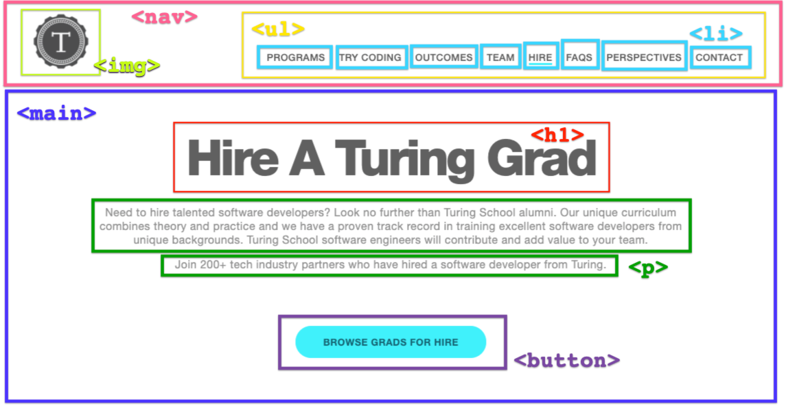
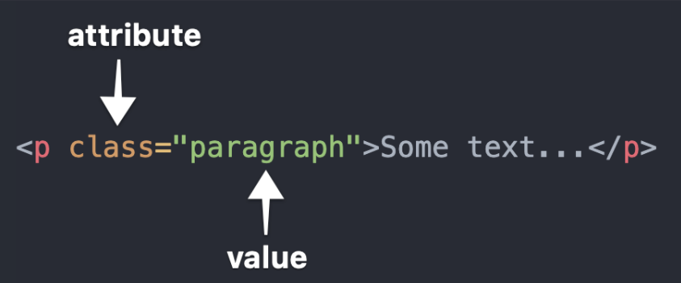

## Learning Goals

* Understand what HTML stands for and it's purpose
* Identify and use attributes for appropriate elements
* Understand the importance of writing semantic HTML

## Pre-Work

Spend 15-20 minutes reading, watching, and completing the content in the [Chrome Dev Tools](./chrome-dev-tools) resource before attending class.

## Vocabulary

- `HTML` HyperText Markup Language
- `CSS` Cascading Style Sheet
- `HTML Element` A building block that makes up the structure of a web page. Encompasses tags and content
- `HTML Tag` Used to create HTML elements. Some elements have an opening and closing tag, others only have an opening tag
- `Attribute` Additional values that configure HTML elements and adjust their behavior
- `Hyperlink` A reference to an external resource
- `Nesting` when an element lives inside of another element

<section class="call-to-action">
### Warm Up

Go to the [Turing Home Page](https://turing.edu/) and open up your Dev Tools.
- Click on the "Elements" tab. Stay in the "Elements" tab throughout this Warm Up.
- Dig into the `<body>`. What are some things you see nested inside of this element? Can you associate any of the things you see in the code to what you see on the page?
- In many of the elements, you'll notice a `class`. What do you think those are used for?
- How can you search for a specific HTML element in the HTML document? For example, `<nav>`.
- Click around a bit more. What else do you notice in the "Elements" view of the Dev Tools?
</section>

## Overview

The front-end of the web is based on three major technologies:

* __HTML aka "STRUCTURE"__:  HyperText Markup Language (HTML) defines the structure, content and semantics of web pages on the web.
* __CSS aka "PRESENTATION"__:  Cascading Style Sheets (CSS) sets the look and style of a web page. CSS provides style to the structure provided by HTML.
* __JavaScript aka "BEHAVIOR"__:  JavaScript allows us to define interaction in our pages. What happens when a user clicks on a certain area?

Today, we will build a foundation of HTML knowledge and skills.

## What is HTML?

HTML is used to create electronic documents (pages) that are displayed on the Web.  

HTML ensures the proper formatting of content (text, images, video) so that your internet browser can display them as intended.  As a result, HTML is made up of many elements.  These elements are used to hold our content and define how the browser must format and display the content. The term `markup` refers to the set of tags used to structure a page.

## Elements & Tags

Elements are created with either one or more tags and are used to describe and hold our content. These tags are created by using angle brackets `<>`.  

Most elements are created using an opening and closing tag which surround the child elements and/or text content. `<h1>Text Content</h1>`

Elements which are created with only one tag are called [empty elements](https://developer.mozilla.org/en-US/docs/Glossary/Empty_element) (also known as self-closing elements) and cannot have any child elements. Examples of this are `` and `<input>`.

<section class="note">
### Pro Tip

Type both opening and closing tags before typing content to avoid making silly mistakes that are hard to hunt down later.
</section>

## Elements & Tags Example

Let's start by looking at this page:


Notice all of the HTML elements that exist on the page:


Now, let's look at what that HTML looks like:
```html
<nav>
  
  <ul>
    <li>Programs</li>
    <li>Try Coding</li>
    <li>Outcomes</li>
    <li>Team</li>
    <li>Hire</li>
    <li>FAQs</li>
    <li>Perspectives</li>
    <li>Contact</li>
  </ul>
</nav>
<main>
  <h1>Hire A Turing Grad</h1>
  <p>Need to hire...</p>
  <p>Join 200+ tech industry partners...</p>
  <button type="button" name="browse-button">BROWSE GRADS FOR HIRE</button>
</main>
```
<section class="call-to-action">
### Partner Practice

Discuss the following questions with your partner:
- Do you notice any empty elements?
- What is a `<ul>` element? What are `<li>` elements?
- What do you notice about the indentation of all of the elements?
- Are there any elements in the HTML that are not visible on the actual page? Why do you think we have those elements?
</section>

## Nesting HTML Elements

Before we move on, it's important to be familiar with vocabulary and certain patterns. Specifically, around nested HTML elements.

As sites become more complex, more elements are used, and more are used in relation to each other. Let's look at the example from the above section.

The `<nav>` and `<main>` elements are on the same level - or __sibling__ elements. We know this because they sit on the same indentation line, and they are not wrapped around one another.

Nested inside the `<main>` element is an `<h1>`, 2 `<p>` elements, and a `<button>`. We can communicate these relationships with the following terms:
- The `<h1>` and `<button>` elements are __siblings__ to each other.
- The `<h1>` is a __child__ of the `<main>`.
- The `<main>` is a __parent__ of the two `<p>` elements.

Because so much nesting occurs in HTML, it is absolutely essential that you write clean, easy-to-read code with consistent use of white-space and indentation.

## HTML Attributes

Any HTML element can have attributes. An attribute provides additional information about an element. It must be specified in the opening tag of an element, and usually come in name/value pairs. A `class` is a commonly used attribute:



The name of the __attribute__ in the example above is class, and the __value__ is `"paragraph"`. The are separated by a single `=`, and no spaces.

Attribute names are determined for us by HTML; we must comply with the list of available names to use. The values are determined by us as developers. Different attributes are used for different purposes; we will explore some of those today, and continue learning the use-cases for others as we move into CSS and JavaScript.

### Attributes in Images

We use HTML tags to mark up text to show its semantic meaning. The browser uses these tags to structure the document. As we talked about earlier in this lesson, _most_ tags have an opening and closing tag, but a few do not. For example, images defined using the `` tag do not have a closing tag.

#### Consider the following:

```html

```

Our browser is more than happy to load up an image, but we need to tell it where that image is located. Our `` tag needs extra information to know which image to display. That's where the `src` attribute comes in. The `alt` attribute provides alternative text in the case the user is not able to view the image.

### Attributes in Hyperlinks

Another important tag is the `<a>` tag. These are the tags we use for creating hyperlinks. You might have noticed that the `<a>` tag behaves a little differently than the `<h1>`, `<h2>`, and `<p>` tags. We can use the `<a>` tag to mark up a few words, while the other tags denote a big section - what we might call a "block" — of our page.

#### Consider the following example:  
Welcome to the [Turing School of Software and Design](http://turing.edu).

```html
<p>
  Welcome to the <a href="http://turing.edu">Turing School of Software and Design</a>.
</p>
```

In this case, the `<a>` tag needs to know which url it should be linked to. We use the `href` attribute to set the links destination. `href` is an abbreviation for "hypertext reference."

<section class="call-to-action">
### Stop & Reflect

- What are HTML attributes?
- Why are HTML attributes useful?
</section>

## Thinking Bigger Picture

We've learned how to use some pieces of HTML, but it's important we can put them together to build a site.

### Required Structure of any HTML Page

Every page that is built with HTML needs to have the following four elements to start:

* `<!DOCTYPE html>` declaration: The doctype declaration is not an HTML tag, but rather tells the browser which version of HTML the page is written in.  
  - [W3C DTD Docs](https://www.w3.org/QA/2002/04/valid-dtd-list.html)  
* `<html></html>` tag wraps the entire document
* `<head></head>` tag wraps elements that shouldn't be rendered - information about the page and how to process it
* `<body></body>` tag wraps elements that should be displayed - the actual content that will appear in the browser

<section class="call-to-action">
### Partner Practice

- Go to [this repository](https://github.com/kaylaewood/htm_css_fundamentals). No need to fork or clone it!
- Click on the `index.html` file to view its code.
- What two sibling elements are nested inside of `<html>`?
- Use Google to determine what the attributes in `line 2` mean.
- What type of information exists in the `<head>` element? Why isn't this information in `<body>`?
- What do you think `line 5` is doing? What about `line 29`?
</section>

## Semantic HTML
HTML5 has a variety of _semantic tags_, or HTML tags that provide additional meaning through descriptive naming, available for us to use. They don't provide any visual difference, but do have benefits in other areas:
- They can make our code more understandable and clear to other developers (and our future selves) by organizing content
- They incorporate basic accessibility into your HTML for users who may need to access your website in non-traditional ways (ie: provide a verbal roadmap for users utilizing screen reader software).


Before we had semantic tags like `<main>`, `<section>` and more, developers would use `<div>` tags to organize content. `<div>`'s are still really useful elements, but we should aim to use more semantic tags for organizing large blocks of your HTML code.

<section class="call-to-action">
### Solo Investigation
Take some time to notice the differences between these two codepens:  
- [Non-Semantic Page](https://codepen.io/kaylaewood/pen/QWEjbZM)
- [Semantic Page](https://codepen.io/kaylaewood/pen/NWrGqmv)
</section>

## Refactoring Some HTML

Now that you know what clean, correctly indented HTML looks like, and some of the semantic tags that are available to you, let's take some time to practice.

<section class="call-to-action">
### Partner Practice

- Choose a driver and a navigator.
- The driver should fork [this CodePen](https://codepen.io/kaylaewood/pen/YzWyyPw).
- First, fix the indentation to make this more readable and maintainable
- Then, look for at least 3 opportunities to improve readability and accessibility by changing tags to be more semantic. Once you and you partner agree, make those changes.
</section>

## Wrap Up

<section class="call-to-action">
### Solo Journaling

- How would you describe HTML to someone who has never heard of it before?
- What is an HTML attribute and why would you use one?
- Why is it important to be consistent with your use of white space and indentation when writing HTML?
- What is the purpose of semantic HTML?
- What questions do you still have about HTML?

</section>

## Additional Resources

* [Turing HTML Style Guide](https://github.com/turingschool-examples/html)
* [8 Best Practices to Write Clean HTML Code](https://medium.com/@sergimarquez/8-best-practices-to-write-clean-html-code-1cd407e2a7ec)
* [W3C Markup validation](https://validator.w3.org/#validate_by_uri)
* [MDN HTML Overview](https://developer.mozilla.org/en-US/docs/Web/HTML)
* [MDN HTML Reference](https://developer.mozilla.org/en-US/docs/Web/HTML/Reference)
