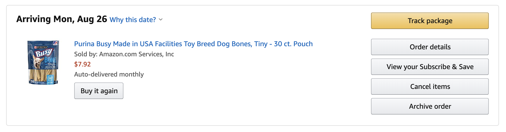
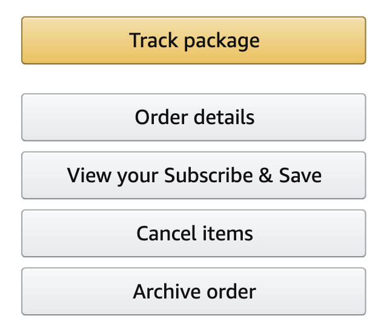

## Learning Goals

* Implement clean and consistent CSS syntax
* Use Chrome Dev Tools to debug CSS
* Demonstrate understanding of the box model by recreating small comps

## Pre-Work

Read through [Intro to CSS Pre-Work document](./intro-to-css-prework.html) and all links provided and complete exercises provided in it. Be prepared to demonstrate your understanding of the concepts in that document when you come to this class.

## Vocabulary

- `CSS` Cascading Style Sheets
- `HTML element` A building block that makes up the structure of a web page
- `id` / `class` attributes on HTML elements that allow us to identify HTML elements in our CSS
- `property` (CSS property) The name of a style property of an HTML element (e.g., color, border)
- `value` The value that is paired with a given style property
- `declaration` A property/value pair within a CSS rule
- `declaration blocks` multiple declarations
- `selector` used to target HTML elements on our web pages that we want to style
- `rule` selector(s) and a declaration block come together to create a rule

## Warm Up

Answer the following questions in your notebook. Be ready to share out your answer as if you were in an interview.
- What is the difference between HTML and CSS?
- List at least two ways an element can be targeted in CSS, and write out the syntax.
- List at least three CSS properties and explain what they do.

## What is CSS?

It’s a “style sheet language” that lets you style the HTML elements on your page. CSS works _with_ HTML, but isn't HTML. CSS controls the positioning, sizing, colors, and specific fonts on your page. There is a `class` and `id` attribute available to use on __every__ HTML element. In addition to the plain old element names themselves, these attributes allow you to create "targets" for both your CSS and JavaScript. They are hooks that you can use to manipulate the look and behavior of your HTML elements.

## Anatomy of a Basic CSS Rule


We can target an HTML element in CSS many ways:
* via element name
* via class name
* via id name
* via a combination of above

<p class="codepen" data-height="300" data-theme-id="37918" data-default-tab="html,result" data-user="turing-school" data-slug-hash="GRRpNBa" style="height: 300px; box-sizing: border-box; display: flex; align-items: center; justify-content: center; border: 2px solid; margin: 1em 0; padding: 1em;" data-pen-title="CSS Rules">
  <span>See the Pen <a href="https://codepen.io/turing-school/pen/GRRpNBa">
  CSS Rules</a> by Turing School (<a href="https://codepen.io/turing-school">@turing-school</a>)
  on <a href="https://codepen.io">CodePen</a>.</span>
</p>
<script async src="https://static.codepen.io/assets/embed/ei.js"></script>

<section class="call-to-action">
### Explore

With your partner, use the CodePen above to explore. Then, answer the questions below:

* Can you add two classes to an element? What is the syntax?
* Which class will take precedent?
* If an element has both a class and an id, and conflicting rules are applied to the class and id, which takes precedent? What about element and class? Element and id?
</section>

## Dev Tools and CSS

Developer Tools, or Dev Tools, are available to use in every browser. They help us debug, experiment, and test assumptions in our HTML, CSS, and JavaScript quickly and with a low-risk in the browser. They're your friend when it comes to understanding how CSS works (or untangling why it *isn't* working) -- get in the habit of using them early and often!

### Editing CSS

To the right of the HTML pane, there's a small sidebar that gives us styling information for the currently selected element. Similar to the HTML pane, we can add or remove styles and adjust CSS property values from this pane. You can click on any style property associated with the selected element and change its value. You can also use the blue checkbox to toggle the style on or off.


<section class="call-to-action">
### Dev Tools Challenge

Directly from the CSS pane, we can edit the CSS and see the changes reflected immediately.

Let's make the following edits on [kodewithklossy.com](https://www.kodewithklossy.com/):

* Change the background color of the div that holds the mission to `rebeccapurple`
* Change the text color of all the nav items to `orange`.
* Change the "Kode With Klossy" logo in the nav bar to have a height of 90px and a width of 320px
* Hide the element that contains the content under the sub header "In The News"

**Finished Early?** Find the Turing logo in the footer of the site. Inspect it. What HTML element created it? What attributes does it have? In the Styles Pane, toggle off and on various CSS properties to explore the outcome. Now, scroll down in that pane - you'll see a rule that targets: `#comp-jxczctmainlineContent-gridContainer > *`. Do some research to explore what `>` is doing. Lastly, consider this: when you explore elements in larger sites, you'll commonly see very obscure looking class and ID names - if there is such an emphasis on semantics and good naming, why might this be?
</section>

## The Box Model

Each elements content is in a rectangular box. CSS leverages **the box model** to control layout and design. An HTML element is comprised of its content and the padding, borders, and margins surrounding it. Boxes are "stacked" in the order they appear in your HTML. You can stack them horizontally, vertically, and in the z-plane.

This diagram can be found in the CSS Dev Tools and the same color coding is used when we hover over elements in the browser with the inspector selected.  You will probably find it extremely helpful!

# 

### The Docs

* [MDN CSS Box Model](https://developer.mozilla.org/en-US/docs/Web/CSS/CSS_Box_Model/Introduction_to_the_CSS_box_model)
* [MDN CSS Overview](https://developer.mozilla.org/en-US/docs/Web/CSS)

## The Box Model Applied

First, let's flex those command line muscles you've been building:

* Create a directory called `static-site-playground`
* Create a file `index.html`, copy and paste in the HTML provided below
* Create a file `main.css`
* Open the project in Atom
* Link the index and main files you just made
* Test things are working as expected by opening in the browser by running `open index.html` in your terminal

```html
<!doctype html>
<html>
  <head>
    <title>CSS Playground</title>
  </head>
  <body>
    <h1>Button Practice</h1>
    <section>
      <button class="track-package">Track package</button>
    </section>
  </body>
</html>
```

Next, we'll use this HTML to do some experimenting with Box Model behavior.

<section class="call-to-action">
### Explore Box Model

On your own, take a few minutes to practice writing the syntax of CSS rules and seeing how margin and padding affect an element.
- A common mantra when working on CSS is "when in doubt, border it out". Apply a border of an obvious color to both the section and button so you are 100% clear on where things are.
- Add margin and padding to your button
- Add margin and padding to the section

With your partner, choose a website you frequently visit. Find a button or box that demonstrates the use of padding. Find a place where margin was probably used to provide breathing room. Be ready to show and share!
</section>

## Recreating Comps

We can apply all the margin and padding we want, but when it comes down to it, many times Front End Developers are tasked with re-creating something a designer has provided them with, commonly called "comps". Let's use our tools to build something professional-grade.

The screen shots below are taken from the "Your Orders" page.




<section class="call-to-action">
### Recreating Amazon Buttons

With your partner, decide who will drive and who will navigate. The navigator should close their computer.

First, work to recreate the "Track package" button. Since the focus is box model, do not worry about the slight linear gradient in the background color; just use `#f0c14b` and `#846a29` for the border. Things to keep in mind:
  - Approximately what percentage of the button do the words take up on Amazon's button? How closely does yours match that?
  - About how much space is between the top of the letter and the top border?
  - How thick is the border?
  - What do the corners of the button look like?

Now, work to recreate the 4 grey buttons. You already have a lot to work with from the code you wrote for the first one. Use `#e7e9ec` for the background and `#A2A6AC` for the border. Things to keep in mind:
  - How much space is between each grey button?
  - How much space is between the yellow and first grey button?
</section>

## Box-Sizing and the CSS Box Model

In HTML, you can visualize each element as its own rectangular box. There are a number of CSS properties that can affect the final width and height of each of these boxes. The CSS Box Model describes how the final height and width of an element is determined.

We have an `section` element that we gave a `width` of `400` and a `height` of `200`. However, we've also applied several additional properties that are affecting its size and positioning. The `padding` and `border` properties are both adding `20px` to the element's height and width. Now the actual *visible* dimensions of our element are `480x280`. The Dev Tools panel provides a handy graphic of how our section is being rendered.

This is the default behavior for the rendering of block elements in CSS and is due to the `box sizing` property having a default value of `content-box`. The `box-sizing` property allows us to override this behavior and alter how the dimensions of an element are calculated:

```css
*,
*:after,
*:before {
  box-sizing: border-box;
}
```

Setting the `box-sizing` property to `border-box` will alter the model so that the `width` and `height` properties include the content, padding and border. If we were to set `box-sizing: border-box` on our previous example, our element would be rendered at exactly the `400x200` dimensions we specified. It's `padding` and `border` properties would be included within those dimensions, making our content area slightly smaller.

You can read about and see another example [here](https://dev.to/ameseee/meet-border-box-my-best-friend-a56).

<section class="call-to-action">
### Revisiting Amazon Buttons

Revisit your Amazon buttons and add the CSS rule shown above that applies the `box-sizing` property to your CSS. How does it change what's rendered in the browser? How is the size of the elements impacted?
</section>

## Inline vs. Block

While doing your capstone or in yesterday's Intro to HTML lesson, you may have noticed that some HTML elements behave differently, in terms of whether they are on their own line or not.

Every HTML element has a default `display` property - either `inline` or `block`.

Block elements start on a new line and take up the entire width of the page, even if the content doesn't take up the entire width of the page. Some elements that default to `display: block` are `p`, `h1` and `section`. Open up this CodePen to see this illustrated:

<p class="codepen" data-height="300" data-theme-id="37918" data-default-tab="css,result" data-user="turing-school" data-slug-hash="mddeOGg" style="height: 300px; box-sizing: border-box; display: flex; align-items: center; justify-content: center; border: 2px solid; margin: 1em 0; padding: 1em;" data-pen-title="Block Elements">
  <span>See the Pen <a href="https://codepen.io/turing-school/pen/mddeOGg">
  Block Elements</a> by Turing School (<a href="https://codepen.io/turing-school">@turing-school</a>)
  on <a href="https://codepen.io">CodePen</a>.</span>
</p>
<script async src="https://static.codepen.io/assets/embed/ei.js"></script>

Inline elements only take up the space their content requires, so you may see multiple inline elements sitting next to each other. Some elements that default to `display: inline` are `img`, `a`, `input`, and `em`. Open up this CodePen to see this illustrated:

<p class="codepen" data-height="300" data-theme-id="37918" data-default-tab="html,result" data-user="turing-school" data-slug-hash="QWWjGZN" style="height: 300px; box-sizing: border-box; display: flex; align-items: center; justify-content: center; border: 2px solid; margin: 1em 0; padding: 1em;" data-pen-title="Inline Elements">
  <span>See the Pen <a href="https://codepen.io/turing-school/pen/QWWjGZN">
  Inline Elements</a> by Turing School (<a href="https://codepen.io/turing-school">@turing-school</a>)
  on <a href="https://codepen.io">CodePen</a>.</span>
</p>
<script async src="https://static.codepen.io/assets/embed/ei.js"></script>

<section class="note">
### You're not stuck with the default display

While every element has a default, we can modify the `display` of any given element with CSS.
</section>

<section class="call-to-action">
### Changing Display

One by one, fork each CodePen. Add a declaration to one rule at a time, changing the value of the display property from its default.
</section>

We will go into much more detail on how to use the different display properties tomorrow; this is meant to be a high level introduction.

## Additional Resources

* [Turing CSS Style Guide](https://github.com/turingschool-examples/css)
* [Visual Guide to CSS](http://cssreference.io/)
