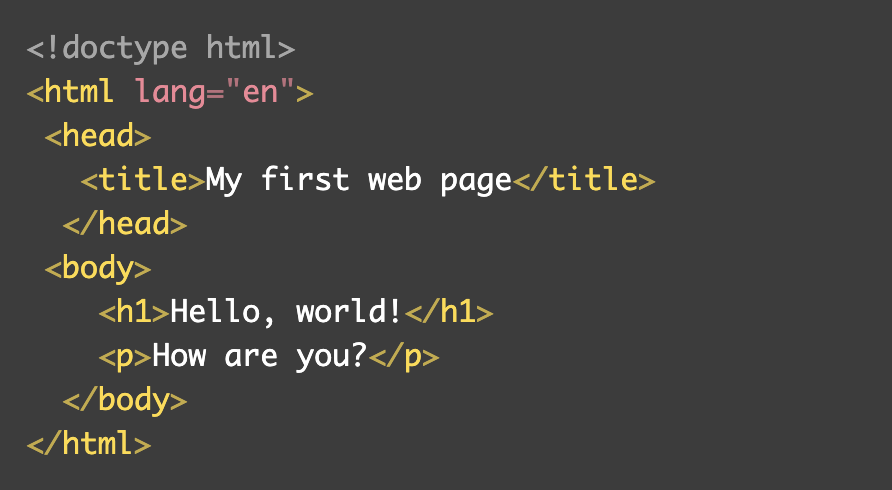
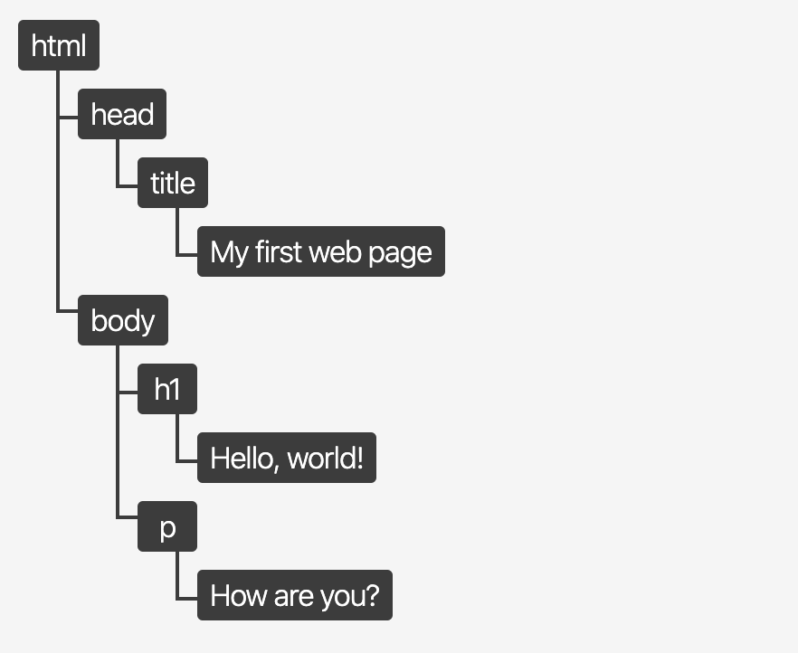
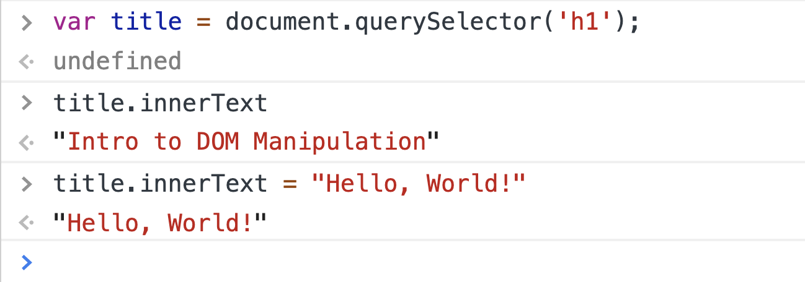
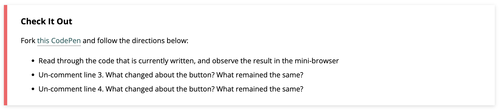

## Learning Goals

* Continue to learn how to access and use the Chrome Developer Tools
* Continue to develop a basic understanding for JavaScript syntax
* Understand how to query and update a page after its been loaded

## Vocabulary

- `HTML Element` A building block that makes up the structure of a web page.
- `CSS Selector` A way to identify a set of elements to which a set of CSS styles apply, typically using a tag, class or id.
- `Interface` a shared boundary across which two separate components exchange information.
- `DOM` Document Object Model, the JS interface used to interact with HTML


## Warm Up

Head over to [Josh W Comeau's website](https://joshwcomeau.com/)! Take 90 seconds to explore!

- Click the little sun icon to toggle dark mode!
- Open dropdown menus!
- Mouse over the blog category buttons

<section id="in-your-notebook" class="call-to-action">
### In Your Notebook

Let's focus on the light-mode/dark-mode toggle button. How do you think this bit of functionality was built? Brainstorm for 2 minutes in your notebook.
</section>

## Document Object Model

The Document Object Model, DOM, is an interface for HTML. It is what allows us to use JavaScript to manipulate the elements or content of elements on a page. Think about a form on a website (maybe signing up to use an application, or paying for your food delivery). Somehow, JavaScript has to know what was typed into an input field, know that the submission button was clicked, and be able to do whatever needs to happen next (maybe showing you a confirmation message). If we didn't have the DOM, this wouldn't be possible.

Once the browser runs/interprets our HTML, it creates the DOM. The DOM represents what is in the HTML, but it is formatted in a way that we can interact with those elements via JavaScript. It is _not_ the exact same thing as your HTML document.

Here's a small HTML file:



Here's the DOM tree that would be created:



Image credit: [bitsofcode](https://bitsofco.de/what-exactly-is-the-dom/).

This is an abstract concept and can be hard to wrap your mind around - we'll come back to it. For now, you need to know two things:
1. The DOM is essential to building functionality on a page
2. We can use the `document` variable in our JavaScript file to interact with the DOM. From there, we can travel through the DOM and ask for specific elements, or instruct the program to change elements.

<section id="check-it-out-1" class="call-to-action">
### Check It Out

In your browser dev tools, type in `document`. Click that small arrow to the left of the output.  
- What do you see?
- Where else can you find that content?
</section>

At any time, you can call `document` to access the DOM. This is very close to the same thing as viewing the document in the Elements panel of the Dev Tools. We won't get into the details of those small differences; if you are interested, start by reading [this blog post](https://bitsofco.de/what-exactly-is-the-dom/).

## Accessing a Specific Element

Our `document` object - it really is a object! - comes built-in with a lot of methods we can use. Today, we will learn about `.querySelector()`. This method allows us to request a specific element from the DOM tree, by its selector. It uses the same syntax for selectors that CSS does. Here's an example:

```javascript
var title = document.querySelector('h1');

title;

//=> <h1>JS: Intro to the DOM</h1>
```

<section id="explore" class="call-to-action">
### Explore

Open the Dev Tools while you are looking at this lesson. In the console, paste this in:

`var box = document.querySelector('.call-to-action');`

Then, call the `box` variable (by typing in `box`, then hitting `return`).

**Discuss with your partner:**
- What is returned?
- Where does that element appear in the browser?
- There are several sections with that class name on this page - why do you think that only _one_ of them is stored in the `box` variable?
- Is there a unique identifier on each of those sections that we could use if we wanted to be more specific when querying?  
</section>

## Updating Content of an Element

So far, we haven't made much headway in terms of _doing_ anything - but we've built some important foundations. It is now time to learn how to update the content of an element we've accessed.

We'll continue using our `title` variable for this example.

```javascript
var title = document.querySelector('h1');
```

Since our `title` variable stores a DOM element, we now have access to another set of properties and methods that are built for DOM elements. We won't learn about all of them today. We'll focus on `innerText`, and time permitting `innerHTML`.

### `innerText`

This is a property which holds the text that lives inside of a given element. Right now, the content inside of the `h1` on this page is `Intro to DOM Manipulation` so that is what the `innerText` is. We can use the assignment operator to change it.



After running the code in the console that is pictured above, the text of the `h1` changed from `Intro to DOM Manipulation` to `Hello, World!`. Now, this may feel a bit disconnected because we know that we usually write our JavaScript in a file in atom, not in the Dev Tools. **If we wrote this in the JavaScript file associated with the page, we'd have the exact same result.** To reinforce this, you're going to have some time to practice applying this concept.

<section id="try-it" class="call-to-action">
### Try It

Fork [this CodePen](https://codepen.io/turing-school/pen/bGGmOrR) and complete the steps listed below, in the `JS` file of the CodePen.

- Declare a variable `studentName` and assign the value of the element with the class of `student` to it
- Declare a variable `schoolName` and assign the value of the `h3` element to it
- Declare a variable `bestGrade` and assign the value of the element with a class of `grade-2` to it
- Declare a variable `newData` and assign an object with keys of `studentName`, `schoolName`, and `bestGrade` (whose values are new strings with whatever information you want to display on the page instead) to it
- Change the `innerText` of the `studentName` variable to the `studentName` value from your `newData` object
- Change the `innerText` of the `schoolName` variable to the `schoolName` value from your object
- Change the `innerText` of the `bestGrade` variable to be the grade you gave your `bestGrade` key in your object
</section>

### `innerHTML`

This property essentially works the same, but has the capacity to do something a little more complex for us.

It can not only insert plain text, but it can insert HTML elements. For the example below, we will go back to using the "call to action" box.

```javascript
var box = document.querySelector('#try-it');

var pageData = {
  title: "Pizza is Tasty",
  body: "Yum!"
}

box.innerHTML = `
  <h3>${pageData.title}</h3>
  <p>${pageData.body}</p>
`;
```

Turn and talk with a partner - BEFORE you run this code, what do you think is happening? What do you think will happen when it's run?

Try running this code in the browser and see what happens to the "Try It" box just above on the page!

## Changing Styles Programmatically

It isn't rare to see an application change the color of something after a user interacts with it.

We see things like...
- Toggling light and dark mode
- A grey check mark turn into a green one
- A box or button changing colors once we've already clicked it, or visited that link
... on almost a daily basis!

We talked earlier about how powerful the DOM is because it allows us to interact with HTML elements via JavaScript. This also gives us the power to **modify the styles applied to said elements** via JavaScript.

We will briefly discuss two ways to do this:
1. Directly manipulate the style of the element through inline styles
2. **Add or remove classes from the element** (the preferred way).

### Directly Manipulate the Style of the Element

We can call the `.style` property on an element, then any CSS property:

```javascript
var box = document.querySelector('#check-it-out-2');

box.style.borderColor = "red";
```

This will result in the check it out box below looking like this:



The reason this is not preferred is we usually want to make more than one tiny change; and each change requires one line of code. This can make for long functions that are difficult to read. Adding or removing classes (examples below) is strongly preferred.

<section class="note">
### Then Why Bring It Up?

Often times, your instructors at Turing will share with you an overview of something, including the multiple ways something can be done, but tell you that one is preferred. Why do we bother to bring up the less-than-ideal approaches?

As a developer, a huge part of your job is researching and learning on your own. That will also be a huge part of being a student at Turing. You'll sift through documentation, blog posts, and Stack Overflow posts. It's important to be familiar with the multiple ways of doing things, different syntax, best practices, etc. so you can more easily sift through those resources and determine what is good and helpful.
</section>

### Add or Remove Classes from the Element

Since it's common to need to change multiple CSS declarations, we can instead add or remove a class from the list of classes a given element has on it.

<section id="check-it-out-2" class="call-to-action">
### Check It Out

Fork [this CodePen](https://codepen.io/hannahhudson/pen/JjyKBpW) and follow the directions below:
- Read through the code that is currently written, and observe the result in the mini-browser
- Un-comment line 3. What changed about the button? What remained the same?
- Un-comment line 4. What changed about the button? What remained the same?
</section>

Typically, if you are going to add/remove a class via JavaScript, that class should be declared **below** the class that originally styled the given element. This is because of the cascading nature of CSS; any time rules conflict, the rule declared lower on the sheet will take precedence.

Read up on [this documentation](https://developer.mozilla.org/en-US/docs/Web/API/Element/classList) to learn how to **remove** a class from an elements classList! Hint: `toggle` may soon be a friend of yours, as well!

## Wrap Up

Let's take a few minutes to look back at what we've started to learn!

<section id="one-more-time" class="call-to-action">
### One more time...

Head back over to [Josh W Comeau's website](https://joshwcomeau.com/). Look around again, with new eyeballs.

In your notebook, add to the brainstorming you did at the beginning of the lesson. Knowing what you know now, how do you think Josh accomplished his light-mode/dark-mode functionality?

What else about the DOM do you think you would need to know to build something like this yourself?
</section>

### Suggested re-teaching practice

In order to keep learning about the DOM and DOM manipulation, here are some suggestions:

- Use CodePen to practice creating HTML elements to interact with using JavaScript
- Read up more about [the DOM (and node trees)](https://frontend.turing.io/lessons/module-1/the-dom-tree.html)
- Practice manipulating the DOM of various websites through the developer tools, using `document.querySelector()` - have fun creating ridiculous things to screenshot
