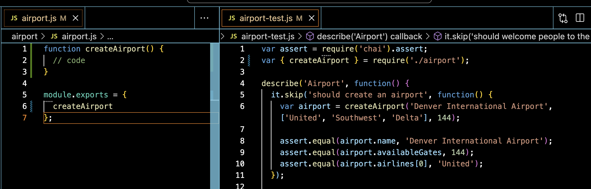

## Learning Goals

* Explain what testing is
* Define Unit and Integration testing
* Justify the importance of Test Driven Development (TDD)
* Utilize red/green testing workflow
* Read and pass tests

## Vocabulary

- `TDD` Test Driven Development / Design
- `Assertion` An expression containing some testable logic
- `Assertion Library` A package of assertion functionality. Usually distinct from a `Testing Framework`. Chai is an example. 
- `Testing Framework` A library that determines how tests are organized and executed. Mocha is an example.
- `Red/Green Testing` - a workflow for testing your code, in which we write *and* fail tests (red) before we write any implementation code to pass the test (green)
- `Unit Test` A test that tests one function or one object in isolation to make sure that it behaves the way we were expecting it to behave
- `Integration test` A test that tests the interaction between two units to make sure that they play together nicely and work the way we expect them to work. 

## Strategies, Tools, and Functions

<section class="call-to-action">
## Warm Up

**On Your Own**
Open [this repository](https://github.com/turingschool-examples/first-unit-tests){:target="blank"}, then:
* Read the README, and follow the `Getting Started` steps.
* Run the `npm test` command in your terminal and explore at the result. 
* Open up the `functions-test.js` file, and read every line, using all of the terms of art that you can.

**Discuss With Your Group:**
* What do you notice about this file? What does it seem like this file is doing?
* Which pieces of code are clear in their purpose? What is unclear?
* What sort of functionality is being tested?
</section>

## What does it mean to test your code?

We're always testing our code. We pull it up in the browser and poke at it. Does it do the thing we were expecting it to do? Yes? Then the code works. It's time to go and celebrate. No? Well then, back to the drawing board, right?

For small code bases, this works. Write or change some code and then flip over to the browser and check to see if you got the desired result. The problem is that this doesn't scale very well. When our applications start getting big, we end up with more and more places to poke.  

Even worse: we can end up in a situation where changing code in one place causes something to break somewhere else—somewhere that we're not currently poking.

<section class="note">
Constantly poking at our code manually is tedious and it's not the best use of our time. We're better off writing some code that tests our other code for us. It's a really efficient way to maintain quality in our code base.
</section>

## Unit Tests

The bulk of your tests for an application are likely to be unit tests. **Unit tests** test one function or one object in isolation to make sure that it behaves the way we were expecting it to behave. The bulk of your tests for an application are likely to be unit tests (both at Turing and in the work environment).

## Integration Tests

**Integration tests** test the interaction between two units to make sure that they play together nicely and work the way we expect them to work. You will get opportunities to experiment with this type of test later on in Turing and in the work environment as well.  

<iframe width="560" height="315" src="https://www.youtube.com/embed/0GypdsJulKE?controls=0" frameborder="0" allow="accelerometer; autoplay; clipboard-write; encrypted-media; gyroscope; picture-in-picture" allowfullscreen></iframe>

<section class="answer">
### What are Some of the Benefits of Testing?

* Unit & Integration tests are a safety net that helps developers find software bugs early
* Unit & Integration tests provide documentation by telling a living story about your application
* Unit tests foster simplicity by forcing you to write code that is decoupled, flexible, and configurable
* Integration tests allow us to be confident that all those small pieces are working together as expected
* Tests can prevent users from breaking your application (example: think about a website that auctions off items like EBay. What happens if a user tries to bid on an item that has already been sold? Are they able to? Does the app break or do they get a nice error page?) Testing helps plan for error states. 

</section>

<section class="call-to-action">
### Think - Pair - Share

Consider an application that you use regularly.

* What is one piece of functionality that you could test from your  application?
* Would that be a unit or integration test? Why?
* What would the consequences for the company be if this piece of functionality broke?
</section>

## What is Test-Driven Development?

Test-Driven Development (TDD) is one of those things that is deceptively simple to explain and incredibly hard to do. The basic premise is that we write our test for a piece of required functionality _before_ writing any implementation code. 

Ideally, we'd follow **Red/Green Testing**. This means we would write the test, then *fail* the test, and then finally write the code to *pass* the test. Once the test passes, you can then safely refactor your code to optimize your solution.

<section class="call-to-action">
## Think

* What's the purpose of failing the test *before* we write the code to pass the test?
</section>


## The Testing Cycle

One important thing to note is that TDD is not about writing tests. Writing tests is writing tests, period. TDD is more than that - it’s a methodology in which three activities are tightly interwoven: testing (in the form of unit testing), coding, and design (in the form of refactoring). In order to do TDD well, you should follow the following steps:


1. Think and write test cases - this step ensures that you understand the functionality that is required
2. Red –  In this step, you try to run your test. You have no implementation code, so your test should fail.
3. Green – Write the minimum code required to get the test to pass
4. Green – Ensure that no old tests fail.
5. Refactor - Refactor to ensure functionality is intact and the code is refined.
6. Repeat this cycle - Steps 1 - 5 are repeated multiple times so that all the features are covered in TDD cycles

<section class="call-to-action">
### In Your Notebook

* What is your understanding of why testing is important?
* Explain the steps of TDD in your own words.  
</section>

## What happens if you don't test first?

"I'll write tests later. I just want to get this working first," is one of the greatest lies in software development and it's usually one that we tell ourselves.

Beyond the issue of general motivation — let's face it, you're never going to go back and add those tests — there is the issue that not all code is testable. We won't run into this issue today, but we will soon. The thing you want to keep in mind is that if you write your tests first, it's really hard to find yourself in this situation.

**Steve's Law of Testing**: If something is hard to test, it's probably not your test's fault.

## Mocha and Chai

In Mod 1, we will be using the Mocha testing framework along with the assertion library Chai.

* [Mocha](https://mochajs.org/){:target="_blank"} is a testing framework that runs on `Node.js` in your terminal. This is what allows us to organize and execute our tests.

* [Chai](http://www.chaijs.com/){:target="_blank"} is an assertion library that plugs into Mocha. The assertion library is what actually runs the specs and determines whether any given condition is valid or not.

<section class="note">
#### On NPM 
When we ran `npm install` we brought Mocha and Chai into the first-unit-tests warm up repo! You'll learn about `npm` in depth in M2, but for now it allows us to install packages like Mocha and Chai.

You won't need to run this every time, just when you initially clone a new repo that utilizes packages.  
</section>

<section class="answer">
### A Note About the Syntax

**Mocha:**
* As mentioned above, Mocha itself is the framework that runs the tests and dictates the syntax of the test block as a whole. This is separate from the assertion library Chai.

```js
describe('addTwoNumbers', function() {
  it('should be able to add zero to zero', function() {

  });

  it.skip('should be able to add 1 to 1', function() {

  });
});
```

**Chai:**
* An assertion is the crucial piece of the test that actually checks that when certain pieces of are code are executed, what we're getting back is what we expect.
* Although Chai can be inserted into many different testing frameworks, it works seamlessly with Mocha.

```js
  assert.equal(addTwoNumbers(1, 1), 2);
```
</section>


## Set Up

When we are testing code, it's usually best to have the implementation code pulled up, as well as the test file. You'll constantly be going back and forth between the two, and need to compare what is in each, so this will make you much more effiecient.



- Our `implementation` file refers to the code we are actually testing. 
- Our `test` file will be the automated tests that we write, that verify our class or functions do what they should. 
- It is important to keep scope in mind: **variables declared in the `test` file are not available in the `implementation` file.**

## Testing Functions

Eventually, we'll be writing our own tests, but for now we'll
start with some prewritten tests. This allows us to see the process, and get some practice reading error messages

Head over to [that same repository](https://github.com/turingschool-examples/first-unit-tests){:target="_blank"} and begin to follow the TDD workflow - fail the tests, then write the code to pass 'em!

<section class="checks-for-understanding">
### Wrap Up

In your journal or notebook, reflect on the following:

* What are the benefits to testing your code?
* What is the Red/Green testing workflow? Why do we use this process?
* What is Mocha? What is Chai? Write an example of the code that comes from Chai.

</section>

## Extra Resources
* [Unit Testing Practice](https://github.com/turingschool-examples/unit-testing-practice){:target="_blank"}
