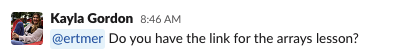
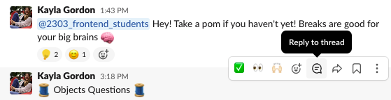
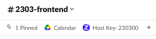
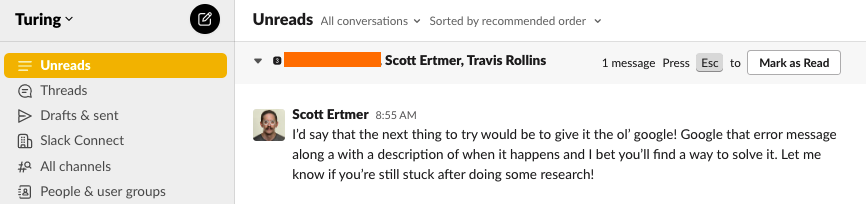
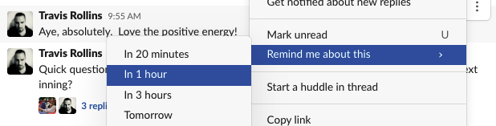
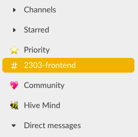

## Slack basics

Some of you are brand new to Slack, and others of you might be a bit more familiar. Slack is essential to how we organize, collaborate and stay up to date at Turing and (most likely) on the job. It’s a professional tool you’ll be using for the foreseeable future. Slack can be overwhelming or even truly unruly so here are some of our favorite tips for managing and leveraging slack. 

### Notifications

There are lots of options for how often and how you are notified of action happening on Slack. We recommend spending some time [configuring your notifications](https://slack.com/help/articles/201355156-Configure-your-Slack-notifications) to suit your needs best. Consider what notifications (if any) you want on your phone vs. your laptop.

### Channels

Channels are spaces where people can share messages to a group. You can leave and join channels based on your needs. Spend a few minutes going through [this document](https://docs.google.com/document/d/1Z6KoqTbLQcudqybCvaHaivf0YNM73BjTNZWPOBuWDcU/edit) and join some slack channels!

### Mentions

You can use mentions to notify specific people by typing `@` and the person's name. If you mention someone in a channel, they will receive a notification that you have sent the message. Please use this sparingly and only when necessary to respect the time and space of others.

### Direct Messages

While we primarily use channels to communicate with your cohort and other students/alumni, you may need to send a private message to someone. Direct messages (DMs) can include up to nine people. DMs work well for one-off conversations that don’t require an entire channel of people to weigh in. DMs to instructors should include **all instructors** to keep communication streamlined. 

### Threads

Slack channels can get unruly very quickly! To avoid this, respond to related messages in threads. Threads will keep all related discussion together, while not clogging up the channel.

### Pinned Messages and Bookmarks

Important messages can be pinned so that they are easy to find later. You can also bookmark specific links. At the top of the channel, you can view all pinned messages and bookmarks.

## Becoming a Slack Pro

### Keeping Track of Important Things

Depending on your settings, Slack will mark things as read the moment you view them. This can be problematic, leading to situations in which you click on something to see if it needs your immediate attention, it doesn’t, but now it’s been marked as read, and you forget to follow up on it. There are a few solutions to this issue:  
  
1 - Navigate to Slack in your menu bar, and select `Preferences` > `Sidebar` > enable `Unreads`. This collects any unread messages into one place, regardless of which channel the message is in. Conveniently, you can read these messages without them being marked as read. You can use this to collect the messages you need to deal with later, and only mark them as read when you've dealt with them.  

2 - When a message comes up and you’d like to deal with it later - hover over the message, navigate to the top right menu of the message and click the three vertical dots. From here you can select remind me about this and set a time to get a reminder. 

3 - If you just want to create a general reminder, navigate to any place where you’d send a message and type `/remind` into the text box. Slack will then allow you to type out a general reminder and set up a time for that notification. 

### Searching Messages

In any channel, press the command key and “F” (`cmd + f`) to bring up the search bar. Initially, you’ll be searching just within the current channel you are viewing, but you can press delete a few times and then type a different channel. You’ll then be able to search by keyword. You can also search by sender by typing `from:@username`

### Sidebar Organization

You’ll quickly acquire TOO MANY channels to keep track of. You can organize these channels or DMs by creating sidebar sections. Just right click any DM, group message, or channel and select `Move Conversation` or `Move Channel`. You’ll be given the option to create new sections here. You can organize your side bar however you'd like!

### Preventing Accidental Messages

It is easy to accidentally send messages before you mean to in Slack because the `enter` button defaults to send messages. In `Preferences`, navigate to `Advanced` and under `When writing a message, press Enter to…` section, choose “Start a new line”. This means that pressing enter will start a new line, rather than send it. Now, to actually send the message is to press `cmd + enter`. 

Additionally if you have an important message and you want to draft a version of it first, practice by DMing yourself. You can use the DM with yourself to save important things for later, draft messages, or try things out.

### Shortcuts 

To see a general list of shortcuts, press `cmd + /`. Here are some of our favorites: 
- `cmd + k` - Jump to navigation bar; From here just type the channel or DM you want to jump to, press enter and BOOM, you're there! 
- `cmd + n` - Start a new message
- `cmd + shift + a` - Jump to all unread messages
- `cmd + [` - Go back a page 
- `cmd + ]` - Go forward a page

### Just For Fun

You can add a gif to your message by using a slash command: `/giphy [search phrase goes here]`. For example, if I wanted to post a gif about partying, I’d type `/giphy party` into my message box, and then “send” it. After you “send”, it won’t actually appear for anyone else but you just yet. What you’ll see is a preview of the gif, and a shuffle button to select the right one. This is a good one to practice by DMing yourself. Sometimes, it will present some, uh, questionable content for your consideration so PLEASE be sure you send gifs that are appropriate. 

You can access the emoji panel via shortcuts too. Just type `:` followed by the name of the emoji, and finally one more `:`. so if I type `:smile:` , I’ll get this: 😀.  

You can make your own emoji! click the smiley face on the bottom right of the message box, then click add emoji. The Turing slack has **a lot** of custom emojis.

Type `/shrug` and SEND IT. Just trust us.

That's it! You're a Slack whiz now! If you ever have questions about Slack or communication at Turing, just post a question about it...**in Slack**! 😉