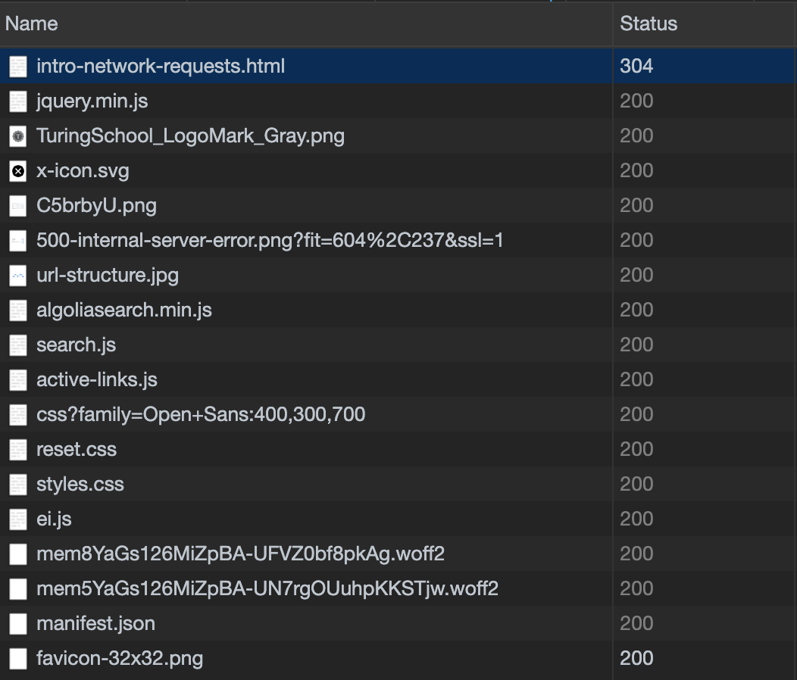

### Learning Goals

* Understand the difference between synchronous and asynchronous operations
* Be familiar with the fetch API
* Understand how network requests work
* Know what `GET` and `POST` requests do and how to use them

### Vocab

* `Async` / `Asynchronous` Executing code without blocking the execution of code after it
* `AJAX` Updating a webpage based on data from the network without reloading the whole thing

## What is a network request?

Open up your dev tools and navigate to the Network tab. Refresh the page and watch what happens.


Each item on a webpage is coming from some server somewhere. The link tags in your HTML connecting your stylesheets and JavaScript files prompt network requests.

### Types of Requests

Network requests can be made to **GET** information from a server, but it's not the only use.

The HTTP protocol defines a variety of types of requests we can make. These include:

* `GET` - retrieve information from a server
* `POST` - send information to a server, creating / updating resources
* `PUT` - send information to a server, updating entire resources
* `PATCH` - send informatin to a server, updating partial resources
* `DELETE` - remove information from a server
* And <a href="https://developer.mozilla.org/en-US/docs/Web/HTTP/Methods" target="\__blank"> many others </a>


While getting comfortable with network requests, we're going to focus on **GET** and **POST** requests.

### Responses

Every request we make, successful or not, will receive a response.

Take another look at the **Network** tab in the dev tools.



We can see that each request has a different response code. The HTTP protocol lays a series of <a href="https://developer.mozilla.org/en-US/docs/Web/HTTP/Status" target="\__blank">Response Codes</a> to give more information on the status of a request.

Here's a high level overview of different statuses:

```
1XX status codes have informational (in progress) purposes
2XX indicates success
3XX is for redirection
4XX represent client-side errors
5XX indicate problems on the server side
```  

#### Common statuses:

* `200 OK` -- successful request
* `201 Created`-- successful POST request
* `400 Bad Request` -- The request failed due to some error in its structure
* `404 Not Found` -- The request was correctly structured, but specified a non-existent resource
* `500 Internal Server Error` -- Something wrong happened on the server's side of things


## Making a request

Remember, every resource we use on our webpages has to get requested from some server.

Why is it important to keep this in mind?

Each network request takes time - they're _expensive_. Imagine if you had to wait for a webpage to load one thing at a time! It would not make for a great user experience.

Network requests are expensive no matter what we do. However, we can run them _asynchronously_, saving some time.

`Asynchronous` operations refer to things that can happen outside the normal order of execution. Network requests can be `synchronous` or `asynchronous`, but most modern applications do them `asynchronously` to improve performance / the user experience.

We'll come back to this idea, but know that when we make requests, we typically do them asynchronously. For now, lets look at how to actually make a request.

One of the more common ways to make a request is through a process called AJAX, or [**A**synchronous **J**avaScript **A**nd **X**ML](https://developer.mozilla.org/en-US/docs/AJAX). AJAX was a huge advancement for the web, as it allowed developers to update part of a webpage without reloading the entire thing.

Traditionally, Ajax requests have been made via the <a href="https://developer.mozilla.org/en-US/docs/Web/API/XMLHttpRequest" target="\__blank"> XMLHttpRequest object </a>. However, the process is a little clunky, so developers made a more streamlined way to do the same thing: the `fetch API`.

<!-- Cool, but really, what is it?

_“the method of exchanging data with a server, and updating parts of a web page – without reloading the entire page.”_

Once we get a response from the server with the data, we can work with data and display it on the page.

### How?

1. An event occurs in a web page (the page is loaded, or maybe a button is clicked)
2. An XMLHttpRequest object is created by JavaScript
3. The XMLHttpRequest object sends a request to a web server
4. The server processes the request
5. The server sends a response back to the web page
6. The response is read by JavaScript
7. Proper action (like page update) is performed by JavaScript

Using the `XMLHttpRequest` object, developers can `GET` information to/from remote servers (among other tasks you'll learn more about in future mods). Depending on how the information is transmitted, the server should respond back with a [status code](https://www.w3.org/Protocols/rfc2616/rfc2616-sec10.html). Here is a high-level summary of the status code ranges:

```
1XX status codes have informational purposes
2XX indicates success
3XX is for redirection
4XX represent client-side errors
5XX indicate problems on the server side
```  


##### Here are a few of the popular players:

* **200 - OK**
	* Typically the response you're hoping for when trying to get information from an API
* **400 - Bad Request**
   * The server did not comprehend the request
* **404 - Not Found**
	* The server did not match any of the parameters you requested
* **500 - Internal Server Error**
	* It's the server's fault


---

### Practice Time!
Open up your console and walk through these steps:

First create a new instance of an XMLHttpRequest Object:

```js
var xhttp = new XMLHttpRequest();
```

Next let's initialize the request using the [`open()`](https://developer.mozilla.org/en-US/docs/Web/API/XMLHttpRequest/open) method.

We will hit this [trivia API](https://opentdb.com/api_config.php). We'll need to use the `GET` method, define our endpoint, and provide a 3rd argument of `TRUE` which tells the request to be asynchronous:

```js
xhttp.open("GET", "https://opentdb.com/api.php?amount=10&category=27&type=multiple", true);
```

Now let's send the request:

```js
xhttp.send();
```

If it worked, you should be able to type `xhttp` and see the results in your XMLHttpRequest object with a status of `200` as well as some responseText containing the specific trivia returned.

--- -->

## ES6: fetch()

Another great tool to help with network requests is the <a href="https://developer.mozilla.org/en-US/docs/Web/API/Fetch_API" target="\__blank">fetch API</a>. This is what we'll focus on in Mod 2, since we can use it "for free" with ES6 (as opposed to `$.get` which requires us to bring in jQuery)!

_It's important to note that not every browser supports the fetch api; polyfills are available, but many legacy codebases use other apis that are supported by older browsers, such as Axios or Superagent._

From the docs:

_The fetch() method takes one mandatory argument, the path to the resource you want to fetch. It returns a promise that resolves to the Response to that request, whether it is successful or not._


<section class="note">
Fetch will **always** return a promise
</section>

`fetch` takes only one mandatory argument: the url of the resource we are requesting.

For example:

```js
fetch("https://opentdb.com/api.php?amount=1&category=27&type=multiple");
```
This make a basic `GET` request to the <a href="https://opentdb.com/api_config.php" target="\__blank"> Trivia API</a>.

`fetch` can also take an optional `init` object as its second argument.

### `fetch` syntax

```js
fetch(resourceUrl, {/*init object with `method`, `body`, and other optional properties*/});
// Returns a promise
```

Let's dive deeper into fetch by looking at how we can make different requests with it

### GET with fetch

By default, fetch performs a `GET` request. This means that if we only add a resource url to the fetch call, we'll try and `GET` information the resource leads us to.

Try typing this in your console and see what we get back:

```js
fetch("https://opentdb.com/api.php?amount=1&category=27&type=multiple");
```

If we put this in the console, we'll see something like this:

```
Promise {<pending>};
```

<section class="note">
#### Promises - the quick version

A `Promise` is an object that represents the eventual completion of an action.

We don't need to worry too much about them now. Just know that a Promise will either be resolved upon completion, or rejected upon failure. We can use special methods for promises to determine what needs to happen in either of those scenarios:

* `.then()` runs upon the resolution of a promise. Returns another promise
* `.catch()` runs upon the rejection of a failed promise. Used for error handling
</section>

Diving into the returned promise reveals some information, such as its status and value, but nothing that's too immediately useful. Instead we have to resolve it:

```js
fetch("https://opentdb.com/api.php?amount=1&category=27&type=multiple");
	.then(response => console.log(response))
```

If you plug the code above into your console, you should see the Response object come back!

However, there's one problem: we can't seem to get the data we want from the Response.body. There's one more step to parse the data (much like you do when pulling things from localStorage). We'll need to use the **`Body.json()`** method that comes with fetch to parse it and call another `.then()`. (See code snippet below)

From the docs, the `.json()` method returns "A promise that resolves with the result of parsing the body text as JSON. This could be anything that can be represented by JSON — an object, an array, a string, a number..."

In short, it gives us access to the data!

```js
fetch("https://opentdb.com/api.php?amount=1&category=27&type=multiple")
  .then(data => data.json())
  .then(data => console.log(data));
```

Lastly, we can add in a `.catch()` to account for any errors we may run into.

```js
fetch("https://opentdb.com/api.php?amount=1&category=27&type=multiple")
  .then(data => data.json())
  .then(data => console.log(data))
  .catch(err => /* do something else */);
```

<section class="call-to-action">
### Practice
Using the <a href="https://opentdb.com/api_config.php" target="\__blank"> Trivia API</a>, do the following in your console:

- Fetch 10 science questions using fetch and console.log the entire response
- Fetch 20 geography questions and for each trivia object console.log the answer only
- Fetch 20 geography questions and console.log the response status code.
</section>

### POST with fetch

What if we want to add information to a database?

If we want to use fetch to make any other kind of request, we'll have to add an optional init object into the function call.

```js
fetch(url, {
	method:"POST",
})
```

From here, the implementation may look different based on the API you're communicating with. Some good init object properties to be aware of:

* `method` - whatever kind of request we'll be making; "GET", "POST", "DELETE", etc...
* `body` - the body of whatever we want to send to the server
* `headers` - extra information needed about the request. Takes an object. An **important** header property to know:
  * `Content-Type` - specify what format the body will be in

Here's a typical POST request structure:

```js
fetch(url, {
	method: 'POST',
	headers: {
		'Content-Type': 'application/json'
	},
	body: JSON.stringify(someDataToSend), // remember how HTTP can only send and receive strings, just like localStorage?
})
	.then(response => response.json())
	.then(json => /*do something with json*/)
	.catch(err => /*do something with the error*/);
```

Remember, **fetch still returns a promise**. We've got to resolve it, regardless of what request type we're making.

Often times, if a `POST` is successful, you'll see a `201 created` status message in the response

<section class="call-to-action">
#### Practice

Head to <a href="https://github.com/turingschool-examples/fe2-fetch-practice" target="\__blank">this repo</a> for some practice with GETting and POSTing.

Working with a partner do the following:
- Get the server up and running (just follow all the set up instructions in the
  repo)
- Write a fetch request to GET all the users
- Write a fetch request to POST a new user
- Rerun your previous GET fetch request to verify you added the user
- Write a fetch request to GET all the animals
- Write a fetch request to POST a new animal
- Rerun your previous GET fetch request to verify you added the animal
</section>

### Nice to Know: Query Strings / URL Structure


What's all that weird stuff in the URL we're fetching?

Fetch and XMLHttpRequest Objects take the url as one of their arguments. The URL itself can be thought of containing sub-arguments that give these request objects and methods more information. The entire anatomy of a URL can be broken down into a series of informative peices, but the ones we're focused on today are queries.

Anything coming after the `?` in a url is part of a query. Queries can be broken down into categories and arguments (check the vocab here). Each category / argument pair is separated by an `&`.

 In the example from above:
```
fetch("https://opentdb.com/api.php?amount=1&category=27&type=multiple")
```
we're querying information about the `amount`, `category`, and `type` of the trivia we want to receive.

<section class="call-to-action">
Take a look at the [trivia docs](https://opentdb.com/api_config.php), and figure out what each of the queries in our fetch request mean.
</section>

---

## [Promises](https://developer.mozilla.org/en-US/docs/Web/JavaScript/Guide/Using_promises)

"A Promise is an object representing the eventual completion or failure of an asynchronous operation"

In our case, we can think of Promises as a placeholder that will do something once it receives a response back from the trivia server.

The great thing about promises is that since they are just objects we can move them around like an object and can return them from functions.

```js
function getTrivia(number, categoryId) {
  const root = 'https://opentdb.com/api.php';
  const url = `${root}?amount=${number}&category=${categoryId}&type=multiple`;
  const promise = fetch(url)
                  .then(response => response.json());
  
  return promise;
}

getTrivia(10, 27)
  .then(data => console.log(data))
  .catch(err => /* do something else */);
```
---

### What is this asynchronous thing all about?

Let's say we're at a restaurant for a night out on the town...Here's how the experience would go in each scenario:

* **Synchronous:** I order my food, everyone in the restaurant has to wait until I get my food before the next person can order.

* **Asynchronous:** I order my food, the order is put into a queue, other food is made in the meantime, my food is ready, and the server brings it to me.


#### A Non-AJAX Example: `setTimeout()`

```js
console.log("Legen...");

setTimeout(() => {
  console.log("DARY!");
}, 2000);

console.log("Wait for it...");
```

`setTimeout()` is actually an asynchronous function, which executes its callback after waiting for the allotted time to expire.

<section class="call-to-action">
#### Questions:

* Why are async operations necessary?
* Have you run into a situation on past projects where you needed async operations to accomplish it?
</section>

---

##### Further Reading:

* [The Evolution of Asyncronous JavaScript](https://blog.risingstack.com/asynchronous-javascript/)
* [Fetch](https://developer.mozilla.org/en-US/docs/Web/API/Fetch_API)
* [Promises](https://developer.mozilla.org/en-US/docs/Web/JavaScript/Reference/Global_Objects/Promise)
* [Postman](https://www.getpostman.com/) -- good tool for testing out APIs


<!-- Review Session for the following morning:

  Interview-style questions:

  * In as much detail as possible, describe the request-response cycle when attempting to retrieve a network resource from a server.
  * Describe the difference between synchronous and asynchronous code.
  * What are 4 different levels of HTTP status codes and what does each level mean?

  Write out another fetch call in Chrome DevTools (Trivia Database API is fine):
    * Assign the whole fetch call to a variable
    * Console log the response object in the first .then()
    * Console log the parsed data in the second .then()
    * Inspect the response object & the parsed data
    * Log the variable you created for the entire fetch call to the console, see that it
      returns a Promise object and inspect it to solidify that Promise syntax

-->
