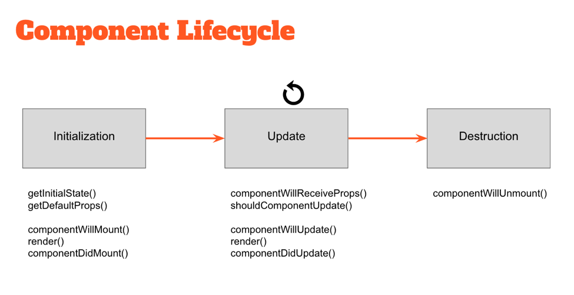

## Vocabulary

- `State` The current data stored in relation to a particular part of a computer program.
- `Stateful Component` A component which stores and updates the information which it uses to render HTML.
- `Lifecycle` The process where a component is created, updated and destroyed.
- `Lifecycle Method` A function that is invoked at some point during a component's lifecycle.
- `Conditional Rendering` Part of the user interface which is only displayed if some condition is met.

In our previous lesson, we learned how to create stateless components. Stateless components are great if we just need to create html that will be be different based on what parameters/properties we pass into our component. Sometimes our components need to be able to store the information they display and change that information based on user interaction. When this is the case, you will want to use a stateful component.

## Stateful Components

Stateful components are ES6 classes that extend an abstract 'Component' class, given to us by default by React. They each have a render method that allows us to specify what should be rendered to the DOM.

In this example, we will create a counter class. This class will render a count and a button to increase the count.

```jsx
import React, { Component } from 'react';

class Counter extends Component {
  render() {
    return (
      <section>
        <span>5</span>
        <button>Add 1</button>
      </section>
    )
  }
}
```
Stateful components keep track of some sort of application data. This application data is used to determine how the component should render. As the application is used, the application data will change causing the view to change.

In our example above, the application data we will want to keep of track of is the current count.

Application data that affects how our app renders is stored in state.

## State

<!-- Compare to gametime GamePiece class, the object x/y coordinates would be in state -->

State is slightly different than props: state holds data that represents the actual state of our component. State is private and local to a component, whereas props are passed into a component. State can be changed and mutated through user interactions, whereas props should remain immutable.

Before you store information in state it should fit two criteria

* That information will affect how your component is displayed
* That information can change based on user interaction

<!-- 
  whiteboard
 state -> determines -> UI
   ^ 
   |                    |
updates                 |
   ^                    |
   |                    v

     User Interaction
 -->

To create state we will initialize it in our class's constructor function. Note: The super method must be called before adding state. After adding state, we can use it in our render method instead of hardcoding our count.

```jsx
import React, { Component } from 'react';

class Counter extends Component {
  constructor() {
    super();

    this.state = {
      count: 5
    }
  }

  render() {
    return (
      <section>
        <span>{this.state.count}</span>
        <button>Add 1</button>
      </section>
    )
  }
}
```

Now when we update our state, our component will rerender and display the correct count.

### setState(newState, [callback])
The setState method is used to update the state of the application. It takes two arguments, the first is an object that represents the new state of the application. the second is an optional callback, that will be invoked after state is updated.

Let's add a method to update our state when our button is clicked.

```jsx
import React, { Component } from 'react';

class Counter extends Component {
  constructor() {
    super();

    this.state = {
      count: 5
    }
  }

  increaseCount = () => {
    const newState = {
      count: this.state.count + 1
    }

    this.setState(newState);
  }

  render() {
    return (
      <section>
        <span>{this.state.count}</span>
        <button onClick={this.increaseCount} >Add 1</button>
      </section>
    )
  }
}
```

In our example above we create our increaseCount method as an arrow function. This will insure that the keyword `this` in our function will always refer to this specific instance of our counter.

One of the more confusing things about React is when to make a component stateful. A general rule of thumb to keep in mind is that, if you're not sure if a component should be stateless or stateful, start with a stateless component. Add state if you find that you need it. Stateful components are a lot heavier than stateless component. Keep your app as lean as possible!

##### Turn and Talk

* What is the difference between props and state?

## Lifecycle Methods



React lifecycle methods are inherited from React Component. These methods should never be invoked directly. Instead, they are invoked by react as the components are used.

For our purposes we will only focus on `componentDidMount`. A component is "mounted" after it finishes rendering for the first time. After the component finishes rendering, the componentDidMount method will be invoked.

A component's state cannot be updated before it is rendered. If a component's state needs to be updated after it is loaded, componentDidMount is a good place to fetch or load that data.

## Conditional Rendering

Conditional rendering is hiding or showing UI elements based on information in state or passed in as props.

Let's add some conditional rendering to our counter example. If our count is below 10 we will display "Can you count to 10?". If our count is 10 or more we will display "You counted to 10!".

There are a variety of ways to conditionaly render UI in React. We will look at three ways: if/else, using the `&&` operator, and using ternary statements.

### if/else

We can add an if/else statement to our render method. Inside of our if/else blocks we will return the html that we want to render. Note that you cannot put an if/else statement in your HTML. The if/else must go outside of your return statement.

```jsx
render() {
  if (this.state.count < 10) {
    return (
      <section>
        <h2>Can you count to 10?</h2>
        <span>{this.state.count}</span>
        <button onClick={this.increaseCount} >Add 1</button>
      </section>
    )

  } else {
    return (
      <section>
        <h2>You counted to 10!</h2>
        <span>{this.state.count}</span>
        <button onClick={this.increaseCount} >Add 1</button>
      </section>
    )
  }
}
```
This achieves our desired result but can result in a lot of repeated html code.

### Short-circuit operator (&&)
With the `&&` operator, our code takes the following form: { js statement && HTML }. If our js statement evaluates to a truthy value, then our HTML will render. Unlike our if/else statement, we can put this in our returned HTML and it will evaluate before rendering.

```jsx
render() {
  return (
    <section>
      { 
        this.state.count < 10 && 
        <h2>Can you count to 10?</h2>
      }
      {
        this.state.count >= 10 && 
        <h2>You counted to 10!</h2>
      }
      <span>{this.state.count}</span>
      <button onClick={this.increaseCount} >Add 1</button>
    </section>
  )
}
```

### Ternary

Similar to our ampersand (&&) operator, we can use ternaries in our HTML. If our js statement evaluates to a truthy value the first h2 will render, otherwise the second h2 will render.

```jsx
render() {
  return (
    <section>
      { 
        this.state.count < 10 
        ? <h2>Can you count to 10?</h2>
        : <h2>You counted to 10!</h2>
      }
      <span>{this.state.count}</span>
      <button onClick={this.increaseCount} >Add 1</button>
    </section>
  )
}
```

Check out this [article](https://blog.logrocket.com/conditional-rendering-in-react-c6b0e5af381e) to see additional conditional rendering options.


