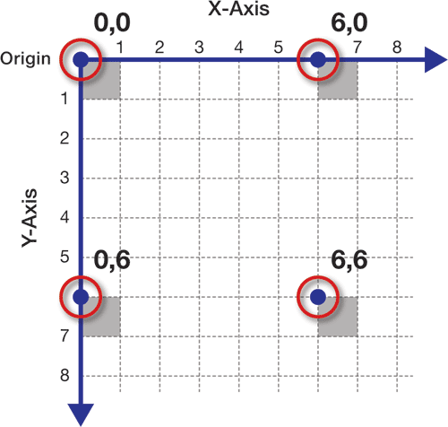
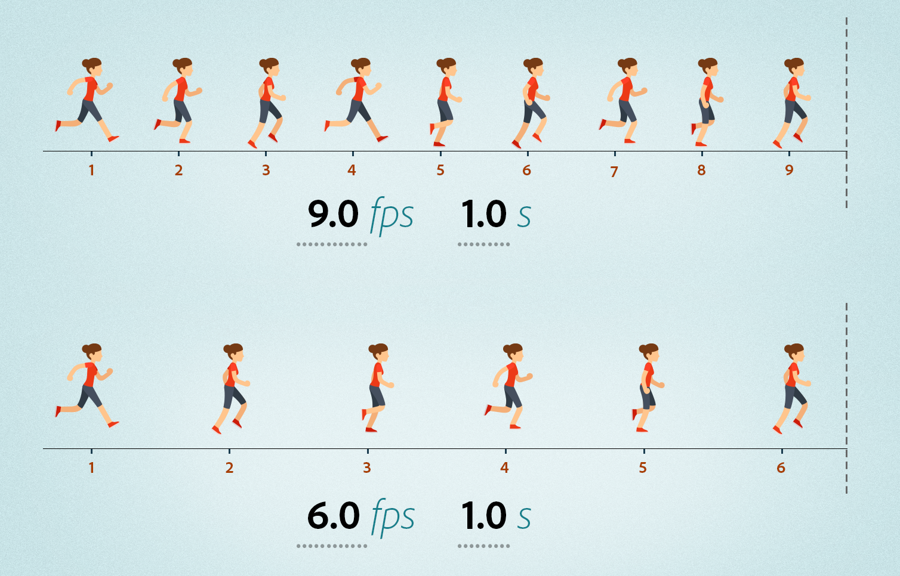

### Goals
* Learn the basics drawing using the canvas api
* Creating an animation loop
* Collision detection
* Object Oriented Inheritance

## Introduction to Game Time Starter Kit

### Project Organization

##### index.js
* DOM interaction
* Event Listeners

##### Game.js
* Game setup
* Game status
* What to do when objects collide
* Tracking score
* Event handling

##### GamePiece.js
* Draw
* Movement
* Collision detection

##### Block.js
* Specialized functions

## Canvas API

#### Canvas Coordinate System

The canvas is a grid of pixels. When we use the canvas to draw 2d pictures, each pixel has a x and a y location that determines where it is on the canvas. In the image below four pixels are shaded gray and their addresses are listed with the x-coordinate first followed by the y-coordinate.



#### Canvas Context
The canvas context is the API which we will use to interact with the canvas. [2d Rendering Context Documentation](https://developer.mozilla.org/en-US/docs/Web/API/CanvasRenderingContext2D)

```js
const canvas = document.querySelector('#game');
const ctx = canvas.getContext('2d');
```

#### .fillRect(x, y, width, height)
The `fillRect` method to draw solid rectangles on our canvas. It takes four arguments, 

* **x**: the starting position on the horizontal axis for the rectangle
* **y**: the starting position on the vertical axis for the rectangle
* **width**: the width in pixels of the rectangle 
* **height**: the height in pixels of the rectangle

```js
ctx.fillRect(x, y, width, height);
```

#### .fillStyle
The fillStyle property is used to change the color of the filled rectangle we draw using the fillRect method.

```js
ctx.fillStyle = 'green';
```

#### .clearRect(x, y, width, height)
The context clearRect method is used to clear our canvas between animation frames. It takes the same arguments as fillRect.

```js
ctx.clearRect(x, y, width, height);
```

## Animation
So far we have learned how to draw one a picture on our canvas. This picture is called a frame. To create an animation we need to draw many frames one after another. 



To create the illusion that all of these frames are connected and represent a moving image we need to create a lot of images very rapidly. To achieve a believable animation, we need to create 60 frames per second. Modern browsers are constantly updating and repainting the screen we see. Luckily for us, there is a built in method that we can use to run some code when the browser repaints itself. 

#### requestAnimationFrame(callback)
requestAnimationFrame takes a function as an argument. This function will run when the browser repaints itself. If you want to create an animation this function will have to call requestAnimationFrame again to paint the next frame.

```js
// start animation loop
window.requestAnimationFrame(gameLoop);

function gameLoop () {
    // clear previous frame
    ctx.clearRect(0, 0, canvas.width, canvas.height);
    
    // draw this frame
    game.animate();

    // draw next frame
    window.requestAnimationFrame(gameLoop)
}
```

#### speed

## Collision Detection


[Great Blog Post on Collision Detection](https://learnopengl.com/In-Practice/2D-Game/Collisions/Collision-detection)

#### Collision Between Rectangles
#### Collision With Boundaries

## Object Oriented Programming - Inheritance

#### Inheritance
With Object Oriented Programming we organize our code by creating classes. These classes are templates for different objects which we will use in our application. 

Inheritance is when a child class inherits properties and methods from a parent class. When we create a child method we can tell it to inherit from another class using the `extends` and `super` keywords.

#### extends
The `extends` keyword allows to tell a class that it will inherit from another class. In our example below, Block will inherit all the properties and methods of GamePiece. The Block class can add additional properties and methods to all blocks.

```js
class Block extends GamePiece {
}
```

#### super
The super keyword is used to invoke parent class methods. When it is used directly in the child constructor function, it invokes the parent class constructor function.

```js
class Block extends GamePiece {
    constructor(x, y, width, height) {
        // invoke GamePiece constructor method
        super(x, y, width, height);
    }
}
```

It can also be used in other methods to invoke parent class methods.

```js
class Block extends GamePiece {
    constructor(x, y, height, width, color, borderColor) {
        // invoke parent class constructor
        super(x, y, height, width, color);

        this.borderColor = borderColor;
    } 

    draw(ctx) {
        const {x, y, height, width, borderColor } = this;

        // invoke GamePiece draw method
        super.draw(ctx);

        // draw block border
        ctx.strokeStyle = borderColor;
        ctx.strokeRect(x, y, width, height);
    }
}
```


