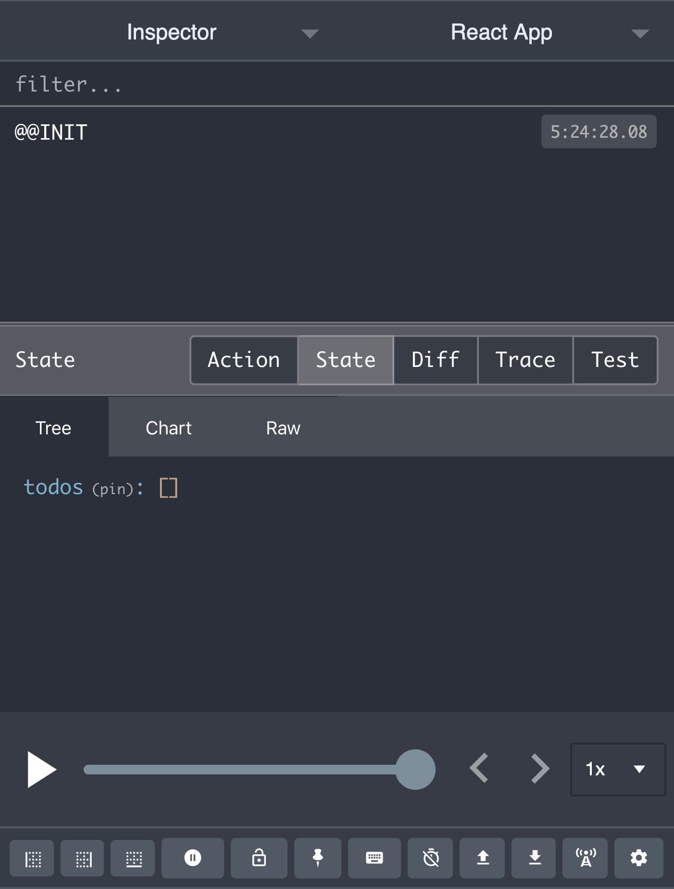

## Intro

By this point, you should feel comfortable with React components, state management, and the passing of props.  In this workshop, we're going to see how we can convert a React app to use Redux.  We'll go through the packages you should install as well as how to set up your files and go through the flow of setting up actions, reducers, and connecting the store to a React component.

## Learning Goals

- Know exactly what packages need to be installed to get your devtools up and app running Redux
- Become familiar with creating actions, reducers, and containers
- Understanding how to `connect` components to the store through mapStateToProps & mapDispatchToProps

### Setup

We're going to start out with a `Todo Box` application and then move it over to Redux.  We will need to clone down this [repo](https://github.com/turingschool-examples/redux-lesson-boilerplate/tree/master).

**ToDo Box**
```bash
git clone https://github.com/turingschool-examples/redux-lesson-boilerplate.git redux-workshop
cd redux-workshop
npm i
npm start
```

Looking at the file structure, you'll notice that we've got a few added directories including actions, reducers, & containers.  We'll be using these shortly!

Let's also install a few packages to get our app up and running with Redux.

```bash
  npm i redux react-redux redux-devtools-extension -S
```

  * `redux` - Allows us to have access to using Redux in our app.
  * `react-redux` - Allows us to connect our react components to our Redux store.
  * `redux-devtools-extension` - Useful for debugging in our devtools!

You will also want to install the [Redux DevTools Chrome Extension](https://chrome.google.com/webstore/detail/redux-devtools/lmhkpmbekcpmknklioeibfkpmmfibljd?hl=en).

### Annnd....Action!

Taking a look at our app, we can see there's not a whole lot of functionality set up yet.  There is a Form component, but it doesn't do much just yet.  We want to be able to add a todo to a list.  Instead of creating a method in our App and creating local state there, let's use Redux.  Let's start out with writing an action to add a todo!  We already have an `index.js` file setup in your actions directory.  Let's start there.

```js
// actions/index.js

export const addToDo = todo => ({
  type: 'ADD_TODO',
  todo
});
```

Remember, `action creators` are functions that return an object (aka `action`).  We're going to need to pass a todo so we can tell the store what the new value is that we are adding.  Remember, all actions need a *type* and *payload*.

Lets focus next on creating our reducer!

### Setting Up Your First Reducer

Common convention is to create a new file for each reducer (property in our store).  Let's create a reducer for all of our todos.

```bash
  touch src/reducers/todos.js
```

<section class="note">
### A couple things to remember:

Reducers are functions that need an initial/default value (just like state in a React component) and an action as the second argument.  Inside they must have a switch statement to return different values based on the different type of action.  Reducers are fired when the app first starts up to give default values to the store.  Also remember that when one reducer fires, all reducers are fired (so remember to always include a default value!).
</section>

```js
// reducers/todos.js

export const todos = (state = [], action) => {
  switch (action.type) {
    case 'ADD_TODO':
      return [...state, { id: Date.now(), text: action.todo, completed: false }];
    default:
      return state;
  }
}
```

Just like our App would likely default with an empty array of todos, we will set the initial state to an empty array as well.  The switch is based on the `type` of the action.  Since we have created an action to add a todo, we want to add the case with the exact same type.  Likely in the future, we could add cases for *deleting* and *editing* a todo.  Note what we are returning in our case of `ADD_TODO`.  Does this look somewhat similar to our `addIdea` from our previous `IdeaBox` iterations?

<section class="call-to-action">
### In Your Notebook

Write out the similarities to what we are doing so far compared to how we have already built out Ideaboxes.
- What are the differences?
- What are the similarities?
Then turn and talk to the person next to you and explain what we have done so far.  Remember to use key terms like `actions`, `action creators`, `reducers`, etc.
</section>

### Creating the Store
Remember, reducers make up the store (our global state).  We need to find a way to somehow `combine` all of our reducers together.  Thankfully, Redux gives us a method to combine our reducers called `combineReducers`!  Let's move over to the `index.js` file in our reducers directory.

```js
// reducers/index.js

import { combineReducers } from 'redux';
import { todos } from './todos';

const rootReducer = combineReducers({
  todos,
});

export default rootReducer;
```

<section class="note">
### Note:

Take note of where we are importing combineReducers from!  `combineReducers` is imported from the `redux` package.  This method takes an object as an argument.  Here is where we set the properties of our store to each reducer (remember reducers return a value to the store).  Also note, it is common convention to name the variable `rootReducer`.
</section>

### Setting Up Redux In Our App

There are a few last steps to setting up Redux in our app before we have access to our store.  Let's move on to our `index.js` file in our src directory.

```jsx
// src/index.js

import React from 'react';
import ReactDOM from 'react-dom';
import { Provider } from 'react-redux';
import { createStore } from 'redux';
import { composeWithDevTools } from 'redux-devtools-extension';
import rootReducer from './reducers';
import App from './components/App';
import './index.css';

const store = createStore(rootReducer, composeWithDevTools());

ReactDOM.render(
  <Provider store={store}>
    <App />
  </Provider>,
  document.getElementById('root')
);
```

There are several pieces of functionality we must import from the packages we installed at the beginning of the session.  Let's look at what each of these do:

* `Provider` - Comes from `react-redux`.  According to the [react-redux docs](https://react-redux.js.org/api/provider#targetText=Overview,component%20tree%20inside%20of%20it.), "The `Provider` makes the Redux store available to any nested components.  Since any React component in a React Redux app can be connected, most applications will render a Provider at the top level."  Note that the Provider wraps around the entire app. (if you are using React-Router, it will wrap around `BrowserRouter`)
* `createStore` - Comes from `redux`.  According to the [redux docs](https://redux.js.org/api/createstore), "This creates a Redux store that holds the complete state tree of your app.  There should only be a single store in your app."
* `composeWithDevTools` - A method we brought in and can pass as an argument with `createStore` so that we have access to our devtools and can view our store. (order matters here)
<section class="call-to-action">
### Try it out!

Start up your app!  If everything has worked correctly, you should be able to go to your Redux devtools and look at the state of your store.  It should looking something like this:


</section>

### Hooking Up Our React Components to the Store
Now that we have the Redux store available, let's think back to where we want to be adding a todo.  That's right, in our `Form`!  When a user types in a todo, and clicks "Submit", we want to fire our action to update our store.  Let's import a couple of things into our `AddTodoForm.js`.  We'll need our action creator, `addToDo`, and `connect` rom *react-redux*.  (since this connects a react component to our redux store, we import it from `react-redux`)

```jsx
// components/AddTodoForm.js
import React, { Component } from 'react'
import { addToDo } from '../actions';
import { connect } from 'react-redux';

class AddTodoForm extends Component {

  submitForm = (e) => {
    e.preventDefault()
    this.props.addToDo(this.state.todo)
    this.setState({ todo: '' });
  }

  // render()...
}

const mapDispatchToProps = dispatch => ({
  addToDo: text => dispatch( addToDo(text) )
})

export default connect(null, mapDispatchToProps)(AddTodoForm);
```

<section class="call-to-action">
### Reading the docs

Take a moment and read the [docs](https://react-redux.js.org/using-react-redux/connect-mapdispatch) on what mapDispatchToProps does.  This is a function we must create that returns an object.  `dispatch` is a function from the Redux store that sends our actions to our reducers, leading to state changes (the global store).  Note that it passes these methods down to our component as props.
</section>

Since we don't need access to the store specifically in this scenario, we only need the action to add our todo to the store.  We can pass null as the first argument to `connect` and then `mapDispatchToProps` as our second argument.  Now we have access to our props in our `AddTodoForm` component, and can call it on the submit!  Let's try adding some todos and check our store with our DevTools.

<section class="note">
### Move `AddTodoForm` to your containers directory

Look into container vs presentational components [here](https://redux.js.org/basics/usage-with-react/#presentational-and-container-components)

Anytime we wrap a component with `connect` to connect it to the store, that component becomes a `container`.  As a result, in order to stay organized, let's move our `AddTodoForm` to our containers directory.
</section>

### Displaying Our Todos
We're almost there, we just have to display our todos from our store.  But how do we get our todos from our store?  Anytime we need to `connect` to the store, we need to use **connect** from `react-redux`.  Let's create a new component in our containers directory.

```bash
touch src/containers/ToDoList.js
```

```jsx
// containers/ToDoList.js

import React from 'react';
import { connect } from 'react-redux';

const ToDoList = ({todos}) => {
  console.log(todos);

  return (
    <ul>
    </ul>
  )
}

const mapStateToProps = state => ({
  todos: state.todos
});

export default connect(mapStateToProps)(ToDoList);
```

<section class="call-to-action">
### Reading the docs

This time we are creating a function called [mapStateToProps](https://react-redux.js.org/using-react-redux/connect-mapstate).  This "is used for selecting the part of the data from the store that the connected component needs.  It is called every time the store has been updated."  The `state` refers to the global store.  Why do we call it state instead of `store` then?  Read about it [here in the docs](https://react-redux.js.org/using-react-redux/connect-mapstate#arguments)!  The property then defines what the prop will be in our component, while the value will be set to the data needed in the component.
</section>

<section class="note">
### There's only one argument this time!

Since `mapStateToProps` will always be our first argument in `connect`, we put that in there first.  If you have no need for `mapDispatchToProps` in a component, you can leave it out.
</section>

Open up your app once more, and see what your log shows.  You should see an array of todos!  Amazing!  You have access to your todos from your props without even having to pass it down from a parent component.

<section class="call-to-action">
### Finish It Up!

Now that you have the data, you know what to do.  Finish up writing the `ToDoList` so that we can display our data on our app!  Once you've finished, give your partner a high five.
</section>

Here is what I came up with at the end:

```jsx
// containers/TodoList.js

import React from 'react';
import Todo from '../components/ToDo';
import { connect } from 'react-redux';

const ToDoList = ({ todos }) => {
  const displayTodos = todos.map(todo => {
    return (
      <Todo
        {...todo}
        key={todo.id}
      />
    )
  })

  return (
    <ul>
      {displayTodos}
    </ul>
  )
}

const mapStateToProps = state => ({
  todos: state.todos
});

export default connect(mapStateToProps)(ToDoList);
```

```js
// components/ToDo.js

import React from 'react';

const ToDo = ({ id, text, completed }) => {
  return (
    <li>{text}</li>
  )
}

export default ToDo;
```

Cheers, now when you open you app, you should be able to add ToDos and they should magically appear.  Let's implement one more piece of functionality to get more practice with Redux today.

<section class="call-to-action">
### Completing a Todo Functionality

Your instructor will drop groups in your channel.  Group up and implement another feature.  You'll note that we added a `completed` property to each todo.  Add in toggling functionality so that when a user clicks on a todo, it should get crossed out.

**Hints:**
* Start out with creating another action creator.  What is every action made up of?  What do we need in order to find which todo needs to be toggled?
* We are updating our todos.  Don't we already have a todos reducer?  Add another case in your `todos` reducer!
* Your rootReducer should be set up, you should not have to do anything in `reducers/index.js` or `src/index.js`.
* Where does the action need to happen? How can you make a prop available so when a user clicks on a `ToDo`, they can check it off.
* Use the classes already provided to you for the styling.  (`completed` and `not-completed`)
</section>

### Finishing Things Up

Hopefully some pieces are starting to come together after this.  There's a lot of moving pieces, so it's totally okay to still have questions.  If at any point you got stuck during this session, a solution branch is up on `redux-complete`.  

<section class="checks-for-understanding">
### HW For Tonight

Practice going through this again from scratch!  Try to do as much as possible without looking at the lesson or solution branch.  Once you have implemented everything, try adding some filtering functionality.  Have three buttons for `Show All`, `Show Active`, and `Show Completed` and implement the functionality with Redux.  

* `Show All` will show all of your todos.
* `Show Active` will show all of the todos that haven't been completed.
* `Show Completed` will show all of the todos that have been completed.
</section>
