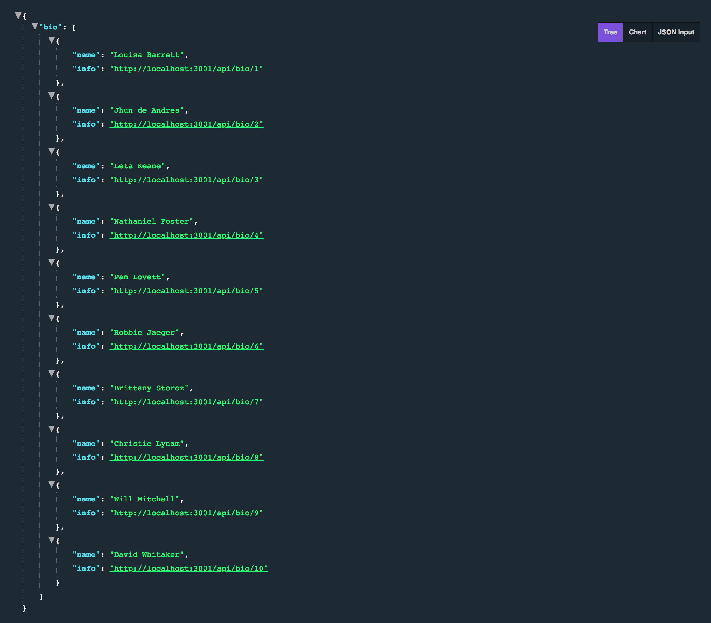

## Learning Goals

Review these concepts:
* single-threaded JS
* asynchronous JS
* non-blocking
* call stack
* task queue
* event loop
* heap

Understanding of:
* Why promises over callbacks
* How to implement a promise
* How to use Promise.all()

## Vocab

* `single-threaded JS` - JavaScript runs on a single call stack aka it is single-threaded..
* `asynchronous JS` This refers to the concept of more than one thing occurring at the same time in JavaScript.
* `non-blocking` - Used to describe how the event loop model in JavaScript works.  It is non-blocking.  I/O is performed via events and callbacks so that even when your application awaits a query or HTTP request, the application can still process things like user input.
* ` call stack` The call stack is where JavaScript code gets pushed and executed one by one as the interpreter reads your program.  It is then popped out once the execution finishes
* `task queue` The task queue is where asynchronous code gets pushed to and waits for the execution.
* `event loop` An event loop has one or more task queues.  This is to help coordinate events, user interactions, scripts, rendering, networking, and etc.  It runs continuously and checks the call stack to see if there are any frames to execute
* `heap` The heap denotes a large mostly unstructured region of memory where objects are allocated

## Quick Review

JavaScript is `a single-threaded, non-blocking, asynchronous, concurrent language`. That's a mouth full... Let's break things down into sections that are a bit more manageable.

### Single-Threaded

JavaScript has a single-threaded `call stack` that has what are called "stack frames". As our code is run, each stack frame is pushed and popped from the top of the call stack, the top being the current code being executed. Think of a can of Pringles... the first in is the last out (FILO).

Consider the JavaScript:

```javascript
function foo(b) {
  var a = 10;
  return a + b + 11;
}

function bar(x) {
  var y = 3;
  return foo(x * y);
}

console.log(bar(7));
```

So what we have is a function `foo(b)` that returns `10 + b + 11`. Then there is `bar(x)` that returns `foo(x * y)`. Our console.log ends up calling `bar(7)`.

Lets watch the call stack:


As we see the stack starts by pushing `console.log(bar(7))` because it was the first executed code we have. Which then calls `bar(7)` to execute `foo(x * y)` to execute the inner operation `x * y`. So far we have just been pushing things to the stack. Until after `x * y` has finished executing then it gets popped off!

Now we continue on with `foo(x * y)` which pushes `a + b + 11` to the top of the stack to immediately get popped off leaving `a + b` to be pushed to the top. Then finishes off by popping all the rest of the stack. This will finish by returning `42` to the console.

<section class="call-to-action">
Go try it out [here](http://latentflip.com/loupe/?code=ZnVuY3Rpb24gZm9vKGIpIHsKICB2YXIgYSA9IDEwOwogIHJldHVybiBhICsgYiArIDExOwp9CgpmdW5jdGlvbiBiYXIoeCkgewogIHZhciB5ID0gMzsKICByZXR1cm4gZm9vKHggKiB5KTsKfQoKY29uc29sZS5sb2coYmFyKDcpKTs%3D!!!PGJ1dHRvbj5DbGljayBtZSE8L2J1dHRvbj4%3D).

Did anything happen you didn't expect? Talk to a neighbor about what you've learned after playing around with the stack.

If you get bored, edit the existing example to include a `setTimeout()` or two. What happens in the call stack and queue as the `setTimeout()`runs?
</section>

So! From the exercise above we can start to understand these these concepts:

* `Single threaded:` Threads are basic units of CPU utilization.
* `Asynchronous:` JavaScript call stack carries out tasks to completion instead of task switching and the same holds for events.
* `Non-blocking:` Blocking occurs when the application state is suspended as a thread runs.

*Check out [this awesome video](https://www.youtube.com/watch?v=8aGhZQkoFbQ) if you want a deeper dive into the `call stack`, `task queue`, `event loop`, `web APIs` and how they all work together*

### Non-Blocking

A very interesting property of the event loop model is that JavaScript, unlike a lot of other languages, never blocks. Handling I/O is typically performed via events and callbacks, so when the application is waiting for a network request to return, it can still process other things like user input.[*](https://developer.mozilla.org/en-US/docs/Web/JavaScript/EventLoop#Never_blocking)

Heres a great example:

<p class="codepen" data-height="265" data-theme-id="0" data-default-tab="js,result" data-user="Kalikoze" data-slug-hash="dBdMpB" style="height: 265px; box-sizing: border-box; display: flex; align-items: center; justify-content: center; border: 2px solid; margin: 1em 0; padding: 1em;" data-pen-title="Non-Blocking JS">
  <span>See the Pen <a href="https://codepen.io/Kalikoze/pen/dBdMpB/">
  Non-Blocking JS</a> by Travis Rollins (<a href="https://codepen.io/Kalikoze">@Kalikoze</a>)
  on <a href="https://codepen.io">CodePen</a>.</span>
</p>
<!-- <script async src="https://static.codepen.io/assets/embed/ei.js"></script> -->

When Big Loop handler runs the browser appears frozen. We know JavaScript’s call stack is synchronous so Big Loop executes on the call stack until completion. It’s also non-blocking where "Do Stuff" clicks are still received even if they didn’t execute immediately.

Note that you might not see the "Do Stuff" button being clicked, but the click is still registered.


### Asynchronous

Let's continue on with asynchronous. With non-blocking code, we can have a user click a button and continue on with I/O without making them wait.

How does that work? Well for a long time the web has used `callbacks` to help solve this issue, allowing code to be executed once it's finished. For example, the `browser` has web APIs that take callbacks as an argument, like: `XHR` (old version of `fetch`), `SetTimeout`, `DOM` events. These things have their own `callback queues`/`task queues`, which run an `event loop`.

You can try it yourself [here](http://latentflip.com/loupe/?code=JC5vbignYnV0dG9uJywgJ2NsaWNrJywgZnVuY3Rpb24gb25DbGljaygpIHsKICAgIHNldFRpbWVvdXQoZnVuY3Rpb24gdGltZXIoKSB7CiAgICAgICAgY29uc29sZS5sb2coJ1lvdSBjbGlja2VkIHRoZSBidXR0b24hJyk7ICAgIAogICAgfSwgMjAwMCk7Cn0pOwoKY29uc29sZS5sb2coIkhpISIpOwoKc2V0VGltZW91dChmdW5jdGlvbiB0aW1lb3V0KCkgewogICAgY29uc29sZS5sb2coIkNsaWNrIHRoZSBidXR0b24hIik7Cn0sIDUwMDApOwoKY29uc29sZS5sb2coIldlbGNvbWUgdG8gbG91cGUuIik7!!!PGJ1dHRvbj5DbGljayBtZSE8L2J1dHRvbj4%3D).

When your code first executes, it loads events and saves them in [`heap`](https://developer.mozilla.org/en-US/docs/Web/JavaScript/EventLoop#Heap) , but for now let's reference it by the web API box. So the call stack starts running through our code and `setTimeout(function timeout{...})`(line 9) gets put on the call stack. Which sends it over to the web API box for storage until it's ready to execute the callback after 5 seconds! Once the wait is done, it will send the callback to the `callback queue / task queue` while the `event loop` waits for a good time to throw it on the stack / till the stack is cleared (event loop is the orange loop in this example).

Now we also saw that the `DOM event listener`, when put on the call stack (line 1) is pushed to the web API's storage and waits/listens for its time to be called. You'll notice that once you trigger the event by clicking the 'Click me!' button, that callback is pushed to the `callback queue / task queue`. Once the stack has cleared the `event loop` will trigger the next callback.

So what does this mean? Yes, your JS code is running on a single call stack (single-threaded). But under your JS, the browser code is running multiple threads to manage async actions. When an async action is done doing its thing, the callback gets pushed on the task queue. The event loop is constantly checking to see if the call stack is empty, and when it is, the task queue grabs the first thing in the queue and puts it on the call stack. And this is where the function is executed.

Hope that review was helpful!

## Let's dive in and build a Front-End Turing staff website


---

## Promises Practice Repo

We're going to be building out this site with two different repos. One for the client side code and another is an API that serves up a collection of members. Something to note is that the API given to us doesn't automatically give us all of the info needed to display the staff members. There is a second nested endpoint we will need to fetch... More on this in a moment.

Clone [this repo](https://github.com/turingschool-examples/promises-practice) and the [promises-api](https://github.com/turingschool-examples/promises-api) repo down.

Have these directories open in two separate terminal tabs so you can see them both at the same time. For both, run:

`npm install`

`npm start`

### What we're working with

The endpoints given to us are:
* [http://localhost:3001/api/frontend-staff](http://localhost:3001/api/frontend-staff) - this returns an object with a key of bio and the value is an array of objects that contain the name of each staff member and another endpoint to grab some additional info (bio & image).



* [http://localhost:3001/api/bio/:id](http://localhost:3001/api/bio/1) - this is the endpoint given from each obj inside the array from the endpoint `frontend-staff`

#### Let's do a little pseudo-coding
* make initial fetch
* map over the array of staff members
  * I need to fetch each endpoint
  * this map is going to return a promise
* Promise.all(promises)
  * returns a single promise

The first thing we need ask ourselves is where do we want to fetch our data from. This [article](https://www.robinwieruch.de/react-fetching-data/) does a really solid job of answering that question. Looks like componentDidMount() is our best option. With componentDidMount(), We can be assured that our component has mounted on the DOM and we can also setState there once we get our data back.

### Fetch

If you're not feeling totally comfortable with `fetch` yet, I suggest taking a five minutes to review the [docs](https://developer.mozilla.org/en-US/docs/Web/API/Fetch_API).

Fetch returns a promise, which will either `resolve` or `reject` depending on the status of the promise. You might want to take a look at when fetch actually catches errors [here](https://developer.mozilla.org/en-US/docs/Web/API/Fetch_API/Using_Fetch#Checking_that_the_fetch_was_successful). The API can actually be set up in a way that can help fix this, but this is a major reason why some people dislike `fetch`.

So, since `fetch` returns a promise, it makes sense that you can chain `.then()` or `.catch()` to it.

```javascript
componentDidMount() {
  const url = 'http://localhost:3001/api/frontend-staff'
  fetch(url)
  .then(response => response.json())
  .then(data => this.fetchBios(data.bio)) // we'll write this function that will fetch all of the nested endpoints shortly
  .then(staff => this.setState({ staff }))
  .catch(error => console.log(error));
}
```

When we make a request and the response comes back as JSON, the first thing we need to do is parse the JSON. Notice also that we are chaining another `.then()` to the `response.json()`. We can do this because `.json()` returns a promise that resolves with the result of parsing the body text as JSON.

### Promise.all()

Now that we have our initial fetch set up, we need to iterate over the array to fetch the other information we need. Yes, we could make 10 different fetch calls, but all our data is going to come back at different times. That's not going to make for a great UI experience. How can we fetch the additional data, but wait for all the data to be returned before we do anything with it? Enter `Promise.all()`.

So `Promise.all()` takes an array of promises and returns a single promise that will either `resolve` when every promise has resolved or `reject` with the reason of the first value in the array that reject. If the promise array resolves completely, the resulting values will be an array of values whose results are ordered by the order of the promises in the original array - regardless of which promises resolve first.

How can we use this to our advantage? So when we make our request to `'api/frontend-staff'` we receive an `array` of staff members containing info to make more `fetch calls`.

```javascript
fetch('http://localhost:3001/api/frontend-staff')
  .then(response => response.json());
  // this returns =>
  // { bio: [
  //         { name: "Louisa Barrett",
  //           info: "http://localhost:3001/api/bio/1"
  //         },
  //         {...},
  //         {...}
  //        ]
  // }
```

<section class="call-to-action">
### On Your Own

So we're probably going to have to iterate over this array to make a fetch call for all the bios and images. How do we do that?
</section>

Possible solution to help:

```javascript
fetchBios = (staff) => {
  const promises = staff.map(staffMember => {
    return fetch(staffMember.info)
    .then(response => response.json())
    .then(data => ({...data, name: staffMember.name}))
    .catch(error => console.log(error));
  });
  return Promise.all(promises);
};
```

#### Resources
* [MDN docs](https://developer.mozilla.org/en-US/docs/Web/JavaScript/EventLoop)
* [Loupe](http://latentflip.com/loupe/?code=JC5vbignYnV0dG9uJywgJ2NsaWNrJywgZnVuY3Rpb24gb25DbGljaygpIHsKICAgIHNldFRpbWVvdXQoZnVuY3Rpb24gdGltZXIoKSB7CiAgICAgICAgY29uc29sZS5sb2coJ1lvdSBjbGlja2VkIHRoZSBidXR0b24hJyk7ICAgIAogICAgfSwgMjAwMCk7Cn0pOwoKY29uc29sZS5sb2coIkhpISIpOwoKc2V0VGltZW91dChmdW5jdGlvbiB0aW1lb3V0KCkgewogICAgY29uc29sZS5sb2coIkNsaWNrIHRoZSBidXR0b24hIik7Cn0sIDUwMDApOwoKY29uc29sZS5sb2coIldlbGNvbWUgdG8gbG91cGUuIik7!!!PGJ1dHRvbj5DbGljayBtZSE8L2J1dHRvbj4%3D), by Philip Roberts, was used for examples.
* [DAN MARTENSEN](https://danmartensen.svbtle.com/events-concurrency-and-javascript) wrote this article that I referenced his code pen from.
* [Promises, Async/Await](https://javascript.info/async)
