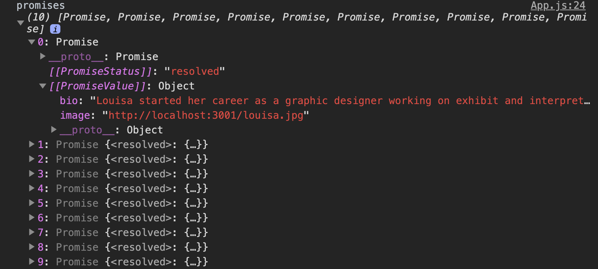
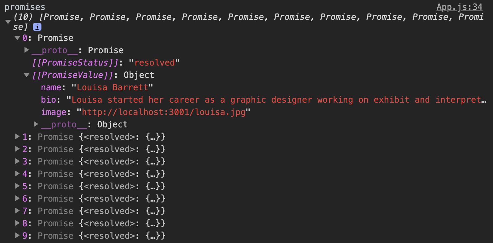

## Learning Goals

- Review these concepts:
  * single-threaded JS
  * asynchronous JS
  * event loop

- Utilize Postman as a tool for making requests to APIs

- Utilize `fetch` to get data from an API and utilize the data in a FE app


<!-- ## Vocab

* `single-threaded JS` - JavaScript runs on a single call stack aka it is single-threaded..
* `asynchronous JS` This refers to the concept of more than one thing occurring at the same time in JavaScript.
* `non-blocking` - Used to describe how the event loop model in JavaScript works.  It is non-blocking.  I/O is performed via events and callbacks so that even when your application awaits a query or HTTP request, the application can still process things like user input.
* ` call stack` The call stack is where JavaScript code gets pushed and executed one by one as the interpreter reads your program.  It is then popped out once the execution finishes
* `task queue` The task queue is where asynchronous code gets pushed to and waits for the execution.
* `event loop` An event loop has one or more task queues.  This is to help coordinate events, user interactions, scripts, rendering, networking, and etc.  It runs continuously and checks the call stack to see if there are any frames to execute
* `heap` The heap denotes a large mostly unstructured region of memory where objects are allocated

## Quick Review

JavaScript is `a single-threaded, non-blocking, asynchronous, concurrent language`. That's a mouth full... Let's break things down into sections that are a bit more manageable.

### Single-Threaded

JavaScript has a single-threaded `call stack` that has what are called "stack frames". As our code is run, each stack frame is pushed and popped from the top of the call stack, the top being the current code being executed. Think of a can of Pringles... the first in is the last out (FILO).

Consider the JavaScript:

```javascript
function foo(b) {
  var a = 10;
  return a + b + 11;
}

function bar(x) {
  var y = 3;
  return foo(x * y);
}

console.log(bar(7));
```

So what we have is a function `foo(b)` that returns `10 + b + 11`. Then there is `bar(x)` that returns `foo(x * y)`. Our console.log ends up calling `bar(7)`.

Lets watch the call stack:


As we see the stack starts by pushing `console.log(bar(7))` because it was the first executed code we have. Which then calls `bar(7)` to execute `foo(x * y)` to execute the inner operation `x * y`. So far we have just been pushing things to the stack. Until after `x * y` has finished executing then it gets popped off!

Now we continue on with `foo(x * y)` which pushes `a + b + 11` to the top of the stack to immediately get popped off leaving `a + b` to be pushed to the top. Then finishes off by popping all the rest of the stack. This will finish by returning `42` to the console.

<section class="call-to-action">
Go try it out [here](http://latentflip.com/loupe/?code=ZnVuY3Rpb24gZm9vKGIpIHsKICB2YXIgYSA9IDEwOwogIHJldHVybiBhICsgYiArIDExOwp9CgpmdW5jdGlvbiBiYXIoeCkgewogIHZhciB5ID0gMzsKICByZXR1cm4gZm9vKHggKiB5KTsKfQoKY29uc29sZS5sb2coYmFyKDcpKTs%3D!!!PGJ1dHRvbj5DbGljayBtZSE8L2J1dHRvbj4%3D).

Did anything happen you didn't expect? Talk to a neighbor about what you've learned after playing around with the stack.

If you get bored, edit the existing example to include a `setTimeout()` or two. What happens in the call stack and queue as the `setTimeout()`runs?
</section>

So! From the exercise above we can start to understand these these concepts:

* `Single threaded:` Threads are basic units of CPU utilization.
* `Asynchronous:` JavaScript call stack carries out tasks to completion instead of task switching and the same holds for events.
* `Non-blocking:` Blocking occurs when the application state is suspended as a thread runs.

*Check out [this awesome video](https://www.youtube.com/watch?v=8aGhZQkoFbQ) if you want a deeper dive into the `call stack`, `task queue`, `event loop`, `web APIs` and how they all work together*

### Non-Blocking

A very interesting property of the event loop model is that JavaScript, unlike a lot of other languages, never blocks. Handling I/O is typically performed via events and callbacks, so when the application is waiting for a network request to return, it can still process other things like user input.[*](https://developer.mozilla.org/en-US/docs/Web/JavaScript/EventLoop#Never_blocking)

Heres a great example:

<p class="codepen" data-height="265" data-theme-id="0" data-default-tab="js,result" data-user="Kalikoze" data-slug-hash="dBdMpB" style="height: 265px; box-sizing: border-box; display: flex; align-items: center; justify-content: center; border: 2px solid; margin: 1em 0; padding: 1em;" data-pen-title="Non-Blocking JS">
  <span>See the Pen <a href="https://codepen.io/Kalikoze/pen/dBdMpB/">
  Non-Blocking JS</a> by Travis Rollins (<a href="https://codepen.io/Kalikoze">@Kalikoze</a>)
  on <a href="https://codepen.io">CodePen</a>.</span>
</p>
<!-- <script async src="https://static.codepen.io/assets/embed/ei.js"></script> -->

<!-- When Big Loop handler runs the browser appears frozen. We know JavaScript’s call stack is synchronous so Big Loop executes on the call stack until completion. It’s also non-blocking where "Do Stuff" clicks are still received even if they didn’t execute immediately.

Note that you might not see the "Do Stuff" button being clicked, but the click is still registered.


### Asynchronous

Let's continue on with asynchronous. With non-blocking code, we can have a user click a button and continue on with I/O without making them wait.

How does that work? Well for a long time the web has used `callbacks` to help solve this issue, allowing code to be executed once it's finished. For example, the `browser` has web APIs that take callbacks as an argument, like: `XHR` (old version of `fetch`), `SetTimeout`, `DOM` events. These things have their own `callback queues`/`task queues`, which run an `event loop`.

You can try it yourself [here](http://latentflip.com/loupe/?code=JC5vbignYnV0dG9uJywgJ2NsaWNrJywgZnVuY3Rpb24gb25DbGljaygpIHsKICAgIHNldFRpbWVvdXQoZnVuY3Rpb24gdGltZXIoKSB7CiAgICAgICAgY29uc29sZS5sb2coJ1lvdSBjbGlja2VkIHRoZSBidXR0b24hJyk7ICAgIAogICAgfSwgMjAwMCk7Cn0pOwoKY29uc29sZS5sb2coIkhpISIpOwoKc2V0VGltZW91dChmdW5jdGlvbiB0aW1lb3V0KCkgewogICAgY29uc29sZS5sb2coIkNsaWNrIHRoZSBidXR0b24hIik7Cn0sIDUwMDApOwoKY29uc29sZS5sb2coIldlbGNvbWUgdG8gbG91cGUuIik7!!!PGJ1dHRvbj5DbGljayBtZSE8L2J1dHRvbj4%3D).

When your code first executes, it loads events and saves them in [`heap`](https://developer.mozilla.org/en-US/docs/Web/JavaScript/EventLoop#Heap) , but for now let's reference it by the web API box. So the call stack starts running through our code and `setTimeout(function timeout{...})`(line 9) gets put on the call stack. Which sends it over to the web API box for storage until it's ready to execute the callback after 5 seconds! Once the wait is done, it will send the callback to the `callback queue / task queue` while the `event loop` waits for a good time to throw it on the stack / till the stack is cleared (event loop is the orange loop in this example).

Now we also saw that the `DOM event listener`, when put on the call stack (line 1) is pushed to the web API's storage and waits/listens for its time to be called. You'll notice that once you trigger the event by clicking the 'Click me!' button, that callback is pushed to the `callback queue / task queue`. Once the stack has cleared the `event loop` will trigger the next callback.

So what does this mean? Yes, your JS code is running on a single call stack (single-threaded). But under your JS, the browser code is running multiple threads to manage async actions. When an async action is done doing its thing, the callback gets pushed on the task queue. The event loop is constantly checking to see if the call stack is empty, and when it is, the task queue grabs the first thing in the queue and puts it on the call stack. And this is where the function is executed.

Hope that review was helpful! -->

## Warm Up
In your journal, write your answers to the following questions. It is totally OK (and encouraged!) to look back at the notes you took yesterday!
- What is the difference between synchronous and asynchronous JS?
- What are the different statuses of a Promise?
- What is returned when we use the `fetch` API?

## What We Will Be Building


--- -->

## Promises Practice Repo

We're going to be building out this site with two different repos. One for the client side code and another is an API that serves up a collection of members. Something to note is that the API given to us doesn't automatically give us all of the info needed to display the staff members. There is a second nested endpoint we will need to fetch... More on this in a moment.

Clone [this repo](https://github.com/turingschool-examples/promises-practice) and the [promises-api](https://github.com/turingschool-examples/promises-api) repo down.

Have these directories open in two separate terminal tabs so you can see them both at the same time. For both, run:

`npm install`

`npm start`

## Postman
[Postman](https://www.getpostman.com/downloads/) is a great tool for making requests to an API and seeing the response you get back in a quick, easy-to-use interface! We will be utilizing this tool throughout Mod 3 and beyond!

Download the app now and get it running now!

## Getting Started
Since we are going to be getting our data from an API, it's usually a good idea to get a sense of what our responses look like when we make a request to a certain endpoint!

<section class="call-to-action">
### You Do
- Make sure you have the `Promises-API` running on port 3001
- With a partner, open **Postman** and make a `GET` request to the following endpoint: `http://localhost:3001/api/frontend-staff`
- What is included in the response?
- Try entering one of the endpoints found in the `info` key for one of the objects. What is included in the response?
</section>

As you may be starting to see, there is a lot of data available to us but it is going to be a little tricky to access this data. We are going to work together to break down how to access this data to get our app running.

## Step 1 - Getting the Initial `Bio` Info
Before we can get any of the detailed info for each staff member, we have to start at the initial endpoint as our "entry" into the rest of the dataset. We will be utilizing the `fetch API` to access this data!

If you're not feeling totally comfortable with `fetch` yet, I suggest taking a five minutes to review the [docs](https://developer.mozilla.org/en-US/docs/Web/API/Fetch_API).

<section class="answer">
### Fetch Details
- Fetch returns a **Promise**, which will either `resolve` or `reject` depending on the status of the promise.
- You might want to take a look at when fetch actually catches errors [here](https://developer.mozilla.org/en-US/docs/Web/API/Fetch_API/Using_Fetch#Checking_that_the_fetch_was_successful). The API can actually be set up in a way that can help fix this, but this is a major reason why some people dislike `fetch`.
- Since `fetch` returns a promise, it makes sense that you can chain `.then()` or `.catch()` to it.
</section>

<section class="call-to-action">
### You Do
Take 5 minutes to read this [article](https://www.robinwieruch.de/react-fetching-data/) about where we should kick off these type of network requests within a React app. Be prepared to discuss the best approach for this problem!

<section class="answer">
### How/Where Will We Fetch?
As you read, utilizing the `componentDidMount()` method is the best place to kick off our network request to the first endpoint!
</section>
</section>

OK, so let's start by making our initial fetch request and seeing what we get back. See if you can...
- Use `fetch` within `componentDidMount()` to make a request to `http://localhost:3001/api/frontend-staff`
- `console.log` the data that comes back!

<section class="answer">
### Initial Fetch w/ `console.log` Solution
```js
componentDidMount() {
  fetch('http://localhost:3001/api/frontend-staff')
    //fetch returns another Promise, which resolves to a Response object
    //We can call .json() on the Response object to access the data from
    //the body of the Response object
    //.json() returns another Promise, which is why we need to chain
    //a .then to allow it to resolve!
    .then(response => response.json())
    .then(staffData => {
      //let's check what the data even looks like...
      console.log('all data', staffData);
      console.log('bio data', staffData.bio);
    })
}
```
</section>

## Step 2 - Accessing the `bio` Data
OK, so it looks like we want to dig into the `.bio` from the data that gets returned after we run the `.json()` method on our initial response object! But, now we have **multiple** API endpoints that house the data we are really after... woof.

<section class="call-to-action">
### With a Partner
- Discuss a way we could access the data of each member of the staff
- Since we will have to utilize `fetch` for each staff member's info, what will be returned from these `fetch` requests?
- Write some pseudocode for how you could approach this problem!
</section>

<section class="answer">
### Possible Pseudocode Pt. I
1. Make initial fetch to `http://localhost:3001/api/frontend-staff` in `componentDidMount`
2. Iterate using `.map()` over the array of staff members
  - `fetch` from each endpoint within the `.map`
  - Since this `.map` is making network requests using `fetch`, the map will return an array of Promises
3. Find some way to resolve all of these daggum Promises from the `.map`!
</section>

Great! We have a plan! Plans are `#tite`. Let's work on getting the first two steps implemented.

<section class="answer">
### Iterating Over Staff Members Solution Pt. I
```js
componentDidMount() {
  fetch('http://localhost:3001/api/frontend-staff')
    .then(response => response.json())
    .then(staffData => {
      //let's just see what we are getting back!
        const promises = staffData.bio.map(staffMember => {
          return fetch(staffMember.info)
            .then(res => res.json())
        })
      console.log('promises', promises);
    })
}
```
This is what the data looks like in our console:


</section>

Alrighty then... We are getting a little bit closer to grabbing all of the data we need. But we still have a little work to do.

## Step 3 - Getting the Data We Need
So we have access to two new pieces of data from this `fetch` - the `bio` and `image`. But we still need to have all of the relevant info for each staff member, especially their `name`!

<section class="call-to-action">
### You Do
With a partner, see if you can find a way to extract the necessary data from the response from our `fetch` of each staff member and find a way to combine it with their name!
</section>

<section class="answer">
### Combining Data w/in .map() Solution
```js
componentDidMount() {
  fetch('http://localhost:3001/api/frontend-staff')
    .then(response => response.json())
    .then(staffData => {
        const promises = staffData.bio.map(staffMember => {
          return fetch(staffMember.info)
            .then(res => response.json())
            //after we have pulled the data off the response...
            .then(info => {
              //create an object with the name
              return {
                name: staffMember.name,
                //and the remaining info (bio + image)
                ...info
                //bio: info.bio,
                //image: info.image
              }
            })
        })
      console.log('promises', promises);
    })
}
```
This is what our console.log looks like:

</section>

[Hell yeah!](./assets/images/promises-practice/hell-yeah.png) We now have the data looking how we want. But the problem is, it's still a Promise and we can't work with it yet. Consarnit! And worst of all, now we have this giant array of Promises - how on earth are we going to resolve all of them?!

<section class="call-to-action">
## Research Spike
- **The Problem:**  we have multiple Promises that need to get resolved.
- Spend 5 minutes researching/figuring out how we can resolve multiple Promise objects!
</section>

## Step 4 - Resolving ALL of the Promises!
<section class="answer">
### Solution to Problem from Research Spike!
`Promise.all()` has entered the chat!
- `Promise.all()` takes an array of promises and returns a single promise that will either `resolve` when every promise has resolved or `reject` with the reason of the first value in the array that reject.
- If the promise array resolves completely, the resulting values will be an array of values whose results are ordered by the order of the promises in the original array - regardless of which promises resolve first!
- **This allows us to make ensure that all of the data is returned at one time, in the correct order, rather than making several different `fetch` calls which could resolve at different times and hoping for the best!**
</section>

Dope! So now we have a way to work with all of the Promises returned from our `.map`! But before we implement it, let's [check the docs](https://developer.mozilla.org/en-US/docs/Web/JavaScript/Reference/Global_Objects/Promise/all) and make sure we understand what we are getting back from this solution!

<section class="call-to-action">
### You Do
- With a partner, see if you can return all of the Promises into a format we can work with by `console.log` the data! Hint: What does `Promise.all` return?
- After you can see the data, how could we store the data within the `state` of our App?
</section>

<section class="answer">
### Promise.all() Solution
```js
componentDidMount() {
  fetch('http://localhost:3001/api/frontend-staff')
    .then(response => response.json())
    .then(staffData => {
        const promises = staffData.bio.map(staffMember => {
          return fetch(staffMember.info)
            .then(res => res.json())
            .then(info => {
              return {
                name: staffMember.name,
                ...info
              }
            })
        })
        //this will return us a single Promise!
        //If it returns a Promise, we need to use .then
        //to give it time to resolve!
        return Promise.all(promises)
    })
    //We can now set the workable data to our state!
    .then(staff => this.setState({ staff }))
}
```
</section>

## Step 5 - Building a Helpers File
[Bravo!](./assets/images/promises-practice/bravo.jpeg) - we have successfully integrated the nested data from the API into our App's state! But, this is a pretty burly chunk of code and isn't super readable. This is where you might find it more beneficial to break this into a separate file and bring in the functionality only when you need it!

<section class="call-to-action">
### You Do
With a partner, see if you can extract the logic from our `fetch` call into it's own function within a new file!
1. Create a new file called `helpers.js`
2. Create a function called `fetchStaffBios`
3. Think about what logic from the `fetch` from our App needs to be broken out and extract that logic into the `fetchStaffBios` function
4. Import the function into your `<App />` component and use it within the `fetch` of `componentDidMount`. If the app still works, you did it!
5. Add some error handling to your `fetch` to handle if something goes awry anywhere along the way!
</section>

<section class="answer">
### Final Solution!
```js
// helpers.js
export const fetchStaffBios = staffData => {
  const promises = staffData.bio.map(staffMember => {
    return fetch(staffMember.info)
      .then(res => res.json())
      .then(info => {
        return {
          name: staffMember.name,
          ...info
        }
      })
  })
  return Promise.all(promises)
}

// App,js
class App extends Component {
  constructor() {
    super();
    this.state = {
      staff: [],
      error: ''
    };
  }

  componentDidMount() {
    fetch('http://localhost:3001/api/frontend-staff')
      .then(response => response.json())
      .then(staffData => fetchStaffBios(staffData))
      .then(staff => this.setState({ staff }))
      .catch(error => this.setState({ error }))
  }

  render() {
    //JSX
  }
}
```
</section>

#### Resources
* [MDN docs](https://developer.mozilla.org/en-US/docs/Web/JavaScript/EventLoop)
* [Loupe](http://latentflip.com/loupe/?code=JC5vbignYnV0dG9uJywgJ2NsaWNrJywgZnVuY3Rpb24gb25DbGljaygpIHsKICAgIHNldFRpbWVvdXQoZnVuY3Rpb24gdGltZXIoKSB7CiAgICAgICAgY29uc29sZS5sb2coJ1lvdSBjbGlja2VkIHRoZSBidXR0b24hJyk7ICAgIAogICAgfSwgMjAwMCk7Cn0pOwoKY29uc29sZS5sb2coIkhpISIpOwoKc2V0VGltZW91dChmdW5jdGlvbiB0aW1lb3V0KCkgewogICAgY29uc29sZS5sb2coIkNsaWNrIHRoZSBidXR0b24hIik7Cn0sIDUwMDApOwoKY29uc29sZS5sb2coIldlbGNvbWUgdG8gbG91cGUuIik7!!!PGJ1dHRvbj5DbGljayBtZSE8L2J1dHRvbj4%3D), by Philip Roberts, was used for examples.
* [DAN MARTENSEN](https://danmartensen.svbtle.com/events-concurrency-and-javascript)
* [Promises, Async/Await](https://javascript.info/async)
