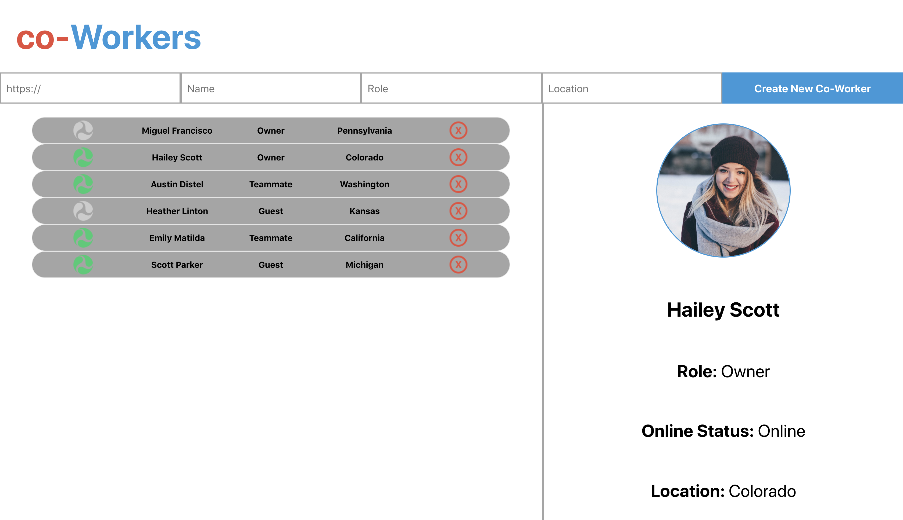

## Prework: 

We're going to be building something slightly different than IdeaBox in this lesson.  While the concepts will be the same, it will be extremely beneficial for you to study the code before the workshop.  Below you will see a screenshot of the aforementioned application.  The purpose of this app is to keep track of the people that you work with.  You can add/remove co-workers, and view information about each person.  You'll see more once you have it cloned down.  Let's get it set up!



### Setup

Clone down the [api](https://github.com/turingschool-examples/co-workers-api) and [ui interface](https://github.com/turingschool-examples/co-workers-ui) repos.

**CoWorkers Api**
```bash
git clone https://github.com/turingschool-examples/co-workers-api.git
cd co-workers-api
npm i
npm start
```

**CoWorkers UI**
```bash
git clone https://github.com/turingschool-examples/co-workers-ui.git
cd co-workers-ui
git checkout in-class
npm i
npm start
```

After setting it up and running it, check through the code.  Much of it should feel familiar with a few added features.  Become familiar with the code, we will be implementing Redux during the workshop!

## Learning Goals

- Become more familiar with creating actions, reducers, and containers
- Understanding where it is necessary to utilize mapStateToProps & mapDispatchToProps
- Learn how to use actions along with your fetch calls to update the store

### A Closer Look

Looking at the application, you may have noticed how the `App` component keeps track of which `Profile` needs to be displayed.  In it's state, we can see that *selectedId* starts out as null (due to no one selecting a user at the start).  The method that updates this part of state is *selectUser*.  Take a look at where that method gets passed down.

```jsx
// components/CoWorkerTab

const CoWorkerTab = ({ id, status, name, role, location, removeCoWorker, selectUser }) => {
  const onlineStatus = status ? online : offline;
  return (
  <li className="tab" onClick={() => selectUser(id)}>
    
    <p>{name}</p>
    <p>{role}</p>
    <p>{location}</p>
     removeCoWorker(e, id)} />
  </li>
  )
}
```

You'll notice that the method gets passed down to the `Dashboard`, and then once again to the `CoWorkerTab` component.  That isn't soo bad, but let's take a look at where the state needs to be given.  The *selectedId* is needed in the `App` so we know which *Profile* to display, but we also need to be passing *coWorkers* to the `Dashboard` AND `Profile`! While this isn't terrible, you can see how quickly our code can get complicated the more functionality we add.  The state in our `App` component is needed in multiple places for different sections of our app.

```jsx
// components/App

  render() {
    const { coWorkers, selectedId, error } = this.state;
    const foundUser = coWorkers.find(coWorker => coWorker.id === selectedId);
    return (
      <div className="app">
          <Form addCoWorker={this.addCoWorker} />
        <main>
          <Dashboard 
            coWorkers={coWorkers} 
            error={error} 
            removeCoWorker={this.removeCoWorker} 
            selectUser={this.selectUser}
          />
        <Profile selected={foundUser} />
        </main>
      </div>
    );
  }
```

### Implementing Redux

Redux helps us maintain and scale our code by abstracting reusable pieces out. This includes actions & state that are needed in multiple places.  This coincides with our conversation about MVC architecture where Redux acts partially as the controller and the model.  We use actions to update our global store, and reducers are combined to let us know what the state of our store is.

With this in mind, let's start with something simpler and take our *selectedId* property out of state and comment out our *selectUser* method.  Let's implement it into our global store with REDUX!

#### Starting with the action

If we look at the *selectUser* method we just commented out, we can see that it takes an id as an argument and then sets it to state.  Let's create an action that does the same thing.

```js
// actions/index.js

export const selectUser = id => ({
  type: 'SELECT_USER',
  id
})
```

The only difference is that we need a type (as with all actions) and an id which is our payload.  These will be used to update our global state shortly.  Seems pretty simple so far right?  Let's move to our reducer!

#### Creating the Reducer

```js
// reducers/selectedId.js

export const selectedId = (state=null, action) => {
  switch (action.type) {
    case 'SELECT_USER':
      return action.id
    default:
      return state;
  }
}
```

Similar to what our state was when it was originally in the `App.js` file, we want the default state to start out *null* since the user hasn't selected a profile yet.  However, if the type of the action matches "SELECT_USER", we want to return the new id that is to be selected.  Remember to always include the default state since all reducers fire (both on startup of an application as well as when an action is dispatched).  Next up the rootReducer.  

<section class="call-to-action">
### Your Turn

Right now we only have one reducer, but we will likely need multiple reducers in the future!  Create an `index.js` file inside of your reducers directory, and create the rootReducer.
</section>

```js
// reducers/index.js

import { combineReducers } from 'redux';
import { selectedId } from './selectedId';

export const rootReducer = combineReducers({
  selectedId,
})
```

You should have something like this.  We set the key to *selectedId* just so it's a little more specific when we get access to our props.  Next up, let's make sure our App is hooked up with redux.

#### Finalizing Setup of Redux

<section class="call-to-action">
### Your Turn

Move to your `index.js` file in the src directory.  Install & import the necessary dependencies necessary to make your store available to your App component.

**Hint**: You might want to install your redux devtools so that you have access to them later!
</section>

```bash
  npm i redux react-redux redux-devtools-extension -S
```

```jsx
// src/index.js

import { rootReducer } from './reducers';
import { createStore } from 'redux';
import { Provider } from 'react-redux';
import { composeWithDevTools } from 'redux-devtools-extension';

const store = createStore(
  rootReducer,
  composeWithDevTools()
)

ReactDOM.render(
  <Provider store={store}>
    <App />
  </Provider>, 
  document.getElementById('root')
);
```

#### Connecting The Dots

Everything should be hooked up.  You can open your application now and see if everything is up and running.  Double check any errors and then open your DevTools.  Do you see *selectedId* in your store?  Awesome!  Now that the store is set up, we need to find which components need access to our store and actions.  Let's start with where we need the state.  We originally had *selectedId* in our App, so let's include that in our props!

<section class="call-to-action">
### Your Turn

Hook up your App component so it has access to `selectedId` in it's props.  Think about what needs to be included to "connect" your App component to the store!
</section>


```jsx
// App.js

import { connect } from 'react-redux';

render() {
    const { selectedId } = this.props;
    const foundUser = coWorkers.find(coWorker => coWorker.id === selectedId);
    return (
      <div className="app">
          <Form addCoWorker={this.addCoWorker} />
        <main>
          <Dashboard 
            coWorkers={coWorkers} 
            error={errorMsg} 
            removeCoWorker={this.removeCoWorker} 
          />
        <Profile selected={foundUser} />
        </main>
      </div>
    );
  }
}

const mapStateToProps = ({ selectedId }) => ({
  selectedId
});

export default connect(mapStateToProps)(App);
```

**Notice**: We don't need to pass a second argument through our *connect* function if we don't need *mapDispatchToProps*.  

You should have access to the prop now.  Right now it will be *null* due to it being it's default state.  But this means it is working correctly since it's not *undefined*.  Cheers!  Let's move on to where our action needs to be fired!

Think about where we originally invoked our *selectUser* method.  That's right, back in the CoWorkerTab component.  We can connect functional components to our store as well.  

<section class="call-to-action">
### Your Turn

Hook up your coWorkerTab component so it has access to the `selectUser` method in it's props.  Remember to import the action you need to dispatch!
</section>

```jsx
// CoWorkerTab.js

import { bindActionCreators } from 'redux'; 
import { connect } from 'react-redux';
import { selectUser } from '../actions';

const CoWorkerTab = ({ id, status, name, role, location, removeCoWorker, selectUser }) => {
  const onlineStatus = status ? online : offline;
  return (
  <li className="tab" onClick={() => selectUser(id)}>
    
    <p>{name}</p>
    <p>{role}</p>
    <p>{location}</p>
     removeCoWorker(e, id)} />
  </li>
  )
}

const mapDispatchToProps = dispatch => (
  bindActionCreators({ selectUser }, dispatch)
)

export default connect(null, mapDispatchToProps)(CoWorkerTab)
```

You might notice the syntax is a bit different in the solution above.  We have something called *bindActionCreators* that we are importing from `redux` and using in your *mapDispatchToProps* function.  This is a shorthand way to say you want the method name to be the same as your action.  You can do it either way, but this can be nice if you name your actions carefully and want to reuse the names for multiple actions.  The examples below work exactly the same:

```js
// The original way

export const mapDispatchToProps = dispatch => ({
  selectUser: id => dispatch(selectUser(id));
})
```

```js
// Using bindActionCreators

  export const mapDispatchToProps = dispatch => (
    bindActionCreators({ selectUser }, dispatch)
  )
```

Feel free to use the syntax you are most comfortable with.  However, you will want to use the original way if you want to name the method something different from the action.

Lastly, it would be a good idea to move both our `App` and `CoWorkerTab` components into a `containers` directory since these are no longer plain React components.  And that's it!  You just implemented Redux in a React project.

### How To Apply Fetch Calls in Redux?

You might be interested in how we can remove our *coWorkers* & *error* properties from state as well.  Is there a way to create an action in Redux that fetches our co-workers?  Using just Redux, unfortunately this is not possible.  Remember action creators can only return an action (object) and therefore has no room to deal with asynchronous code.  However, we can still run our asynchronous code in the methods of our components, and call the actions necessary to update state!

If we think about it, there are 3 stages of an asynchronous request:

* The start of the request
* If the request succeeds
* If the request fails

Our state (Redux store) needs to account for each of these stages.

#### Beginning the loop once more

Just like we did last time, let's start with our actions first.  We are going to need a few actions to represent the state of our network request.  It's important to keep track of the time while it's loading, when it errors out, and then finally if all goes well, the co-workers data we're trying to get!  Let's see what that looks like.

```js
// actions/index.js

export const isLoading = isLoading => ({
  type: 'IS_LOADING',
  isLoading
});

export const hasErrored = errorMsg => ({
  type: 'HAS_ERRORED',
  errorMsg
});

export const getCoWorkers = coWorkers => ({
  type: 'GET_COWORKERS',
  coWorkers
});
```
Notice some of the similarities with how we have kept track of these properties in a component's state previously?  That's it, now that we have our action creators finished let's get on to our reducers!


#### Creating our reducers once more

Let's create a separate file from our `selectedId.js` file since this is dealing with different data.  Let's create a few different files.  We will need three reducers to handle our three actions (each being responsible for a different piece of state in our Redux store).

```js
// reducers/isLoading.js

export const isLoading = (state=false, action) => {
  switch(action.type) {
    case 'IS_LOADING':
      return action.isLoading;
    default:
      return state;
  }
}
```

```js
// reducers/errorMsg.s

export const errorMsg = (state = '', action) => {
  switch(action.type) {
    case 'HAS_ERRORED':
      return action.errorMsg
    default:
      return state;
  }
}
```

```js
// reducers/coWorkers.js

export const coWorkers = (state=[], action) => {
  switch(action.type) {
    case 'GET_COWORKERS':
      return action.coWorkers;
    default:
      return state;
  }
}
```

The neat thing about how we're setting this up is that in the future, when we create other methods for adding co-workers, removing co-workers, we can re-use our actions for handling loading & errors.  It's going to take practice, but finding ways to reuse actions/reducers can help to keep a flatter Redux store!

<section class="call-to-action">
### Your Turn

We've created our reducers now.  What is the next part of the flow?  How can we connect these to our store?  Take a few minutes and get these new reducers connected.
</section>

```js
// reducers/index.js

import { combineReducers } from 'redux';
import { selectedId } from './selectedId';
import { isLoading } from './isLoading';
import { errorMsg } from './errorMsg';
import { coWorkers } from './coWorkers';

export const rootReducer = combineReducers({
  selectedId,
  isLoading,
  errorMsg,
  coWorkers
});
```

#### Connecting the Store to our Props

Lastly, we need to connect the store to our props.  You've done this already.  Go back to your `App.js` and think about how we added to our props previously.  We need to feed both an action and our state to you `App`.

<section class="call-to-action">
### Your Turn

Before looking at the solution below, experiment with passing state from your store to your props.  You've already done this before!  You likely will also need to set up your container so it can accept actions as well.  Think about which actions need to fire and when.  Instead of setting your coWorkers to state, use an action to update the store.  If something errors out, how can you use an action to update the global state?
</section>

```jsx
// App.js

import { bindActionCreators } from 'redux';
import { fetchCoWorkers } from '../apiCalls';
import { getCoWorkers, isLoading, hasErrored } from '../actions';


class App extends Component {
  async componentDidMount() {
    const { getCoWorkers, isLoading, hasErrored } = this.props;
    try {
      isLoading(true);
      const coWorkers = await fetchCoWorkers();
      isLoading(false);
      getCoWorkers(coWorkers);
    } catch (error) {
      isLoading(false);
      hasErrored(error.message);
    }
  }

   render() {
    const { coWorkers, selectedId, errorMsg } = this.props;
    const foundUser = coWorkers.find(coWorker => coWorker.id === selectedId);
    return (
      <div className="app">
        <Form addCoWorker={this.addCoWorker} />
        <main>
          <Dashboard
            coWorkers={coWorkers}
            error={errorMsg}
            removeCoWorker={this.removeCoWorker}
          />
          <Profile selected={foundUser} />
        </main>
      </div>
    );
  }
}

export const mapStateToProps = ({ selectedId, isLoading, coWorkers, errorMsg }) => ({
  selectedId,
  isLoading,
  coWorkers,
  errorMsg
})

export const mapDispatchToProps = dispatch => (
  bindActionCreators({
    getCoWorkers,
    isLoading,
    hasErrored
  }, dispatch)
)

export default connect(mapStateToProps, mapDispatchToProps)(App);

```

Notice in our `componentDidMount` that we destructure our actions from our props.  Then at the beginning of the function, we invoke our *isLoading* method to update our Redux store.  This is to signify that the data is currently loading. If everything goes well, and we get our data back, we can call *isLoading* once more saying that the loading has finished.  Lastly, we can invoke *getCoWorkers* and pass our data to update our store.  Notice we are also calling *hasErrored* in our `catch` to update state with the error message if things go wrong.

Comment out your *constructor*, *addCoWorker*, and *removeWorker* methods.  Going back to your app, it should load your co-workers.  If you change the url in your *fetchCoWorkers* method to break it, it should still display an error.  We're now fully utilizing our Redux store!  

<section class="call-to-action">
### Next Steps

Now that we have implemented getting the co-workers, try and do the same for adding a co-worker and removing a co-worker.  Practice writing out more actions & reducers and connect what pieces you need to the `App`.  You got this!

If you get stuck, check out the `convert-to-redux` branch to see the final version.  Cheers!
</section>