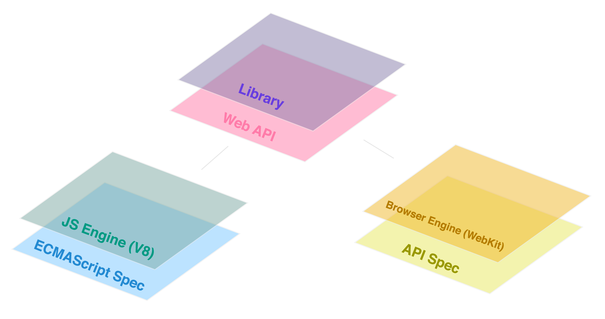

<section>
  <h2>Get Low-Level</h2>
  <h4>Understanding Specs  & Standards Bodies</h4>
</section>

<section>

On the whiteboard, list all the libraries and frameworks you've used.

<ul>
  <li>look through the lesson plans listed on the frontend site</li>
  <li>look through the `package.json` files in your projects</li>
</ul>

<section>
  
</section>
