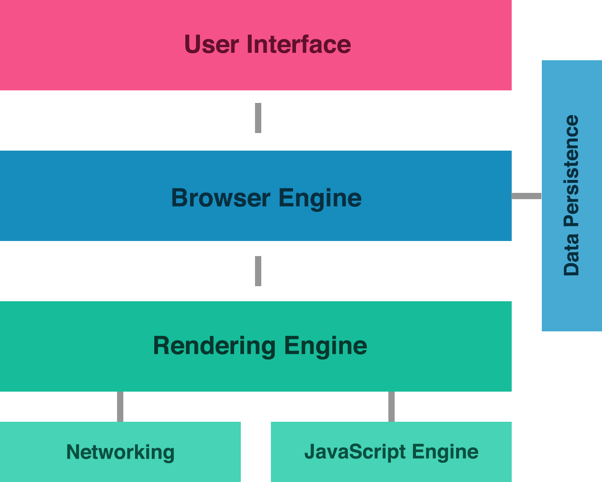

<section>
  <h2>Get Low-Level</h2>
  <h4>Understanding Specs  & Standards Bodies</h4>
</section>

<section>
  <section>
    <h4>On the whiteboard:</h4>
    
<i>list all libraries & frameworks you've used</i>

    <ul>
      <li>look through the lesson plans listed on the frontend site</li>
      <li>look through your `package.json` files in projects you've built</li>
    </ul>
  </section>
  <section>
    
<i>Learning 100 different libraries is still easier than building an application with none.</i>

  </section>
</section>

<section>
  <h3>Identifying the Layers</h3>
  
</section>

<section>
  <section>
    <h3>Layer #3 - The Library</h3>
    <ul>
      <li>previously used <a href="http://dexie.org/">Dexie</a> - library wrapping IndexedDB</li>
      <li><a href="https://github.com/turingschool-examples/offline-news/blob/before-sync-lesson/public/indexedDB.js">code</a> was concise and read similar to English</li>
    </ul>
  </section>
  <section>
    <h4>On Your Own:</h4>
    
look through the Dexie <a href="https://github.com/dfahlander/Dexie.js">source code</a> and find the following implementations:

    <ul>
      <li>`put`</li>
      <li>`get`</li>
      <li>`delete`</li>
    </ul>
  </section>
</section>

<section>
  <section>
    <h3>Layer #2 - The Web API</h3>
    <ul>
      <li>Downsides of IndexedDB: "The API is <a href="https://github.com/turingschool-examples/offline-news/blob/d6182e5e7858af7481ef41d534dbc5a5d8b717f0/public/indexedDB.js">brutal</a>".</li>
      <li>code is verbose and difficult to read</li>
    </ul>
  </section>
  <section>
    <h3>But y tho?</h3>
    <ul>
      <li>Web APIs need to be <b>flexible</b> to handle many scenarios</li>
      <li>This means they have to be as <b>bare-bones</b> as possible</li>
    </ul>
  </section>
</section>

<section>
  <section>
    <h3>Layer #1 - The Browser</h3>
    <ul>
      <li>browsers are made up of many different parts</li>
      <li>working with APIs is dependent on the built-in JavaScript Engine and Browser Engine</li>
    </ul>
  </section>
  <section>
    <h3>Browser Architecture</h3>
    
  </section>
</section>

<section>
  <section>
    <h3>Layer #1a - The Browser Engine</h3>
    
<i>The browser engine is responsible for implementing Web APIs and functionality like IndexedDB, geolocation, web audio, etc.</i>

    <ul>
      <li>Chrome - Webkit (C++)</li>
      <li>Firefox - Gecko (C++)</li>
    </ul>
  </section>
  <section>
    <h3>Check the <a href="https://github.com/WebKit/webkit/tree/master/Source/WebCore/Modules">source</a></h3>
    <ul>
      <li>which modules sound familiar to you?</li>
      <li>bump up a directory and explore the rest of /WebCore/</li>
      <li>what other APIs live in the browser engine?</li>
    </ul>
  </section>
</section>

<section>
  <section>
    <h3>Layer #0a - The Web API Specification</h3>
    
<i>The specification for a Web API gives platform engineers a strict set of rules for how the API should behave, which guides how it is implemented in the browser</i>

    <ul>
      <li>spec writers agree on functional behavior</li>
      <li>platform engineers implement the API in the browser</li>
      <li>app developers build applications using the API</li>
    </ul>
  </section>
  <section>
    <h3><a href="https://www.w3.org/TR/IndexedDB/">IndexedDB Spec</a></h3>
    
<i>Specs are notoriously difficult for app developers to read because they are written for platform engineers who write C++</i>

  </section>
  <section>
    <h3>Reverse!</h3>
    
<i>Let's walk through a single point of IndexedDB functionality from the bottom up.</i>

    <h4>Opening a Database:</h4>
    <ul>
      <li><a href="https://www.w3.org/TR/IndexedDB/#requests">The Spec</a></li>
      <li><a href="https://github.com/WebKit/webkit/blob/master/Source/WebCore/Modules/indexeddb/IDBFactory.cpp#L78-L86">The Browser Engine Implementation</a></li>
      <li><a href="https://github.com/turingschool-examples/offline-news/blob/d6182e5e7858af7481ef41d534dbc5a5d8b717f0/public/indexedDB.js#L11-L21">Our JavaScript Implementation</a></li>
      <li><a href="https://github.com/turingschool-examples/offline-news/blob/after-sync-lesson/public/indexedDB.js#L4">The Dexie Library Wrapper</a></li>
    </ul>
  </section>
</section>

<section>
  <section>
    <h3>Standards Bodies</h3>
    
<i>Standards bodies facilitate creating technical documents that define how proposed web functionality should be implemented.</i>

    <ul>
      <li><a href="https://www.w3.org/">W3C</a> - World Wide Web Consortium</li>
      <li><a href="https://whatwg.org/">WHATWG</a> - Web Hypertext Application Technology Working Group</li>
    </ul>
  </section>
  <section>
    <h3>Why Standards?</h3>
    <ul>
      <li>promote a more stable and consistent web</li>
      <li>follow patterns that make implementation and maintenance easier</li>
      <li>are developed with all demographics in mind</li>
      <li>make it easier to share common knowledge and learn from each other</li>
    </ul>
  </section>
  <section>
    <h3>Standardization Process</h3>
    <ul>
      <li><b>"Working Groups"</b> (clubs of old white men) are formed and discuss new ideas for Web APIs</li>
      <li><b>"Working Draft" (WD) -</b> document to be reviewed by the community</li>
      <li><b>"Candidate Recommendation" (CD) -</b> released for implementation experience</li>
      <li><b>"Proposed Recommenation" (PD) -</b> technical report sent to advisory board</li>
      <li><b>"W3C Recommenation" (REC) -</b> technical report endorsed by W3C members/directors</li>
    </ul>
  </section>
  <section>
    <h3>Web Incubator Community Group (WICG)</h3>
    
<i>WICG is a <a href="https://wicg.io/">Community Group</a> where people <a href="https://discourse.wicg.io/latest">discuss</a> changes to pre-existing APIs and pitch potential new ones. Some of the discussions include:</i>

    <ul>
      <li><a href="https://discourse.wicg.io/t/web-share-api-for-sharing-content-to-arbitrary-destination/1561">Web Share</a></li>
      <li><a href="https://discourse.wicg.io/t/a-zip-api-in-the-browser/14">Zip</a></li>
      <li><a href="https://discourse.wicg.io/t/passing-an-object-of-attributes-to-document-createelement-as-the-second-argument/809">Changes to document.createElement()</a></li>
      <li><a href="https://discourse.wicg.io/t/wake-lock-api-suppressing-power-management-screensavers/769/3">Wake Lock API</a></li>
    </ul>
  </section>
</section>

<section>
  <section>
    <h3>Layer #1b - The JS Engine</h3>
    
<i>The JavaScript Engine is responsible for interpreting the JavaScript we write and doing something meaningful with it.</i>

    <ul>
      <li>Chrome - V8 (C++)</li>
      <li>Firefox - Spidermonkey (C/C++)</li>
    </ul>
  </section>
  <section>
    <h3>Check the <a href="https://github.com/v8/v8/tree/master/src/js">source</a></h3>
    <ul>
      <li>which file names sound familiar to you?</li>
      <li>bump up a directory and explore the rest of /src/</li>
      <li>what other functionaliy lives in the JS engine?</li>
    </ul>
  </section>
</section>

<section>
  <h3>Layer #0b - The ECMAScript <a href="https://www.ecma-international.org/ecma-262/6.0/#sec-declarations-and-the-variable-statement">Spec</a></h3>
  
<i>The ECMAScript spec defines the entire JavaScript language, and is very <a href="https://twitter.com/brittanystoroz/status/885591959154417664">scary</a>.</i>

</section>