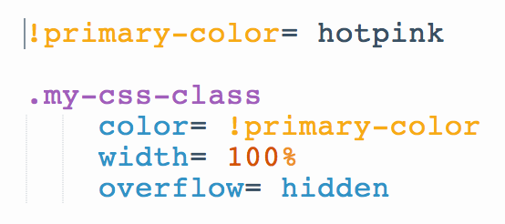

<style type="text/css">
.discuss{padding:20px !important;font-size:13px !important;background-color:#fefefe;border:1px solid #eee !important}
.discuss h4{margin:0 !important}
body,html{background-color:#fff;height:100%;margin:0;font-family:'Open Sans',sans-serif, color: #555;}.content a:link, .content a:visited{border-bottom:0px !important;text-decoration:none;color:#05c2d1}.content p { color: #555 !important; }
hr{width:100%;height:1px;background-color:#eee;border:0;margin:50px 0}
</style>


## Intro to Sass

Sass stands for Syntactically Awesome StyleSheets. Sass allows you to add more advanced syntax - like variables and functions - to your stylesheets. It is a CSS preprocessor that converts SCSS (Sassy CSS) into vanilla CSS.

A pre-processor is a tool that will process your code and compile it to a new format that adheres to the requirements of your environment. Think babel - this compiles our fancy ES6 syntax back down to ES5 so that it can be supported in older browsers.

### Sass vs. SCSS vs. CSS

Sass was originally part of another preprocessor called Haml. It used no curly braces or semi-colons, and the syntax adhered to strict spacing and indentation rules. Like so:



With this version, variables were assigned using `!` and CSS styles were defined with `=`. Pretty different from the CSS you're used to using now. Developers liked the additional control we had over writing our stylesheets, but wanted a syntax more similar to vanilla CSS. This is where SCSS comes in.

### SCSS

SCSS stands for Sassy CSS (...seriously). In May, 2010 `SCSS` was introduced with more recognizable syntax.

<div class="discuss">
  <h4>Practice</h4>
  <p>Take a look at the SCSS in <a href="https://codepen.io/the_ruther4d/pen/ormbi">this codepen</a>. Write down any syntactical similarities and differences you notice between SCSS and the plain CSS you're familiar with.</p>
</div>

Even if you've never worked with SCSS before, this syntax is a little bit easier to understand since it is so much closer to the languages that we use every day. Variables look like jQuery variables, things are nested in these guys: `{}`, wrong indentation won't break your code, and assignments happen using `:` just like in normal CSS.

Although both Sass and SCSS are both still viable languages to use, movement has shifted significantly toward SCSS for several reasons:

1. All modern CSS is valid SCSS. That means that you can rename an entire `.css` file `.scss` and nothing will yell at you. Such is not the case for Sass.
2. There are no strict rules about indentation. There are still best practices, and if your indentation is all over the place you'll make Jhun cry, BUT through the tears your stylesheet will still function properly.

### Why would we use Sass?

CSS in large apps can get crazy. Making changes to these large apps is tedious and extremely error prone. Sass makes it easier to change colors, fonts, and other properties by keeping your code DRY.

Some of the cool tricks include defining variables that can be peppered across multiple CSS files, nesting elements to visibly reflect the HTML element relationships, using math equations to adjust sizes and values, adjusting colors using more intuitive language like "darken" and "lighten", and bundling groups of styles together to easily reference throughout your CSS...to name a few.

<hr />

## Variables

One of the most obvious and immediately useful features of Sass is the ability to define variables.

As developers we strive to write DRY, clean code, and storing values for CSS styles as variables contributes to that. This means we can make color changes in one place, and the change will be reflected anywhere that the variable is referenced.

Variables are defined by a `$` immediately preceding the name of the variable (like jQuery), and a colon separating the name of the variable from the value.

```
$favorite-text-color: chartreuse;
```

They can then be used anywhere in your stylesheet in place of that style.

```css
p {
  color: $favorite-text-color;
}
```

It's also nice to avoid typing long, specific styles more than once. Instead we can reference a semantically logical variable.

```css
$frilly-font: "Fantasy", cursive;
$main-font: "Arial", "Helvetica", "Copperplate", sans-serif;

$button-slide-transition: width 2s, height 2s, background-color 2s, transform 2s;

.main-content {
  font-family: $main-font;
  button {
    transition: $button-slide-transition;
  }
}
```

Variables are easiest to change if they're all located in the same stylesheet. Let's say you create a file called `variables.scss` that houses all of your variables. Then you simply need to require said file in your other stylesheets using the syntax `@import "variables"`

```
// variables.scss

// Colors
$favorite-text-color: chartreuse;
$gray-link: #aaa;

// Fonts
$frilly-font: "Fantasy", cursive;
$main-font: "Arial", "Helvetica", "Copperplate", sans-serif;

// Transitions
$button-slide-transition: width 2s, height 2s, background-color 2s, transform 2s;
```

```
// home-page.scss
@import "variables";

body {
  color: $favorite-text-color;
}
```

<hr />

## Nesting

Nesting makes representing relationships between elements in HTML possible in CSS.

For example, if you want to target an anchor tag within a navigation element within a particular header tag, you can wrap the elements inside each other as you would in HTML.

##### Sass

```
$main-text-dark: #000;
$red: #FF0000;
$link-light: #fff;

header {
  color: $main-text-dark;
  nav: {
    background-color: $dark-red;
    a { color: $link-light; }
  }
}
```

##### CSS Output

```css
header { color: #000; }
header nav { background-color: #ff0000; }
header nav a { color: white; }
```

*IMPORTANT NOTE* Notice how the CSS output contains very specific CSS style rules. Although nesting can make writing CSS easier, it can also make targeting future elements more difficult when you need to make changes. Try to avoid excessive levels of nesting unless absolutely necessary.

#### Nesting & Psuedo-Selectors

A common scenario when nesting is a good option is when dealing with psuedo selectors. This makes it very transparent which element's behavior is being targeted on a particular action.

To target a parent element and apply a psuedo selector, use `&:psuedo-selector`, as in the following syntax:

```
a {
  &:hover { color: pink; }
}
```

<div class="discuss">
<h4>Practice</h4>
<p>Write SCSS for the following HTML using nesting & variables, following the following criteria:</p>

1. Link text font family should be Arial, Tahoma, or sans-serif.
1. On hover, make the link text red, and the button text white.
2. On hover, make the button have a box shadow of some kind.
3. For practice, define all styles as variables.
</div>

```html
  <nav class="nested-magic">
    <ul>
      <li><a href="#">About</a></li>
      <li><a href="#">Contact</a></li>
      <li><button type="button" name="button">Log In</button></li>
    </ul>
  </nav>
```

Let's say that your client wants everything thats red to be teal.  Pretend that your CSS file is huge. Isn't is awesome that you only have to change the CSS in one tiny little place?

<hr />

## Color Functions

Color functions in Sass let you adjust defined color values with ease.

Let's take a second to go back over the different ways to define a color in CSS.

##### RGBA

Stands For: Red, Green, Blue, Alpha(Opacity)  
Syntax: `rgba(0-255, 0-255, 0-255, 0-1)` or `rgba(0-100%, 0-100%, 0-100%, 0-1 )`  
Example: `rgba(255, 0, 0, 1)` or `rgba(100%, 0, 0, 1)` (red)  

Each value takes either a integer from 0-255 or a percentage from 0-100% representing the saturation of red, blue and green respectively, and blends them together.

##### Hexadecimal Code

Stands For: A form of RGB notation written as pairs of hexadecimal values.  
Syntax: `#rrggbb` or `#rgb`.  
Example: `#f00` or `#ff0000` (red)  

*ProTip:* Shorthand comes from duplicating each character. So `#f00` (red) expands into `#ff0000`, or `#fb0` (yellow) expands to `#ffbb00`;)

##### HSLA

Stands For: Hue, Saturation, Lightness, Alpha(Opacity)  
Syntax: `hsla(0-360, 0-100%, 0-100%, 0-1)`  
Example: `hsla(0, 100%, 50%, 1)` (red)  

**Hue:** A value from 0 to 360 indicating the value of RGB on a color wheel.  

Think of the letters RGB distributed equally clockwise around a circle. (R)ed is at 0 or 360, (G)reen is at 120, (B)lue is at 240.

[Color Wheel](https://uwdigipub.files.wordpress.com/2014/11/hsl-color-wheel-pagespeed-ce-if6-exzipy.png)

**Saturation:** A percentage of the grayscale from 0% (no color) to 100% (full color).

**Lightness:** A percentage of white value from 0% (completely dark) to 100% (completely light); Standard colors default to 50%.

**Alpha:** A decimal value indicating transparency from 0 (invisible) to 1 (completely opaque).

#### complement(color)

Returns the complement (aka the color that is 180 degrees from the value on the color wheel).
Identical function to `adjust-hue(color, 180deg)`

Take a peek at the [Color Wheel](https://uwdigipub.files.wordpress.com/2014/11/hsl-color-wheel-pagespeed-ce-if6-exzipy.png) again for clarity.

```css
$color1: hsla(240, 100%, 50%, 1);
complement(hsla(240, 100%, 50%, 1));
=> hsla(60, 100%, 50%, 1);

.complement-background {
  background: complement($color1)
}
```

#### mix(color1, color2, weight)

Mixes two given colors based on the weight percentage provided.

`$weight` in this function is relative to the two defined colors. Closer to `100%` gives more weight to `$color1`, closer to `0%` gives more weight to `$color2`.

```css
$color1: hsla(0, 100%, 50%, 1);
$color2: hsla(240, 100%, 50%, 1);
mix(hsla(0, 100%, 50%, 1), hsla(240, 100%, 50%, 1), 75%);
mix(hsla(0, 100%, 50%, 1), hsla(240, 100%, 50%, 1), 35%);

.redder-background {
  background: mix($color1, $color2, 75%);
}

.bluer-background {
  background: mix($color1, $color2, 35%);
}
```

#### lighten/darken(color, amount)

Takes a color and a percentage value, returning a color with a lightness increased or decreased by given amount.

```css
$color1: hsla(240, 100%, 50%, 1);
lighten(hsla(240, 100%, 50%, 1), 30%);
darken(hsla(240, 100%, 50%, 1), 30%);

.lighter-background {
  background: lighten($color1, 30%);
}

.darker-background {
  background: darken($color1, 30%);
}
```

#### desaturate/saturate(color, amount)
Remember that saturation is a colors representation on a gray scale.

`desaturate()` Will reduce a color's saturation by that percentage.
`saturate()` Will increase a color's saturation by that percentage.

```css
$full-color: hsla(240, 100%, 50%, 1);
$duller-color: hsla(240, 50%, 50%, 1);
saturate(hsla(240, 50%, 50%, 1), 10%);
desaturate(hsla(240, 100%, 50%, 1), 80%);

.vibrant-background {
  background: saturate($duller-color, 30%);
}

.dull-background {
  background: desaturate($full-color, 80%);
}
```

<hr />

## Math

Another cool trick in Sass is using Math to handle simple changes to numerical values.

For example, you can define the width of your window using a variable like `$windowWidth` and then make a div that has a width of `windowWidth/3`.  Let's see this in action.

##### SCSS

```css
$content-width: 900px;

.innerContent {
  width: $contentWidth/3;
}
```

##### CSS

```css
.innerContent {
  width: 300px;
}
```

<hr />

## Mixins and Functions

A mixin allows you to define a set of styles along with the option to pass in arguments that you can include in HTML elements, classes or IDs. Mixins are great for reducing repetitive styles in your CSS.

To use:

1. You name them with @mixin name(arguments) { style }.
2. To include them you use @include name.

```
/ Example
@mixin border-radius($radius) {
  -webkit-border-radius: $radius;
     -moz-border-radius: $radius;
      -ms-border-radius: $radius;
          border-radius: $radius;
}

.box { 
  @include border-radius(10px); 
}
```
    

<div class="discuss">
  <h4>Practice</h4>
  <p>Head over to the <a href="http://www.colorzilla.com/gradient-editor/">CSS Background Gradient Generator</a> and grab some of the generated code to put in a codepen. Refactor this CSS into SCSS using a mixin that takes in the two colors you need in your gradient. Apply the mixin to a div to give it a background gradient.</p>
</div>

---

A similar feature is a Sass function, with the difference being that a function returns a single value. These are very useful in doing logic in your styles. You are already using some of the built in Sass functions such as rgba(200,0,100,.5) or darken(#500, %10). You name them with @function and set the return value with @return.

```
@function make-pinker($value) {
  @return $value + rgb(100,0,0);
}

p {
    background: make-pinker(gray);
}
```

<hr />


## Extend

Extend allows you to inherit properties from other classes and IDs. Think of as parent styles -- short, green eyes, big feet. Their children and grandchildren have the same base styles but with new age flair and coolness of their own.

```
.message {
  border: 1px solid #ccc;
  padding: 10px;
  color: #333;
}

.success {
  @extend .message;
  border-color: green;
}

.error {
  @extend .message;
  border-color: red;
}

.warning {
  @extend .message;
  border-color: yellow;
}
```

Compiles to:

```  
.message, .success, .error, .warning {
  border: 1px solid #cccccc;
  padding: 10px;
  color: #333;
}

.success {
  border-color: green;
}

.error {
  border-color: red;
}

.warning {
  border-color: yellow;
}
```
  
[Check it out](https://codepen.io/atideman/pen/QKJmaO)

<hr />

## Control directives

### @if

The if directive returns any styles if the directive does not result in false or null.

```
// For debugging    
@mixin debug-text($true) {
  @if $true {
    color: red;
  }
}

body {
  @include debug-text(true)
}
  
// Useful mixin using If and else statement
@mixin top-or-bottom($tb) {
  position: absolute;

  // Declare top or bottom
  @if $tb == top {
    top: 20px;
  }

  @else if $tb == bottom {
    bottom: 20px;
  }
}

.lower-text {
  @include top-or-bottom(bottom);
}
```


### @each

The each directive loops through a list or map of variables. This is handy in creating accurate class names with specific values:

```    
@each $cohort in 1505, 1511, 1610, 1612 {
   .#{$cohort}-avatar {
       background-image: url('/img/#{$cohort}.png');
   }
}

$align-list: center, left, right;

@each $align in $align-list {
  .txt-#{$align} {
    text-align: $align;
  }
}
```

### @for

Output styles in a loop. Uses a variable name to track the loop. You can use from x through y to include the ending number or from x to y to not include it. You can loop backwards by making the first number larger than the second. 

```
@for $i from 1 through 12 {
  .col-#{$i} { width: 100/12 * $i;}
}
```

### @while

Output styles until the desired condition returns false.

```
$z:1;

@while $z < 9 {
    .text-col-#{$z} { 
      font-weight: 100 * $z;
    }
    $z: $z + 1;
};
```


<hr />

## Disadvantages of Using a CSS Preprocessor

The downsides of using a CSS preprocessor are pretty minimal, but here's a giant list [anyway](https://adamsilver.io/articles/the-disadvantages-of-css-preprocessors/)

## Resources

- [Color Functions Documentation](http://sass-lang.com/documentation/Sass/Script/Functions.html)
- [Sass to CSS Translator](http://www.sassmeister.com/)
- [Why Sass?](http://alistapart.com/article/why-sass)
- [A Complete Beginner’s Guide to Learning Sass in a Weekend](http://skillcrush.com/2014/07/29/jargon-begone-common-sass-terminology-beginners/)
- [How to Structure a Sass Project](http://thesassway.com/beginner/how-to-structure-a-sass-project)
- [Cooler things you can do with Sass](https://gist.github.com/jareware/4738651)

### Instructor Resources

- [Practice Solutions](https://github.com/turingschool/front-end-keys/blob/master/module-4/lesson-plans/intro-to-sass.md)