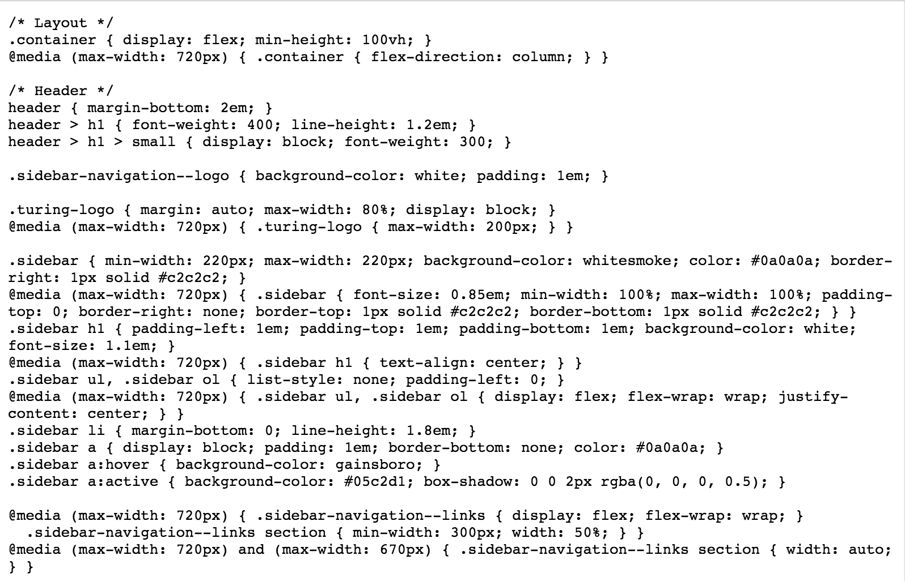
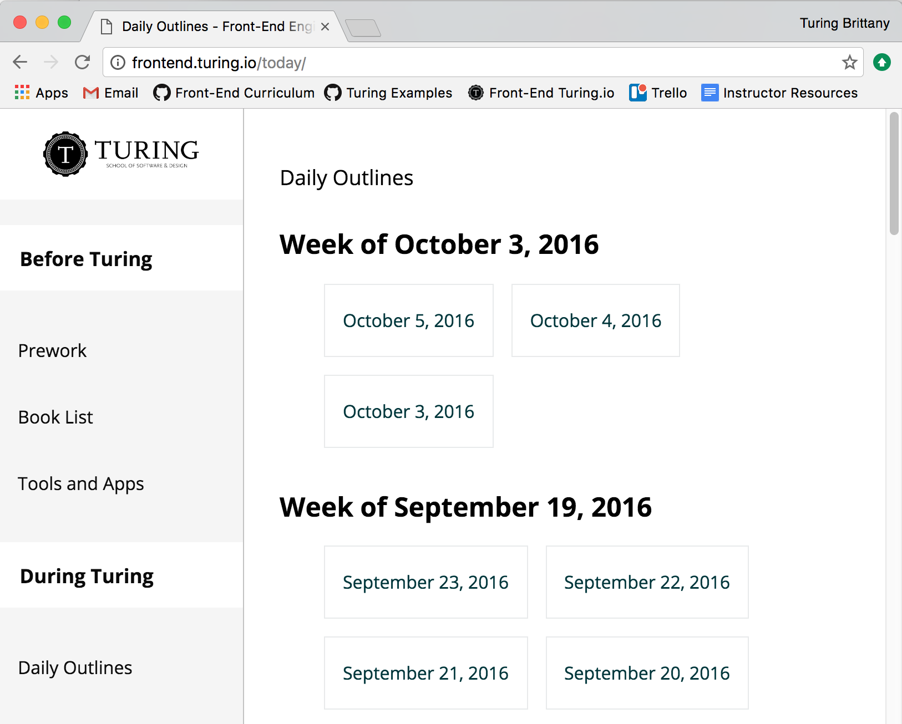
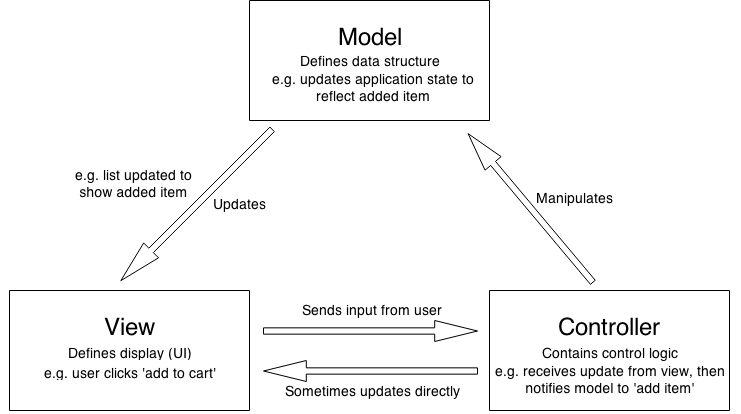

<section>
  <h1>MVC Architecture</h1>
</section>

<section>
  <section>
    <h2>What?</h2>
  </section>
  <section>
    
A set of patterns and concepts that define the main <b>divisions</b> of your application, their responsibilities, and how they should work together.

  </section>
  <section>
    
A blueprint for the overall structure of your application that dictates how responsibilities should be delegated, and outlines a pattern of <b>communication</b> between each working part.

  </section>
</section>

<section>
  <section>
    <h2>Why?</h2>
  </section>
  <section>
    <h3>Mental Model</h3>
    <ul>
      <li>makes abstract concepts more tangible</li>
      <li>app logic is easier to reason about when it's grouped under an 'umbrella' term</li>
    </ul>
  </section>
  <section>
    <h3>Separation of Concerns & Modularity</h3>
    <ul>
      <li>adds flexibility & durability for rapid iterations</li>
      <li>makes it easier to reuse code</li>
      <li>promotes efficient collaboration</li>
    </ul>
  </section>
  <section>
    <h3>Predictability</h3>
    <ul>
      <li>can anticipate how an app will work and where it might break</li>
      <li>allows us to build frameworks to solve common problems</li>
    </ul>
  </section>
</section>

<section>
  <section>
    <h2>Different Schools of Thought</h2>
  </section>
  <section>
    <h3>MOVE</h3>
    
[ models - operations - views - events ]

  </section>
  <section>
    <h3>MVP</h3>
    
[ models - views - presenters ]

  </section>
  <section>
    <h3>MVC</h3>
    
[models - views - controllers ]

  </section>
</section>

<section>
  <section>
    <h2>MVC Breakdown:</h2>
    <h3>The divisions</h3>
    
[ models - views - controllers ]

  </section>
  <section>
    <h2>Models</h2>
    
Define and structure what data the application should contain

     
    
<i>i.e. grocery object, list of groceries</i>

  </section>
  <section>
    <h2>Views</h2>
    
Define how the application data should be displayed; the visual representation of the model

     
    
<i>i.e. UI of grocery app, buttons, list elements, etc</i>

  </section>
  <section>
    <h2>Controllers</h2>
    
Dictates how a model or view should be updated in response to user input; the link between a user and the system

     
    
<i>i.e. click on button to add a grocery, update the grocery list in state</i>

  </section>
</section>

<section>
  <section>
    <h2>MVC Example: The Browser</h2>
  </section>
    <section>
    
HTML = Model

    
  </section>
  <section>
    
CSS = View

    
  </section>
  <section>
    
Browser = Controller

    
  </section>
</section>

<section>
    <h2>MVC Breakdown:</h2>
    <h3>Communication</h3>
  
</section>

<section>
  <h2>Modern Front-End Frameworks</h2>
  <ul>
    <li>Backbone.Js</li>
    <li>Angularjs</li>
    <li>Ember.Js</li>
    <li>ReactJS*</li>
  </ul>
</section>

<section>
  <h2>Why use a framework?</h2>
  <ul>
    <li>Forces you to reap the benefits of the MVC design pattern</li>
    <li>Makes apps easier to test</li>
    <li>Learning a new framework is hard...but solving the problems that frameworks handle for us is harder</li>
  </ul>
</section>

<section>
  <section>
    <h2>Life without Frameworks</h2>
  </section>

  <section>
    <h2>Data Binding & Templating: before</h2>
    <pre>
      <code class="javascript js">
      &lt;input type="text" class="current-grocery" /&gt; 
      &lt;div id="grocery-name"&gt;&lt;/div&gt; 

      $('input.current-grocery').on('keyup', (e) => { 
        $('#grocery-name').text(`Current Word: ${this.val()}`); 
      });
      </code>
    </pre>
  </section>
  <section>
    <h2>Data Binding & Templating: after</h2>
    <pre>
      <code class="html">
    <input type="text" onChange={this.handleChange()} />
    Current Grocery: {this.state.currentGrocery}
      </code>
    </pre>
  </section>

  <section>
    <h2>Routing: before</h2>
    <h2>😞</h2>
  </section>
  <section>
    <h2>Routing: after</h2>
    <pre>
      <code class="javascript js">
  &lt;Router&gt;
    &lt;Route path="/" component={App}&gt;
      &lt;Route path="groceries/" component={GroceryList} /&gt;
      &lt;Route path="groceries/:id" component={GroceryDetail} /&gt;
    &lt;/Route&gt; 
  &lt;/Router&gt;
      </code>
    </pre>
  </section>

  <section>
    <h2>Communication: before</h2>
    <h2>😞</h2>
  </section>
  <section>
    <h2>Communication: after</h2>
    <pre>
      <code class="javascript">
      // Model
      const groceryStore = {
        groceries: [],
        currentGrocery: null
      }

      // View
      <input type="text" onChange={this.handleChange(e)} />
      Current Grocery: {this.state.currentGrocery}

      // Controller Functions
      handleChange(e) => {
        dispatch('groceryChanged', e.target.value);
      }

      groceryChanged(grocery => {
        type: 'GROCERY_CHANGED', // action
        grocery
      });

      case GROCERY_CHANGED: // reducer
        return Object.assign({}, state, {
          currentGrocery: action.grocery,
        });
      </code>
    </pre>
  </section>

</section>

<section>
  <section>
    <h2>The Frameworks</h2>
  </section>
  <section>
    <h2><a href="http://backbonejs.org/">Backbone.js</a></h2>
    <ul>
      <li>Small and lightweight</li>
      <li>Many 3rd-party libraries built on top</li>
      <li><b>MVC Implementation:</b> Models/Collections - Views - Routes</li>
    </ul>
  </section>
  <section>
    <h2><a href="https://angularjs.org/">Angular</a></h2>
    <ul>
      <li>Larger framework, gives you a lot for free</li>
      <li>Very flexible despite its size - a "framework to build a framework"</li>
      <li><b>MVC Implementation:</b> Angular Data - Components - Directives</li>
    </ul>
  </section>
  <section>
    <h2><a href="http://emberjs.com/">Ember</a></h2>
    <ul>
      <li>Larger framework, gives you a lot for free</li>
      <li>Favors convention over configuration - much more opinionated, less flexible</li>
      <li><b>MVC Implementation:</b> Ember Data - Components - Services</li>
    </ul>
  </section>
  <section>
    <h2><a href="https://facebook.github.io/react/">React</a></h2>
    <ul>
      <li>Considered to be more of a library than a framework</li>
      <li>Often described as "just the view layer" of MVC</li>
      <li><b>MVC Implementation:</b> Redux Store - React Components - Actions/Reducers</li>
    </ul>
  </section>
</section>

<section>
  <h2>Choosing a Framework</h2>
  <ul>
    <li><b>big vs. small:</b> how complex is your application?</li>
    <li><b>flexible vs. opinionated:</b> how much control do you want?</li>
    <li><b>community & support:</b> can you get help when needed?</li>
  </ul>
     
  
<b>...<a href="http://todomvc.com/">todomvc</a>:</b> compare setup & syntax

</section>