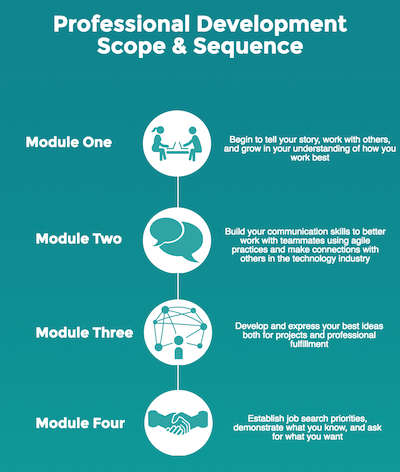

During your time at Turing School of Software and Design, you’ll prepare for your first position as a software developer. Our professional development curriculum will provide you with the tools to establish a healthy and sustainable career in this field. We aim to cultivate graduates who can confidently express who they are and what they can contribute to the tech community. They are able to work collaboratively in teams as well as build off of their own ideas. They easily adapt to different situations and maintain a growth mindset throughout challenges.

Throughout each module, you’ll have workshops with the Community Affairs Manager, Employment Coordinator, and the Partnerships Manager to address these ideas and prepare you for your new career.

### Breakdown of Curriculum
* [Module One](https://github.com/turingschool/professional_skills/blob/master/module_one/index.md)
* [Module Two](https://github.com/turingschool/professional_skills/blob/master/module_two/index.md)
* [Module Three](https://github.com/turingschool/professional_skills/blob/master/module_three/index.md)
* [Module Four](https://github.com/turingschool/professional_skills/blob/master/module_four/index.md)
* [Extensions & Resources](extensions_and_resources)
* [StrengthsFinder (optional)](strengths_finder)
