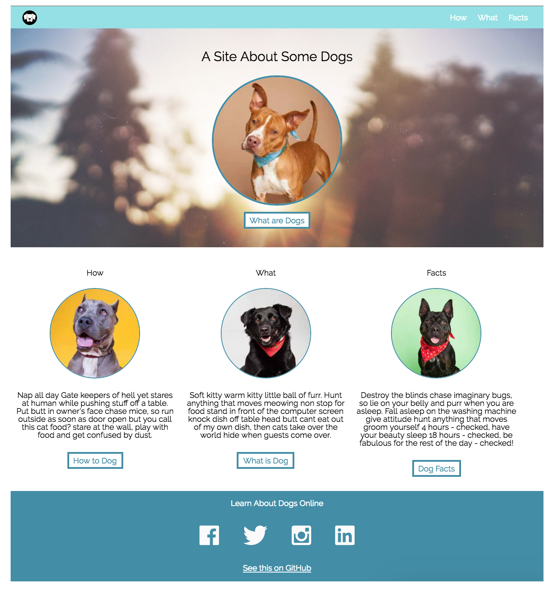

## Specification
The static comp challenge is a challenge to keep you working that HTML/CSS muscle. :muscle:  Once you get into the workforce, building out comps that reflect the designer's choice in layout, spacing, font, imagery, and color to the smallest detail is a requirement. This project is meant to give you an at-bat with matching a comp as pixel perfect as you can.

## Creative License
You may NOT take any creatuve liberties with this design. You should act as though you have been handed this comp by a professional designer and it is your job to bring that design to life in exact detail.

## Assets
- The images and icons are provided for you in the repo in the `images` directory
- You should match the colors by using a tool like [this color picker](https://chromewebstore.google.com/detail/colorpick-eyedropper/ohcpnigalekghcmgcdcenkpelffpdolg?pli=1)
- You can use a tool like [this pixel ruler](https://chromewebstore.google.com/detail/pixgrid-ruler/glkplndamjplebapgopdlbicglmfimic) to match sizing
- The font used in the comp is [Raleway](https://fonts.google.com/specimen/Raleway?preview.text=warm&stroke=Sans+Serif)

## Set Up + Submission
- Fork [this repo](https://github.com/turingschool-examples/dog-party/blob/master/README.md)
- Push your final work to [github pages](https://pages.github.com/)
- Submit your repo and GH pages links [here](https://docs.google.com/forms/d/1kW1JPMpZUhAjzIDnW_wDrGB8PtRDTIFh9ohpkd5h0xk/edit) by the due date listed in your calendar

## Other Notes
- This page does not need to be responsive to screensize
- There does not need to be any JavaScript for this project. It will be a static page with no functionality.

