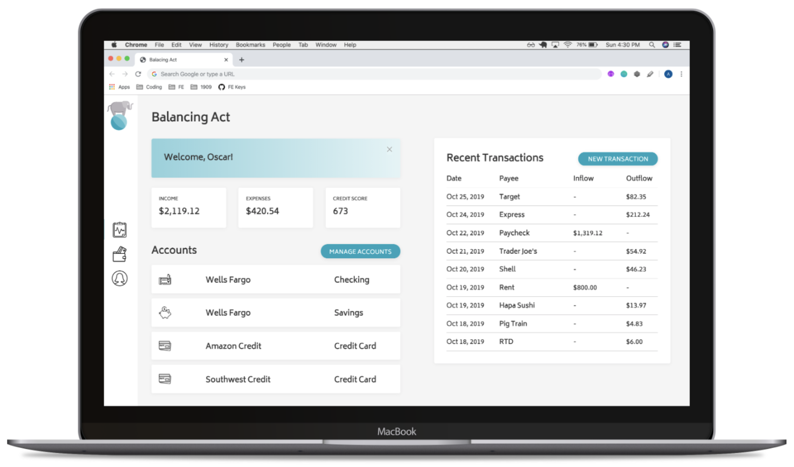
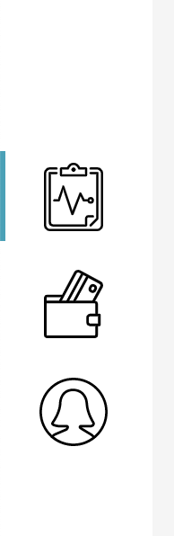
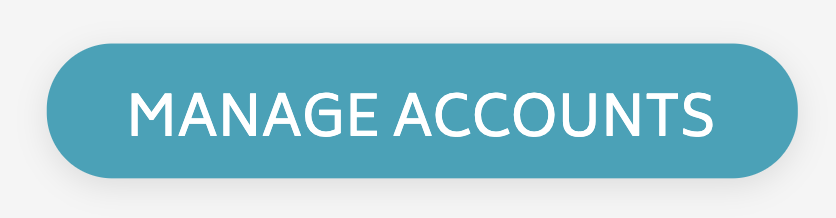

## Week 1

Steps 0-3 need to be completed by Friday morning at 9am. Once these steps are completed, we will eventually add more functionality!

<section class="call-to-action">
### Step 0 - Make a Plan

Contrary to popular opinion, developers don't spend all their time coding! A significant amount of time should be put into planning (both the visual layout of a page and the logic that makes it function).

**DO NOT** skip this step! It's placed here very intentionally, and we will ask you about it in your evaluation.

Spend a couple minutes really looking at every little detail of the comp. Consider:
- What HTML element do you think you'll use for the title? For the "Accounts" sub-title?
- Where do you think the CSS property `border` was used? `border-radius`?
- Will padding, margin, or both be used for the three boxes that have income/expenses/credit score info?

<br>

Map it out. Either print out the comp (there is a printer available in the vault), or sketch it out in your notebook.
- Label each part of the page with the HTML element you think is most appropriate to display it.
- For parts of that page that are repetitive (account cards, and more!), decide on a class name that you will use to refer to those in CSS.
- Think about, and possibly research, how will you make sure that the nav bar stays on the left and the recent transactions box stays on the right?
</section>

<section class="call-to-action">
### Step 1 - General Layout

Now that you have a vision and a plan for how to work towards it, it is time to start writing some code.

Write the HTML and CSS necessary to get the general layout of the comp re-created. This step should NOT include worries about fonts, colors, borders, or other small details. It may look somewhat like craigslist right now - kind of boring, but the content is still there for anyone who needs it.
</section>

Once you're happy with your general layout, commit this chunk of work. Make sure you are navigated to this project in your terminal, then run the following commands:

```
git add index.html
git commit -m "Build skeleton of dashboard page"

git add styles.css
git commit -m "Style general layout of dashboard page"

git push origin master
```

Now, check your project on GitHub. If you click into a file, you should see your recently updated code!

<section class="call-to-action">
### Step 2 - Details, Details, Details

Now that we have the layout in place, it's time to start getting into the nitty-gritty and getting this pixel perfect.

Write the CSS necessary to re-create every little detail of the comp. Keep an eye on font sizes in relation to other pieces of text, padding and margin around content and boxes.
</section>

Don't forget to commit your work! If you don't commit until you finish this iteration, that's ok. Ideally, you'd made several commits throughout this iteration. Below is an example of a series of commit messages that someone _may_ write while working on this.

```
- Add fonts and size fonts
- Style left-side nav bar
- Add padding the cards on middle of page
- Center content vertically on account cards
- Style recent transactions list
- Add final details - hover states to buttons and box shadow to white containers
```

**Once you've pushed your work up to GitHub, check your GitHub pages link.** A very common issue is that images look the way you'd expect when running the project locally, but not on GitHub Pages. If you have that problem, it has to do with a file path. As your cohort mates or rock if you're not sure what to do with this info!

<section class="call-to-action">
### Step 3 - A Little Functionality

It's time to write some JavaScript. Implement the functionality for this [user story](https://www.freecodecamp.org/news/how-and-why-to-write-great-user-stories-f5a110668246/):

```
As a user,
- When I click the "x" icon in the top right corner of the banner that says "Welcome, Username!"
- The entire banner disappears
- and the content below it now fills the space the banner previously took up
- so that I have fewer distractions and can view more accounts (if I had more than 3!)
```

**NOTE:** We do **not** expect that you have a fancy animation for this.
</section>

Don't forget to commit your work! Push up to GitHub and ensure it's working as expected on your GitHub Pages link.

### Comp

For scale, in relation to the full browser:



The next few images show a little more detail as to what is expected in your comp recreation:






<section class="call-to-action">
### Colors, Font & Assets

**Colors:**
- Font color: `#363636`
- Light grey background: `#F5F5F5`
- Grey line between each transaction: `#CCCCCC`
- Turquoise buttons: `#1CA3BA`
- Welcome banner gradient: `#8ED1DC` to `#E3F4F6`
- Box shadow on all elements sitting over the grey background: `rgba(0,0,0,0.05)`

**Icons:**

All icons can be found in [this Google Drive](https://drive.google.com/drive/folders/1tinxJcBu8lf5dHIJZtmOgXnzGu8yhKRK?usp=sharing). You should download them and store them in the `assets` directory you created in the Set Up section.

**Font:**

The only font used is [Biryani](https://fonts.google.com/?query=biry&selection.family=Biryani). For now, you only need `Regular 400`. This should be pulled into the project with a `<link>` tag in the head of your HTML.
</section>

## Rubric

This rubric should serve as a guide for students as they progress through the project, as well as to self-evaluate. Instructors will use it to evaluate the project at its final due date/time, and provide detailed feedback so students know what areas to focus on in future projects.

Scores land in a range between 1 and 4. Below is a breakdown of what those numbers represent.

* 4 - Exceptional (you are where you need to be and either had time or learned extra to go above and beyond in this area)
* 3 - Expected (you showed you are right where you need to be at this point in time)
* 2 - Below expectations (in a good place to grow and be strong in this area soon, but not where you need to be right now)
* 1 - Far below (significant growth needs to be shown in this area; maybe it's an area you forgot to look at, maybe it's something you have big gaps on and need to set up a pairing session on ASAP)

To earn a given score, an application must meet the requirements listed in that score explanation **and** all scores lower.

### Comp Recreation

* 4 - All details have been achieved for both Dashboard and Transactions views. Buttons have hover states (cursor and some other sort of visual indicator that is consistent with the comp, and not distracting).
* 3 - The general layout of the comp has been achieved for both Dashboard and Transactions views and almost all details have been achieved.
* 2 - The general layout of the comp has been achieved for both Dashboard and Transactions views. Some details have been achieved, while some may be missing. (Examples of "details" we'll look for: the text on the buttons is centered horizontally and vertically, the font size of the word "Credit Score" is significantly smaller than that of "673", extremely close to the size difference displayed in comp.) **OR** The general layout of the comp has been achieved with 1-2 layout issues. Almost all details have been achieved.
* 1 - Colors, fonts, and icons were implemented and the general layout of the comp for both Dashboard and Transactions views has been achieved with 1-2 layout issues **OR** the general layout has been achieved and almost all details have been achieved for the Dashboard only.

### HTML

* 4 - Application fully implements HTML that is accessible for folks with visual disabilities. Reference [this lesson plan](https://frontend.turing.edu/lessons/floating/aria-accessibility.html) as a resource!
* 3 - Semantic tags are used to convey meaning of content. Elements are not added in for the sole purpose of making styling easier (`<br>`s should not be used, excessive `<div>`s or other containing elements, etc.)
* 2 - Class and ID names follow a convention and describe the content in a consistent manner.
* 1 - Use of spaces, white space and indentation meet requirements of the [Turing HTML Style Guide](https://github.com/turingschool-examples/html).

### CSS

* 4 - Code does not contain repetitive rules according to the [DRY principle](https://vanseodesign.com/css/dry-principles/).
* 3 - A method is used to order declarations within a rule (get some inspiration [here](https://9elements.com/css-rule-order/) and [here](https://webdesign.tutsplus.com/articles/outside-in-ordering-css-properties-by-importance--cms-21685))
* 2 - A method is used to order the rules within the stylesheet. Comments are used to help a reader more quickly navigate the sheet.
* 1 - Whitespace, indentation and comments meet requirements of the [Turing CSS Style Guide](https://github.com/turingschool-examples/css).

### Functionality

* 4 - If the user has closed the welcome banner, visits the Transactions view, then goes back to Dashboard, the banner does not re-appear.
* 3 - The user can toggle between the Dashboard and Transactions views, and the visual indicator to the left of the associated icon is updated accordingly.
* 2 - The user can toggle between the Dashboard and Transactions views **OR** the visual indicator to the left of the associated icon is updated accordingly, but the Transaction view does not display when it's icon is clicked.
* 1 - The welcome banner disappears when clicked when the "x" icon is clicked.
