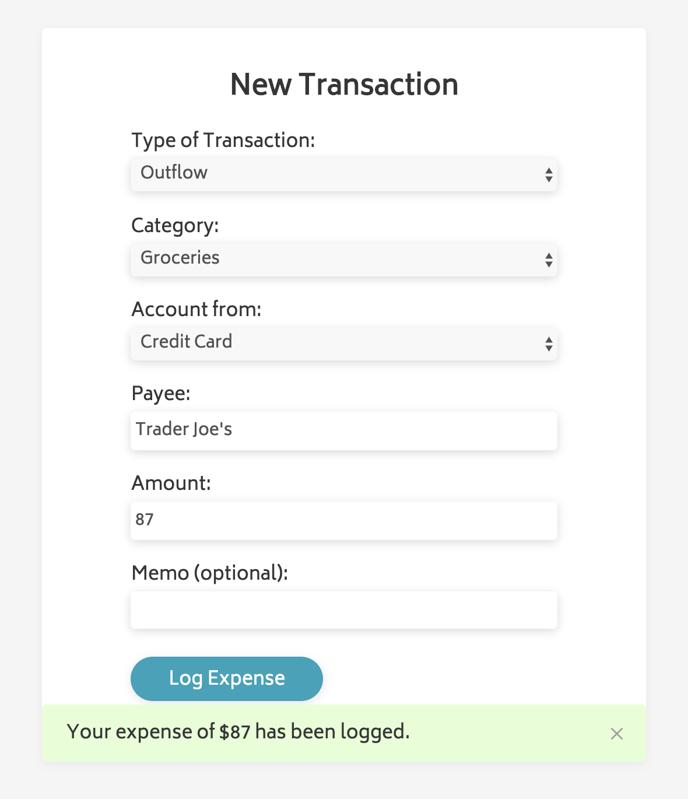
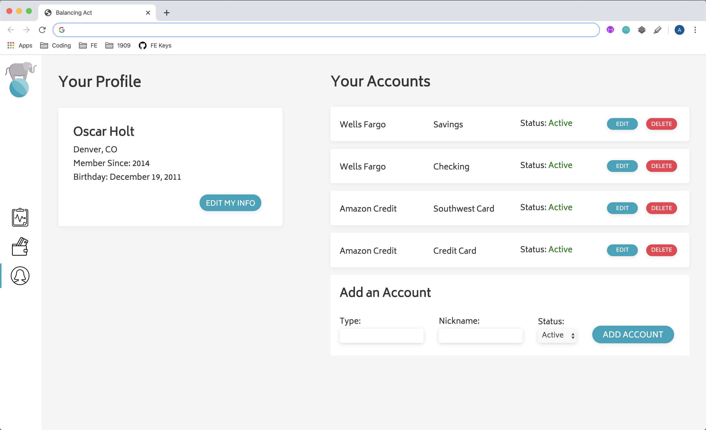

## Week 2

During Week 2, Balancing Act will provide you with some extra practice opportunities on concepts you've used a few times and also introduces some that may be brand new! If you look at the Week 2 calendar you'll see that a lesson is scheduled for each of the new concepts.

The structure of the project requirements will be formatted a bit differently from here on out. During Week 1, we reminded you to commit to GitHub and gave a little more step-by-step guidance than you'll have from here on out. That's because you're ready for it. There are also no rubrics anymore since after Week 1 this is not formally evaluated. We recommend you reference the rubrics from your paired and group projects for guidance on what to focus on. Even though this won't be formally evaluated, your instructor can and will check in, and will be happy to provide more formal feedback upon request!

(If you are working on this over Thanksgiving and have clarifying questions about what is required, etc. we will talk about this as a class during Week 2!)

<section class="call-to-action">
## New Transaction

Let's create a small piece of functionality on the New Transaction form.

First, make sure you have the necessary drop-down options:
- **Type of Transaction:** Inflow, Outflow
- **Category:** Groceries, Bills, Fun Money, Paycheck (feel free to add more/modify!)
- **Account From:** Checking, Savings, Amazon Credit, Southwest Credit (these should match the accounts listed on your dashboard)

Now, implement the following user stories:

```
As a user,
- when I complete the new transaction form and click "Log Expense",
- I see a visual confirmation (banner) that my transaction has been logged
- so that I know my information was submitted
```

```
As a user,
- when I complete the new transaction form and click "Log Expense",
- and when I click the small "x" icon on the right side of that banner
- I see the banner disappear
- so that it's out of my way
```

```
As a user,
- when I click the "Log Expense" button without completing one of the required input fields,
- a visual indicator will be provided for any/all input that is missing user information
- so that I know what I need to do in order to continue
```

```
As a user,
- when I click the "Log Expense" button without completing one of the required input fields,
- then fill out the empty input,
- the visual indicator for that give input will disappear
- so that I know I did what was necessary to meet the requirements and continue
```

"Where is this data going?" you may ask. Great question - for now, nowhere. Building these user stories out now _will_ set you up for later work that will ultimately lead to a newly entered transaction appearing on the list of all transactions.

Note that only 2 of the 6 inputs are used for the user stories here. Later in the project, we'll use them all!
</section>

### Comp

You are provided with the comp for the confirmation banner, but **you can choose** how to let the user know that they failed to complete one or more required fields.



<section class="call-to-action">
## Implementing Flexbox

Refactor the HTML and CSS of at least one part of your current project to utilize Flexbox. (Notice that this prompt is a little bit of a Choose Your Own Adventure - you can re-do just one piece of layout, or the entire thing! No pressure either way, it's just meant to give you a little more time with Flexbox.)
</section>

<section class="call-to-action">
## Profile Page

In addition to building out the third and final page, "Your Profile", let's make sure we have the following user stories implemented:

```
As a user,
- when I click on the "profile" icon (third/last on the left-side nav),
- I no longer see the previous page (Dashboard or Transactions)
```

```
As a user,
- when I click on any of the three icons in the left-side nav,
- The turquoise highlight to the left of the previously selected icon will disappear, and
- the turquoise highlight to the left of the recently selected icon will appear
```

```
As a user,
- when I click on the "Manage Accounts" button from the Dashboard view,
- I will be taken to the "Your Profile" view
```

```
As a user,
- when I click on the "Manage Accounts" button from the Dashboard view,
- the turquoise highlight to the left of the clipboard icon will disappear, and
- the turquoise highlight to the left of the profile icon will appear
```

```
As a user,
- when I click on the "New Transaction" button from the Dashboard view,
- I will be taken to the "Transactions" view
```

```
As a user,
- when I click on the "New Transaction" button from the Dashboard view,
- the turquoise highlight to the left of the clipboard icon will disappear, and
- the turquoise highlight to the left of the wallet icon will appear
```

Below is the static comp for the Profile view! Later, we will add in functionality for "Edit my Info", edit/delete an account, and "Add an Account".

</section>

### Comp



<section class="call-to-action">
## Account or Transaction Class

Touch a new file, `transaction.js` and in it, write a Transaction Class. It should have the following properties:
- `type`
- `category`
- `accountFrom`
- `payee`
- `amount`
- `memo` (optional)

Touch a new file, `account.js` and in it, write an Account Class. It should have the following properties:
- `type` (credit, savings, or checking)
- `nickname`
- `active` (boolean - all start at true.)

The Account class should also have a method called `updateAccount` that takes two arguments - `category`, and `updatedInfo`. This method will change the value of a certain property. So if ("nickname", and "Oscar's Vacation Fund") are passed in, the nickname property would be updated from whatever it previously was, to "Oscar's Vacation Fund".

These classes aren't doing anything yet - they're kind of just "extra files" sitting in the project. We will bring it full circle in the coming weeks.

Note: you do NOT need to test these classes; you'd need mocha and chai which require a lot of configuration that you don't have set up for this project.
</section>
