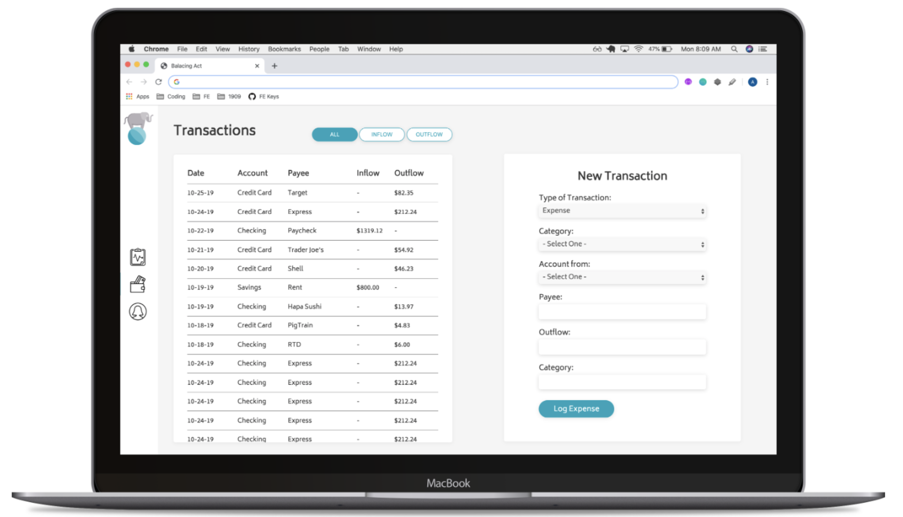
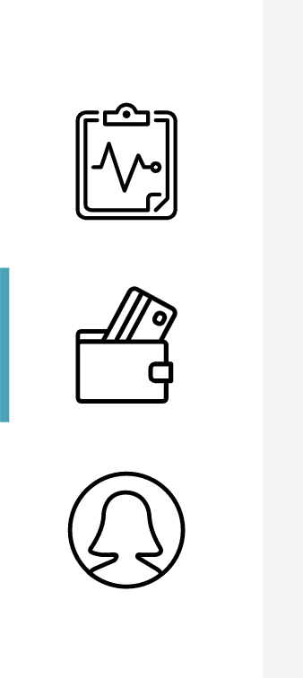
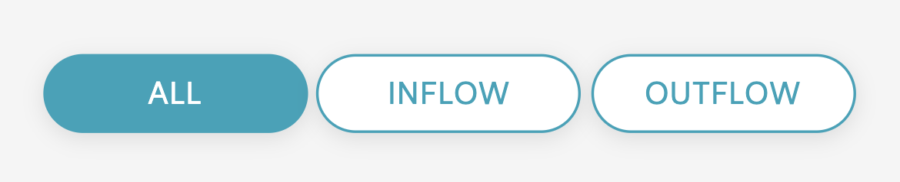
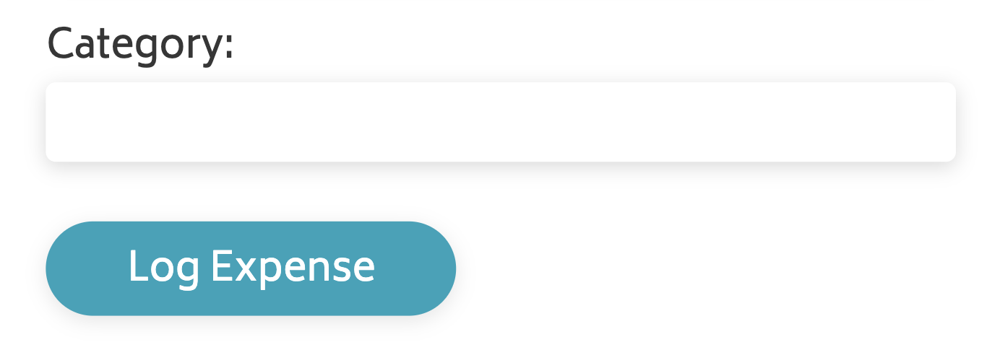

## Weekend 1-2

Steps 4-5 are to be completed over the Weekend between Weeks 1-2. Turing students, on average, work about 20 hours between Friday, Saturday, and Sunday. We estimate that (if you've completed Steps 0-3 successfully), Steps 4-5 can be completed in about 20 hours.

<section class="call-to-action">
### Step 4 - Toggle Views

```
As a user,
- When I am on the Dashboard and click the "wallet" icon (middle of the three icons on the nav bar),
- The turquoise highlight to the left of the clipboard icon will disappear, and
- an turquoise highlight to the left of the wallet icon will appear
```

```
As a user,
- When I am on the Dashboard and click the "wallet" icon,
- The content on the main part of the page is cleared out (greeting banner, accounts, recent transactions, etc.)
```

```
As a user,
- When I am on the Dashboard and click the "wallet" icon,
- Then click the "clipboard" icon,
- The turquoise highlight to the left of the wallet icon will disappear, and
- an turquoise highlight to the left of the clipboard icon will appear
```

```
As a user,
- When I am on the Dashboard and click the "wallet" icon,
- Then click the "clipboard" icon,
- The content of the original dashboard shows on the main part of the page (greeting banner, accounts, recent transactions, etc.)
```
</section>

Don't forget to commit your work after you complete each user story! Push up to GitHub and ensure it's working as expected on your GitHub Pages link.

<section class="call-to-action">
### Step 5 - Transactions Details

Now that we are able to toggle back and forth between two views, let's provide some content for our user on that second page.

```
As a user,
- When I am on the Dashboard and click the "wallet" icon,
- I should see a transactions page matching the comp below
```
</section>

### Comp



The next few images show a little more detail as to what is expected in your comp recreation:







## Rubric

This rubric should serve as a guide for students as they progress through the project, as well as to self-evaluate. Instructors will use it to evaluate the project at its final due date/time, and provide detailed feedback so students know what areas to focus on in future projects.

Scores land in a range between 1 and 4. Below is a breakdown of what those numbers represent.

* 4 - Exceptional (you are where you need to be and either had time or learned extra to go above and beyond in this area)
* 3 - Expected (you showed you are right where you need to be at this point in time)
* 2 - Below expectations (in a good place to grow and be strong in this area soon, but not where you need to be right now)
* 1 - Far below (significant growth needs to be shown in this area; maybe it's an area you forgot to look at, maybe it's something you have big gaps on and need to set up a pairing session on ASAP)

To earn a given score, an application must meet the requirements listed in that score explanation **and** all scores lower.

### Comp Recreation

* 4 - All details have been achieved for both Dashboard and Transactions views. Buttons have hover states (cursor and some other sort of visual indicator that is consistent with the comp, and not distracting).
* 3 - The general layout of the comp has been achieved for both Dashboard and Transactions views and almost all details have been achieved.
* 2 - The general layout of the comp has been achieved for both Dashboard and Transactions views. Some details have been achieved, while some may be missing. (Examples of "details" we'll look for: the text on the buttons is centered horizontally and vertically, the font size of the word "Credit Score" is significantly smaller than that of "673", extremely close to the size difference displayed in comp.) **OR** The general layout of the comp has been achieved with 1-2 layout issues. Almost all details have been achieved.
* 1 - Colors, fonts, and icons were implemented and the general layout of the comp for both Dashboard and Transactions views has been achieved with 1-2 layout issues **OR** the general layout has been achieved and almost all details have been achieved for the Dashboard only.

### HTML

* 4 - Application fully implements HTML that is accessible for folks with visual disabilities. Reference [this lesson plan](https://frontend.turing.edu/lessons/floating/aria-accessibility.html) as a resource!
* 3 - Semantic tags are used to convey meaning of content. Elements are not added in for the sole purpose of making styling easier (`<br>`s should not be used, excessive `<div>`s or other containing elements, etc.)
* 2 - Class and ID names follow a convention and describe the content in a consistent manner.
* 1 - Use of spaces, white space and indentation meet requirements of the [Turing HTML Style Guide](https://github.com/turingschool-examples/html).

### CSS

* 4 - Code does not contain repetitive rules according to the [DRY principle](https://vanseodesign.com/css/dry-principles/).
* 3 - A method is used to order declarations within a rule (get some inspiration [here](https://9elements.com/css-rule-order/) and [here](https://webdesign.tutsplus.com/articles/outside-in-ordering-css-properties-by-importance--cms-21685))
* 2 - A method is used to order the rules within the stylesheet. Comments are used to help a reader more quickly navigate the sheet.
* 1 - Whitespace, indentation and comments meet requirements of the [Turing CSS Style Guide](https://github.com/turingschool-examples/css).

### Functionality

* 4 - If the user has closed the welcome banner, visits the Transactions view, then goes back to Dashboard, the banner does not re-appear.
* 3 - The user can toggle between the Dashboard and Transactions views, and the visual indicator to the left of the associated icon is updated accordingly.
* 2 - The user can toggle between the Dashboard and Transactions views **OR** the visual indicator to the left of the associated icon is updated accordingly, but the Transaction view does not display when it's icon is clicked.
* 1 - The welcome banner disappears when clicked when the "x" icon is clicked.
