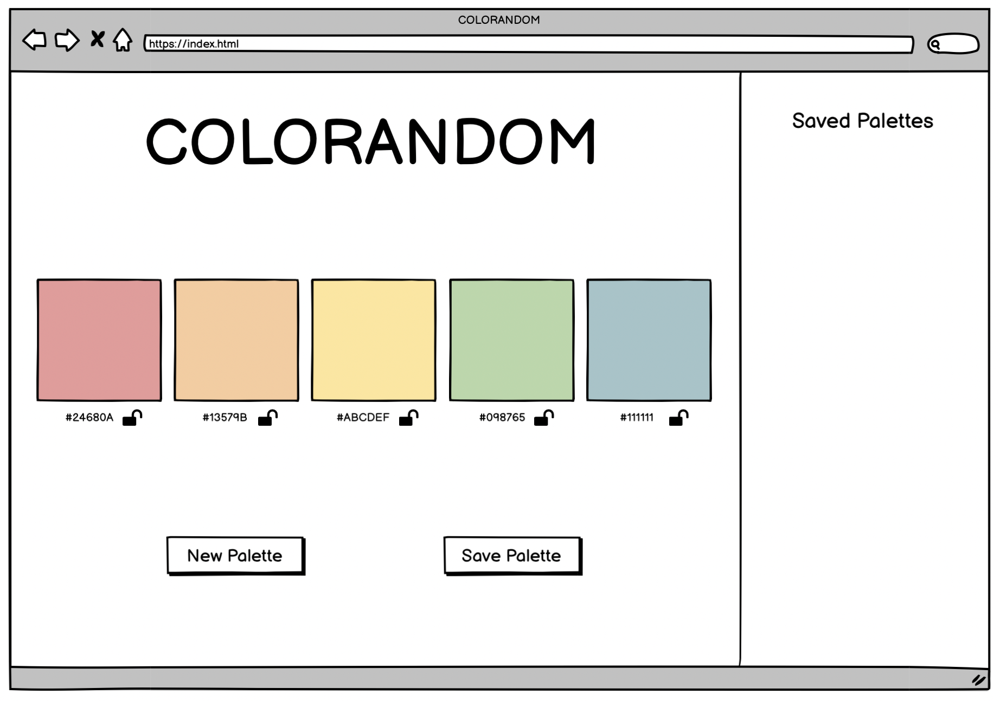
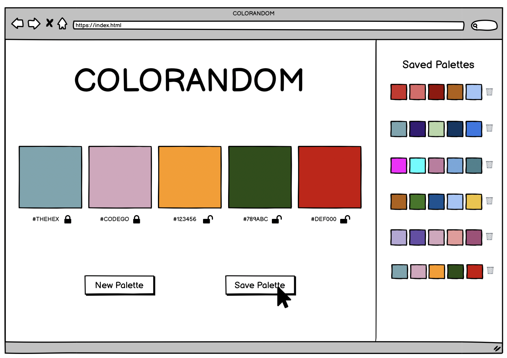
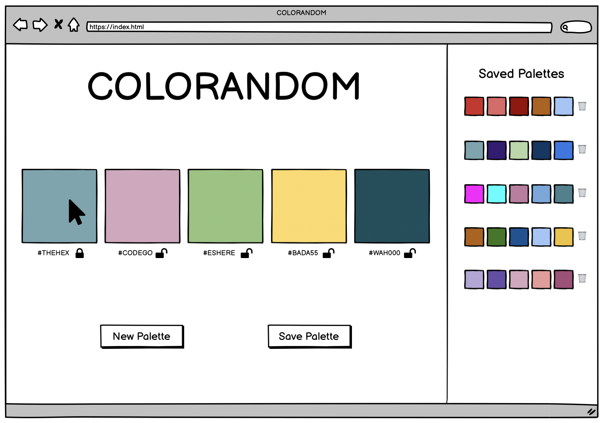
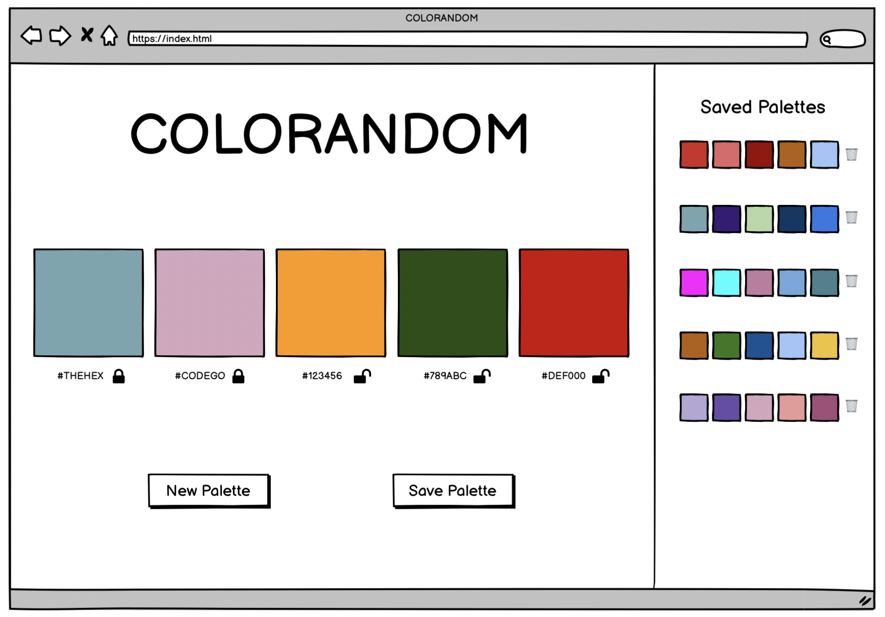
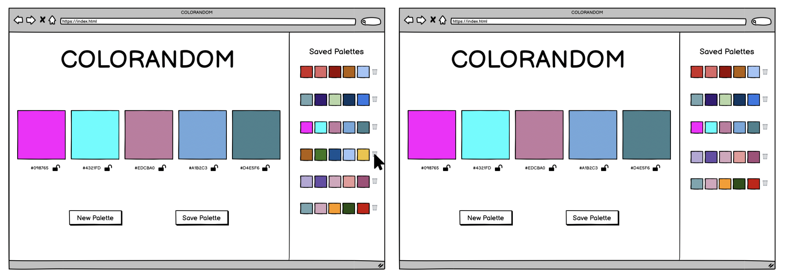
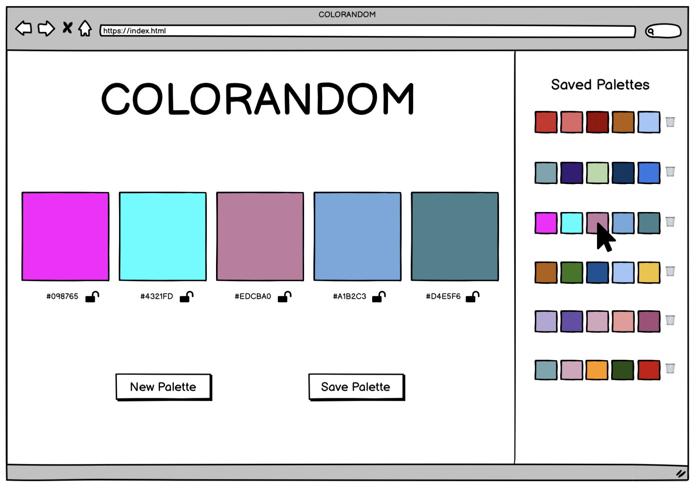

## Learning Goals

* Write semantic HTML and efficient CSS to form a usable UI
* Write clean, DRY JavaScript and leverage classes, creating and using an effective data model
* Manipulate the page after it has loaded adding, removing, and updating elements on the DOM
* Refine your collaboration skills

## Overview

We will be building a site that generates color palettes for us. Similar to other sites like [coolors](https://coolors.co/app), we will present users with various random colors which they can choose to "save" (note: saved palettes will not persist across page refreshes). Users can "lock" a color, which will keep that color when a new palette is generated.

This project will give you and your team an opportunity to write HTML and CSS, and leverage JavaScript to both create your data model and interact with the DOM.

Additionally, as your first group project, this will give you a chance to continue to hone your team skills: communication, planning, proper git and GitHub workflow.

## Set Up

To begin, choose ONE TEAM MEMBER to do the following:

1. Create a Slack DM with you, all project teammates, and your assigned project manager.
2. Locally, create a new folder containing an empty `index.html` file, a blank `scripts.js` file, and an empty `styles.css` file.
3. Run `git init` in your terminal (make sure your working directory is your project folder).
4. Create an initial commit.
5. On GitHub, create a new repository. Follow the written instructions on GitHub to add the repo's remote to your local project, and push your initial commit up to GitHub.
6. Add all project partners to the repository as contributors.
7. If your repository is set to private, add your project manager as a collaborator as well.

Then, as a team:

* Have all team members clone down the repo.

## Day 1 Deliverables

**By EOD on Kick Off Day:** complete the following tasks:

* As a team, read the entire project spec and rubric
* As a team, complete [the DTR Form](https://docs.google.com/forms/d/e/1FAIpQLSche5cvtlYQ_SaBDqqoF3H9gFiy2p60AOPoUMbhgIHlg-vRlQ/viewform?usp=sf_link)
* Complete [this project submission form](https://docs.google.com/forms/d/1kW1JPMpZUhAjzIDnW_wDrGB8PtRDTIFh9ohpkd5h0xk/edit) to ensure your project manager has the following links:
  - your team's GitHub repo
  - the GitHub Pages deployed site
    - Instructions for deploying: Repo Settings >> Pages >> Select the `main` branch as your Source branch >> Save >> Send us the URL they give you in the pop up that says "Your site is ready to be published at [URL]"

## Progression

### Iteration 0 - HTML & CSS 

- When the page loads, we should see:
  -  a title
  -  5 colors labeled with their hex codes, with an unlocked lock emoji next to each hex code
      -  Hardcode these for now
  -  2 buttons (one to get a new random palette, one to save the displayed palette)
  -  a section for displaying saved palettes (later iteration)

The CSS in this iteration should mostly focus on LAYOUT (positioning), rather than STYLE (fonts and colors).

**Note: The image above is only a wireframe. You are not expected to match it perfectly!** It simply provides you an idea of the basic layout and elements we expect to see.

### Iteration 1 - OOP

- Write two classes: Color and Palette
- Color:
    - A color should have a random hex code
      - hint: hex codes are 6 characters long, and each character is some value of 0-9 or A-F (ABCDEF0123456789)
      - Though there are many examples of this logic coded out, this type of crunchy problem solving is well within your skill set! 
      - Don't look up how to accomplish this; challenge yourselves to use pseudocode to problem-solve through it!
    - It should have a property of `locked`, whose value is a boolean. Colors begin unlocked.
- Palette:
    - Note: on page load, a new instance of Palette will be declared. This Palette will be used until a user decides to save that Palette. Then, a new instance will be created and used until _that_ palette is saved. Continue ad infinitum.
    - It should have 5 Colors
    - It should have a unique ID
    - It should be able to replace the Colors with new Colors
    - It should be able to lock Colors
    - It should only replace unlocked Colors

### Iteration 2 - Show Random Color Palette

- Refactor: when the user first visits the page, they see a randomly generated color palette.
- Every time the user clicks the New Palette button, a new set of colors is created
    - Note: do not create a new instance of Palette here
- Every time the user clicks the New Palette button, the new set of colors is displayed

Hint: when storing information in HTML to be gathered later, instead of reaching for a `class` or `id`, consider using a [`data attribute`](https://developer.mozilla.org/en-US/docs/Learn/HTML/Howto/Use_data_attributes)!

### Iteration 3 - Saving Palettes

- When the user clicks Save Palette, the saved palette should show up in the saved palette side of the UI
    - The palette here does not display hex codes, just blocks of the palette's color
    - Each saved palette should be rendered with a button to delete the palette (you won't build out this functionality until a later iteration)
- A new Palette should automatically be created and displayed in the main part of the app

- _Note: Saved palettes do NOT need to persist on page load_

### Iteration 4 - Locking colors

- A user should be able to click a color in the Palette and lock it
    - The open lock icon/emoji should change to be a locked icon/emoji to indicate that the color is locked

- When the New Palette button is clicked, all the colors update as expected, except for any colors that are locked
- A user should be able to unlock colors and continue updating the colors with the New Palette button as expected

### Iteration 5 - Deleting saved Palettes

- When a saved palette's delete button is clicked, that palette is removed from the page.

### Optional Extensions - Getting fancy

Here's a list of possible extensions to implement - but **ONLY IF** your team has completed all the previous iterations **AND** have cleaned up your code to make it DRYer and more readable.

You are welcome to add your own extensions. Be sure they are thoughtful in terms of UX/UI, and that they do not break any prior functionality.

Options:
- A user should be able to click a saved palette and view it and its hex codes in the main viewing area
  - 
- Polish your app's styling - get creative.
- Ensure that all saved palettes are unique.
- When a user tries to delete a saved palette, have them confirm that they really do want to delete it.
- Make the UX informative and delightful with one or more microinteractions.
- Allow users to name their palettes when saving.
- Allow users to name their palettes wen saving, and allow them to search their saved palettes by name.
- Create a way for users to adjust a color (look to [Coolors](https://coolors.co/app) for inspiration).
- Research hex codes to figure out how to programmatically generate random palettes that are cohesive and pleasant.

# Notes on Project Feedback

The rubric below serves as a guide for both **students** and **instructors**. 

**Students:**
- It should be used as a reference throughout the project to keep on track and guide learning.
- It should also be used by students to self-assess their work.

**Instructors:**
- It should be used to evaluate the project at its final due date/time.
- It should be a guide to provide relevant feedback to students so they can grow and improve in the areas that need deeper understanding.

### Projects as Learning Tools

When projects are graded, we want you to view the evaluation + feedback as a means to inform your learning, rather than as static "grades". Feedback from instructors will focus on areas where you have an opportunity to deepen your understanding. 

The evaluation will provide feedback by answering the only important question:

**Does the project demonstrate student understanding of the learning goals & concepts?**

Projects will answer that question, being marked as **yes**, **not yet**, and **wow**. Similarly, each section of the rubric (see below) will have yes/not yet/wow markings, helping you understand your progress and growth in specific areas.

The overall project outcome (yes, not yet, wow) is determined by "averaging" each section's outcome. You can think of a "yes" being worth a  1, a "not yet" being worth a 0, and a "wow" being worth a 2. 

An average that is above 0.5 is considered a yes - a passing project that demonstrates good student understanding! An average of 1+ is considered a wow. An average of 0.5 or below is considered a not yet - a project that indicates that the concepts have not been fully understood (see note in the section below).

<section class="answer">
### A important note about the possible outcomes

**Yes** indicates that the student/team is ON TRACK in this area! YES you showed us you understand the concept! 
- The student/team demonstrates a good understanding of the concept

**Not Yet** indicates that the student/team is BEHIND in this area - you showed us that you don't yet understand the concept
- The student/team demonstrates misconceptions or confusion around the topic
- Student/team should prioritize this concept in their studying and practice
- ✨ An overall "not yet" on one project does **not** mean the module is doomed! We want to see GROWTH. A student/team can struggle with a project and still (taking into account the rest of their work and assessments) demonstrate readiness for the next module! ✨

**Wow** indicates that the student/team did extra work to teach themselves a new concept, or to achieve a deep & nuanced understanding of a concept
- This is not an outcome to prioritize achieving
- "Wow" should not come at the expense of another concept
- "Wow" often does not look like extra features, but instead looks like thoughtful refactoring and polish 💅
</section>

## Rubric

This project has 4 evaluated concepts:

- Professionalism
- Comp Recreation
- HTML & CSS
- JavaScript

And evaluation of these concepts is assisted through the final graded section:
- Functionality (we can't properly assess the 4 main concepts if there is not enough work to grade)

<section class="note">
### Note about the below criteria

Competency & understanding of these concepts can be demonstrated in many ways. **The following examples are not checklists to complete!** They are illustrations to guide your team as you develop this project and continue your learning.
</section>

---

<section class="answer">
### Professionalism

- The team's norming document is taken seriously, with thoughtful reflections from all team members regarding their skills, learning goals, work styles, etc. 
- The work is distributed equitably; commit/code contributions are roughly even for each team member in the final product and throughout the process
- Branches are consistently used for individual features and commit messages are descriptive and concise
- Commits are atomic, documenting a single changeset (such as a new function being created, or a function being updated) and clearly demonstrates how the project evolved over time.
- PRs have clear, thorough descriptions and are consistently reviewed by other team members before work has been merged.
- README is formatted and gives new contributors and employers sufficient context about the project including setup instructions, deploy link (gh-pages), images or video of the functioning app, technologies used, reflections, future features, and other pertinent information.

✨WOW✨ can look like:
- The team holds regular standups and retros while also revisiting the norming document as better perspective is gained
- A [PR template](https://docs.github.com/en/free-pro-team@latest/github/building-a-strong-community/creating-a-pull-request-template-for-your-repository) is effectively used
</section>

<section class="answer">
### Comp Recreation

- Application implements all major comp details accurately and correctly on desktop (layout, spacing, alignment, etc)
- Careful attention was given to the little details like sizing and hover states.

✨WOW✨ can look like:
- Additional elements and animations have been added that match the visuals established in the comps.
- The design is responsive across multiple screen sizes including tablets and mobile devices.
</section>

<section class="answer">
### HTML & CSS

- Crafts CSS according to the [Turing CSS style guide](https://github.com/turingschool-examples/css)
- Crafts markup according to the [Turing HTML style guide](https://github.com/turingschool-examples/html)
- Application utilizes consistant naming for HTML classes and IDs, and follows suggested conventions.
- Application uses an appropriate amount of [HTML semantic elements](https://developer.mozilla.org/en-US/docs/Learn/HTML/Introduction_to_HTML/Document_and_website_structure). If `
` elements are used, they are only for styling purposes.
- Application utilizes organizational conventions for the whole CSS stylesheet. This may look like - grouping native elements, typography styles, layout styles, etc. together.
- Application utilizes data attributes to store information in the HTML

✨WOW✨ can look like:
- Developers use [BEM](http://getbem.com/), [SMACCS](http://smacss.com/), or another set of naming conventions for classes. _Note: If going this route, document it in your README and let your project manager know which naming convention will be used._
- Application fully implements HTML that is accessible for individuals with visual disabilities. _Note: This will be checked using the Chrome Extenstion [WAVE](https://chrome.google.com/webstore/detail/wave-evaluation-tool/jbbplnpkjmmeebjpijfedlgcdilocofh?hl=en-US) audit tool, and 0 errors & 0 contrast errors are expected._
</section>

<section class="note">
### Note about using the WAVE tool

To get this extension to work with local files, follow these steps:
- Install
- Right click the WAVE extension
- Click "Manage Extensions"
- Flip the "Allow access to file URLs" switch
- Success!
</section>

<section class="answer">
### Javascript

- Application uses the Data Model exclusively to track changes to the ideas.
- No nested if/else statements or for loops.
- Functions are DRY and adhere to the Single Responsibility Prinicple (SRP)
- Event delegation is used correctly on dynamic elements for deleting and starring an idea.
- Data model is fully separated from the DOM.  There is no DOM manipulation in the class files.
- Global variables are thoughtfully created, with a clear understanding demonstrated as to what needs to be global and what can be local
- Crafts JS according to the [Turing JS Style Guide](https://github.com/turingschool-examples/javascript/tree/master/es5)

✨WOW✨ can look like:
- Changes to the DOM only happen after the Data Model has been updated.  The Data Model is then used to update the DOM.
- Functions make use of arguments and parameters to be dynamic and reusable where possible without overengineering
- Bracket notation is utilized effectively to make accessing properties of class instances more dynamic.
</section>

### Functional Expectations
Functionality is the least important piece of the rubric. It’s included because it is another benchmark to gauge proficiency (for example, we can’t grade your JS if there isn’t enough of it written!). However, you should not pursue functionality at the expense of code quality or the learning/growth of all team members.

This means, we DO NOT want to see:

* Code that completes iterations but is sloppy
* One or both team members do not understand every single line of code
* One or both team members skips the problem solving process (pseudocoding, talking out the problem, articulating, planning) in the pursuit of completing functionality

Well-refactored, thoughtful code is better than sloppy extra features.

<section class="answer">
### Functionality competency examples

- The application completes all of the expectations of Iteration 5 without bugs.

✨WOW✨ can look like:

- Iteration 5 and at least one extension are successfully implemented without bugs.  Additional UI elements are well thoughtout.
</section>

---

## Feedback

A few days after the due date, your team will receive feedback about the project's average outcome (yes/not yet/wow), as well as each section's outcome. You will also receive a few pieces of team-specific feedback for each section (things done well, things to improve on for the current/next project).
