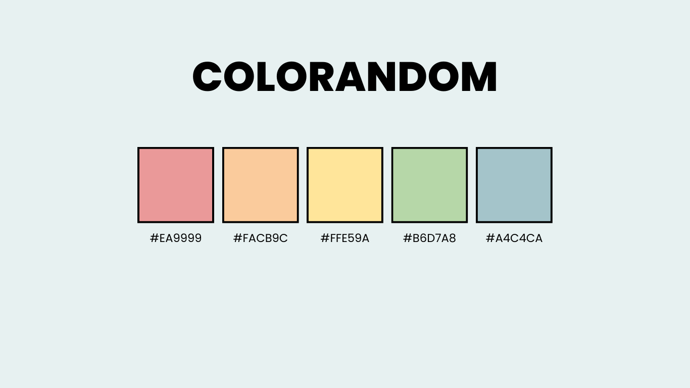
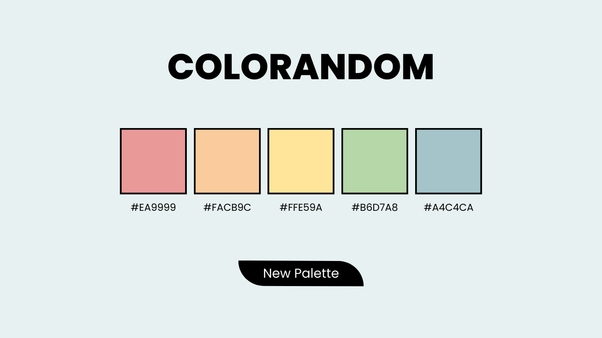
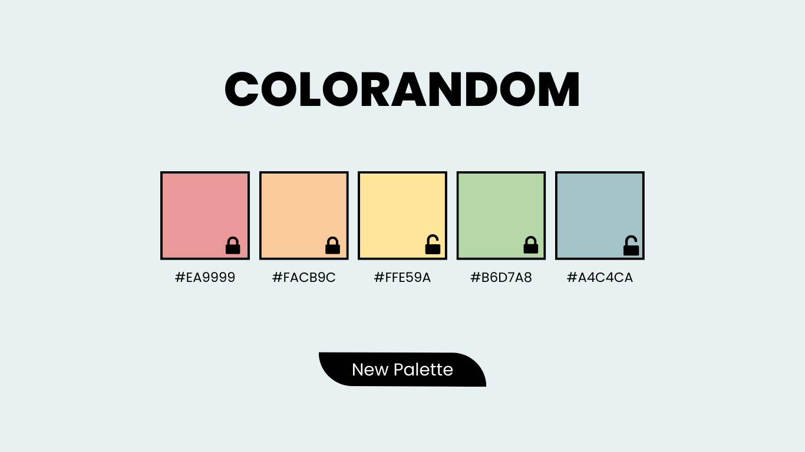
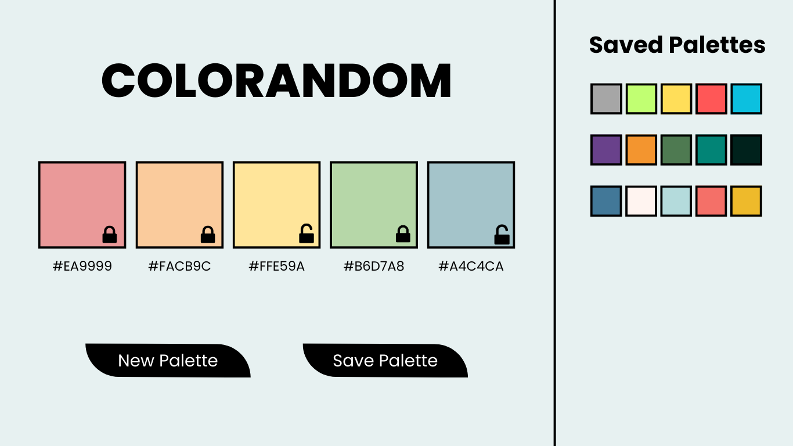
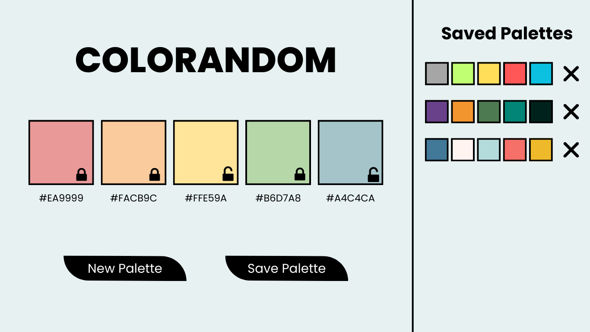

## Learning Goals

* Write semantic HTML and efficient CSS to form a usable UI
* Write clean, DRY JavaScript and leverage functions, creating and using an effective data model
* Manipulate the page after it has loaded adding, removing, and updating elements on the DOM
* Refine your collaboration skills

## Overview

We will be building a site that generates color palettes for us. Similar to other sites like [coolors](https://coolors.co/app), we will present users with various random colors which they can choose to "save" (note: saved palettes will not persist across page refreshes). Users can "lock" a color, which will keep that color when a new palette is generated.

This project will give you and your team an opportunity to write HTML and CSS, and leverage JavaScript to both create your data model and interact with the DOM.

Additionally, as your first group project, this will give you a chance to continue to hone your team skills: communication, planning, proper git and GitHub workflow.

You will work through the iterations listed under **Progression** below.

## Notes Before You Begin

<section class="answer">
### Design Resources

For each iteration, you should be matching the provided design comps closely. ([What is a design comp?](https://clients.geminoscreative.com/marketing-blog/what-is-a-design-comp)) Act like you're on the job and these are the designs you've been given to match. Details and spacing matter! Here is some info to help you:
  - Background color: `#E7F1F1`
  - Font: [Poppins](https://fonts.google.com/specimen/Poppins?query=poppins)
  - Icons: [Found here](https://drive.google.com/drive/folders/1ZX31xVFdRAsLPzsL8G2_ujNQNXgFmKxD?usp=sharing) (Note: Add these icons to an `assets` folder in your repository.)
</section>

<section class="answer">
### Refactoring as You Go

Between each iteration, take some time to look at the code you've written and make any changes that might improve the readability of your code. Refactoring as you go can help ensure that everyone understands the code you've written so far AND make it easier to build on top of that code.

Here are some ideas of what to look for:
- Did we use [semantic HTML elements](https://developer.mozilla.org/en-US/docs/Web/HTML/Element) rather than `divs` and `sections` everywhere?
- Is our indentation and spacing consistent across all files?
- Are our variable names descriptive of the values they hold? Do they follow common convention (i.e. arrays are plural, etc)?
- Are our function names descriptive of what the function does? Are they named with present tense verbs?
- Are any of our functions too big or doing too many things? Should we break any of them up?
- Is any of our JS code too repetitive? Could we make any reusable functions with parameters and arguments?

Remember - shorter code isn't always better! 
</section>

## Progression

<section class="answer">
### Set Up + Day 1 Deliverables

**By EOD on Kick Off Day:** complete the following tasks:

* As a team, complete [the DTR Form](https://docs.google.com/forms/d/e/1FAIpQLSche5cvtlYQ_SaBDqqoF3H9gFiy2p60AOPoUMbhgIHlg-vRlQ/viewform?usp=sf_link)

Choose ONE TEAM MEMBER to do the following:
1. Locally, create a new folder called `coloRandom` and add the following files to that folder: `index.html`, `main.js`, and `styles.css`. Create an `assets` folder where your icons will live (You can add them to this folder as you need them.)
2. `cd` into the `coloRandom` directory and run `git init` to initialize git.
3. Create an initial commit.
4. On GitHub, create a new repository. Follow the written instructions on GitHub to add the repo's remote to your local project, and push your initial commit up to GitHub.
5. Add all project partners to the repository as contributors. If your repository is set to private, add your project manager as a collaborator as well.  
6. Complete [this project submission form](https://docs.google.com/forms/d/1kW1JPMpZUhAjzIDnW_wDrGB8PtRDTIFh9ohpkd5h0xk/edit) to ensure your project manager has the necessary links. Below are instuctions for deploying to GH Pages:
    - Repo Settings » Pages » Select the main branch as your Source branch » Save. Then, wait up to an hour, hit refresh, and your deployed link should appear at the top of the screen.
    - If you don't want to wait, your GH pages URL will follow this format: `https://username.github.io/coloRandom/` and replace `username` with the repo owner's GH username and `coloRandom` with your repo's name (if different). The URL will not work right away - that's ok! 

Then, as a team:
* Have all team members clone down the repo.  

You're ready to start iteration 0!
</section>

<section class="answer">
### Iteration 0 - Basic Layout

- When the page loads, we should see:
  -  a title
  -  5 colors labeled with their hex codes, hardcoded to match the colors in the screenshot above for now
</section>

<section class="answer">
### Iteration 1 - Generating Random Palettes

- Add a button that matches the design above  
- When the page initially loads, is refreshed, or the button is clicked:  
  - 5 random and new colors should appear
  - the color's hex codes should appear below each color box
  - the current palette should be tracked somewhere in your Data Model and updated when a new palette is generated

<section class="answer">
### Hint About the Button Shape 

Play around with the `border-radius` CSS property!
</section>

<section class="answer">
### Hint About Hex Codes 

Hex codes are 6 characters long, and each character is some value of 0-9 or A-F (ABCDEF0123456789). Don't look up how to generate a random hex code - challenge yourselves to use pseudocode to problem-solve through it. This is where the learning happens!
</section>
</section>

<section class="answer">
### Iteration 2 - Locking + Unlocking Colors

- When the page is initially loaded, all colors should have an unlocked icon in the bottom right corner
- When a user clicks on the unlocked icon, a locked icon should appear; The locked/unlocked icons should toggle back and forth as the user clicks them
- When the `New Palette` button is clicked, only the unlocked colors should change; Locked colors should remain
- When the palette is updated, your Data Model should be updated too
</section>

<section class="answer">
### Iteration 3 - Saving Palettes

- Add a `Save Palette` button to match the design above
- Add a `Saved Palettes` section to match the design above
- The saved palettes section should be viewable on the page at all times
- When the page loads, there should be no saved palettes
- Whenever there are no saved palettes, the user should see a message in the saved palettes section saying "No saved palettes yet!"
- When the user clicks `Save Palette`:
  - the palette should be saved somewhere in your Data Model
  - the palette should show up in the saved palette section to match the design above
  - A new Palette should automatically be created and displayed in the main part of the app
- Saved palettes do NOT need to persist on page load
</section>

<section class="answer">
### Iteration 4 - Deleting Saved Palettes

- Add a delete button next to each saved palette to match the design above
- When a saved palette's delete button is clicked:
  - the palette is removed from your Data Model
  - the palette is removed from the page
</section>

<section class="answer">
### Iteration 5 - Editing Saved Palettes (Extension)

- When a user clicks on a saved palette, it should appear on the main part of the page
- From there, a user can change the palette by locking/unlocking colors and clicking `New Palette`
- If a user saves the updated palette, it should appear as a NEW saved palette. The previous saved palette (the one you were initially editing) should remain untouched in the saved palettes section.
</section>

<section class="answer">
### Other Optional Extensions

Here's a list of possible extensions to implement - but **ONLY IF** your team has completed all the previous iterations **AND** have cleaned up your code to make it DRYer and more readable.

You are welcome to add your own extensions. Be sure they are thoughtful in terms of UX/UI, and that they do not break any prior functionality.

Options:
- Ensure that all saved palettes are unique.
- When a user tries to delete a saved palette, have them confirm that they really do want to delete it.
- Implement [localStorage](https://frontend.turing.edu/lessons/module-1/json-and-localstorage.html) so the saved palettes persist on page load.
- Allow users to name their palettes when saving.
- Allow users to name their palettes when saving, and allow them to search their saved palettes by name.
- Create a way for users to adjust a color (look to [Coolors](https://coolors.co/app) for inspiration).
- Research hex codes to figure out how to programmatically generate random palettes that are cohesive and pleasant.
</section>

---

## Rubric

This project has 4 evaluated concepts:

- Professionalism
- Comp Recreation
- HTML & CSS
- JavaScript
- Functionality

<section class="note">
### Note about the below criteria

Competency & understanding of these concepts can be demonstrated in many ways. **The following examples are not checklists to complete!** They are illustrations to guide your team as you develop this project and continue your learning.
</section>

<section class="answer">
### Professionalism

💫ON TRACK💫 can look like:
- The team's norming document is taken seriously, with thoughtful reflections from all team members regarding their skills, learning goals, work styles, etc. 
- The work is distributed equitably; commit/code contributions are roughly even for each team member in the final product and throughout the process
- Branches are consistently used for individual features and commit messages are descriptive and concise
- Commits are atomic, documenting a single changeset (such as a new function being created, or a function being updated) and clearly demonstrates how the project evolved over time.
- PRs have clear, thorough descriptions and are consistently reviewed by other team members before work has been merged.
- README is formatted and gives new contributors and employers sufficient context about the project including setup instructions, deploy link (gh-pages), images or video of the functioning app, technologies used, reflections, future features, and other pertinent information.

✨WOW✨ can look like:
- The team holds regular standups and retros while also revisiting the norming document as better perspective is gained
- A [PR template](https://docs.github.com/en/free-pro-team@latest/github/building-a-strong-community/creating-a-pull-request-template-for-your-repository) is effectively used
</section>

<section class="answer">
### Comp Recreation

💫ON TRACK💫 can look like:
- Application implements all major comp details accurately and correctly on desktop (layout, spacing, alignment, etc)
- Careful attention was given to the little details like hover states.

✨WOW✨ can look like:
- Additional elements and animations have been added that match the visuals established in the comps.
- The design is responsive across multiple screen sizes including tablets and mobile devices.
</section>

<section class="answer">
### HTML & CSS

💫ON TRACK💫 can look like:
- Crafts CSS according to the [Turing CSS style guide](https://github.com/turingschool-examples/css)
- Crafts markup according to the [Turing HTML style guide](https://github.com/turingschool-examples/html)
- Application utilizes consistant naming for HTML classes and IDs, and follows suggested conventions.
- Application uses an appropriate amount of [HTML semantic elements](https://developer.mozilla.org/en-US/docs/Learn/HTML/Introduction_to_HTML/Document_and_website_structure). If `
` elements are used, they are only for styling purposes.
- Application utilizes organizational conventions for the whole CSS stylesheet. This may look like - grouping native elements, typography styles, layout styles, etc. together.
- Application utilizes data attributes to store information in the HTML

✨WOW✨ can look like:
- Developers use [BEM](http://getbem.com/), [SMACCS](http://smacss.com/), or another set of naming conventions for classes. _Note: If going this route, document it in your README and let your project manager know which naming convention will be used._
- Application fully implements HTML that is accessible for individuals with visual disabilities. _Note: This will be checked using the Chrome Extenstion [WAVE](https://chrome.google.com/webstore/detail/wave-evaluation-tool/jbbplnpkjmmeebjpijfedlgcdilocofh?hl=en-US) audit tool, and 0 errors & 0 contrast errors are expected._
<section class="answer">
### Note about using the WAVE tool

To get this extension to work with local files, follow these steps:
- Install
- Right click the WAVE extension
- Click "Manage Extensions"
- Flip the "Allow access to file URLs" switch
- Success!
</section>
</section>

<section class="answer">
### Javascript

💫ON TRACK💫 can look like:
- Changes to the DOM only happen after the Data Model has been updated.  The Data Model is then used to update the DOM.
- No nested if/else statements or for loops.
- Functions are DRY and adhere to the Single Responsibility Prinicple (SRP).
- Event delegation is used correctly on dynamic elements like saved palettes.
- Global variables are thoughtfully created, with a clear understanding demonstrated as to what needs to be global and what can be local.
- Crafts JS according to the [Turing JS Style Guide](https://github.com/turingschool-examples/javascript/tree/master/es5)

✨WOW✨ can look like:
- Functions make use of arguments and parameters to be dynamic and reusable where possible without overengineering
- Bracket notation is utilized effectively to make accessing properties of class instances more dynamic.
- Demonstrates efforts towards making functions pure when possible. *Note: Purity is not possible for every function in a FE application. Strive for it only when it makes sense.*
</section>

<section class="answer">
### Functionality

Functionality is the least important piece of the rubric. It’s included because it is another benchmark to gauge proficiency (for example, we can’t grade your JS if there isn’t enough of it written!). However, you should not pursue functionality at the expense of code quality or the learning/growth of all team members.

This means, we DO NOT want to see:

* Code that completes iterations but is sloppy
* One or both team members do not understand every single line of code
* One or both team members skips the problem solving process (pseudocoding, talking out the problem, articulating, planning) in the pursuit of completing functionality

Well-refactored, thoughtful code is better than sloppy extra features.

💫ON TRACK💫 can look like:
- All of the expectations of Iteration 4 are complete without bugs

✨WOW✨ can look like:
- Iteration 5 or another extension is successfully implemented without bugs
</section>

---

## Feedback

A few days after the due date, your team will receive feedback about the project's average outcome (yes/not yet/wow), as well as each section's outcome. You will also receive a few pieces of team-specific feedback for each section (things done well, things to improve on for the current/next project).
