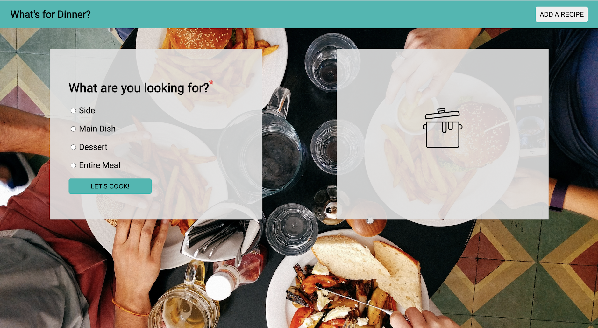
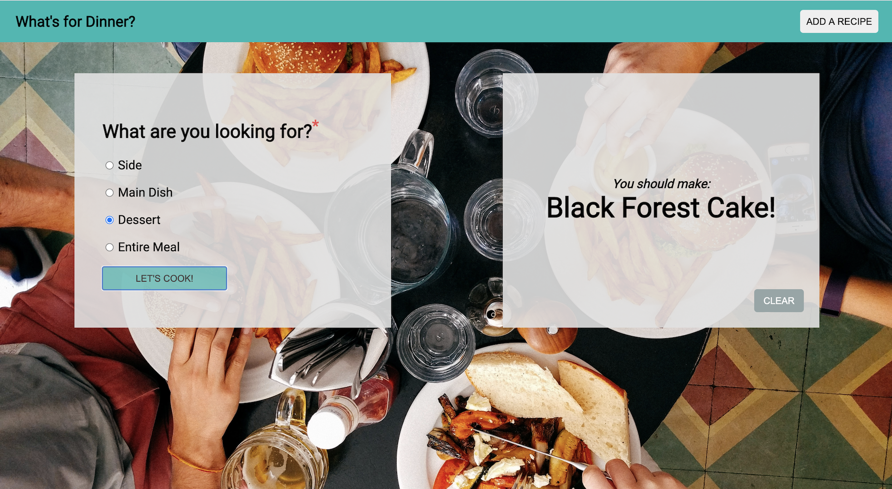
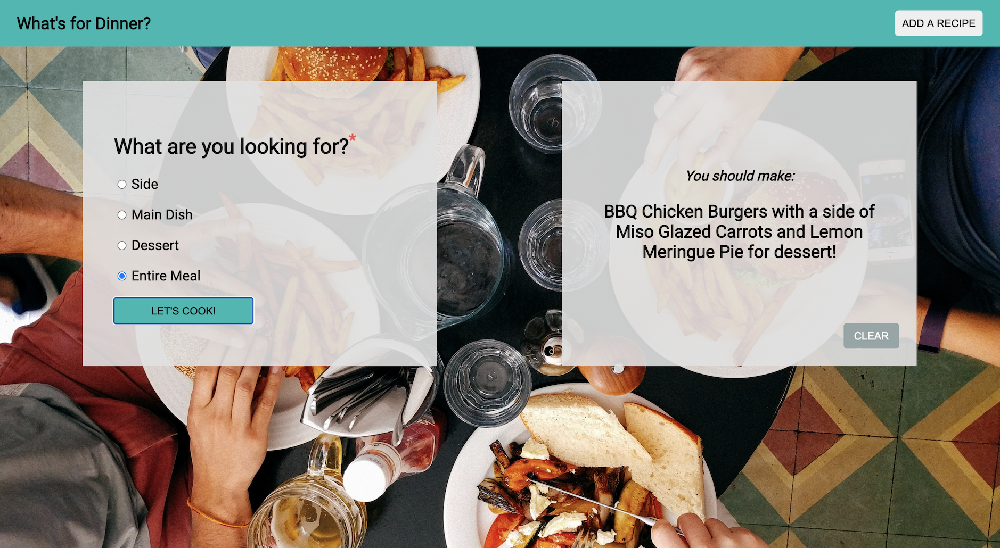
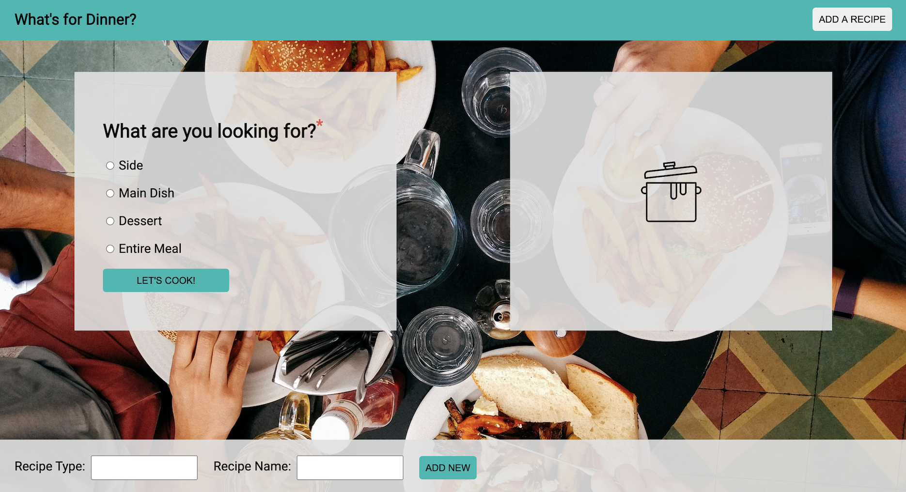

## Overview

What's for dinner? The ultimate question. You will be building an app that helps users choose a dish and put together meals.

This Solo Challenge gives students and instructors the opportunity to get a pulse on where you are with the foundational concepts of Module 1 curriculum. Students should use this as an opportunity to challenge themselves and work completely independently. Google can (and probably should!) be used, but any other code base should not be referenced. Instructors will be able to use your work, both completion of functionality and code quality, to determine where you stand and if you are behind for this point in the module, provide supports to intervene.

_NOTE: You do not need to use Classes for this project._

## Learning Goals

- Gain experience building an application that utilizes HTML, CSS and JavaScript
- Write HTML and CSS to match a provided comp
- Understand how to listen to and respond to user events
- Individualize your programming skill set

## Expectations
- In order to get a good read on your progress during this inning, we'd like to see you complete the MVP (iteration 1) and at least one CYOA feature. If you'd like to complete more CYOA features after that, please do!
- As for feedback: You will receive minimal feedback on this challenge.  Of course, if you have specific questions, please reach out!

## Setup

- Fork [this project](https://github.com/turingschool-examples/whats-for-dinner) to your own Github account
- Clone the repository to your local machine
- `cd` into the project
- Read this README thoroughly, then begin working!

## Workflow
Make sure you're utilizing git best practices (branches) and commiting frequently.

### Day One Deliverables
**By EOD on Kick Off Day:**   
- Read the spec sheet closely.
- Fill out [this form](https://docs.google.com/forms/d/1pW1rNr63XgPjIy_uCOIeu5dpBQPud1tYfW5qAWTLXz8/edit).

### Iteration 0: Build Out Comp
- Images are below
- An assets directory is provided in the repo, and colors are provided in the CSS file.
- Don't worry about the "Add a Recipe" button and "Entire Meal" radio button for now.

### Iteration 1: Minimum Viable Product (MVP) - Add Random Side, Main and Dessert Functionality

- When a user selects a dish option (don't worry about "Entire Meal") and then clicks the "Let's Cook!" button, the user sees a random dish from the list of possible dishes for that category
- When the dish name appears, the cookpot icon disappears

### Choose your own Adventure

In the interest of giving you opportunities to individualize the skills you build, this project's main goal is to provide various different paths you can take. Along these different paths you will encounter different problems and solve them in different ways. As you make choices about which features to add, you should consider which features align with your strengths, which features would challenge you to grow, and which features you'd find to be useful in this application. Choose one or more of the following features to add. Some of them build on others, so be sure to read them all before choosing.

When you choose a feature, you **must** complete all bullet points!

_NOTE: You should absolutely not be working on this unless your UI is solid and you are 100% sure that your MVP is fully functional and bug free._

#### Entire Meal Functionality

- When the user selects the "Entire Meal" option and then clicks the "Let's Cook!" button, the user sees a message with a side, main and dessert option from the lists of possible dishes for all categories
- When the meal items appear, the cookpot icon disappears

#### Error Handling and Clear Button
- The user can click a clear button, which clears the page of any message. User should only be able to click the clear button if a food is visible. When the clear button is clicked and the food is removed, the image of the cookpot should re-appear.
- User should not be able to click the "Let's Cook" button for a recipe unless they have selected an option.

_Note: You can disable these buttons, hide them, or display a message to the user for error handling. The choice is yours! But it should be very clear to the user if/when they can/can't click on any given button. Users should never think they can click a button then just have nothing happen._

#### User can add a recipe

- The user can click an "Add a Recipe" button, which will display a form to add a new recipe at the bottom of the page
- The user can add a type and a name, click the "Add New" recipe and that recipe will be added to the appropriate list
- When a new recipe is added, that recipe should automatically display instead of the cookpot icon
- When a user tries to add to a recipe type that does not exist, we see an error message, OR the new category gets added!

#### Login Page
- Refactor your application so that the user lands on a "Login" page
- The login page should match the style of the application.
- The login page should contain an input for a user to enter their name, and a button to submit.
- After the user clicks the submit button, they should be taken to the main application page, and see a personalized greeting that displays their name and some sort of welcome message.
- The welcome message and name should appear in a logical place of your choosing.

#### User can favorite a recipe

- When a recipe appears, it should appear with a "Favorite" button.
- When the "Favorite" button is clicked, that recipe should be added to a new list of favorite recipes.
- Users should be able to view their favorites by clicking a "View Favorites" button that exists somewhere on the page
- When the "View Favorites" button is clicked, users should be taken to a new page that displays all of their favorite recipes.
- Users should be able to navigate back to the main page by clicking a button.
- Users should be able to remove a recipe from their list of favorites, by clicking a button.
- As you add these new elements to the page, be sure to match the style of existing elements.

#### User can delete a recipe
- Add the ability to delete a recipe (ie: when a recipe shows up, show a button that says "I don't like this recipe" (or something similar), and remove it from the list so that it will not show up any more. Make sure to alert the user in some way that the recipe has been removed.

#### User never sees a repeated recipe
- Use JavaScript to ensure that the user never sees a repeated recipe until they've seen them all.
- After they've seen them all they should be notified that they will now start seeing repeat recipes.

#### All recipes interface
- Add a "View All Recipes" button.
- When that button is clicked, the user is taken to a new pages that displays all recipe, sorted by recipe type.
- On this page, user should have the ability to add/edit/delete recipe.

#### Intermediate CSS

- Do some research and determine how to make your app respond to the user's screen size.
- Layout and spacing should adapt to mobile, tablet, desktop and extra large screens.
- Add a loading animation when a user clicks the "Let's Cook" button to simulate searching for a recipe. Hint - You will need to use CSS Keyframes, and a Javascript timeout function for this.
- Make your buttons grow in size or change color when the user hovers over them, enticing them to click the dang thing.
- When the recipe appears, the text should fade in.

Remember your user experience and animate these things in gradually. Timing is everything!

#### Local Storage
- Only do this if you've added the "Favorite a dish" functionality.
- Do some research to utilize `localStorage`, so that the user's favorite recipes will persist, even if they reload the page.
- `localStorage` could also be utilized for the "User can delete a recipe" CYOA to make sure that the recipes a user has deleted stay gone after page reload.

#### Design your own feature
- Have an idea of something you'd like to add to the app? Go for it! Just be sure to run the idea by your instructors first!

### Example Food Lists (Feel free to use your own instead!)

#### Sides
Miso Glazed Carrots  
Coleslaw  
Garden Salad  
Crispy Potatoes  
Sweet Potato Tots  
Coconut Rice  
Caeser Salad  
Shrimp Summer Rolls  
Garlic Butter Mushrooms  
Hush Puppies  

#### Mains
Spaghetti and Meatballs  
Pineapple Chicken  
Shakshuka  
Thai Yellow Curry  
Bibimbap  
Chicken Parmesean  
Butternut Squash Soup  
BBQ Chicken Burgers  
Ramen  
Empanadas  
Chicken Fried Rice  
Sheet Pan Fajitas  
Margarita Pizza  

#### Desserts
Apple Pie  
Lemon Meringue Pie  
Black Forest Cake  
Banana Bread  
Peach Cobbler  
Cheesecake  
Funfetti Cake  
Baklava  
Flan  
Macarons  
Macaroons  
Chocolate Cupcakes  
Pavlova  
Pumpkin Pie  
Key Lime Pie  
Tart Tatin  
Croissants  
Eclairs  
