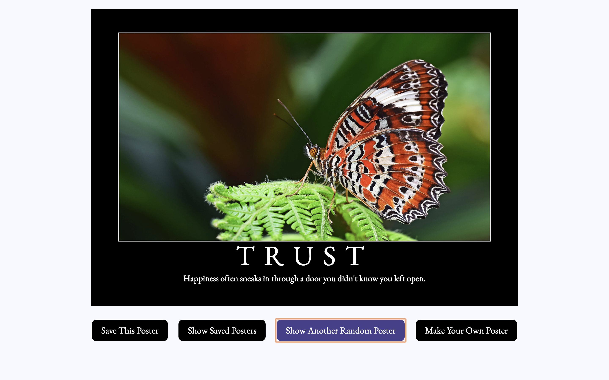
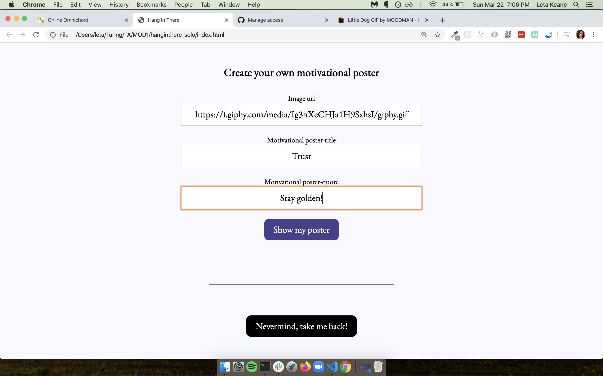
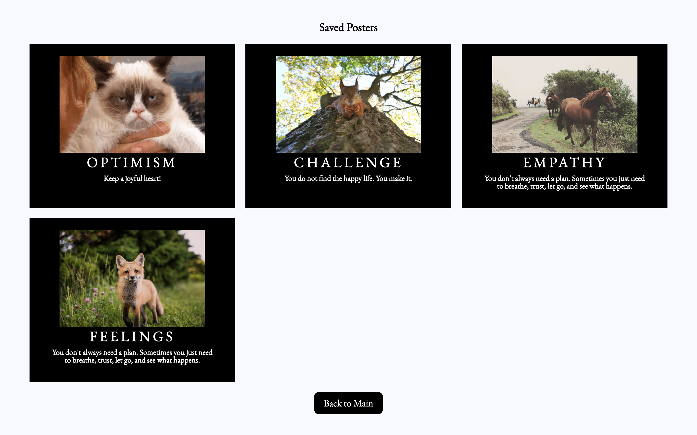
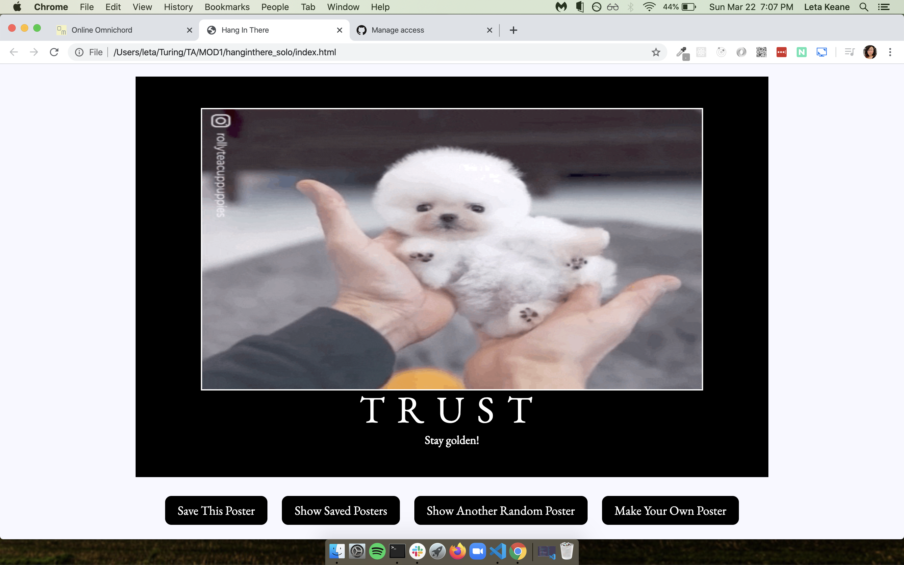

## Learning Goals

* Write clean, DRY JavaScript
  * Use a provided class by creating object instances using the `new` keyword
  * Manipulate the page after it has loaded adding, removing, and updating elements on the DOM
* Begin to understand the connection between HTML, CSS and JavaScript
  * Practice reading, understanding, and using provided code
* Build an understanding of writing code collaboratively
  * Document changes with atomic commits & thorough code reviews
  * Communicate, troubleshoot, and plan effectively as a team

## Overview

Sometimes you need a pick me up. Remember those motivational posters that were all over the place in classrooms and online? We're going to make our own!

## Set Up

To begin, choose one partner to do the following:

1. Fork the repository found here: [https://github.com/turingschool-examples/hang-in-there-boilerplate/](https://github.com/turingschool-examples/hang-in-there-boilerplate/).
2. Clone down your new, forked repo.  While cloning, name it what you want your project to be named, should not include "boilerplate". `git clone <url> <newNameYouWantItToHave>`
3. `cd` into the repository
4. Open it in your text editor
5. Add all project partners and your assigned instructor as collaborators on the repository

Then, as a team:

* Explore the repository to see what's going on in the code
* What pieces of code might you use to complete iterations, and what pieces will you have to create?
* All of your work will take place in `main.js` - you will not need to change any other files.

## Day 1 Deliverables

**By EOD on Kick Off Day:** complete the following tasks:

* As a team, read the entire project spec and rubric
* As a team, complete [the Norming Form](https://docs.google.com/forms/d/e/1FAIpQLSche5cvtlYQ_SaBDqqoF3H9gFiy2p60AOPoUMbhgIHlg-vRlQ/viewform?usp=sf_link)
* Complete [this project submission form](https://docs.google.com/forms/d/1kW1JPMpZUhAjzIDnW_wDrGB8PtRDTIFh9ohpkd5h0xk/edit) to ensure your project manager has the following links:
  - the forked GitHub repo
  - the GitHub Pages deployed site
    - Instructions for deploying: Repo Settings >> Pages >> Select the `main` branch as your Source branch >> Save >> Send us the URL they give you in the pop up that says "Your site is ready to be published at [URL]"
* Add all teammates and your assigned instructor as collaborators to your forked repository

## Progression

### Iteration 0 - Main Page

- When the page loads, we should see a poster with a randomly selected image, title, and quote
- Every time the user clicks the Show Random Poster button, a new random poster is displayed.

### Iteration 1 - Switching Views

Form view:

Saved posters view:

- When a user clicks the "Make Your Own Poster" button, we should see the form, and the main poster should be hidden
- When a user clicks the "View Saved Posters" button, we should see the saved posters area, and the main poster should be hidden
- When a user clicks the "Nevermind, take me back!" or "Back to Main" buttons, we should only see the main poster section
- In summary: Be able to switch between the three views (main poster, form, and saved posters) on the correct button clicks

_Hint: go check out the HTML and CSS files to see how the form and saved posters sections are being hidden in the first place_

## Iteration 2 - Creating a New Poster

Result after clicking Show My Poster button:

- On the new poster form view, users should be able to fill out the three input fields and then hit the Show My Poster button
- When the Show My Poster button is clicked, several things will happen:
  - Use the values from the inputs to create a new instance of our Poster class  (part of your data model)
  - Save the submitted data into the respective arrays (image URL into the images array, etc - all part of your data model) so that future random posters can use the user-created data
  - Change back to the main poster view (hiding the form view again)
  - Use the new instance of the Poster class (part of your data model) to display the newly created poster image, title, and quote in the main view on the DOM

## Iteration 3 - Saving & Viewing Posters

- When a user clicks the "Save This Poster" button, the current main poster will be added to the `savedPosters` array.
- If a user clicks the "Save This Poster" more than once on a single poster, it will still only be saved once (no duplicates)
- When a user clicks the "Show Saved Posters" button, we should see the saved posters section
- All the posters in the `savedPosters` array should be displayed in the saved posters grid section

## Iteration 4 - Deleting Saved Posters

- From the saved posters view, if a user double clicks a saved poster, it will be deleted
  -  `onclick` functionality should not be used in any HTML code - all functionality should be through JavaScript.  

_Hint: How will you update the data model to achieve this?_

## Optional Extensions - Gettin' fancy

Here's a list of possible extensions to implement - but **ONLY IF** your team has completed all the previous iterations **AND** have cleaned up your code to make it DRYer and more readable.

You are welcome to add your own extensions. Be sure they are thoughtful in terms of UX/UI, and that they do not break any prior functionality.

- Implement data validation and error handling into the form (disable button, provide error messages if data entered is not correct, etc)
- In the main poster view, allow users to click each piece of the poster (image, title, quote) to update just that piece with another random item from the appropriate array
- When a user single clicks a saved poster, create a modal to view it larger
- Allow users to drag and drop saved posters into whatever order they want them to appear

## Notes on Project Feedback

The rubric below serves as a guide for both **students** and **instructors**. 

**Students:**
- It should be used as a reference throughout the project to keep on track and guide learning.
- It should also be used by students to self-assess their work.

**Instructors:**
- It should be used to evaluate the project at its final due date/time.
- It should be a guide to provide relevant feedback to students so they can grow and improve in the areas that need deeper understanding.

### Projects as Learning Tools

When projects are graded, view the evaluation as a means to inform your learning, rather than as a static "grade". Feedback from instructors will focus on areas where you have an opportunity to deepen your understanding. 

Projects may be marked as **yes**, **not yet**, and **wow**. These scores answer the only important question: **does the project demonstrate student understanding of the learning goals?** Similarly, each section of the rubric (see below) will have yes/not yet/wow markings, helping you understand your progress and growth in specific areas.

The overall project outcome (yes, not yet, wow) is determined by "averaging" each section's outcome. You can think of a "yes" being worth a  1, a "not yet" being worth a 0, and a "wow" being worth a 2. 

For this project, an average of 1+ is considered a passing project that demonstrates good student understanding! An average of 1.5+ is considered a wow. Anything below a 1 is considered a project that indicates that the concepts have not been fully understood (see note in the section below).

<section class="answer">
### A important note about the possible outcomes

**Yes** indicates that the student/team is ON TRACK in this area! YES you showed us you understand the concept! 
- The student/team demonstrates a good understanding of the concept

**Not Yet** indicates that the student/team is BEHIND in this area - you showed us that you don't yet understand the concept
- The student/team demonstrates misconceptions or confusion around the topic
- Student/team should prioritize this concept in their studying and practice
- ✨ A fail on a project does **not** mean the module is doomed! We want to see GROWTH. A student/team can fail a project and still be successful in Mod 1! ✨

**Wow** indicates that the student/team did extra work to teach themselves a new concept, or to achieve a deep & nuanced understanding of a concept
- This is not an outcome to prioritize achieving
- "Wow" should not come at the expense of another concept
- "Wow" often does not look like extra features, but instead looks like thoughtful refactoring and polish 💅
</section>

## Rubric

This project has 3 evaluated concepts:

- JavaScript
- Workflow & Professional Habits
- Reading Code

One way these concepts are evaluated is via the final graded section:
- Functionality (we can't properly assess the 3 main concepts if there is not enough work to grade)

---

### JavaScript

This project gives the team room to practice the following JavaScript concepts:  
- OOP (Object Oriented Programming)
- DOM (Document Object Model) manipulation
- Style
  - SRP (Single Responsibility Principle) and DRY (don't repeat yourself) conventions
  - Readability - semantic naming, consistency, conciseness

Competency & understanding of these concepts can be demonstrated in many ways. **The following examples are not checklists to complete!** They are illustrations to guide your team as you develop this project and continue your learning.

<section class="answer">
### OOP competency examples

- Project makes use of the provided class, creating instances to encapsulate & store unique data
- Team considers when and how to create new instances or update existing instances, coming to a clear and consistent decision
- Team effectively creates/accesses instance properties when applicable
- Team effectively invokes instance methods when applicable

✨WOW✨ can look like:  

- Creating effective, clean methods in the provided class to manipulate class properties
</section>

<section class="answer">
### DOM Manipulation competency examples

- Project makes use of the DOM to access and update the displayed information
- Team is thoughtful about elements being targeted, limiting global variables to only the ones needed for current functionality
- Team succesfully renders the appropriate data to the page without bugs

✨WOW✨ can look like:

- Team keeps the data model logic separate from the render/display logic
</section>

<section class="answer">
### JavaScript Style competency examples

- The main JS file is organized thoughtfully (DOM variables together, event listeners together, functions together)
- Global variables are thoughtfully created, with a clear understanding demonstrated as to what needs to be global and what can be local
- Functions are DRY and demonstrate SRP
- Variable and function naming is meaningful & readable
- JS is formatted according to the [Turing JS style guide](https://github.com/turingschool-examples/javascript/tree/main/es5)
- Only semantic/organizational comments remain in file (if any); no "dead" commented out code remain in the file

✨WOW✨ can look like:

- Functions make use of arguments and parameters to be dynamic and reusable where possible without overengineering
- Code has clearly been refactored; no functions show evidence of vestigial functionality (aka when functionality changes, all relevant code is updated)
- No extraneous or unused lines of code
</section>

Each of these "subsections" are not distinct; they are all taken into consideration when the outcome for JavaScript is determined.

---

### Workflow & Professional Habits

This project gives the team room to practice the following skills:  
- Collaboration
- Git
- GitHub

Competency & understanding of these concepts can be demonstrated in many ways. **The following examples are not checklists to complete!** They are illustrations to guide your team as you develop this project and continue your learning.

<section class="answer">
### Collaboration competency examples

- The team's norming document is taken seriously, with thoughtful reflections from all team members regarding their skills, learning goals, work styles, etc. 
- The team plans and executes an agreed upon process for working, troubleshooting, and handling conflicts.
- Each member of the team reflects meaningfully on the collaboration and can point to specific behaviors they wwant to continue, and those they want to modify for future collaboration
- The work is distributed equitably; hopefully commit/code contributions are roughly even for each team member

✨WOW✨ can look like:

- The team's norming document is regularly revisted and revised as better perspective is gained
- When conflicts arise, the team works together to find ways to re-focus on individual and group learning objectives
</section>

Note: ⬆️this⬆️ kind of collaboration can be difficult to assess, but know that this is a crucial and vital part of your learning and marketability as a developer! 

<section class="answer">
### Git competency examples

- Team understands the importance & utility of documenting a single change with every commit; changesets are small
- Commit messages are descriptive and concise
- The team keeps the main branch clean by using branches for new, unreviewed code

✨WOW✨ can look like:

- The team's commit messages clearly tell the story of how the project evolved over time
- Commits are atomic, documenting a single changeset (such as a new function being created, or a function being updated).
</section>

<section class="answer">
### GitHub competency examples

- Team understands the point of the PR process, making strong use of code reviews & pushing up requested changes before merging
- PRs have clear, thorough descriptions, such that a new person joining the codebase can clearly understand the proposed changes and evolution of the codebase
- The team understands that the README is an opportunity to document their work and growth
- The team understands that the README is a new contributor or potential employer's first glimpse into the project, and includes thorough setup instructions, context, reflections, and other pertinent information

✨WOW✨ can look like:

- A PR template is effectively used (not a checkbox to complete, but an opportunity to document the changes being proposed)
- Meaningful decisions are documented through code reviews; suggested/requested edits are made before merging
- No bugs or poor code are merged into the main branch
- The README effectivelly communicates the team's learning and growth as students
</section>

Each of these "subsections" are not distinct; they are all taken into consideration when the outcome for Workflow and Professional Habits is determined.

---

### Reading Code

This project gives the team room to practice the following skills:  
- Reading code written by someone else (provided boilerplate)
- Effectively making use of existing code

Competency & understanding of these concepts can be demonstrated in many ways. **The following examples are not checklists to complete!** They are illustrations to guide your team as you develop this project and continue your learning.

<section class="answer">
### Reading Code competency examples

- The team takes time to thoroughly understand the provided code
- Provided code is used effectively (the provided Class, the provided assets, the provided HTML & CSS)
  - The team does not have to directly edit the HTML or CSS file
  - The team does not ignore provided styling
  - No code is added that makes the provided code redundant

✨WOW✨ can look like:

- Creating and sharing a document (with your PM) for the team's observations of and questions about the existing code
</section>

---

### Functional Expectations

Functionality is the least important piece of the rubric. It's included because it is another benchmark to gauge proficiency. However, you should not pursue functionality at the expense of code quality or the learning/growth of all team members.

This means, we DO NOT want to see:
- Code that pursues extensions but is sloppy
- One or both team members do not understand every single line of code
- One or both team members skips the problem solving process (pseudocoding, talking out the problem, articulating, planning) in the pursuit of completing functionality

Well-refactored, thoughtful code is better than sloppy extra features.

<section class="answer">
### Functionality competency examples

- The application completes all iterations without bugs

✨WOW✨ can look like:

- An extension is successfully implemented along with thoughtful UI
</section>

---

## Feedback

A few days after the due date, your team will receive feedback about the project's average outcome (yes/not yet/wow), as well as each section's outcome. You will also receive a few pieces of team-specific feedback for each section (things done well, things to improve on for the current/next project).

Common feedback to all projects will also be shared with the cohort. There will be time in the calendar to review these items and figure out how to apply your learning to your current and future work!
