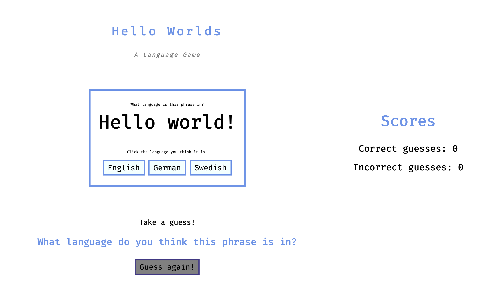
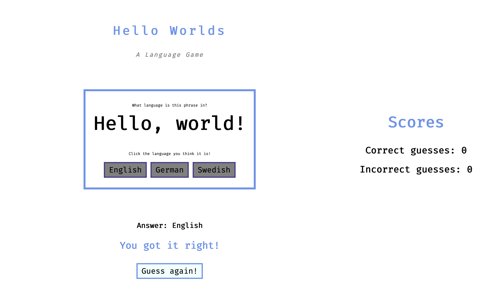
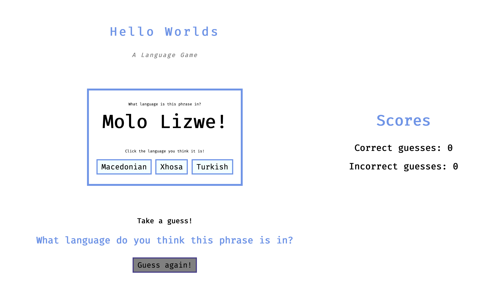
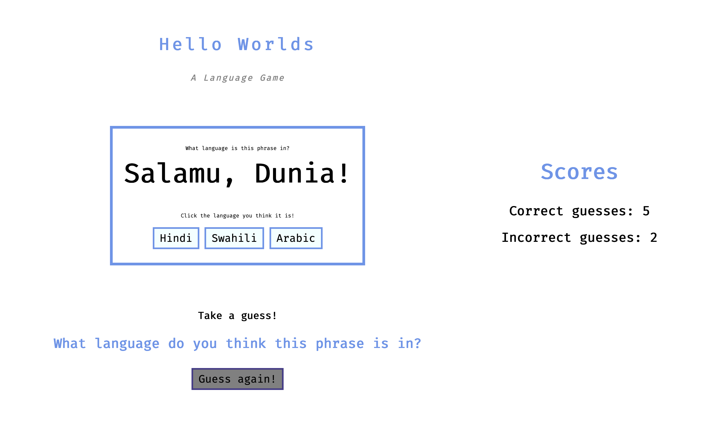

## Learning Goals

* Write clean, DRY JavaScript
  * Build out functionality using functions that show trends toward SRP
  * Manipulate the page after it has loaded adding, removing, and updating elements on the DOM
* Begin to understand the connection between HTML, CSS and JavaScript
  * Practice reading, understanding, and using provided code
* Build an understanding of writing code collaboratively
  * Document changes with atomic commits & thorough code reviews
  * Communicate, troubleshoot, and plan effectively as a team  
  * Ensure all team members are able to be heard and contribute throughout the project

## Overview

"Hello World" is a classic programming phrase with a [long history](https://www.hackerrank.com/blog/the-history-of-hello-world/). It's become an affectionate trope that, when learning a new programming language, one of the first things you learn to do is print "Hello World" - to a console, to a terminal, to a browser page. 

We're turning this into a game about language! Our users will guess what language the phrase "Hello world!" appears in, and we'll keep track of their guesses.

## Resources 

<section class="answer">
### Helpful Hints

<section class="answer">
### What's the deal with deploying?

Deploying your repos allows you to have a live site for your application. You'll be able to share this link with friends and family to show off what you're learning! You will also include deploy links on your resume so potential employers can see what you've built! 

Deploying takes time, so it's not a good idea to use your deployed site as your point of reference while building your app. While you're coding, you'll want to run `open index.html` in your terminal to see the current local version of your app. You need to refresh the browser each time you make an update to your code. Once you've pushed up your code and merged into the main branch, the deployed site should update within an hour. 

Below are instuctions for deploying to GH Pages:  

    - Repo Settings » Pages » Select the main branch as your Source branch » Save. Then, wait up to an hour, hit refresh, and your deployed link should appear at the top of the screen.  

    - If you don't want to wait, your GH pages URL will follow this format: "https://username.github.io/hello-worlds/". Replace "username" with the repo owner's GH username and "hello-worlds" with your repo's name (if different). The URL will not work right away - that's ok! Add it to the Project Submission form anyway. 
</section>

<section class="answer">
### Why are our PRs pushing to the Turing repo?

Forks are typically used to let someone propose changes to your project, that would eventually be merged back into the original repo you forked from. So a fork will always remain connected to the original repo.

When merging a PR, you should see a dropdown to select which repo you want to merge to. You can select the original repo or your fork (you want to choose your fork). 

If you want to change the default, follow the steps [here](https://stackoverflow.com/questions/44466618/default-branch-for-pull-request).
</section>

<section class="answer">
### Where are our console logs?

If you console log something in your project, you’ll see it in the dev tools console when you open the page in your browser (`open index.html`). Nothing will appear in your terminal. Remember, you need to refresh the browser each time you make an update to your code.
</section>
</section>

<section class="answer">
### Refactoring as You Go

Between each iteration, take some time to look at the code you've written and make any changes that might improve the readability of your code. Refactoring as you go can help ensure that everyone understands the code you've written so far AND make it easier to build on top of that code.

Here are some ideas of what to look for:
- Is our indentation and spacing consistent?
- Are our variable names descriptive of the values they hold? Do they follow common convention (i.e. arrays are plural, etc)?
- Are our function names descriptive of what the function does? Are they named with present tense verbs?
- Are any of our functions too big or doing too many things? Should we break any of them up?
- Is any of our JS code too repetitive? Could we make any reusable functions with parameters and arguments?

Remember - shorter code isn't always better! 
</section>

## Progression

<section class="answer">
### Set Up + Day 1 Deliverables

To begin, choose **ONE** partner to do the following:

1. Fork the repository found here: [https://github.com/turingschool-examples/hello-worlds-boilerplate/](https://github.com/turingschool-examples/hello-worlds-boilerplate/).
2. Clone down your new, forked repo.  While cloning, name it what you want your project to be named, should not include "boilerplate". `git clone <url> <newNameYouWantItToHave>`
3. `cd` into the repository
4. Open it in your text editor
5. View the project in the browser by running `open index.html` in your terminal
6. Add all project partners and your assigned instructor as collaborators on the repository

Then, as a team:

* Explore the repository to see what's going on in the code. Look at each file.
  * What pieces of code might you use to complete iterations, and what pieces will you have to create?
* All of your JavaScript will be written in `main.js` - you will not need to change any other files.

**By EOD on Kick Off Day:** 

* As a team, read the entire project spec and rubric
* As a team, complete [the Norming Form](https://docs.google.com/forms/d/e/1FAIpQLSche5cvtlYQ_SaBDqqoF3H9gFiy2p60AOPoUMbhgIHlg-vRlQ/viewform?usp=sf_link)
* Complete [this project submission form](https://docs.google.com/forms/d/1kW1JPMpZUhAjzIDnW_wDrGB8PtRDTIFh9ohpkd5h0xk/edit) to ensure your project manager has the necessary links. (Note: See `Helpful Hints` for help with deploying!)
* Add all teammates and your assigned instructor as collaborators to your forked repository
</section>

<section class="answer">
### Iteration 0 - Main Page

- When the page loads, we should see a game screen with the phrase, 3 guess options, and player guess scores displayed.
</section>

<section class="answer">
### Iteration 1 - Guessing

- When a user clicks one of the guess buttons, we should see the answer
- When a user clicks ones of the guess buttons, we should see feedback about their answer
- When a user clicks one of the guess buttons, we should see that the guess buttons are disabled, preventing the user from making a different guess for the same question
- When a user clicks one of the guess buttons, we should see that the Guess Again reset button is enabled.

<section class="note">
### Hint!

Go check out the HTML and CSS files to see how the reset buttonis being disabled in the first place.
</section>
</section>

<section class="answer">
### Iteration 2 - Going on to the next question

Result after clicking `Guess again!` button:

- When the user clicks the Guess again! button, we should see that a new question and guess options are displayed
- When the user clicks the Guess again! button, we should see that the option buttons are enabled again
- When the user clicks the Guess again! button, we should see that the Guess again! button is disabled again
- When the user clicks the Guess again! button, we should see that the answer text has returned to the default "Take a guess!" text
- When the user clicks the Guess again! button, we should see that the feedback text has returned to the default "What language do you think this phrase is in?" text

<section class="note">
### Hint!

You should use the provided `shuffle` function. Also, take a look at how the first currentQuestion is being created.
</section>
</section>

<section class="answer">
### Iteration 3 - Tracking scores

- When a user makes correct guesses, the Scores section should keep track of their correct guesses
- When a user makes incorrect guesses, the Scores section should keep track of their incorrect guesses
</section>

<section class="answer">
### Optional Extensions

Here's a list of possible extensions to implement - but **ONLY IF** your team has completed all the previous iterations **AND** have cleaned up your code to make it DRYer and more readable.

You are welcome to add your own extensions. Be sure they are thoughtful in terms of UX/UI, and that they do not break any prior functionality.

- Store questions users got wrong. Allow users to try answering those questions again.
- Persist user scores across page refreshes.
- Add a form view where users can submit new questions in other languages.
- Build in two player competition functionality.
</section>

---

## Project Feedback

When projects are graded, we want you to view the evaluation + feedback as a means to inform your learning, rather than as static "grades". Feedback from instructors will focus on areas where you have an opportunity to deepen your understanding. 

The evaluation will provide feedback by answering this important question: **Does the project demonstrate student understanding of the learning goals & concepts?**

Projects will answer that question, with each section of the rubric (see below) receiving a `yes`, `not yet`, or `wow` marking.

The overall project outcome is determined by "averaging" each rubric's outcome. You can think of a "yes" being worth a 1, a "not yet" being worth a 0, and a "wow" being worth a 2. For this project, an average of 0.5 is considered a passing project that demonstrates good student understanding!

## Rubric

This project has 4 evaluated concepts:

- JavaScript
- Workflow & Professional Habits
- Reading Code
- Functionality

<section class="note">
### Note about the below criteria

Competency & understanding of these concepts can be demonstrated in many ways. **The following examples are not checklists to complete!** They are illustrations to guide your team as you develop this project and continue your learning.
</section>

<section class="answer">
### JavaScript

💫ON TRACK💫 can look like:
- JS is formatted according to the [Turing JS style guide](https://github.com/turingschool-examples/javascript/tree/main/es5)
- The main JS file is organized thoughtfully (DOM variables together, event listeners together, functions together)
- Variable and function naming is meaningful, readable, and follow convention. (Arrays are plural, functions begin with present-tense verb, etc.) 
- Functions are DRY (Don't Repeat Yourself) and demonstrate SRP (Single Responsibility Principle)
- Global variables are limited to only those that are necessary.
- Only semantic/organizational comments remain in file (if any). No console logs remain in any files.

✨WOW✨ can look like:

- Team keeps the data model logic separate from the DOM logic
- Functions make use of arguments and parameters to be dynamic and reusable where possible without overengineering
</section>

<section class="answer">
### Workflow & Professional Habits

💫ON TRACK💫 can look like:
- The team's norming document is taken seriously, with thoughtful reflections from all team members regarding their skills, learning goals, work styles, etc. 
- The work is distributed equitably; Commit/code contributions (viewable under `Insights` tab) are roughly even for each team member.
- Commits are made regularly to describe small chunks of working code. Commit messages are descriptive, concise, and consistent across all team members.
- The team keeps the main branch clean by using branches for new, unreviewed code. No one pushes code directly to the main branch.
- PRs have clear, thorough descriptions, such that a new person joining the codebase can clearly understand the proposed changes and evolution of the codebase.
- The README template is filled out thoughtfully and completely.

✨WOW✨ can look like:   
- Team uses a [PR template](https://docs.github.com/en/communities/using-templates-to-encourage-useful-issues-and-pull-requests/creating-a-pull-request-template-for-your-repository).
- Meaningful decisions are documented through code reviews. Suggested/requested edits are made before merging.
</section>

<section class="answer">
### Reading Code

💫ON TRACK💫 can look like:
- The team takes time to thoroughly understand the provided code
- Provided code is used effectively (the provided createPoster function, the provided assets, the provided HTML & CSS)
  - The team does not directly edit the HTML or CSS file
  - The team does not ignore provided styling
  - No code is added that makes the provided code redundant

✨WOW✨ can look like:
- Creating and sharing a document (with your PM) for the team's observations of and questions about the existing code
</section>

<section class="answer">
### Functionality

Functionality is the least important piece of the rubric. It’s included because it is another benchmark to gauge proficiency (for example, we can’t grade your JS if there isn’t enough of it written!). However, you should not pursue functionality at the expense of code quality or the learning/growth of all team members.

This means, we DO NOT want to see:

* Code that completes iterations but is sloppy
* One or both team members do not understand every single line of code
* One or both team members skips the problem solving process (pseudocoding, talking out the problem, articulating, planning) in the pursuit of completing functionality

**Well-refactored, thoughtful code is better than sloppy extra features.**

💫ON TRACK💫 can look like:
- All of the expectations of iterations 0-4 are complete without bugs

✨WOW✨ can look like:
- All of the expectations of iterations 0-4 and an extension are complete without bugs
</section>