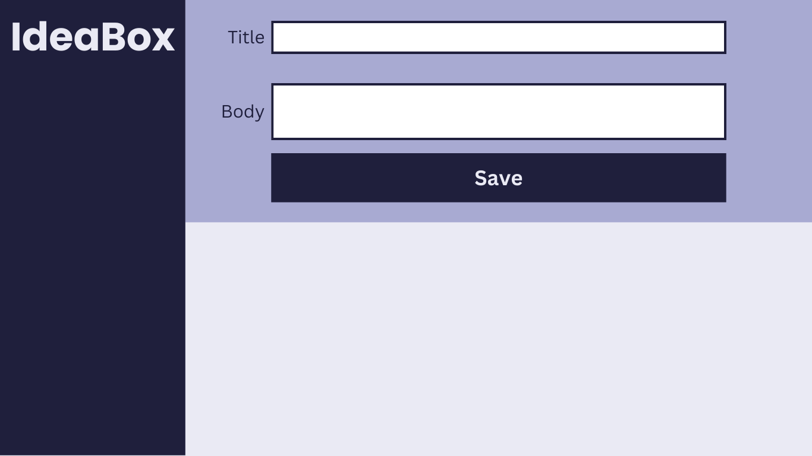
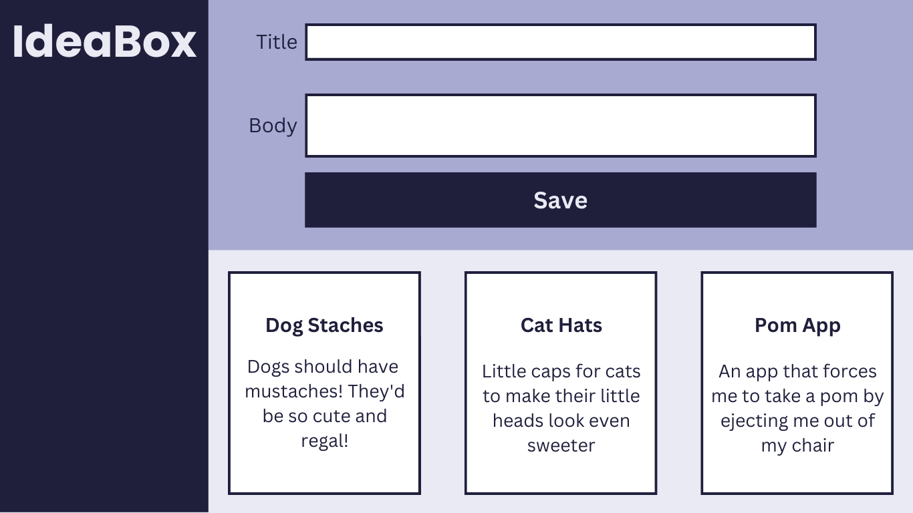
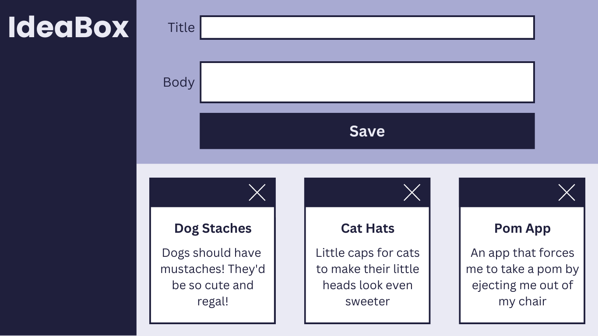
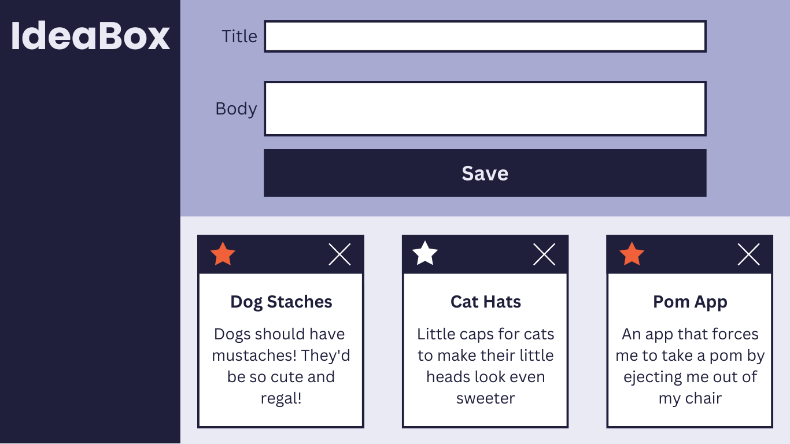
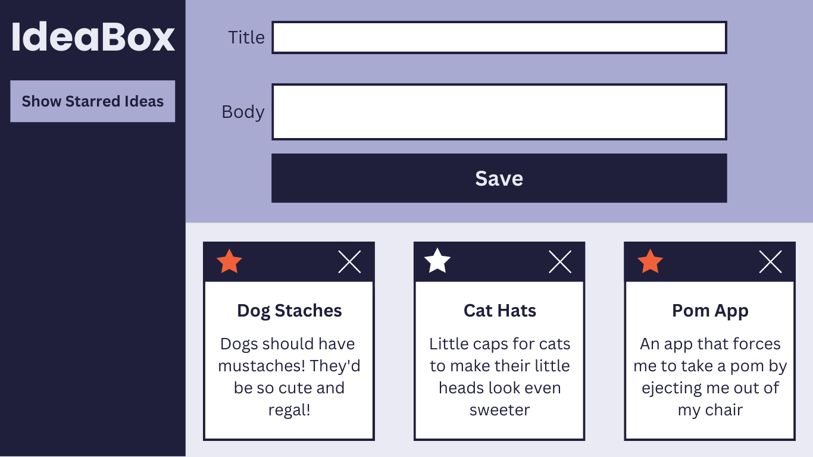
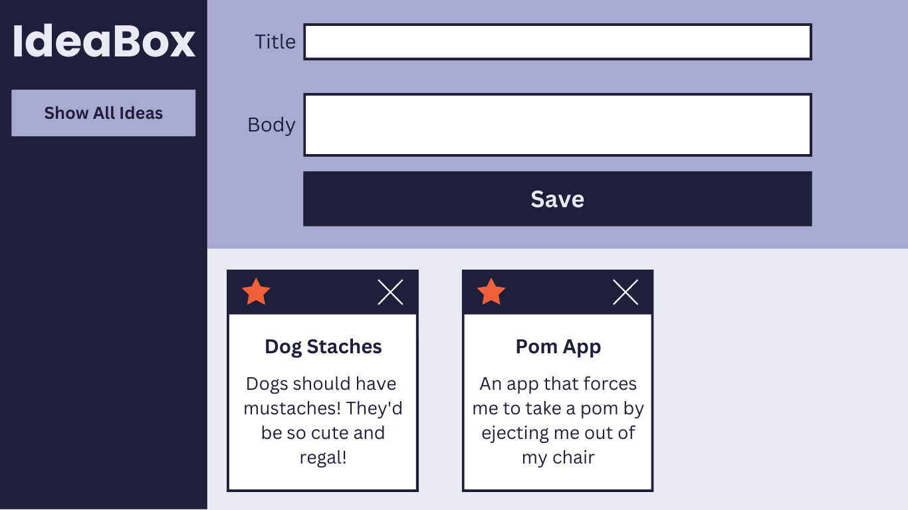
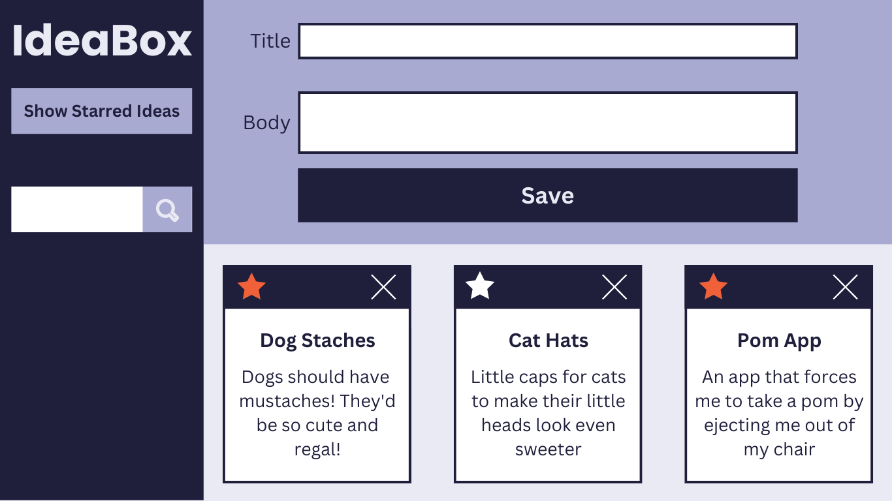

## Learning Goals

* Gain an understanding of how to write clean HTML and CSS to match a provided comp
* Understand how a developer might separate the data model from the DOM model
* Incorporate & iterate over arrays in order to filter what is being displayed
* Craft code with clean style, using small functions that show trends toward DRYness, SRP, and purity

## Overview

Every developer has more ideas than time. As David Allen likes to say "the human brain is for creating ideas, not remembering them." In this project, we'll be building an application that records and archives our ideas (good and bad alike).

This project will give you and your team an opportunity to write HTML and CSS, and leverage JavaScript to both create your data model and interact with the DOM.

Additionally, as your first group project, this will give you a chance to continue to hone your team skills: communication, planning, proper git and GitHub workflow.

You will work through the iterations listed under **Progression** below.

## Notes Before You Begin

<section class="answer">
### Design Resources

For each iteration, you should be matching the provided design comps closely. ([What is a design comp?](https://clients.geminoscreative.com/marketing-blog/what-is-a-design-comp)) Act like you're on the job and these are the designs you've been given to match. Details and spacing matter! Here is some info to help you:
  - Font: [Poppins](https://fonts.google.com/specimen/Poppins?query=poppins)
  - Icons: [Found here](https://drive.google.com/drive/folders/18xpWplI0tpXIK1omBZeq04LEx2OMzzMK?usp=sharing) (Note: You will not use all of the icons in this folder.)
  - Colors:
    - Dark Purple: `#1F1F3C`
    - Medium Purple: `#A8AAD2`
    - Light Purple: `#EAEAF4`
    - White: `#FFFFFF`
</section>

<section class="answer">
### Refactoring as You Go

Between each iteration, take some time to look at the code you've written and make any changes that might improve the readability of your code. Refactoring as you go can help ensure that everyone understands the code you've written so far AND make it easier to build on top of that code.

Here are some ideas of what to look for:
- Did we use [semantic HTML elements](https://developer.mozilla.org/en-US/docs/Web/HTML/Element) rather than `divs` and `sections` everywhere?
- Is our indentation and spacing consistent across all files?
- Are our variable names descriptive of the values they hold? Do they follow common convention (i.e. arrays are plural, etc)?
- Are our function names descriptive of what the function does? Are they named with present tense verbs?
- Are any of our functions too big or doing too many things? Should we break any of them up?
- Is any of our JS code too repetitive? Could we make any reusable functions with parameters and arguments?

Remember - shorter code isn't always better! 
</section>

## Progression

<section class="answer">
### Set Up + Day 1 Deliverables

**By EOD on Kick Off Day:** complete the following tasks:

* As a team, complete [the DTR Form](https://docs.google.com/forms/d/e/1FAIpQLSche5cvtlYQ_SaBDqqoF3H9gFiy2p60AOPoUMbhgIHlg-vRlQ/viewform?usp=sf_link)

Choose ONE TEAM MEMBER to do the following:
1. Locally, create a new folder called `ideaBox` and add the following files to that folder: `index.html`, `main.js`, and `styles.css`.
2. `cd` into the `ideaBox` directory and run `git init` to initialize git.
3. Create an initial commit.
4. On GitHub, create a new repository. Follow the written instructions on GitHub to add the repo's remote to your local project, and push your initial commit up to GitHub.
5. Add all project partners to the repository as contributors. If your repository is set to private, add your project manager as a collaborator as well.  
6. Complete [this project submission form](https://docs.google.com/forms/d/1kW1JPMpZUhAjzIDnW_wDrGB8PtRDTIFh9ohpkd5h0xk/edit) to ensure your project manager has the following links:
  - your team's GitHub repo
  - the GitHub Pages deployed site
    - Instructions for deploying: Repo Settings >> Pages >> Select the `main` branch as your Source branch >> Save >> Send us the URL they give you in the pop up that says "Your site is ready to be published at [URL]"  

Then, as a team:
* Have all team members clone down the repo.  

You're ready to start iteration 0!
</section>

<section class="answer">
### Iteration 0 - Basic Layout

- When the page loads, we should see:
  -  a title, two inputs, and a button
  -  a page layout and colors that match the comp above

- When a user clicks "Save," a new idea object should be created and logged to the console. The idea object should have:
  - title
  - body
  - id

- Every time a new idea is created, it should be added to a list that represents your data model.
</section>

<section class="answer">
### Iteration 1 - Adding Ideas

- When a user fills out both inputs and clicks "Save": 
  - a new idea should be added to the data model.
  - a card should appear on the screen to match the comp above. The card should show the title and body the user entered into the form.
  - the form inputs should clear out to be ready for the next idea.

- When a user tries to click "Save" with an empty Title or Body input field:
  - the "Save" button is disabled and unable to be clicked. It's clear to the user when the button is disabled because it is a lighter color and the cursor is not a pointer when they hover over it.
  - a new idea card should not appear.

- Notes:
  - You can choose what the layout looks like if more then 3 cards are added.
  - You can choose how to handle titles and bodies that are longer than what fits on the card. There are lots of ways to handle this.
</section>

<section class="answer">
### Iteration 2 - Deleting Ideas

- A delete button should be visible on all idea cards now that match the comp above.
- When a user clicks the delete button:
  - that idea should be removed from the data model.
  - that idea card should be removed from the page.
</section>

<section class="answer">
### Iteration 3 - Favoriting Ideas

- A star button should be visible on all idea cards now that match the comp above.
- When a user clicks the star button:
  - the data model should be updated such that you can tell which ideas have been starred.
  - the star should toggle between orange and white to show the user whether that idea is favorited or not.
    - orange: favorited
    - white: not favorited
- When an idea is created, it should start not favorited.
</section>

<section class="answer">
### Iteration 4 - Filtering Ideas

- A filter button should be visible on the side bar to match the comp above.
- When a user clicks the "Show Starred Ideas" button:
  - only the favorited ideas should be visible
  - the text on the button should change to "Show All Ideas"

  

- When the user clicks the "Show All Ideas" button:
  - all ideas should be visible again
  - the text on the button should change to "Show Starred Ideas"
</section>

<section class="answer">
### Iteration 5 - Searching Ideas (Extension)

- A search bar should be visible on the page to match the comp above.
  - Note: The search icon is not a button - this is a live search that occurs as the user types.
- As a user types into the search input, the cards should start filtering to show only matches (no click needed). The user should see only cards that include the letter(s) in either the body or title.
- As a user deletes letters in the search bar, cards should keep filtering correctly.
- If a user deletes all the way back to a blank input, all cards should be visible.
</section>

<section class="answer">
### Other Optional Extensions

Here's a list of possible extensions to implement - but **ONLY IF** your team has completed all the previous iterations **AND** have cleaned up your code to make it DRYer and more readable.

You are welcome to add your own extensions. Be sure they are thoughtful in terms of UX/UI, and that they do not break any prior functionality.

Options:
- Only allow unique ideas to be added.
- When a user tries to delete an idea, have them confirm that they really do want to delete it.
- Implement [localStorage](https://frontend.turing.edu/lessons/module-1/json-and-localstorage.html) so the ideas persist on page load.
- Create a "Recently Deleted" filter that allows users to see their previously deleted ideas.
</section>

---

## Rubric

This project has 4 evaluated concepts:

- Professionalism
- Comp Recreation
- HTML & CSS
- JavaScript
- Functionality

<section class="note">
### Note about the below criteria

Competency & understanding of these concepts can be demonstrated in many ways. **The following examples are not checklists to complete!** They are illustrations to guide your team as you develop this project and continue your learning.
</section>

<section class="answer">
### Professionalism

💫ON TRACK💫 can look like:
- The team's norming document is taken seriously, with thoughtful reflections from all team members regarding their skills, learning goals, work styles, etc. 
- The work is distributed equitably; commit/code contributions are roughly even for each team member in the final product and throughout the process
- Branches are consistently used for individual features and commit messages are descriptive and concise
- Commits are atomic, documenting a single changeset (such as a new function being created, or a function being updated) and clearly demonstrates how the project evolved over time.
- PRs have clear, thorough descriptions and are consistently reviewed by other team members before work has been merged.
- README is formatted and gives new contributors and employers sufficient context about the project including setup instructions, deploy link (gh-pages), images or video of the functioning app, technologies used, reflections, future features, and other pertinent information.

✨WOW✨ can look like:
- The team holds regular standups and retros while also revisiting the norming document as better perspective is gained
- A [PR template](https://docs.github.com/en/free-pro-team@latest/github/building-a-strong-community/creating-a-pull-request-template-for-your-repository) is effectively used
</section>

<section class="answer">
### Comp Recreation

💫ON TRACK💫 can look like:
- Application implements all major comp details accurately and correctly on desktop (layout, spacing, alignment, etc)
- Careful attention was given to the little details like hover states.

✨WOW✨ can look like:
- Additional elements and animations have been added that match the visuals established in the comps.
- The design is responsive across multiple screen sizes including tablets and mobile devices.
</section>

<section class="answer">
### HTML & CSS

💫ON TRACK💫 can look like:
- Crafts CSS according to the [Turing CSS style guide](https://github.com/turingschool-examples/css)
- Crafts markup according to the [Turing HTML style guide](https://github.com/turingschool-examples/html)
- Application utilizes consistant naming for HTML classes and IDs, and follows suggested conventions.
- Application uses an appropriate amount of [HTML semantic elements](https://developer.mozilla.org/en-US/docs/Learn/HTML/Introduction_to_HTML/Document_and_website_structure). If `
` elements are used, they are only for styling purposes.
- Application utilizes organizational conventions for the whole CSS stylesheet. This may look like - grouping native elements, typography styles, layout styles, etc. together.
- Application utilizes data attributes to store information in the HTML

✨WOW✨ can look like:
- Developers use [BEM](http://getbem.com/), [SMACCS](http://smacss.com/), or another set of naming conventions for classes. _Note: If going this route, document it in your README and let your project manager know which naming convention will be used._
- Application fully implements HTML that is accessible for individuals with visual disabilities. _Note: This will be checked using the Chrome Extenstion [WAVE](https://chrome.google.com/webstore/detail/wave-evaluation-tool/jbbplnpkjmmeebjpijfedlgcdilocofh?hl=en-US) audit tool, and 0 errors & 0 contrast errors are expected._
<section class="answer">
### Note about using the WAVE tool

To get this extension to work with local files, follow these steps:
- Install
- Right click the WAVE extension
- Click "Manage Extensions"
- Flip the "Allow access to file URLs" switch
- Success!
</section>
</section>

<section class="answer">
### Javascript

💫ON TRACK💫 can look like:
- Changes to the DOM only happen after the Data Model has been updated.  The Data Model is then used to update the DOM.
- No nested if/else statements or for loops.
- Functions are DRY and adhere to the Single Responsibility Prinicple (SRP).
- Event delegation is used correctly on dynamic elements like saved palettes.
- Global variables are thoughtfully created, with a clear understanding demonstrated as to what needs to be global and what can be local.
- Crafts JS according to the [Turing JS Style Guide](https://github.com/turingschool-examples/javascript/tree/master/es5)

✨WOW✨ can look like:
- Functions make use of arguments and parameters to be dynamic and reusable where possible without overengineering
- Bracket notation is utilized effectively to make accessing properties of class instances more dynamic.
- Demonstrates efforts towards making functions pure when possible. *Note: Purity is not possible for every function in a FE application. Strive for it only when it makes sense.*
</section>

<section class="answer">
### Functionality

Functionality is the least important piece of the rubric. It’s included because it is another benchmark to gauge proficiency (for example, we can’t grade your JS if there isn’t enough of it written!). However, you should not pursue functionality at the expense of code quality or the learning/growth of all team members.

This means, we DO NOT want to see:

* Code that completes iterations but is sloppy
* One or both team members do not understand every single line of code
* One or both team members skips the problem solving process (pseudocoding, talking out the problem, articulating, planning) in the pursuit of completing functionality

Well-refactored, thoughtful code is better than sloppy extra features.

💫ON TRACK💫 can look like:
- All of the expectations of Iteration 4 are complete without bugs

✨WOW✨ can look like:
- Iteration 5 or another extension is successfully implemented without bugs
</section>

---

## Feedback

A few days after the due date, your team will receive feedback about the project's average outcome (yes/not yet/wow), as well as each section's outcome. You will also receive a few pieces of team-specific feedback for each section (things done well, things to improve on for the current/next project).
