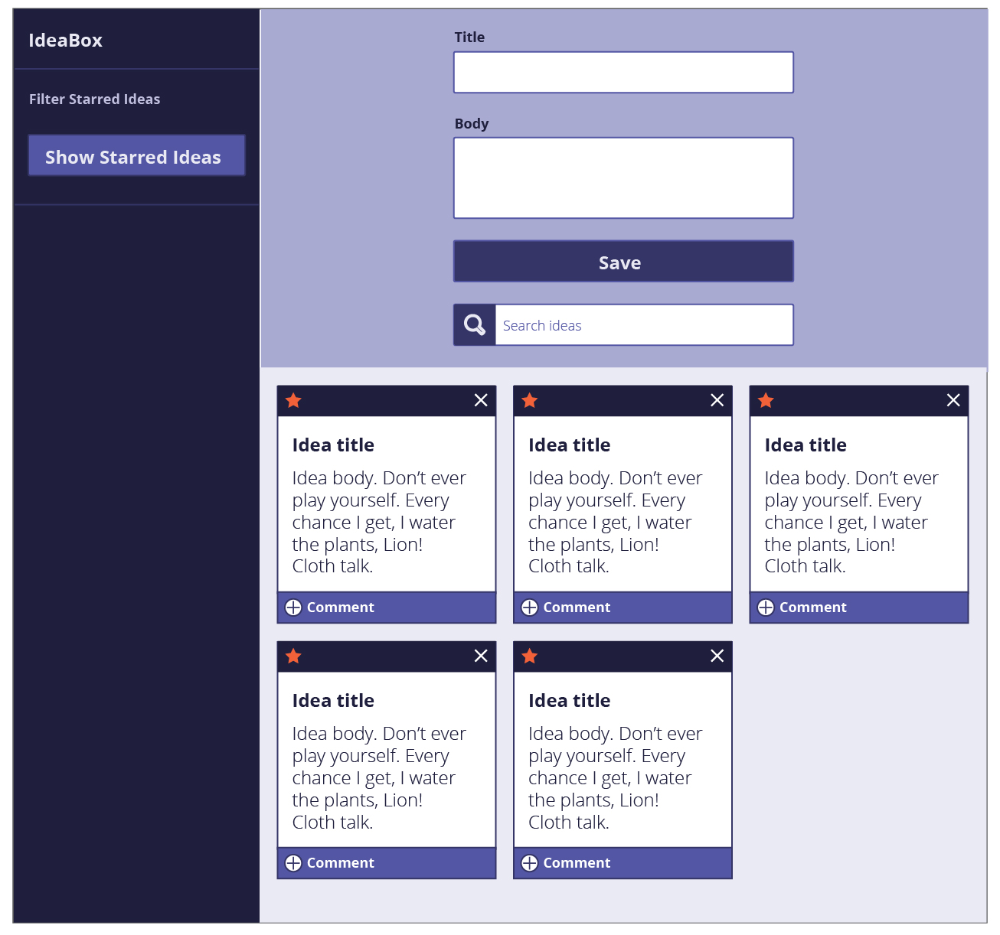
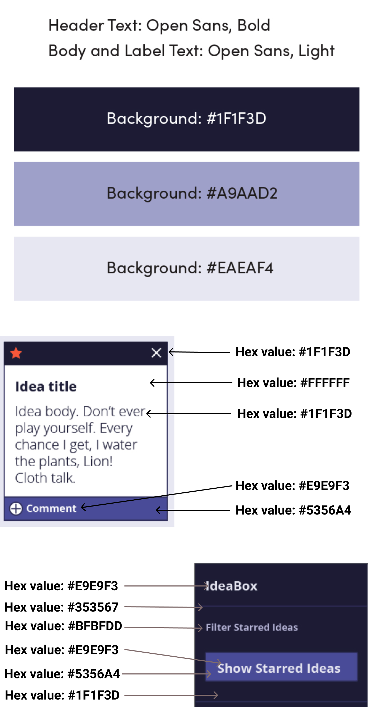
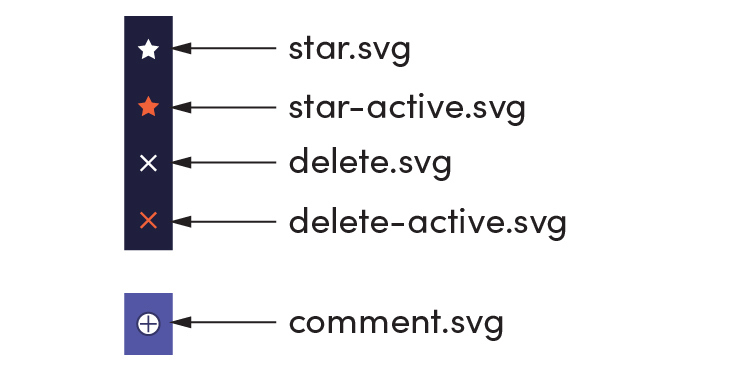

## Overview

Every developer has more ideas than time. As David Allen likes to say "the human brain is for creating ideas, not remembering them." In this project, we'll be building an application that records and archives our ideas (good and bad alike).

Throughout the project, one of our focuses will be on providing the user with a usable, intuitive client-side interface. To this end, we'll rely on JavaScript to implement snappy filtering in the browser.

## Learning Goals

* Gain an understanding of how to write clean HTML and CSS to match a provided comp
* Understand how a developer might separate the data model from the DOM model
* Incorporate & iterate over arrays in order to filter what is being displayed
* Craft code with clean style, using small functions that show trends toward DRYness, SRP, and purity

## Day One Deliverables

- One person should create a new directory called `ideabox`.You'll need to initialize git in your local repo. You can brush up on that process with [this article](https://guides.github.com/introduction/git-handbook/).
  It should contain:
  - `index.html` 
  - `styles.css`
  - `app.js` (this is where you will write the logic for the data model)
  - `index.js` (this is where your DOM manipulation will occur)
  - `assets` (this is a directory that will hold your icon files)
-  As a team, complete [the DTR Form](https://docs.google.com/forms/d/e/1FAIpQLSche5cvtlYQ_SaBDqqoF3H9gFiy2p60AOPoUMbhgIHlg-vRlQ/viewform?usp=sf_link)
-  Complete [this project submission form](https://docs.google.com/forms/d/1kW1JPMpZUhAjzIDnW_wDrGB8PtRDTIFh9ohpkd5h0xk/edit) to ensure your project manager has the following links:
    - the GitHub repo link
    - the GitHub Pages deployed site
      - Instructions for deploying: Repo Settings >> Pages >> Select the `main` branch as your Source branch >> Save >> Send us the URL they give you in the pop up that says "Your site is ready to be published at [URL]"
-  Add all teammates and your assigned instructor as collaborators to your forked repository
- In your group project README, include links to all of your LinkedIn profiles. The rough draft of your LinkedIn is due during this project, so use this as an opportunity to leverage it! We'll check in on this during our group project check-in. 

## Progression

### Iteration 0 - App Layout

Plan to write the HTML and CSS so that your application matches this comp. Based on what you are building, you can anticipate that the Idea "cards" will not always be there on page load, but for now, they should.

Use the same text on your cards that is used in the spec so you can ensure your spacing/sizing is accurate.

You will need the `svg` image files for the star and delete icons. [Here's the link to download the `svg` icons.](https://drive.google.com/drive/folders/18xpWplI0tpXIK1omBZeq04LEx2OMzzMK?usp=sharing). _Note: You won't end up using all of the icons in this folder._

### Iteration 1 and beyond

We **strongly recommend** that you complete Iteration 0 **before** moving on to the next iterations!

### Architecture

For this project, we'll be increasingly thinking about the "data model" and "DOM model" as separate entities. We'll be using:

- JavaScript to manage the data model and the client-side interactions.
- HTML, CSS and the DOM to display our data

Your entire application will consist of one HTML page or template. You will have two JavaScript files, for now:

1. An `app.js` file that contains the logic for the data model.
  * You'll need:
    1. A function that can create an idea (see details below in "Data Model")
    2. A way to store ideas (hint: store idea objects in an array)
    3. Functions to update the stored ideas array (one to remove ideas, one to add new ideas, etc)
    4. A function to update a single idea's information (ex: you will need to be able to change an idea's "star" property's value)
2. An `index.js` file that contains all DOM related JavaScript.

**Note** The `app.js` file  must be the first script in your HTML so that your `index.js` file has access to the functions in your `app.js` file!

### Data Model

* An idea is represented by an object that has an _id_, _title_, _body_, and _star_.
  * The _id_ should be a unique identifier. (Note: generating a random number does _not_ guarantee it will be unique)
  * _title_ and _body_ are strings.
  * _star_ is a boolean.

Each idea should be an object that is created by a function. Once an idea object is created, that data can be used to update the DOM. That idea object should also be added to a "list" of all the ideas your application currently has. This should probably be a global variable in your `app.js` file.

Remember: as users interact with the DOM, you should use that information to first update the data model, and then use that data model to display the information onto the DOM.

### Iteration 2 - Adding Ideas

As a user,
- When I click "Save",
- If I entered information in both the "Title" and "Body" input fields,
- A new idea object with the provided title and body should be added to the ideas array
- I should see a new idea card with the provided title and body appear on the DOM

As a user,
- When I click "Save",
- If I entered information in both the "Title" and "Body" input fields,
- I should see the "Title" and "Body" input fields clear out (so that they are ready for the user to add a different idea)

As a user,
- When I look at the "Save" button,
- When both or either of the "Title" or "Body" input fields is empty,
- I should notice that the "Save" button is disabled because it is a lighter color and the cursor is not a pointer when I hover over it

As a user,
- When I click "Save",
- And a new card is successfully created,
- I should _not_ see the page reload

### Iteration 3 - Favoriting & Deleting Ideas

As a user,
- When I click the "Delete" button on an idea card,
- That idea object should be permanently removed from the ideas array
- The idea card should be permanently removed from the DOM

As a user,
- When I click the "Star" button on an idea card,
- The star property of that idea's object should be updated (in the ideas array)
- When the button was an outline of a star (not favorited), the button should now be a filled in star (favorited)
- **and vice versa (for unfavoriting)**

As a user,
- When I delete or favorite any card,
- I should _not_ see the page reload

### Iteration 4 - Filtering

As a user,
- When I click "Show Starred Ideas"
- I see only cards that are favorited

As a user,
- When I click "Show Starred Ideas"
- I see the text on that button has changed to "Show All Ideas"

As a user,
- When I click "Show Starred Ideas"
- Then I click what is now "Show All Ideas"
- I see all ideas, favorited or not

As a user,
- When I type a letter or phrase into the search bar, the cards should start filtering (no click needed)
- I now only see the idea cards that include the letter/phrase in either the title or body

As a user,
- When I backspace and delete something from the search bar, so that it's empty
- I see all cards since no search criteria is being provided

## Extensions

### localStorage 

Typically, frontend developers work with APIs to serve up data that is stored on an external server/database. However, sometimes you might want to store some information `Client Side` - meaning we store it on the user's local browser. Interested in this extension? Check out the lesson on [localStorage](https://frontend.turing.edu/lessons/module-1/json-and-localstorage.html). We don't officially teach this lesson, but it's a good one to know.

As a user,
- When I create one idea successfully, then manually refresh the page,
- The idea object is still saved in the ideas array
- The idea card is still visible on the DOM

As a user,
- When I create two cards successfully, delete one, then refresh the page,
- One idea object is still in the ideas array (the one I did not delete)
- One idea card is still visible on the DOM (the one I did not delete)

As a user,
- When I favorite an idea card, then refresh the page,
- That idea card is still in the "favorite" state with the filled in star icon (in both the ideas array and on the DOM)

### Commenting on Ideas

This extension adds the ability for your user to add comments to an idea.

#### Data Model

* The idea objects should now include a new property: `comments`. This will begin as an empty array.  
* You will need to write functions that allow you to add new comments to an idea's `comments` array.  
* A comment will be an object with the following properties: `id` (should be unique), `content` (a string of the comment itself).

As a user,
- When I click the "Add" icon on an idea card,
- A form to add a comment appears on that idea card

As a user,
- When I open the comment form on a card, type something in, and click "Add Comment",
- The text typed in is now a comment attached to this card

As a user,
- When I open the comment form on a card, type something in, and click "Add Comment",
- The "Comment" input field clears out and is ready to accept another comment

As a user,
- When I open the comment form on am idea card,
- When the "Comment" input field is empty,
- I should notice that the "Add Comment" button is disabled because it is a lighter color and the cursor is not a pointer when I hover over it

As a user,
- If I have implemented localStorage,
- When I comment on an idea card, then refresh the page,
- That comment is still on the idea card

---

## Notes on Project Feedback

The rubric below serves as a guide for both **students** and **instructors**. 

**Students:**
- It should be used as a reference throughout the project to keep on track and guide learning.
- It should also be used by students to self-assess their work.

**Instructors:**
- It should be used to evaluate the project at its final due date/time.
- It should be a guide to provide relevant feedback to students so they can grow and improve in the areas that need deeper understanding.

### Projects as Learning Tools

When projects are graded, we want you to view the evaluation + feedback as a means to inform your learning, rather than as static "grades". Feedback from instructors will focus on areas where you have an opportunity to deepen your understanding. 

The evaluation will provide feedback by answering the only important question:

**Does the project demonstrate student understanding of the learning goals & concepts?**

Projects will answer that question, being marked as **yes**, **not yet**, and **wow**. Similarly, each section of the rubric (see below) will have yes/not yet/wow markings, helping you understand your progress and growth in specific areas.

The overall project outcome (yes, not yet, wow) is determined by "averaging" each section's outcome. You can think of a "yes" being worth a  1, a "not yet" being worth a 0, and a "wow" being worth a 2. 

For this project, an average of 0.5 is considered a yes - a passing project that demonstrates good student understanding! An average of 1+ is considered a wow. Anything below a 0.5 is considered a not yet - a project that indicates that the concepts have not been fully understood (see note in the section below).

<section class="answer">
### An important note about the possible outcomes

**Yes** indicates that the student/team is ON TRACK in this area! YES, you showed us you understand the concept! 
- The student/team demonstrates a good understanding of the concept

**Not Yet** indicates that the student/team is BEHIND in this area - you showed us that you don't yet understand the concept
- The student/team demonstrates misconceptions or confusion around the topic
- **Student/team should prioritize this concept in their studying and practice**
-  An overall "not yet" on one project does **not** mean the module is doomed! We want to see GROWTH. A student/team can struggle with a project and still (taking into account the rest of their work and assessments) demonstrate readiness for the next module! 

**Wow** indicates that the student/team did extra work to teach themselves a new concept, or to achieve a deep & nuanced understanding of a concept
- Please note: this is not an outcome to prioritize achieving! A "Yes" is an excellent outcome.
- "Wow" is here as something to reach for if you have a solid understanding of the concepts and want to push yourselves.
- "Wow" should not come at the expense of another concept
- "Wow" often does not look like extra features, but instead looks like thoughtful refactoring and polish 💅
</section>

## Rubric

This project has 4 evaluated concepts:

- Workflow & Professional Habits
- HTML & CSS
- Comp Recreation
- JavaScript

And evaluation of these concepts is assisted through the final graded section:
- Functionality (we can't properly assess the 4 main concepts if there is not enough work to grade)

---

### Workflow & Professional Habits

This project gives the team room to practice the following skills:  
- Collaboration
- Git
- GitHub

Competency & understanding of these concepts can be demonstrated in many ways. **The following examples are not checklists to complete!** They are illustrations to guide your team as you develop this project and continue your learning.

<section class="answer">
### Collaboration competency examples

- The team's norming document is taken seriously, with thoughtful reflections from all team members regarding their skills, learning goals, work styles, etc. 
- The team plans and executes an agreed upon process for working, troubleshooting, and handling conflicts.
- Each member of the team reflects meaningfully on the collaboration and can point to specific behaviors they want to continue, and those they want to modify for future collaboration
- The work is distributed equitably; hopefully commit/code contributions are roughly even for each team member

WOW can look like:

- The team's norming document is regularly revisted and revised as better perspective is gained
- When conflicts arise, the team works together to find ways to re-focus on individual and group learning objectives

Note: ⬆️this⬆️ kind of collaboration can be difficult to assess, but know that this is a crucial and vital part of your learning and marketability as a developer! 
</section>

#### Important Note on Collaboration and Professionalism:
Every team member is expected to fully participate, contribute, communicate and collaborate with the team throughout the entirety of this project. Failure to do so can result in an individual failing the project, even if the group/project is otherwise passing.

<section class="answer">
### Git competency examples

- Team understands the importance & utility of documenting a single change with every commit; changesets are small
- Commit messages are descriptive and concise
- The team keeps the main branch clean by using branches for new, unreviewed code

WOW can look like:

- The team's commit messages clearly tell the story of how the project evolved over time
- Commits are atomic, documenting a single changeset (such as a new function being created, or a function being updated).
</section>

<section class="answer">
### GitHub competency examples

- Team understands the point of the PR process, making strong use of code reviews & pushing up requested changes before merging
- PRs have clear, thorough descriptions, such that a new person joining the codebase can clearly understand the proposed changes and evolution of the codebase
- The team uses the README as an opportunity to document their work and growth
- The team uses the README as documentation, understanding that it is a new contributor or potential employer's first glimpse into the project, and includes thorough setup instructions, context, reflections, and other pertinent information

WOW can look like:

- A PR template is effectively used (not a checkbox to complete, but an opportunity to document the changes being proposed)
- Meaningful decisions are documented through code reviews; suggested/requested edits are made before merging
- No bugs or poor code are merged into the main branch
- The README effectively communicates the team's learning and growth as students
</section>

---

### HTML & CSS

This project gives the team room to practice using semantic HTML & CSS.

<section class="answer">
### HTML & CSS

- Crafts CSS according to the [Turing CSS style guide](https://github.com/turingschool-examples/css)
- Crafts markup according to the [Turing HTML style guide](https://github.com/turingschool-examples/html)
- Application utilizes consistant naming for HTML classes and IDs, and follows suggested conventions.
- Application uses an appropriate amount of [HTML semantic elements](https://developer.mozilla.org/en-US/docs/Learn/HTML/Introduction_to_HTML/Document_and_website_structure). If `
` elements are used, they are only for styling purposes.
- Application utilizes organizational conventions for the whole CSS stylesheet. This may look like - grouping native elements, typography styles, layout styles, etc. together.
- Application utilizes data attributes to store information in the HTML

✨WOW✨ can look like:
- Developers use [BEM](http://getbem.com/), [SMACCS](http://smacss.com/), or another set of naming conventions for classes. _Note: If going this route, document it in your README and let your project manager know which naming convention will be used._
- Application fully implements HTML that is accessible for individuals with visual disabilities. _Note: This will be checked using the Chrome Extenstion [WAVE](https://chrome.google.com/webstore/detail/wave-evaluation-tool/jbbplnpkjmmeebjpijfedlgcdilocofh?hl=en-US) audit tool, and 0 errors & 0 contrast errors are expected._
</section>

<section class="note">
### Note about using the WAVE tool

To get this extension to work with local files, follow these steps:
- Install
- Right click the WAVE extension
- Click "Manage Extensions"
- Flip the "Allow access to file URLs" switch
- Success!
</section>

---

### Comp Recreation 

Being able to recreate a provided design comp accurately is a critical skill for front-end developers.

<section class="answer">
### Comp Recreation competency examples

- The application interface recreates the provided spec, matching fonts, colors, icons, and layout
- If any additional elements are created (for example if the team implements an extension), all new elements match the style/spirit of the comp

WOW can look like:

- The application interface is responsive and can be viewed/used at various screen widths, maintaining legibility and usability at each size.
- The team makes thoughtful decisions about the UI that makes the user experience easier and more pleasant
</section>

---

### JavaScript - Style and Implementation

This project gives the team room to practice the following JavaScript concepts:  
- Separation of the data model and the DOM
- DOM (Document Object Model) manipulation
- Style
  - SRP (Single Responsibility Principle) and DRY (don't repeat yourself) conventions
  - Function purity
  - Readability - semantic naming, consistency, conciseness

Competency & understanding of these concepts can be demonstrated in many ways. **The following examples are not checklists to complete!** They are illustrations to guide your team as you develop this project and continue your learning.

<section class="answer">
### Javascript

- Application uses the Data Model exclusively to track changes to the ideas.
- No nested if/else statements or for loops.
- Functions are DRY and adhere to the Single Responsibility Prinicple (SRP).
- Event delegation is used correctly on dynamic elements for deleting and starring an idea.
- Data model is fully separated from the DOM.  There is no DOM manipulation in the `app.js` file.
- Global variables are thoughtfully created, with a clear understanding demonstrated as to what needs to be global and what can be local.
- Crafts JS according to the [Turing JS Style Guide](https://github.com/turingschool-examples/javascript/tree/master/es5)

✨WOW✨ can look like:
- Changes to the DOM only happen after the Data Model has been updated.  The Data Model is then used to update the DOM.
- Functions make use of arguments and parameters to be dynamic and reusable where possible without overengineering.
- Demonstrates efforts toward writing functions that are pure and do not rely on or cause side effects. *Note: Purity is not possible for every function in a FE application. Strive for it only when it makes sense.*
- Bracket notation is utilized effectively to make accessing properties of class instances more dynamic.
</section>

---

### Functional Expectations  

Functionality is the least important piece of the rubric. It’s included because it is another benchmark to gauge proficiency (for example, we can’t grade your JS if there isn’t enough of it written!). However, you should not pursue functionality at the expense of code quality or the learning/growth of all team members.

This means, we DO NOT want to see:

* Code that completes extensions but is sloppy
* One or more team members do not understand every single line of code
* One or more team members skips the problem solving process (pseudocoding, talking out the problem, articulating, planning) in the pursuit of completing functionality
* A score cannot be earned if all developers are not intimately familiar with the concepts and understanding driving every line of code.

Well-refactored, thoughtful code is better than sloppy extra features.

<section class="answer">
### Functionality competency examples

- The application completes all iterations without bugs

✨WOW✨ can look like:

- An extension is successfully implemented along with thoughtful UI
</section>

