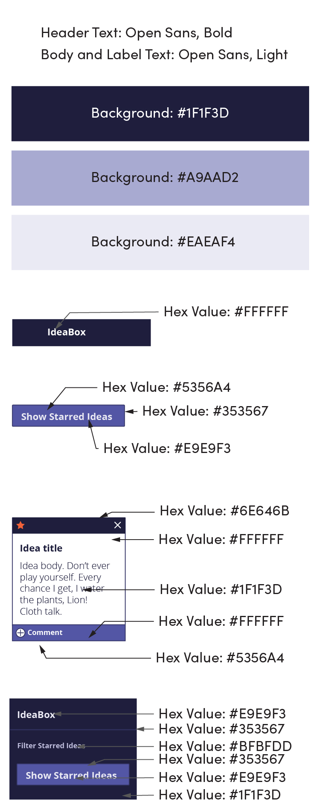
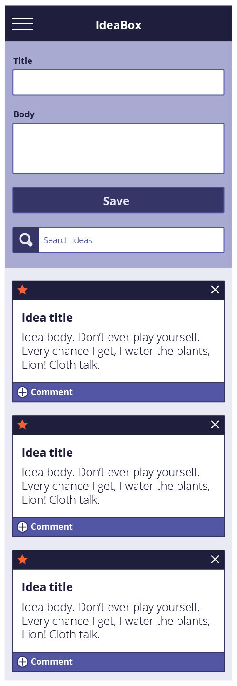
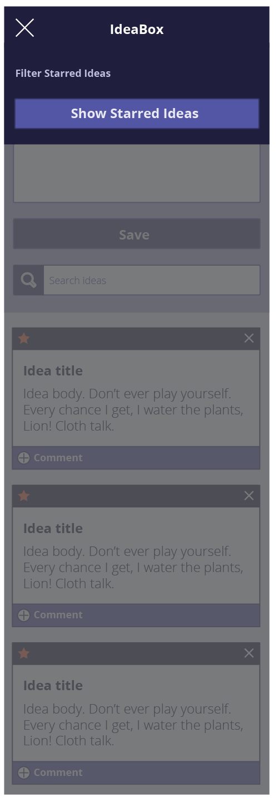

## Overview

Every developer has more ideas than time. As David Allen likes to say "the human brain is for creating ideas, not remembering them." In this project, we'll be building an application a new client that records and archives our ideas (good and bad alike).

Throughout the project, one of our focuses will be on providing a fluid and responsive client-side interface. To this end, we'll rely on JavaScript and to implement snappy filtering in the browser, and `localStorage` to persist our wonderful ideas between sessions.  Our goal is to also incorporate an agile workflow by incorporating two weekly sprints.

*Note*: Expectations listed for Iteration 0-1 should be complete by your first check-in. No JavaScript should be written before that check-in, unless you get approval to move ahead with functionality from your Project Manager.

## Learning Goals

* Continue to improve on building responsive client-side applications with good user feedback
* Understand how to implement client-side data persistence using `localStorage`
* Understand what it looks like to have a separate data model (using a class) and DOM model
* Utilize `data-*` attributes
* Incorporate & iterate over arrays in order to filter what is being displayed
* Craft code with clean style, using small functions that show trends toward DRYness and SRP

## Setup

- Complete a DTR
- Create a slack channel for all team members and your Project Manager.
- Fork [the boilerplate
  repository](https://github.com/turingschool-examples/ideabox-boilerplate). Add all team members and your Project Manager as collaborators.
- Deploy your application to GitHub Pages.
- In the team channel, drop the repo link and GitHub pages link.

## Progression

### Iteration 0 - Desktop Layout

Plan then write the HTML and CSS so that your application matches this comp. Based on what you are building, you can anticipate that the Idea "cards" will not always be there on page load, but for now, they should.

Use the same text on your cards that is used in the spec so you can ensure your spacing/sizing is accurate.

You will need the `svg` files for the star, delete, and menu icons. [Here's the link to download the `svg` icons.](https://drive.google.com/drive/folders/18xpWplI0tpXIK1omBZeq04LEx2OMzzMK?usp=sharing)

### Iteration 1 - Mobile Layout

Now that your Desktop Layout is in place, it's time to write some media queries so this is a responsive site.

Full mobile layout:

Full mobile layout with open navigation:

### Iteration 2 and beyond

After you have completed Iterations 0-1, your Project Manager will provide you with the next iteration.

<!-- Everything below will be commented out, only for Instructors to see -->
<!--
### Architecture

For this project, we'll be increasingly thinking about the "data model" and "DOM model" as separate entities. We'll be using:

- JSON and `localStorage` to persist data on page reload.
- vanilla JavaScript to manage client-side interactions.

Your entire application will consist of one HTML page or template. You will have two JavaScript files, for now:

1. An `idea.js` file that contains an `Idea` class.
  * `Idea` methods must include, but are not limited to:
    1. `constructor`
    2. `saveToStorage` (should only have one job which is to save the instance to storage)
    3. `deleteFromStorage`
    4. `updateIdea` (should be able to update the idea's title, body, or starred state)
2. A `main.js` file that contains all DOM related JavaScript.

**Note** The `idea.js` file  must be the first script in your HTML so that your `main.js` file has access to your `Idea` class.

### Data Model

* An idea has an _id_, _title_, _body_, and _star_.
  * The _id_ should be a unique identifier. (Note: generating a random number does _not_ guarantee it will be unique)
  * _title_ and _body_ are strings.
  * _star_ is a boolean.

Each idea should be created as an object instance of the `Idea` class. Once an idea object is created, all that data can be used to update the DOM. That object should also be added to a `list` of all the ideas your application currently has. This should probably be a global variable in your `main.js`.

### Iteration 2 - Adding Ideas

As a user,
- When I click "Save",
- If I entered information in both the "Title" and "Body" input fields,
- I should see a new idea card with the provided title and body appear in the idea list

As a user,
- When I click "Save",
- If I entered information in both the "Title" and "Body" input fields,
- I should see the "Title" and "Body" input fields clear out

As a user,
- When I look at the "Save" button,
- When either the "Title" or "Body" inputs are empty,
- I should notice that the "Save" button is disabled because it is a lighter color and the cursor is not a pointer when I hover over it

As a user,
- When I click "Save",
- And a new card is successfully created,
- I should _not_ see the page reload

### Iteration 3 - Favoriting & Deleting Ideas

As a user,
- When I click the "Delete" button on an idea card,
- The card should be permanently removed from my view

As a user,
- When I click the "Star" button on an idea card,
- When the button was an outline of a star (not favorited),
- The button should now be a filled in star (favorited)

As a user,
- When I click the "Star" button on an idea card,
- When the button was a filled in star (favorited),
- The button should now be an outline of a star (not favorited)

As a user,
- When I delete or favorite any card,
- I should _not_ see the page reload

### Iteration 4 - Local Storage & Filtering

As a user,
- When I create one idea successfully, then refresh the page,
- The idea card is still in the idea list

As a user,
- When I create two cards successfully, delete one, then refresh the page,
- One idea card is still in the idea list (the one I did not delete)

As a user,
- When I favorite an idea card, then refresh the page,
- That idea card is still in the "favorite" state with the filled in star icon

As a user,
- When I click "Show Starred Ideas"
- I see only card that are favorited

As a user,
- When I click "Show Starred Ideas"
- I see the text on that button has changed to "Show All Ideas"

As a user,
- When I click "Show Starred Ideas"
- Then I click what is now "Show All Ideas"
- I see all idea, favorited or not

As a user,
- When a type a letter or phrase into the search bar
- I now only see the cards that include the letter/phrase in the title or body

As a user,
- When I backspace and delete something from the search bar, so that it's empty
- I see all cards since no search criteria is being provided

### Iteration 5 - Commenting on Ideas

### Architecture

In addition to your `idea.js` and `main.js`, you now need to have a `comment.js` file.

This file should hold a class, `Comment`. `Comment` methods must include, but are not limited to:
1. `constructor`
2. `saveToStorage` (should only have one job which is to save the instance to storage)
3. `deleteFromStorage`

### Data Model

* An idea now also has a _comments_ property
  * The _id_ should be a unique identifier. (Note: generating a random number does _not_ guarantee it will be unique)
  * _title_ and _body_ are strings.
  * _star_ is a boolean.
  * _comments_ is an array.

* A comment should have _content_ - a string that holds the content of a comment. If you end up completing an extension, you may need your comment class to have additional properties.

As a user,
- When I click the "Add" icon on an idea card,
- A form to add a comment appears

As a user,
- When I open the comment form on a card, type something in, and click "Add Comment",
- The text typed in is now a comment attached to this card

As a user,
- When I open the comment form on a card, type something in, and click "Add Comment",
- The "Comment" input field clears out and is ready to accept another comment

As a user,
- When I open the comment form on am idea card,
- When the "Comment" input field is empty,
- I should notice that the "Add Comment" button is disabled because it is a lighter color and the cursor is not a pointer when I hover over it

As a user,
- When I comment on an idea card, then refresh the page,
- That comment is still on the idea card -->

## Rubric

### Functional Expectations

* **4:** Application meets all of the expectations from Iteration 4 and most functionality from Iteration 5.
* **3:** Application meets all of the expectations from Iteration 4.
* **2:** Application meets all of the expectations of Iteration 3.
* **1:** Application meets all of the expectations of Iteration 2.

### Comp Recreation

* **4:** Additional elements that have been added match the visuals established in the comps. Every little detail was built out thoughtfully - from hover states to placeholders, etc.
* **3:** Application implements all major comp details accurately and correctly on desktop and mobile (colors, fonts, icons, spacing, alignment, etc.) with **smooth transitions between screen sizes**. Additional elements added generally match the visuals established in the comps, but may be slightly awkward.
* **2:** Application implements most major comp details accurately and correctly on **desktop and mobile** (colors, fonts, icons, spacing, alignment, etc.). Transitions between screen sizes may not be smooth.
* **1:** Application implements all major comp details on desktop only (colors, fonts, icons, spacing, alignment, etc.), OR masonry layout is not implemented.

### Git Workflow & Documentation

* **4:** A PR template was used. A code review was requested and completed by a mentor, and all team members can speak to how the feedback in code review was implemented (and point to the commit(s) that implemented the feedback).
* **3:** Every team member (on a team of 3) authors between 25%-40% of the commits. Most commits are formatted correctly. Every team member contributes to at least 2 meaningful PR conversations. The README is formatted well and contains:
  - Overview of project and goals
  - Overview of technologies used, challenges, and wins, any other reflections
  - Screenshots of comp and your app
  - Credit all teammates
* **2:** Every team member (on a team of 3) authors between 20%-45% of the commits. More than a few commits are formatted incorrectly. The README is formatted well but may be lacking in detail.
* **1:** Commit and PR history does not tell a story of the application OR a README has not been created/has minimal information.

### JavaScript - Style and Implementation

* **4:**
  * All loops are refactored into the proper array prototype iteration methods
  * Uses logical operators instead of if/else statements where applicable
  * When 'Filtering and Searching by Text' and 'Viewing Urgent ToDo Cards', to-dos that do not need to be shown on the DOM should be completely removed from the DOM, instead of only being hidden from view
  * Application uses the Data Model exclusively to track changes to the ideas,
    and display of ideas happens after the Data model has been updated
* **3:**
  * DRY and SRP practices are demonstrated in codebase and students can speak to implementation decisions
  * All functions are less than 10 lines
  * There are no nested if/else statements
  * There are no global variables aside from query selectors and an array for your to-dos
  * Uses event delegation correctly on dynamic elements for deleting, checking tasks off, and marking a to-do urgent
* **2:** Application correctly implements data model for the `Idea` class including all required methods
* **1:** Crafts JS according to the [Turing JS Style Guide](https://github.com/turingschool-examples/javascript/tree/master/es5)
