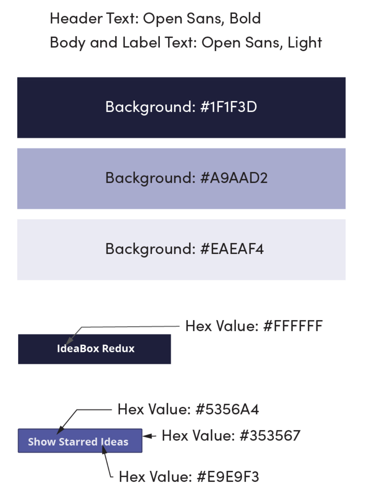

## Overview: Week 1

Every developer has more ideas than time. As David Allen likes to say "the human brain is for creating ideas, not remembering them." In this project, we'll be building an application a new client that records and archives our ideas (good and bad alike).

Throughout the project, one of our focuses will be on providing a fluid and responsive client-side interface. To this end, we'll rely on JavaScript and to implement snappy filtering in the browser, and `localStorage` to persist our wonderful ideas between sessions.  Our goal is to also incorporate an agile workflow by incorporating two weekly sprints.

*Note*: Expectations listed for Iteration 0-1 should be complete by your first check-in. No JavaScript should be written before that check-in, unless you get approval to move ahead with functionality from your Project Manager.

## Learning Goals

* Continue to improve on building responsive client-side applications with good user feedback
* Understand how to implement client-side data persistence using `localStorage`
* Understand what it looks like to have a separate data model (using a class) and DOM model
* Utilize `data-*` attributes
* Incorporate & iterate over arrays in order to filter what is being displayed
* Craft code with clean style, using small functions that show trends toward DRYness and SRP

## Setup

- Complete a DTR
- Create a slack channel for all team members and your Project Manager.
- Create a directory called `ideabox`, with `index.html` and `styles.css` files inside of it. Initialize and create a GitHub project. Add all team members and your Project Manager as collaborators.
- Deploy your application to GitHub Pages.
- In the team channel, drop the repo link and GitHub pages link.

## Progression

### Iteration 0 - Desktop Layout

Plan then write the HTML and CSS so that you application matches this comp. Based on what you are building, you can anticipate that the Idea "cards" will not always be there on page load, but for now, they should.

Use the same text on your cards that is used in the spec so you can ensure your spacing/sizing is accurate.

![desktop specs][desktop-base]

You will need the `svg` files for the star, delete, and menu icons. [Here's the link to download the `svg` icons.](https://drive.google.com/drive/folders/18xpWplI0tpXIK1omBZeq04LEx2OMzzMK?usp=sharing)

[desktop-base]: /assets/images/projects/ideabox/ideabox-redux-01.jpg

### Iteration 1 - Mobile Layout

Now that your Desktop Layout is in place, it's time to write some media queries so this is a responsive site.

Full mobile layout:

![full mobile layout][mobile-full]

Full mobile layout with open navigation:

![full mobile layout with navigation][mobile-full-navigation]

[mobile-full]: /assets/images/projects/ideabox/ideabox-redux-02.jpg
[mobile-full-navigation]: /assets/images/projects/ideabox/ideabox-redux-03.jpg

### Iteration 2 - Adding Ideas

### Iteration 3 - Favoriting & Deleting Ideas

### Iteration 4 - Commenting on Ideas
