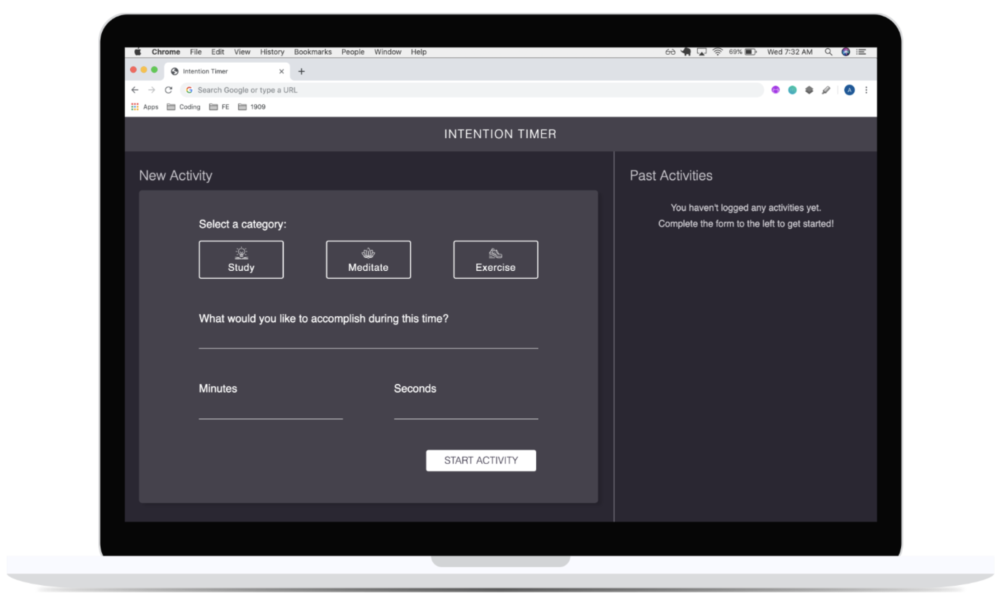
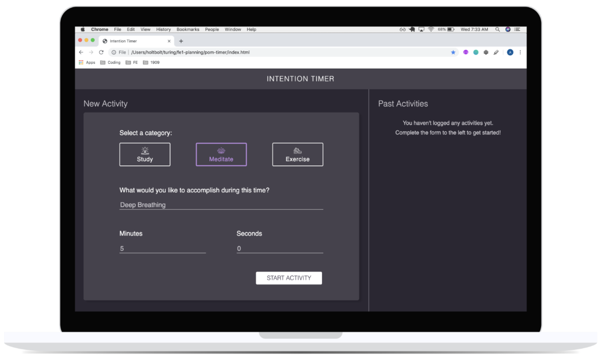
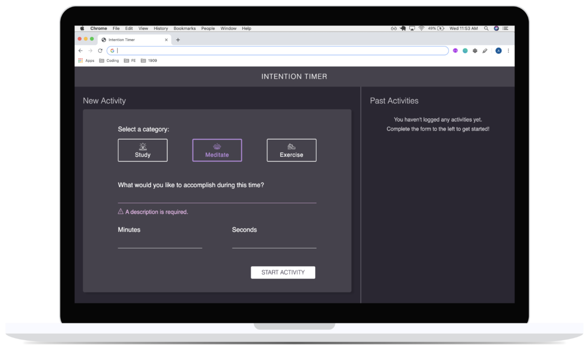
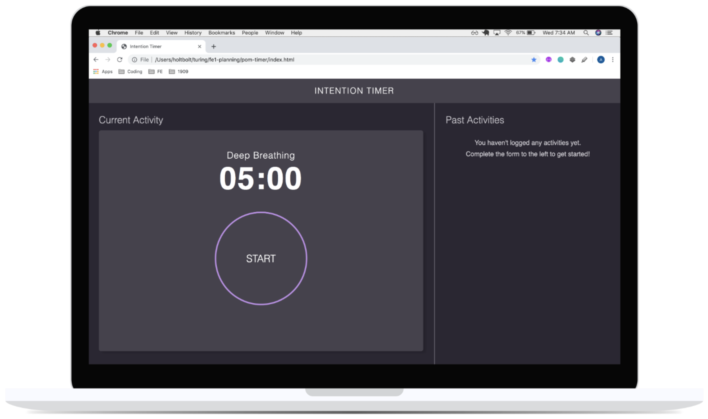
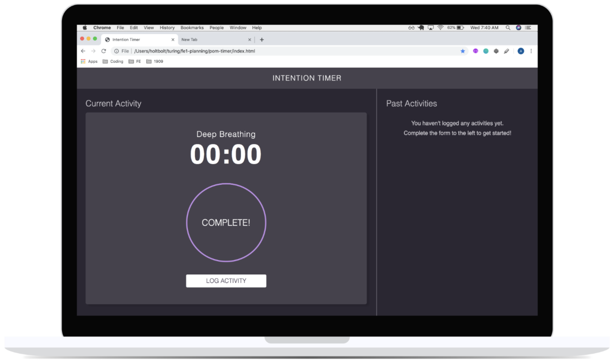
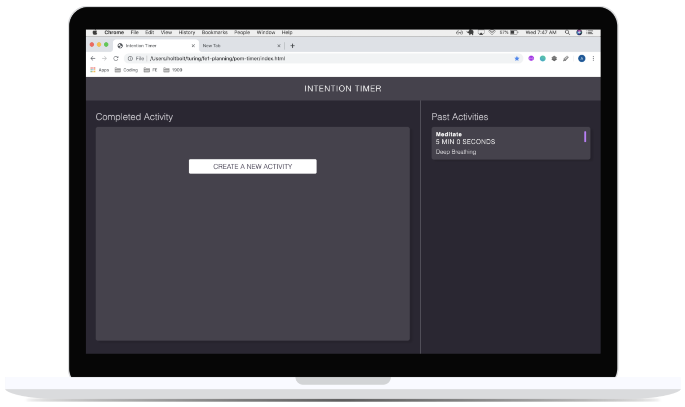
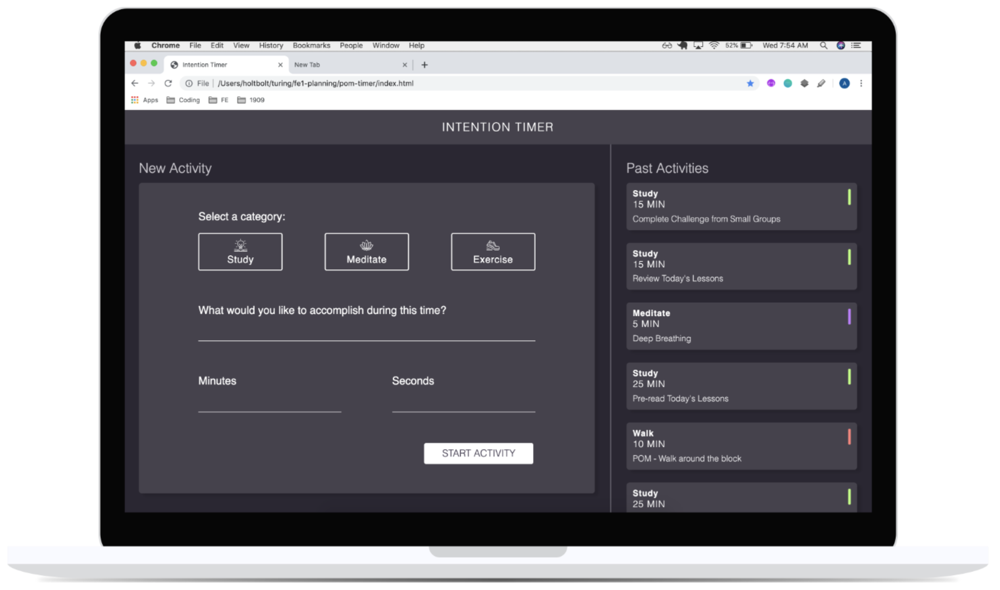

## Learning Goals

* Develop your skills in writing:
  * semantic HTML
  * clean & organized CSS styles
  * DRY and organized JavaScript
* Manipulate the page after it has loaded adding, removing, and updating elements on the DOM
* Understand event bubbling and use event delegation on dynamic elements
* Persist data across page refreshes by using local storage

## Overview

You'll be building an application that allows a user to set goals for their health and productivity, tied to an amount of time. Users will select an activity category, set the amount of time they want to spend on that activity, and start the timer. The app will log that activity to keep track of how the user has been spending their time.

## Set Up

Create a new directory called `intention-timer`.You'll need to initialize git in your local repo. You can brush up on that process with [this article](https://guides.github.com/introduction/git-handbook/).

It should contain:
- `index.html`
- `styles.css`
- `activity.js`
- `main.js`
- `assets` (this is a directory that will hold your icon files)

Make sure both teammates and your assigned instructor are all added as collaborators on the GitHub repository.

## Progression

### Iteration 0 - Zero State

- Build the layout with HTML & CSS
  - Before moving on, the header and left side of the page should match the comp.
  - The right side of the page should only have the sub-header and not that no activities exist since you do not have past activity card functionality yet!

### Iteration 1 - Activity Class

**STOP!** Did you refactor Iteration 0? Clean up your code before moving on!

- Build out the Activity class
  - Properties should include:
    - category
    - description
    - minutes
    - seconds
    - completed
    - id
  - Methods should include:
    - countdown (or beginTimer or startTimer - whatever naming makes sense to you)
    - markComplete
    - saveToStorage

Make sure that you link this file in your `index.html` using a `script` tag, above the link to your `main.js` file.

### Iteration 2 - Form Functionality

**STOP!** Did you refactor Iteration 1? Clean up your code before moving on!

- Form Functionality
  - When an activity category is clicked on (`Exercise`, `Meditate`, or `Study`), the associated border and icon should change colors to give a visual indication that it has been selected. Colors are provided in comp.
  - An input field should be provided for `What would you like to accomplish during this time?`, `minutes` and `seconds`. The `minutes` and `seconds` fields should only accept numbers. (Hint: more than one layer should probably be put into place to ensure this. Make sure that `e` cannot be accepted.)
  - A `Start Activity` button is provided to submit the data entered into the form. When the button is clicked, update your data model with an instance of the Activity class.
  - When the `Start Activity` button is clicked, the user should no longer see the form, and instead see a timer clock. The timer clock should display the user-provided minutes and seconds, as well as the description. The category should not appear, but the outline of the circle should match the color associated with the category.
  - If the `Start Activity` button is clicked before the user has entered information into all four inputs, the user will receive an error message, but will not lose any information that was provided.

### Iteration 3 - Build an MVP

**STOP!** Did you refactor Iteration 2? Clean up your code before moving on!

- The user can start the time by clicking `Start`.
- While timer is running, the user should see it count down by second.
- When the timer completes, an [`alert`](https://developer.mozilla.org/en-US/docs/Web/API/Window/alert) should appear in the browser, letting the user know that the time is up and the activity has been completed. 
- NOTE: This alert is temporary and is not something we suggest using in a fully built out application.

### Iteration 4 - Logging Past Activities

**STOP!** Did you refactor Iteration 3? Clean up your code before moving on!

- When the timer completes, the `alert` no longer appears.
- Instead, a motivational or congratulatory message appears on the left side of the page, replacing the timer.
- When the user acknowledges the message and completion of the activity by clicking `Log Activity`, a card with the `category`, `time`, and the users input for `What would you like to accomplish during this time?` should appear on the card. The card should also have a small color-coded visual indicator of the category. Color, size, and spacing of that visual indicator are provided in comp.
- Before moving on, your past activity cards should match the comp.

## Iteration 5 - Persisting past activities

**STOP!** Did you refactor Iteration 4? Clean up your code before moving on!

- When the user refreshes the page,
  - Their past activities are still displayed!
  - Hint: localStorage could come in handy here...

## Optional Extensions

Remember, do not move on to any of these extensions if functionality from the previous iterations is not complete or bug-free.

- **Option 1:** Expand/Collapse Reflection
  - When timer completes but before a card is created, the user can submit a reflection on the way they spent that time. Then, they can click the `Log Activity` button to create the card.
  - Even though there is more information about the activity, the reflection should not appear on the card immediately. The cards should still match the comp. The user should have a visual indicator that there is "more info" on a card. When the user takes the appropriate action, the card expands to show the reflection the user had submitted.
  - The user should also have a way to collapse the additional information/reflection.

- **Option 2:** Favorite & Re-Do
  - A user should be able to `favorite` or `re-do` an activity.
  - A favorite icon should be on the card. When clicked, the icon should change its appearance to communicate it has been favorited.
  - An icon to represent `re-do` should also be on the card. It should only be enabled when the left side of the page is displaying the `New Activity` form. If the `re-do` button is clicked, the form will populate with the data from the card that was clicked on.

- **Option 3:** Pausing the Timer
  - After the timer begins, a user should be able to pause the timer and resume an activity when they wish

- **Option 4:** Animate the Timer
  - Animate the border around the timer in a way that communicates how much time is left.

**Consider the user experience:** the actions a user needs to take should be intuitive for someone who has never seen this application before. [Smashing Magazine](https://www.smashingmagazine.com/) contains great resources and articles, but their homepage also has some great examples of classy animations and hover states that convey something to the user.

Before moving on to an extension, the site should match the comp and any additions should be in the spirit of the comp and have been user-tested from a great user experience (UX).

## Comp Details

### Colors

- Main background: `#2B2733`
- Text on main background: `#CBC9CF`
- Header, cards: `#46424D`
- Card shadow: `#26222D`
- Text on header and cards: `#FFF`
- Study: `#B3FD78`
- Meditate: `#C278FD`
- Exercise: `#FD8078`
- Error: `#EFB7EC`

### Icons

Active (color-coded) and non-active (white) icons are all stored [here](https://drive.google.com/drive/folders/1EpDeH6IeDTOaK3fP9YR_XkaB4mwCWZxm?usp=sharing). You will need to download and save these in an `assets` directory in your project.

### Fonts

[Montserrat](https://fonts.google.com/?query=mont&selection.family=Montserrat:300,400), both 300 and 400 weights are used in the comp. You'll need to link this in the HTML.

## Rubric

This rubric should serve as a guide for students as they progress through the project, as well as to self-evaluate. Instructors will use it to evaluate the project at its final due date/time, and provide detailed feedback so students know what areas to focus on in future projects.

Scores land in a range between 1 and 4. Below is a breakdown of what those numbers represent.

* **4 (exceptional)** - went beyond set learning goals; did self-teaching to go above and beyond in this area
* **3 (proficient)** - exactly on track! you're where you need to be in this area! great work!
* **2 (trailing)** - a little behind where we want to see you right now; in a good place to build familiarity/competency in this area; study in this area to level up and grow
* **1 (dragging)** - significantly behind where we want to see you; major growth needs to be shown in this area; set up a pairing session with an instructor as soon as possible

To earn a given score, an application must meet the requirements listed in that score explanation and all scores lower.

### Professionalism

* **4:** 
  - Team uses a PR template
  - Team habitually conducts thorough code reviews in the GitHub GUI to document the progress of the application
  - Team has sought out code reviews from one or more mentors
  - README is well formatted and descriptive with screenshots or gifs of the application in action.
* **3:** 
  - Commits are atomic and frequent, effectively documenting the evolution/progression of the application
  - Commit messages are consistent, descriptive, and concise
  - Team uses PRs to screen/verify code before adding it to the main branch
  - There is no more than a 10% disparity in project contributions between teammates
  - README is well formatted and gives good context about the project, including links to both contributors' GitHub profiles, and to the deployed GitHub Pages site
* **2:** 
  - Commits are large and do not effectively communicate the progression of the application
  - Team uses PRs but do not review code before merging into the main branch
  - All teammates can speak to the purpose and functionality of any/every line of code
  - There is a 20% disparity in project contributions between teammates
  - README is brief and does not provide context for the project
* **1:** 
  - Teammates do not understand the purpose and functionality of every line of code
  - Some commits are pushed directly to the main branch
  - PRs are used inconsistently
  - There is a 50% disparity in project contributions between teammates
  - There is no README, or README is insufficient

### Comp Recreation

* **4:** 
  - Additional elements and animations  have been added that match the visuals established in the comps.
* **3:** 
  - Application implements **all** major comp details accurately and correctly on desktop (colors, fonts, icons, spacing, alignment,  etc).
  - If additional elements were added, they generally match the visuals established in the comps, but may be slightly awkward. 
  - Careful attention was given to the little details like spacing, alignment, and hover states.
* **2:** 
  - Application implements most major comp details accurately and correctly on desktop (colors, fonts, icons, spacing, alignment,  etc.).
* **1:** 
  - Crafts markup according to the [Turing CSS style guide](https://github.com/turingschool-examples/css)

### HTML && CSS - Style and Implementation
* **4:**
  * Application adds to the requirements of the Proficient category by using [BEM](http://getbem.com/), [SMACCS](http://smacss.com/), or another set of naming conventions for classes
  * Application fully implements HTML that is accessible for folks with visual disabilities. Reference [this lesson plan](http://frontend.turing.io/lessons/floating/aria-accessibility.html).

* **3:**
  * Application utilizes good naming conventions for HTML classes and IDs
  * CSS is DRY, utilizing existing classes/rules to cut down on repetitive styles

* **2:**
  * Application adds to the above with HTML that incorporates semantic HTML elements whenever possible
  * Application has a simple, clean HTML structure
  * Application utilizes organizational conventions for the whole CSS stylesheet

* **1:**
  * Crafts CSS according to the [Turing CSS style guide](https://github.com/turingschool-examples/css)
  * Crafts markup according to the [Turing HTML style guide](https://github.com/turingschool-examples/html) 

### JavaScript - Style and Implementation

* **4:**
  * Functions and code are well-refactored and show developer empathy
  * There are no global variables aside from query selectors, `pastActivities` and `currentActivity`.
  * Uses logical operators instead of if/else statements wherever applicable
  * There are no nested if/else statements
* **3:**
  * Application uses event delegation correctly on dynamic elements
  * Functions are [DRY](https://en.wikipedia.org/wiki/Don%27t_repeat_yourself) with a focus on [SRP](http://knnthvu.weebly.com/srp-and-dry.html). No function is more than 10 lines (this does not include functions that insert html). Remember that you shouldn't sacrifice the legibility of your code to shorten the number of lines.
  * Application demonstrates full separation of data-model and presentational logic (there is no DOM logic in the `Activity` class)
  * Application makes use of arguments and parameters to make functions more dynamic/reusable
  * Application correctly uses `localStorage` to persist data
* **2:**
  * There are no extraneous or unnecessary parameters in functions
  * Application uses function declarations over anonymous functions in event listeners
  * Application uses appropriate number of if/else statements to handle multiple paths of logic/error handling
  * Application fails to fully separate data-model and presentational logic (DOM) - example: there is DOM logic in the `Activity` class
* **1:** 
  * Crafts JS according to the [Turing JS style guide](https://github.com/turingschool-examples/javascript/tree/master/es5)

### Functional Expectations

Functionality is the least important piece of the rubric. It's included because it is another benchmark to gauge proficiency (for example, we can’t grade your JS if there isn’t enough of it written!). However, you should not pursue functionality at the expense of code quality or the learning/growth of all team members.

This means, we DO NOT want to see:
- Code that completes iterations but is sloppy
- One or both team members do not understand every single line of code
- One or both team members skips the problem solving process (pseudocoding, talking out the problem, articulating, planning) in the pursuit of completing functionality

A score cannot be earned if all developers are not intimately familiar with the concepts and understanding driving every line of code.

* **4:** Application completes an extension
* **3:** Application meets all of the expectations of Iteration 5.
* **2:** Application meets all of the expectations of Iteration 4.
* **1:** Application meets all of the expectations of Iteration 3.