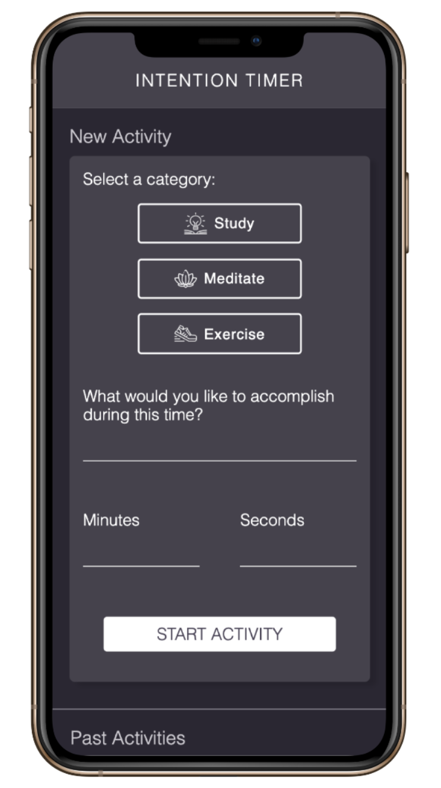
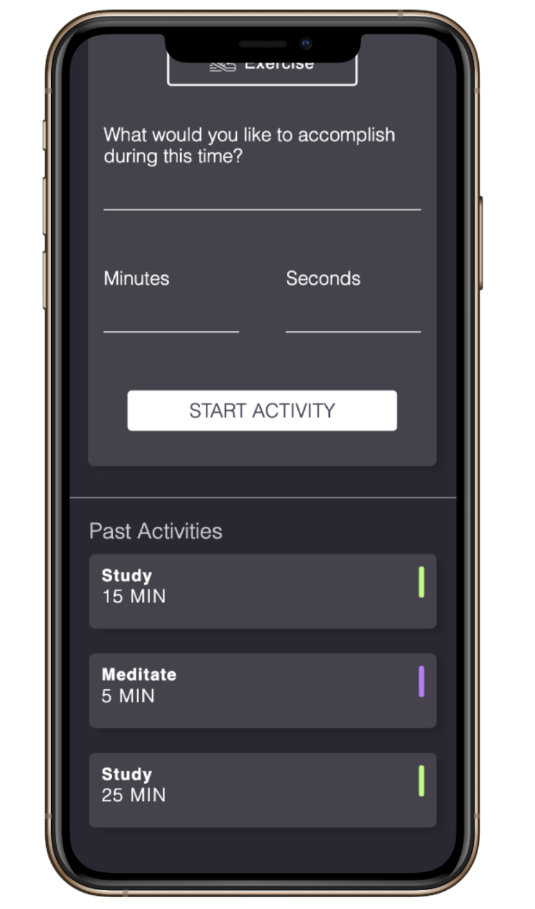

## Learning Goals

* Develop your skills in writing:
  * semantic HTML
  * clean & organized CSS styles
  * DRY and organized JavaScript
* Manipulate the page after it has loaded adding, removing, and updating elements on the DOM
* Understand event bubbling and use event delegation on dynamic elements

## Overview

You'll be building an application that allows a user to set goals for their health and productivity, tied to an amount of time. Users will select an activity category, set the amount of time they want to spend on that activity, and start the timer. The app will log that activity to keep track of how the user has been spending their time.

## Set Up

Create a new directory called `intention-timer`. It should contain:
- `index.html`
- `styles.css`
- `main.js`
- `assets` (this is a directory that will hold your icon files)

Make sure both teammates and instructors are added as collaborators on the GitHub repository.

## Progression

### Iteration 0 - Zero State

- Build the layout with HTML & CSS
  - Before moving on, the header and left side of the page should match the comp.
  - The right side of the page should only have the sub-header and not that no activities exist since you do not have past activity card functionality yet!

### Iteration 1 - Form Functionality

- Form Functionality
  - When an activity category is clicked on (`Exercise`, `Meditate`, or `Study`), the associated border and icon should change colors to give a visual indication that it has been selected. Colors are provided in comp.
  - An input field should be provided for `What would you like to accomplish during this time?`, `minutes` and `seconds`. The `minutes` and `seconds` fields should only accept numbers. (Hint: more than one layer should probably be put into place to ensure this. Make sure that `e` cannot be accepted.)
  - A `Start Activity` button is provided to submit the data entered into the form. When the button is clicked, the user should no longer see the form, and instead see a timer clock. The timer clock should display the minutes a seconds, as well the and description. The category should not appear, but the outline of the circle should match the color associated with the category.
  - If the `Start Activity` button is clicked before the user has entered information into all four inputs, the user will receive an error message, but will not lose any information that was provided.

### Iteration 2 - Build an MVP

- The user can start the time by clicking `Start`.
- While timer is running, the user should see it count down by second.
- When the timer completes, an [`alert`](https://developer.mozilla.org/en-US/docs/Web/API/Window/alert) should appear in the browser, letting the user know that the time is up. (This alert is temporary and is not something we suggest using in a fully built out application.)

### Iteration 3 - Logging Past Activities

- When the timer completes, the `alert` no longer appears.
- Instead, a motivational or congratulatory message appears on the left side of the page, replacing the timer.
- When the user acknowledges the message and completion of the activity by clicking `Log Activity`, a card with the `category`, `time`, and the users input for `What would you like to accomplish during this time?` should appear on the card. The card should also have a small color-coded visual indicator of the category. Color, size, and spacing of that visual indicator are provided in comp.
- Before moving on, your past activity cards should match the comp.

## Iteration 4 - Adding Functionality

For this iteration, your team can select one or both of the options below:

- **Option 1:** Expand/Collapse Reflection
  - When timer completes but before a card is created, the user can submit a reflection on the way they spent that time. Then, they can click the `Log Activity` button to create the card.
  - Even though there is more information about the activity, the reflection should not appear on the card immediately. The cards should still match the comp. The user should have a visual indicator that there is "more info" on a card. When the user takes the appropriate action, the card expands to show the reflection the user had submitted.
  - The user should also have a way to collapse the additional information/reflection.

- **Option 2:** Favorite & Re-Do
  - A user should be able to `favorite` or `re-do` an activity.
  - A favorite icon should be on the card. When clicked, the icon should change its appearance to communicate it has been favorited.
  - An icon to represent `re-do` should also be on the card. It should only be enabled when the left side of the page is displaying the `New Activity` form. If the `re-do` button is clicked, the form will populate with the data from the card that was clicked on.

**Consider the user experience:** the actions a user needs to take should be intuitive for someone who has never seen this application before. [Smashing Magazine](https://www.smashingmagazine.com/) contains great resources and articles, but their homepage also has some great examples of classy animations and hover states that convey something to the user.

Before moving on to an extension, the site should match the comp and any additions should be in the spirit of the comp and have been user-tested from a great user experience (UX).

## Extensions

- Once the user starts the timer, they have an option to pause the timer.
- An `Activity` class is written and utilized to hold the state of a given activity.

## Comp Details

### Colors

- Main background: `#2B2733`
- Text on main background: `#CBC9CF`
- Header, cards: `#46424D`
- Card shadow: `#26222D`
- Text on header and cards: `#FFF`
- Study: `#B3FD78`
- Meditate: `#C278FD`
- Exercise: `#FD8078`
- Error: `#EFB7EC`

### Icons

Active (color-coded) and non-active (white) icons are all stored [here](https://drive.google.com/drive/folders/1EpDeH6IeDTOaK3fP9YR_XkaB4mwCWZxm?usp=sharing). You will need to download and save these in an `assets` directory in your project.

### Fonts

[Montserrat](https://fonts.google.com/?query=mont&selection.family=Montserrat:300,400), both 300 and 400 weights are used in the comp

### Mobile Layouts

## Rubric

### Functional Expectations

* **Exceptional/4:** Application adds three or more of the extensions from phase four.
* **Proficient/3:** Application meets all of the expectations of phase three.
* **Advanced Beginner/2:** Application meets all of the expectations of phase two.
* **Novice/1:** Application meets all of the expectations of phase one.

### Comp Recreation

* **Exceptional/4:** Application implements all major comp details accurately and correctly on desktop **and** mobile (colors, fonts, icons, spacing, alignment,  etc.) with smooth transitions between screen sizes. Additional elements that have been added match the visuals established in the comps.
* **Proficient/3:** Application implements **all** major comp details accurately and correctly on desktop and mobile (colors, fonts, icons, spacing, alignment,  etc.) with smooth transitions between screen sizes. Additional elements added generally match the visuals established in the comps, but may be slightly awkward. Careful attention was given to the little details like spacing, alignment, and hover states.
* **Advanced Beginner/2:** Application implements most major comp details accurately and correctly on desktop & mobile (colors, fonts, icons, spacing, alignment,  etc.).
* **Novice/1:** Application implements most major comp details accurately and correctly on **desktop only** (colors, fonts, icons, spacing, alignment, etc.)

### HTML - Style and Implementation

* **Exceptional/4:** Application fully implements HTML that is accessible for folks with visual disabilities. Reference [this lesson plan](http://frontend.turing.io/lessons/floating/aria-accessibility.html)
* **Proficient/3:** Application adds to the above with markup that is easy to read and follows across naming conventions
* **Advanced Beginner/2:** Application adds to the above with HTML that incorporates semantic HTML elements and has a simple, clean HTML structure.
* **Novice/1:** Crafts markup according to the [Turing HTML style guide](https://github.com/turingschool-examples/html)

### CSS - Style and Implementation

* **Exceptional/4:** Application adds to the requirements of the Proficient category by using [BEM](http://getbem.com/), [SMACCS](http://smacss.com/), or another set of naming conventions for classes
* **Proficient/3:** Applications adds to the above by removing repetitive rules and blocks of code according to the DRY principle and has 3 or less media queries for responsiveness
* **Advanced Beginner/2:** Application adds organization for the whole stylesheet and within rules and has 5 or less media queries for responsiveness
* **Novice/1:** Crafts CSS according to the [Turing CSS style guide](https://github.com/turingschool-examples/css)

### JavaScript - Style and Implementation

* **Exceptional/4:**
  - Functions and code are well-refactored and show developer empathy
  - There are no global variables aside from query selectors, `time` and `currentTimerInfo`.
  - All functions are less than 10 lines
  - Uses logical operators instead of if/else statements where applicable
* **Proficient/3:**
  * Application uses event delegation correctly on dynamic elements
  * Functions are [DRY](https://en.wikipedia.org/wiki/Don%27t_repeat_yourself) with a focus on [SRP](http://knnthvu.weebly.com/srp-and-dry.html)
  * There are no nested if/else statements
* **Advanced Beginner/2:**
  * All parameters are used in their respective functions
  * Uses function declarations over anonymous functions in event listeners
  * Uses if/else statements to handle multiple paths of logic/error handling
* **Novice/1:** Crafts JS according to the [Turing JS style guide](https://github.com/turingschool-examples/javascript/tree/master/es5)
