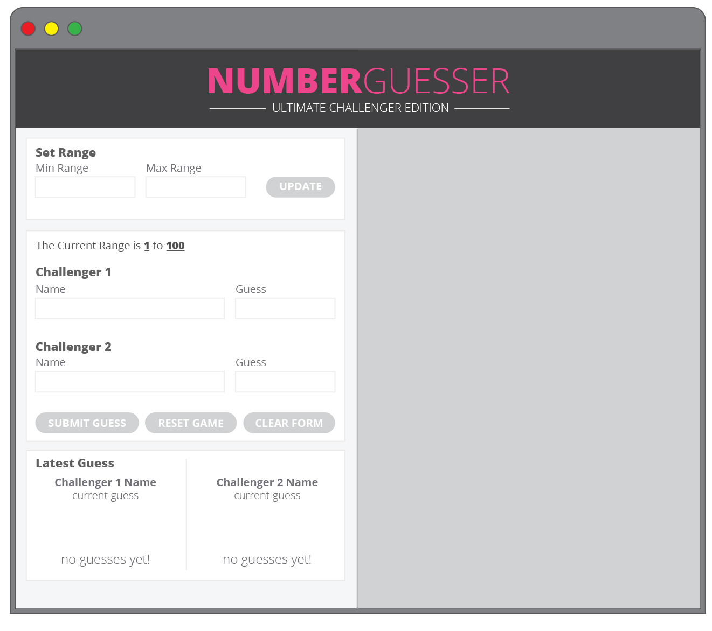
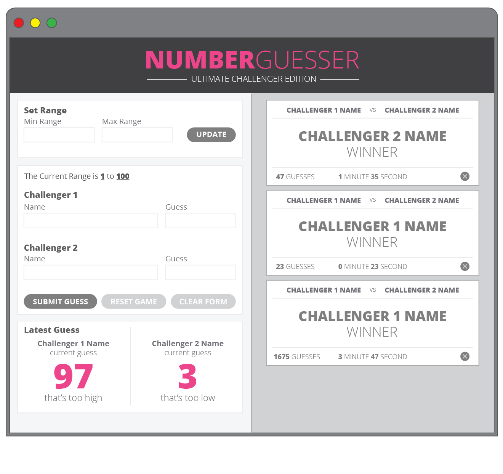
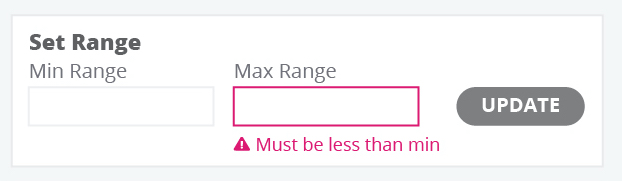
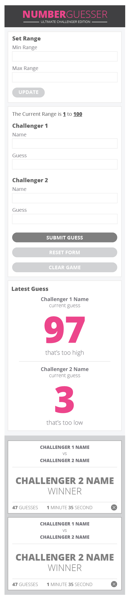

## Learning Goals

* Develop your skills in writing:
  * clean & organized CSS
  * DRY and organized JavaScript
* Build error handling into an application so a user has an interface that is clear and easy to use
* Manipulate the page after it has loaded adding, removing, and updating elements on the DOM
* Understand event bubbling and use event delegation on dynamic elements

## Overview

Over the next two weeks, you'll work with a teammate to build a two-player game!

## Set Up

### GitHub

**One teammate will need to follow the steps below for the initial setup:**
- Create a project on your machine title `number-guesser`
  - Touch `index.html`, `styles.css`, and `main.js` files inside the project
  - Create a `assets` directory inside the project
- Follow the directions [here](https://frontend.turing.edu/lessons/module-1/github-repo.html) to set up a local Git repository and connect it to a remote GitHub repository.
- In the "Settings" tab, click "Collaborators & teams", then type your partners email or GitHub handle in to invite them. Either send them the provided link in Slack or tell them to check their email for the link.

**Now, the other partner should follow these directions:**
- Click the link provided by your partner, and accept the invitation to be a collaborator on this repo. You **MUST** do this - if you just clone, you won't have push access.
- Now, clone the repo down to your machine.
- FYI - even though you are a collaborator, you don't _own_ this repo, so it won't show up on your repo page. If you'd like it to be there for whatever reason, we recommend waiting until the project is submitted, then forking it to your account.

At this point, both partners are set up to contribute to this project!

### Project Board

**To set up your project board, one teammate needs to follow these directions:**
- Create a free account, if you don't have one yet, with [Trello](www.trello.com/trello‎)
- Go to [this site - the template](https://trello.com/b/MVhsK3uT/number-guesser-1911)
- Click "... Show Menu" in the top-right corner
- Click the "... More" option on that Menu
- Click "Copy Board" - give it any title you'd like, and keep both boxes checked.
- Click "Create"

**Lastly, make it public so that your partner and PM can view it:**
- In the "secondary" nav bar, you'll see the title of the board and some icons on the left side - click the "Private" button.
- When the drop down appears, select "Public"

### Keeping your Project Manager in the loop

Please complete the Google Form that is in the cohort Slack channel to share all relevant links with your PM. Because you are providing these now, you will not need to "submit" them later!

## Iteration Requirements

Below is a short description of the main focus of each iteration. The detailed requirements are provided in the form of user stories in the Trello board you should have made a copy of in the Set Up section above.

### Iteration 0 - Building out the Comp

You'll start by building out the header and left side of the page with HTML and CSS.

### Iteration 1 - Your First MVP

Most of the requirements in this iteration will be handled in your JavaScript! You'll create game functionality - two users can enter their names and guesses, then get feedback on if their guess was too high, too low, or correct.

### Iteration 2 - Guess Range

In this iteration, you'll build out the functionality to let your user have a little more fun by creating their own range!

### Iteration 3 - Winning a Game

Currently, users learn that they've guessed correctly by seeing "BOOM!" appear on their card at the bottom of the left side. In this iteration, we are going to award each winner with a card including their game details! That way, we have a bit of a win history.

### Iteration 4 - Error Handling

By the work you've done with disabling and enabling buttons, you've already put some things in place to provide a clear UI for your user. In this iteration, you'll put some error messaging in place so your users can do silly things like setting an impossible range or guessing outside of the range.

### Extensions

This final iteration asks you to level your game up with a few more details! You can imagine they provide some new, interesting, technical challenges 😉

## Mid-Way Check-ins

By our check-in that is placed about 2/3 of the way through the project, you should probably have completed Iterations 0-2 and be working in Iteration 3 to be on track.

Being in the place noted above would put you on track for functionality completion. This does not mean that if you don't meet this benchmark, you _can't_ do it; and it also doesn't mean that you are _guaranteed_ to have a passing project if you do have this much functionality. Keep in mind that the rubric weighs the quality of your code much more than your functionality!

## Comp to Recreate

### Color and font spec:

**Colors:**
- Header background: `#404041`
- Left side background: `#f7f7f7`
- Right side background: `#d0d2d3`
- Pink text: `#dd1972`
- Buttons - text: `#ffffff`
- Buttons - active state background: `#6e6e6e`
- Buttons - disabled state background: `#d0d2d3`
- Buttons - hover and click background: `#dd1792`

**Icons:**
- Error Icon [can be found here](https://drive.google.com/drive/folders/1xMuapAlmwswiz28L3SUGCma9AUHEQ-uD)

**Font:**
- [Open Sans](https://fonts.google.com/?query=open+san&selection.family=Open+Sans:300,700) (Bold: 700, Light: 300)

### Layout comps

Desktop layout:

Error Handling:

Mobile layout:

------------------------------------------------------------------

## Rubric

### Professionalism

- **4:** Participated in at least one conversation on a PR that was constructive and supportive. *("Great Job" does not count. It should be a conversation where technical considerations/questions arose and moved the project forward or helped all teammates get on the same page about why/what has been/will be implemented).*
- **3:** Pointed to two commits that you made, were able to explain your process, approach, and what the code you wrote does. You made no less than 40% of the commits, and no more than 60% of the commits.
- **2:** You made no less than 35% of the commits, and no more than 65% of the commits. A PR was made for almost every card on the Trello board. Most PRs had multiple commits.
- **1:** There was a large discrepancy in commits and/or there was not a PR for almost every card on the Trello board and/or most PRs did not have multiple commits.

**NOTE:** In addition to this rubric, keep in mind that you will complete a survey regarding your partner's professionalism at the end of the project so we have a pulse on how things went. The results will be confidential. We ask:
  - Would you want to work with this teammate agin?
  - Did your teammate honor the commitments made in the DTR?
  - Did your teammate respect your time (show up on time, complete tasks when they said they would, was focused during pairing time, etc)?
  - Did your teammate respect your space & your learning (give you the chance to write some code on your own, give you time to soak in concepts if/when needed, didn't write code without you unless agreed, didn't interrupt you while talking, listened to your ideas and was open to implementing them, etc.)?

------------------------------------------------------------------

### Comp Recreation

* **4:** The general layout of the comp has been achieved and almost all details have been achieved for both desktop and mobile (the CSS Extension was completed).
* **3:** The general layout of the comp has been achieved and almost all details have been achieved. Additional elements added generally match the visuals established in the comps. Hover states for buttons are attended to.
* **2:** The general layout of the comp has been achieved. Some details have been achieved, while some may be missing.
* **1:** The general layout of the comp has been achieved, but many details are missing.

------------------------------------------------------------------

### CSS - Style and Implementation

* **4:** Code does not contain repetitive rules according to the [DRY principle](https://vanseodesign.com/css/dry-principles/). Application uses [BEM](http://getbem.com/), [SMACCS](http://smacss.com/), or another set of naming conventions for classes
* **3:** A method is used to order declarations within a rule (get some inspiration [here](https://9elements.com/css-rule-order/) and [here](https://webdesign.tutsplus.com/articles/outside-in-ordering-css-properties-by-importance--cms-21685))
* **2:** A method is used to order the rules within the stylesheet. Comments are used to help a reader more quickly navigate the sheet.
* **1:** Whitespace, indentation and comments meet requirements of the [Turing CSS Style Guide](https://github.com/turingschool-examples/css).

------------------------------------------------------------------

### JavaScript - Style and Implementation

* **4:**
  - Functions and code are well-refactored and show developer empathy
  - There are no global variables aside from query selectors, `min` & `max`, `number of guesses`, and `start time`
  - All functions are less than 10 lines
* **3:**
  * Application uses event delegation correctly on dynamic elements
  * Functions are [DRY](https://en.wikipedia.org/wiki/Don%27t_repeat_yourself) with a focus on [SRP](https://en.wikipedia.org/wiki/Single-responsibility_principle)
  * There are no nested if/else statements
* **2:**
  * All parameters are used in their respective functions
  * Uses function declarations over anonymous functions in event listeners
  * Uses if/else statements to handle multiple paths of logic/error handling
* **1:** Crafts JS according to the [Turing JS style guide](https://github.com/turingschool-examples/javascript/tree/master/es5)

------------------------------------------------------------------

### Functional Expectations

* **4:** Application adds two complete user stories from the Functionality Extensions.
* **3:** Application meets all of the expectations of Iteration 4.
* **2:** Application meets all of the expectations of Iteration 3.
* **1:** Application meets all of the expectations of Iteration 2.
