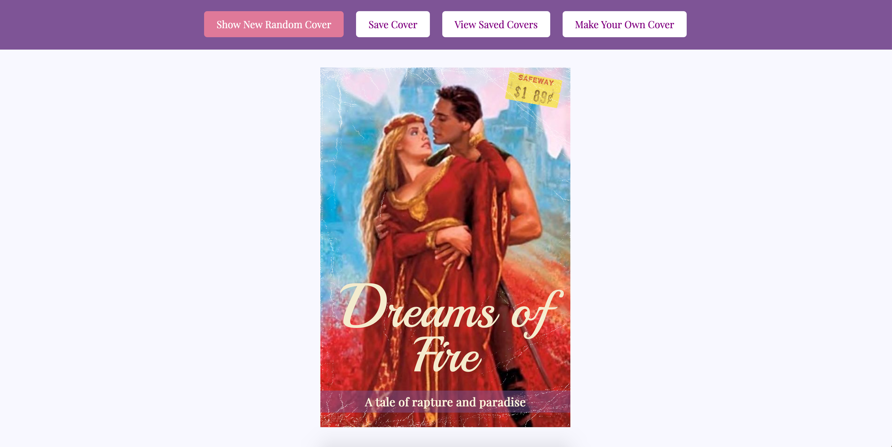
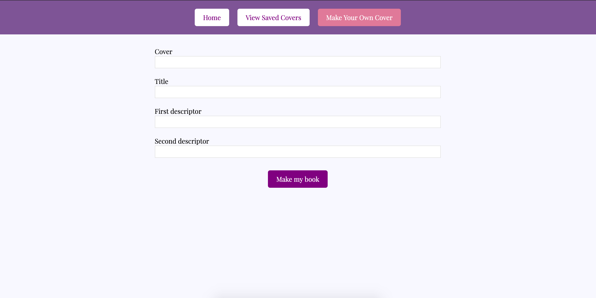

## Learning Goals

* Write clean, DRY JavaScript
  * Use a provided class by creating object instances using the `new` keyword
  * Manipulate the page after it has loaded adding, removing, and updating elements on the DOM
* Explore the connection between HTML, CSS, and JavaScript
  * Practice reading, understanding, and using provided code
* Write code collaboratively
  * Document changes with atomic commits & thorough code reviews
  * Communicate, troubleshoot, and plan effectively as a team

## Overview

People say that romance novels are formulaic. Well ... maybe that's true. We're going to make an app that generates romance novel covers!

## Set Up

To begin, choose ONE PARTNER to do the following:

1. Fork the boilerplate repository found [here](https://github.com/turingschool-examples/romcom/)
2. Clone down your new, forked repo. While cloning, name it what you want your project to be named, should not include “boilerplate”. `git clone <url> <newNameYouWantItToHave>`
3. `cd` into the repository
4. Open it in your text editor
5. View the project in the browser by running `open index.html` in your terminal
6. Add all project partners and your assigned instructor as collaborators on the repository

Then, as a team:

* Explore the repository to see what's going on in the code
  - Look at each file: `index.html`, `styles.css`, `data.js`, `Cover.js`, `main.js`
  - _Note: no imports or exports are needed because each JS file is linked in the HTML_
  - Even if you don't know what each piece of the code is doing, talk through what you think is going on
* What pieces of code might you use to complete iterations, and what pieces will you have to create?
* All of your work will take place in `main.js` - you will not need to change any other files!

## Day 1 Deliverables

**By EOD on Kick Off Day:** complete the following tasks:

* As a team, read the entire project spec and rubric
* As a team, complete [the Norming Document](https://docs.google.com/forms/d/e/1FAIpQLSche5cvtlYQ_SaBDqqoF3H9gFiy2p60AOPoUMbhgIHlg-vRlQ/viewform?usp=sf_link)
* Complete [this project submission form](https://docs.google.com/forms/d/1kW1JPMpZUhAjzIDnW_wDrGB8PtRDTIFh9ohpkd5h0xk/edit) to ensure your project manager has the following links:
  - the forked GitHub repo
  - the GitHub Pages deployed site
    - Instructions for deploying: Repo Settings >> Pages >> Select the `main` branch as your Source branch >> Save >> Send us the URL they give you in the pop up that says "Your site is ready to be published at [URL]"
* Add all teammates and your assigned instructor as collaborators to your forked repository (Please find instructor GitHub usernames in their Slack profile)

## Progression

### Iteration 0 - Main Page

- When the page loads, we should see a cover with a randomly selected image, title, and tagline which includes two random descriptors
- Every time the user clicks the Show New Random Cover button, a new random cover is created
    - hint: you may need to update the value of the provided `currentCover` variable
    - hint: use that Cover class!
- Every time the user clicks the Show New Random Cover button, the random cover is displayed
    - hint: you may need to create a function that displays information on the DOM

### Iteration 1 - Switching Views

**NOTE:** in this iteration, you are not worrying about making the form WORK, and you are not worrying about saving or displaying covers. You simply want to make sure the views can be switched when you click the appropriate buttons.

Form view:

- When a user clicks the "Make Your Own Cover" button, we should see the form, and the homepage view should be hidden
- When the Form view is visible, the "Show New Random Cover" and "Save Cover" buttons should be hidden
- When the Form view is visible, the "Home" button should be visible

Saved covers view:

- When a user clicks the "View Saved Covers" button, we should see the saved covers section, and the homepage view should be hidden
- When the Saved Covers view is visible, the "Show New Random Cover" and "Save Cover" buttons should be hidden
- When the Saved Covers view is visible, the "Home" button should be visible

For both the Make New Cover form section and the Saved Covers section:

- In summary: Be able to switch between the three views (main poster, form, and saved posters) on the correct button clicks
- When a user clicks the "Home" button, we should only see the Home section
- When a user clicks the "Home" button, the home button should be hidden
- When a user clicks the "Home" button, the "Show New Random Cover" and "Save Cover" buttons should be visible again

_Hint: go check out the HTML and CSS files to see how the form and saved covers sections are being hidden in the first place_

## Iteration 2 - Creating a New Cover

- In the new cover form view, users should be able to fill out the four input fields and then hit the Make My Book button
- When the Make My Book button is clicked, several things will happen:
  - Save the submitted data into the respective arrays (cover URL into the covers array, title string into the titles array, etc) so that future random covers can use the user-created data
  - Use the values from the inputs to create a new instance of the Cover class
  - Change back to the main home view (hiding the form view again)
  - Display the newly created cover image, title, and descriptors in the main cover

## Iteration 3 - Saving & Viewing Covers

- When a user clicks the "Save Cover" button, the current cover will be added to the `savedCovers` array
- If a user clicks the "Save Cover" more than once on a single cover, it will still only be saved once (no duplicates)
- When a user clicks the "View Saved Covers" button, we should see the saved covers section
- All the covers in the `savedCovers` array should be displayed in the saved covers section

_Note: None of this needs to persist on page load_

## Iteration 4 - Deleting Saved Covers

- From the saved covers view, if a user double clicks a saved poster, it will be deleted

_Hint: How will you update the data model to achieve this?_
_Note: None of this needs to persist on page load_

## Optional Extensions - Gettin' fancy

Here's a list of possible extensions to implement - but **ONLY IF** your team has completed all the previous iterations **AND** have cleaned up your code to make it DRYer and more readable.

You are welcome to add your own extensions. Be sure they are thoughtful in terms of UX/UI, and that they do not break any prior functionality.

- Implement data validation and error handling into the form (disable the button until all fields are filled, provide error messages if data entered is not correct, etc)
- When a user single clicks a saved cover, create a modal to view it larger
- Allow users to drag and drop saved posters into whatever order they want them to appear

## Rubric

This rubric should serve as a guide for students as they progress through the project, as well as to self-evaluate. Instructors will use it to evaluate the project at its final due date/time, and provide detailed feedback so students know what areas to focus on in future projects.

Scores land in a range between 1 and 4. Below is a breakdown of what those numbers represent.

* **4 (exceptional)** - went beyond set learning goals; did self-teaching to go above and beyond in this area
* **3 (proficient)** - exactly on track! you're where you need to be in this area! great work!
* **2 (trailing)** - a little behind where we want to see you right now; in a good place to build familiarity/competency in this area; study in this area to level up and grow
* **1 (dragging)** - significantly behind where we want to see you; major growth needs to be shown in this area; set up a pairing session with an instructor as soon as possible

To earn a given score, an application must meet the requirements listed in that score explanation and all scores lower.

### Professionalism

* **4:**
  - Team uses a [PR template](https://docs.github.com/en/free-pro-team@latest/github/building-a-strong-community/creating-a-pull-request-template-for-your-repository) consistently
  - Team habitually conducts thorough code reviews in the GitHub GUI to document the progress of the application
  - Team has sought out code reviews from one or more mentors. Mentors must add their code review to a pull request that can be viewed.

* **3:**
  - Commits are atomic and frequent, effectively documenting the evolution/progression of the application. Remember, a commit should be one “unit” of work.
  - Commit messages are consistent, descriptive, concise and begin with a verb and capital letter
  - Team uses PRs to screen/verify code before adding it to the main branch
  - There is no more than a 10% disparity in code contributions between teammates. Note: this is checked via the “Insights” and “Contributors” tab in your GitHub repo.
  - Branches are consistently used for individual features
  - README is well formatted and gives good context about the project. At minimum, a sufficient README should contain - contributors, technologies used, instructions for running and viewing the project, deploy link (gh-pages), images/GIFs if necessary, future additions, etc. Think about what a user needs to understand and get the full picture of the application.

* **2:**
  - Commits are large and do not effectively communicate the progression of the application.
  - Team uses PRs but do not review code before merging into the main branch
  - During evaluations with PM, all teammates can speak to the purpose and functionality of any/every line of code.  
  - Branches are sometimes used for individual features
  - There is a 20% disparity in code contributions between teammates
  - README is brief and does not provide full context for the project

* **1:**
  - During evaluations with PM, teammates are unable to describe the purpose and functionality of every line of code
  - Some commits are pushed directly to the main branch
  - PRs are used inconsistently or not at all
  - There is a 50% disparity in code contributions between teammates There is no README, or the “boilerplate” README is left in the project.

### JavaScript Style & Implementation

* **4:**
  - There are no global variables aside from query selectors, `currentCover` and `savedCovers`.
  - Application uses event delegation correctly on dynamic elements
  - All functions strictly adhere to the [Single Responsibility Principle (SRP)](https://dev.to/skill_pathway/single-responsibility-principle-for-dummies-59gb) and are all 10 lines of code or less
  - Uses logical operators instead of nesting conditional statements
  - Conditionals are written in a way that demonstrates an understanding of [truthy/falsy values](https://frontend.turing.io/lessons/module-1/js-truthy-falsy-expressions.html). For example, the developer avoids using logic like `=== true` and `!== 0`.

* **3:**
  - Demonstrate understanding of DOM manipulation by adding, removing, and updating elements on the DOM, after the page has loaded
  - Functions are [DRY](https://en.wikipedia.org/wiki/Don%27t_repeat_yourself) and observe [SRP](https://dev.to/skill_pathway/single-responsibility-principle-for-dummies-59gb) - and most are around 10 lines of code or less
  - Most functions and variables are semantically and concisely named. Functions should start with a verb, array names should be plural, etc. Function and variable names describe their role in the program. Examples: The name of the data type should not ever be in a variable name (ex: “petArray”); the name itself should be clear enough to indicate the type of data it holds (ex: “allPets” or “pets”).
  - An event handler should not have the word “handler” in the name (ex: “clickHandler”); the name should indicate the handler’s purpose (ex: “addNewPet”).
  - Uses parameters and arguments to craft short and reusable functions. There are no parameters or arguments in functions that are unused.
  - Whenever possible, function declarations are used over anonymous functions in event listeners. There should be no logic present in an event listener.
  - All console logs, debuggers and comments are removed from code before submitting.

* **2:**
  - Uses named functions instead of anonymous functions as event handlers in event listeners.
  - Correctly uses if/else statements to handle multiple paths of logic & error handling.
  - Inconsistently uses parameters and arguments to craft short and reusable functions. There might be parameters or arguments in functions that are unused.
  - Most console logs, debuggers and comments are removed from code before submitting.

* **1:**
  - Crafts JS according to the [Turing JS style guide](https://github.com/turingschool-examples/javascript/tree/main/es5)

### Functional Expectations

Functionality is the least important piece of the rubric. It's included because it is another benchmark to gauge proficiency. However, you should not pursue functionality at the expense of code quality or the learning/growth of all team members.

This means, we DO NOT want to see:
- Code that completes iterations but is sloppy
- One or both team members do not understand every single line of code
- One or both team members skips the problem solving process (pseudocoding, talking out the problem, articulating, planning) in the pursuit of completing functionality

* **4:** Applications completes one or more of the extensions without bugs
* **3:** Application completes all the expectations of Iteration 4 without bugs
* **2:** Application completes all the expectations of Iteration 3 without bugs
* **1:** Application completes all the expectations of Iteration 2 without bugs
