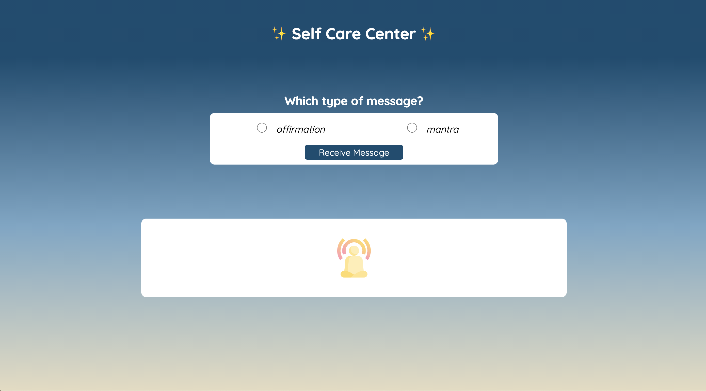

## Overview
How can I care for myself? One way is with affirmations and mantras!
Affirmations are thoughts of positive self-empowerment, meant to assert your self-worth.
Mantras are repetitive phrases that are repeated again and again during mindfulness practices. Your challenge is to build an app that helps users remind themselves of their inherent value!

This Solo Challenge gives students and instructors the opportunity to get a pulse on where you are with the foundational concepts of Module 1 curriculum. Students should use this as an opportunity to challenge themselves and work completely independently. Google can (and probably should!) be used, but any other code base should not be referenced. Instructors will be able to use your work, both completion of functionality and code quality, to determine where you stand and if you are behind for this point in the module, provide supports to intervene.

## Learning Goals

- Gain experience building an application that utilizes HTML, CSS and JavaScript
- Write HTML and CSS to match a provided comp
- Understand how to listen to and respond to user events
- Individualize your programming skill set

## Expectations
- In order to get a good read on your progress during this inning, we'd like to see you complete the MVP (iteration 1) and at least one CYOA feature. If you'd like to complete more CYOA features after that, please do!
- As for feedback: No news is good news. If we have concerns, we'll let you know so that you can make adjustments before your next project
- As for feedback: You will receive minimal feedback on this challenge.  Of course, if you have specific questions, please reach out!

## Setup

- Fork [this project](https://github.com/turingschool-examples/self-care-center) to your own Github account
- Clone the repository to your local machine
- `cd` into the project
- Read this README thoroughly, then begin working!

## Workflow
Make sure you're utilizing git best practices (branches) and committing frequently.

### Day One Deliverables
**By EOD on Kick Off Day:**   
- Read the spec sheet closely.
- Fill out [this planning form](https://docs.google.com/forms/d/1pW1rNr63XgPjIy_uCOIeu5dpBQPud1tYfW5qAWTLXz8/edit)

### Iteration 0: Build Out Comp
- Images are below
- An assets directory is provided in the repo, and colors and fonts are provided in the CSS file.

### Iteration 1: Minimum Viable Product (MVP) - Add Random Affirmation and Mantra feature

- When a user selects a message option and then clicks the "Receive Message" button, the user sees a random message from the list of possible messages for that category
- When the message appears, the mediation icon disappears from the message area

### Choose your own Adventure

In the interest of giving you opportunities to individualize the skills you build, this project's main goal is to provide various different paths you can take. Along these different paths you will encounter different problems and solve them in different ways. As you make choices about which features to add, you should consider which features align with your strengths, which features would challenge you to grow, and which features you'd find to be useful in this application. Choose one or more of the following features to add. Some of them build on others, so be sure to read them all before choosing.

When you choose a feature, you **must** complete all bullet points!

When you choose a feature, you **must** complete all bullet points!

_NOTE: You should absolutely not be working on this unless your UI is solid and you are 100% sure that your MVP is fully functional and bug free._

#### Error handling and clear button
- User should not be able to click the "Receive Message" button unless they have selected a message option.
- The user can click a clear button, which clears the page of any message.
- User should only be able to click the clear button if a message is visible.
- When the clear button is clicked and the message is removed, the image of the meditation icon should re-appear.
- If you've added other buttons or inputs, be sure to add some error handling for them as well.

_Note: You can disable these buttons, hide them, or display a message to the user for error handling. The choice is yours!_

#### User can add their own message
- Add an "Add Message" button in a logical spot.
- When the user clicks "Add Message" a form will appear in the message box. The form should contain two inputs - one to specify which type of message is being added, and another to add the text of the message itself. The form should also contain a "Submit" button.
- If the user doesn't specify the type of message, they should get an error and be unable to submit their message until the type is specified.
- When the user clicks the "Submit" button and that message will be added to the appropriate list of messages.
- When a new message is added, that message should automatically be displayed in the message box, instead of the meditation icon.
- As you add these new elements to the page, be sure to match the style of existing elements.

_NOTE: None of this needs to persist on page refresh, unless you also complete the local storage feature_

#### User can favorite a message

- When a message appears, it should appear with a "Favorite" button.
- When the "Favorite" button is clicked, that message should be added to a new list of favorite messages.
- Users should be able to view their favorites by clicking a "View Favorites" button that exists somewhere on the page
- When the "View Favorites" button is clicked, users should be taken to a new page that displays all of their favorite messages.
- Users should be able to navigate back to the main page by clicking a button.
- Users should be able to remove a message from their list of favorites, by clicking a button.
- As you add these new elements to the page, be sure to match the style of existing elements.

_NOTE: None of this needs to persist on page refresh, unless you also complete the local storage feature_

#### User can delete a message
- Add the ability to delete a message (ie: when a message shows up, show a button that says "I don't like this message" (or something similar), and remove it from the list so that it will not show up any more. Make sure to alert the user in some way that the message has been removed.

_NOTE: None of this needs to persist on page refresh, unless you also complete the local storage feature_

#### User never sees a repeated message
- Use JavaScript to ensure that the user never sees a repeated message until they've seen them all.
- After they've seen them all they should be notified that they will now start seeing repeat messages.

#### All Messages interface
- Add a "View All Messages" button.
- When that button is clicked, the user is taken to a new pages that displays all messages, sorted by message type.
- On this page, user should have the ability to add/edit/delete messages.

#### Login Page
- Refactor your application so that the user lands on a "Login" page
- The login page should match the style of the application.
- The login page should contain an input for a user to enter their name, and a button to submit.
- After the user clicks the submit button, they should be taken to the main application page, and see a personalized greeting that displays their name and some sort of welcome message.
- The welcome message and name should appear in a logical place of your choosing.

#### Intermediate CSS
- Do some research and determine how to make your app respond to the user's screen size.
- Layout and spacing should adapt to mobile, tablet, desktop and extra large screens
- Add a loading animation when a user clicks the "Receive Message" button to simulate searching for a message. Hint - You will need to use CSS Keyframes, and a Javascript timeout function for this.
- Make your buttons grow in size or change color when the user hovers over them, enticing them to click the dang thing.
- When the message appears, the text should fade in, from white to black to deliver the message in a calming way.
- Have the background change depending on if a user has selected an affirmation or mantra. Choose a calming secondary gradient for each type of message.

Remember your user experience and animate these things in gradually. Timing is everything!

#### Local Storage
- Only do this if you've added the "Favorite a Message" functionality.
- Do some research to utilize Local Storage, so that the user's favorite messages will persist, even if they reload the page.

#### Design your own feature
- Have an idea of something you'd like to add to the app? Go for it! Just be sure to run the idea by your instructors first!

### Message Lists (Feel free to use your own instead!)

#### Affirmations

I forgive myself and set myself free.

I believe I can be all that I want to be.

I am in the process of becoming the best version of myself.

I have the freedom & power to create the life I desire.

I choose to be kind to myself and love myself unconditionally.

My possibilities are endless.

I am worthy of my dreams.

I am enough.

I deserve to be healthy and feel good.

I am full of energy and vitality and my mind is calm and peaceful.

Every day I am getting healthier and stronger.

I honor my body by trusting the signals that it sends me.

I manifest perfect health by making smart choices.

#### Mantras
Breathing in, I send myself love. Breathing out, I send love to someone else who needs it.

Don’t let yesterday take up too much of today.

Every day is a second chance.

Tell the truth and love everyone.

I am free from sadness.

I am enough.

In the beginning it is you, in the middle it is you and in the end it is you.

I love myself.

I am present now.

Inhale the future, exhale the past.

This too shall pass.

Yesterday is not today.

The only constant is change.

Onward and upward.

I am the sky, the rest is weather.
