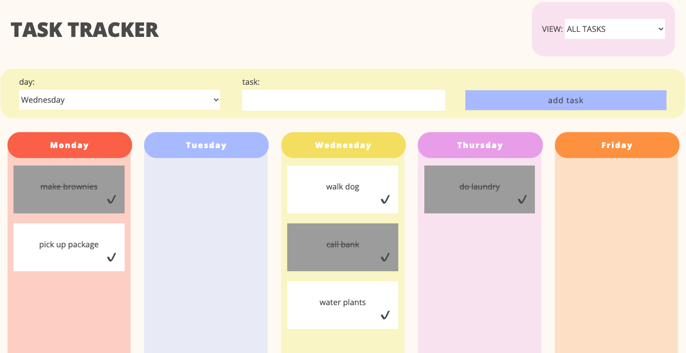

## Learning Goals

* Understand, navigate, and update code that you didn't write
* Debug application to find and fix bug
* Apply JS concepts to build a new feature

## Overview

## Progression

<section class="answer">
### Iteration 0 - Set Up 

- Follow the instructions in the README to clone down [this repo](https://github.com/turingschool-examples/task-tracker)
- Open the app in your browser (`open index.html`) and click around. Discover what functionality already exists.
- Open up the code and explore! Take time to look at the HTML, CSS, and JavaScript files.
</section>

<section class="answer">
### Iteration 1 - Scavenger Hunt

**Set Up:** Move to the scavenger hunt branch.
- Run `git checkout scavenger-hunt` to get to the correct branch
- You should see `// SCAVENGER HUNT BRANCH` at the top of the `main.js` file to know you're in the right place

**Challenge:** Work with your group to find the following in the codebase. Be sure to take notes - we'll discuss as a class when we come back together!
1. What represents the data model? How do you know?
2. Find two examples of the data model being updated. Why is it important to update the data model?
Find one example of a DOM update that relies on the data model. Why is it important that the DOM update uses the information in the data model?
3. Find two functions that have at least one parameter. Add a console log to each function to see what the value of that parameter is when the function is invoked. Click around the app and notice the console logs. Are the functions always logging the same value (i.e. is the value of the arguments always the same)?
4. Find an example of bracket notation being used to access an object. Change it so it's using dot notation. Does it still work? Why or why not?
5. Find an example of a pure function. How do you know it's a pure function?
6. Find an example of an impure function that has a side effect. Discuss if it possible for that function to be pure. Why or why not?
7. Find an example of a function's returned value being used somewhere else. Are the functions in this example pure?
8. Find an example of event delegation. Why is event delegation necessary there?
</section>

<section class="answer">
### Iteration 2 - Bug Fix

**Set Up:** Move to the bug fix branch.
- If you made changes to the code on the `scavenger-hunt` branch, you need to commit your work before switching branches (`git add...`, `git commit...`) - don't push! 
- Run `git checkout bug-fix` to get to the correct branch
- You should see `// BUG FIX BRANCH` at the top of the `main.js` file to know you're in the right place

**Challenge:** Oh no! The *No tasks today!* message isn't disappearing when a new event is added AND the new event isn't appearing. Find the source of the bug and fix it!
- Narrow your focus to the section of code labeled `// No Tasks Message`. 
- Follow the logic line by line and add console logs to check the code at every point. For example, what's in our data model (`tasks`) at each point in the code? Are we getting into each conditional block as expected? What is the outcome of each function?  

**🌶 Optional Extension:** The `clearTasks` function is really repetitive. Can you make that code DRYer? 
- Look into [Object.keys()](https://developer.mozilla.org/en-US/docs/Web/JavaScript/Reference/Global_Objects/Object/keys)!)
</section>

<section class="answer">
### Iteration 3 - New Feature

**Set Up:** Move to the new feature branch.
- If you made changes to the code on the `bug-fix` branch, you need to commit your work before switching branches (`git add...`, `git commit...`) - don't push! 
- Run `git checkout new-feature` to get to the correct branch
- You should see `// NEW FEATURE BRANCH` at the top of the `main.js` file to know you're in the right place

**Challenge:** Using the user stories below, add a feature to the app that allows you to delete a task.  
- When a user clicks the ❌ button on a card, that task should be removed from the data model.  
- When a user clicks the ❌ button on a card, that task should no longer appear on the screen (no matter what VIEW filter is applied).  

**🌶 Optional Extension:** Using the user stories below, add a feature to the app that allows users to view recently deleted tasks.
- In the `index.html` file, uncomment the new `option` in the `filter-selection` dropdown.
- When a user selects the "RECENTLY DELETED" filter in the top right VIEW form, all tasks that the user has deleted should appear on the screen. 
- Deleted tasks should not appear under any other view.
</section>
