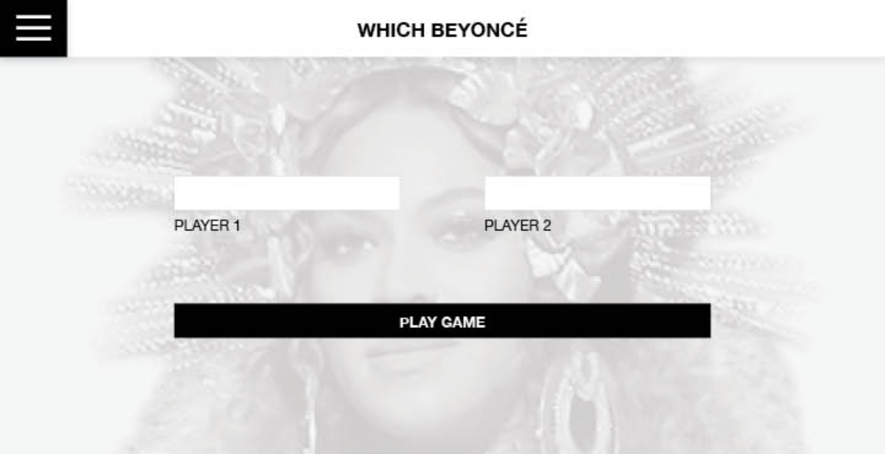
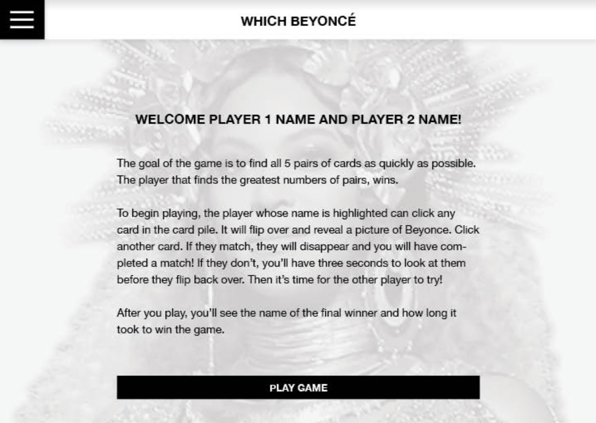
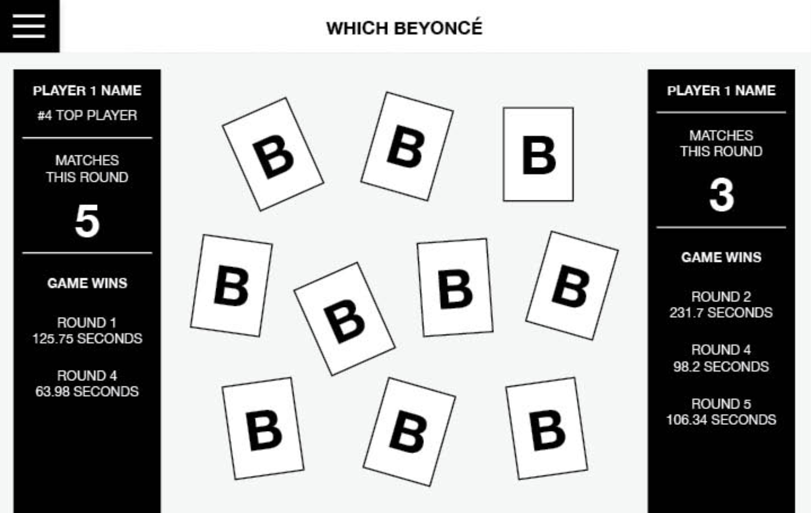
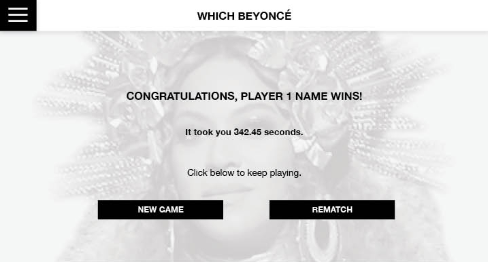

## Learning Goals

* Solidify and demonstrate your understanding of:
  * semantic HTML
  * DRY JavaScript
  * localStorage to persist data
* Iterate through/filter DOM elements using `for` loops
* Understand the difference between the data model and how the data is displayed on the DOM
* Match/recreate a UI and create a great UX

## Overview

`Which Beyoncé?` is a two-player game that replicates [Concentration](https://en.wikipedia.org/wiki/Concentration_(card_game)).

Each player takes turn flipping over two cards at a time. If they match, that player "scores". If the two cards don't match, they must be flipped back over. The goal is the get the greatest amount of matches.

## Set Up

Create a **private** repository on GitHub and add both/all instructors as collaborators. Send over your repo link and GitHub pages as soon as it's up.

## Progression

### Iteration 0 - Single Player Layout & UI

- User should see an input for their name, and a "Play Game" button
- User should enter their name, (note the two bullet points below) click "Play Game", then see a greeting including their name and directions for how to play the game.
  - If the user attempts to click the "Play Game" button before entering their name, they should receive a small but clear message as to why they can't yet click the button, prompting them to change what they are providing.
  - The limit on the name input field should be 32 characters.
- Once the user clicks "Play Game" on the directions screen, they should see ten cards, face down.
- User should be able to click on any card. Once each card is clicked on, the other side of it should be displayed. For now, don't worry about "scrambling" cards up.

### Iteration 1 - Single Player Matches

- On the left hand side of the page, the player should see their name and the number of "Matches This Round"
- User should **only** be able to flip over two cards at a time.
- If the two flipped cards match, they should disappear and the "Matches This Round" count should increase.
- If the cards don't match, the user can re-click them to turn them back over.
- User continues to click until they find all matches
- Once all matches are found, the user should see a congratulatory message including their name.

<section class="call-to-action">
### Data:

- Each card should get its data from an object instance of a Card class
- Each card should have a `matchInfo` property which will hold the same value as the card that matches it. You can determine how to format that matching value. Each card should also have a `matched` property, a boolean, that will default to false and toggle to true once a match has been made.
- Each card should have a method `match` on it
- All card object instances should be held in the Deck class
- The Deck should have `cards`, `matchedCards`, `selectedCards`, and `matches` as properties. The Deck should have the following methods: `shuffle`, `checkSelectedCards`, and `moveToMatched`. If you find a need for additional methods, write/use them!
</section>

### Iteration 2 - A little more interesting, and a better UI

- Once all matches are found, the user should see a congratulatory message including their name *and* the amount of time it took, in minutes and seconds, for them to find all 5 matches. (The comp shows seconds, but we think minutes and seconds are more friendly to the user!)
- Each time a user plays, the ten cards should be assorted *differently*. The `Deck` class should handle this logic.
- Instead of having to manually re-click a card to turn it back face-down, the program should automatically flip both cards over, after the user has had ___ seconds from the time both cards are revealed to view them. This is a great opportunity to do some user testing and see what the right amount of time is!
- Anytime a card flips over, there should be a smooth transition.

### Iteration 3 - Implement Storage

- The users name should persist in Local Storage
- A "Top 5 Winner Board" should be available for the user to view when clicking the icon in top right corner. It should include the names of the 5 winners who won the game in the shortest amount of time, as well as the time they required to win. When the icon is clicked again, the board should no longer be visible.

### Iteration 4 - Two Player

- Two users should be able to compete.
- Both users should enter their name and see them displayed on the screen
- A clear visual should be provided at all times so users know whose turn it is, and how many matches each player has
- When the game is over, the winner's name and (total) time took playing appears on the page. The visual indicator of whose turn it is no longer indicates it is either players turn.
- When the game is over, the users can click "Play Again" to start the game over from scratch.
- The winner board should provide the same data - top 5 winner names and time took.

<section class="call-to-action">
### Data:

- Each player should get its data from an object instance of a Player class
- Each player should have a `name` property and a `matchCount` property that defaults to 0 and increases if/when they create a match
- Each player should have a `findMatch` method on it
- If you see the need for other properties or methods, you can absolutely add those!
</section>

### Iteration 5 - Leveling Up

- Users should be provided 10 cards (5 matches) that are randomly selected from a list of 20 cards (10 matches) to further diversify the mix and make playing multiple times more interesting.
- If a user with the same name as someone of the "Top 5 Winners" board is playing, a trophy-like icon should appear on their side of the scoreboard to indicate that one (or both) of the players is a previous winner.
- After finishing a game, user(s) should have the option to play again as the same players, or start completely over. If they choose to play again as the same players, they should not have to re-enter their info or read the directions again.
- The users should have the ability to pause the game. Once it is paused, time stops, and no cards can be clicked/flipped.

### Extensions

- Under each users name, the total number of wins they have had should appear. This should persist on page refresh. (Think about how this impacts your data for Player!)
- If the user leaves the page and comes back, the game will still be paused, but can resume from there (all cards in same position, same number of "matches" etc.)
- Test your classes (we can provide some assistance with the setup if you'd like to tackle this!)

## Comp

The font used in the comp is `Open Sans`.

When the users first come to the site to play, they should see a screen that takes both players names:

Once the users enter names and click the "Play Game" button, they should see the directions. You can modify this copy as you see fit.

After the users have read the directions and clicked "Play Game", they will be taken to the game board:

After a user wins, they will be taken to the winner screen:

**Note:** Only 1 HTML file should be used.

## Rubric

As you reference the rubric throughout the project the self-assess, keep in mind that the "bar" for each category is a 3. Sometimes, criteria for a 2 will not be listed under the criteria for a 3. To earn a 3, one must meet criteria for the 1 and 2. If there are any clarifying questions, make sure to speak with an instructor **before** the day of the evaluation.

## Functionality

* **4:** Iterations **0-4 are fully functional** with no bugs, and 2 of the 3 user stories in Iteration 4 are fully functional. At least one bullet point in Iteration 5 is fully functional.
* **3:** Iterations **0-4 are fully functional**. One small bug may exist. (Point of clarity - a small bug is not a missing feature or a completely broken feature; it's a feature that usually works but under certain edge cases, behaves unexpectedly).
* **2:** Iterations **0-3 are fully functional** with no bugs.
* **1:** Iterations 0-1 are functional.

## UI/Comp Recreation

The topic does not have to be Beyonce. Besides assets and name of app, students are expected to recreate the comp.

* **4:** Additional elements that have been added **match** the visuals established in the comps. **Finished touches** such as `cursor: pointer` on hover are thoughtfully implemented.
* **3:** Application implements all major comp details accurately and correctly on desktop, tablet, and large TV with **smooth** transitions between screen sizes. **Additional elements added generally match** the visuals established in the comps, but may be slightly awkward. **Nothing about the UI is confusing** to a user who has never seen this application before.
* **2:** Application implements all major comp details accurately and correctly on desktop, **tablet, and large TV**. Transitions between screen sizes may not be smooth. Some UI may be slightly confusing or unclear.
* **1:** Application implements all major comp details accurately and correctly on desktop only (colors, fonts, icons, spacing, alignment, etc.)

## HTML

* **4:** Application uses BEM, SMACCS or another set of **naming conventions** for classes, developer can explain those naming conventions. The form uses **WAI-ARIA** and is fully accessible.
* **3:** Application uses markup that is **easy to read** and follows across **naming conventions**.
* **2:** Application uses HTML that incorporates **semantic HTML** elements and has a simple, clean HTML structure.
* **1:** Crafts markup that meets the criteria of the [Turing HTML Style Guide](https://github.com/turingschool-examples/html)

## JavaScript

* **4:** **Code is well refactored** and demonstrates developer empathy. No global variables are used aside from query selectors, start time, and instances of `Player` and `Deck`. If you feel you need more because you are building out additional functionality that requires a global variable, please check in with an instructor. All functions are **less than 10 lines long**.
* **3:** The **event object** is used correctly, and is not accepted as a parameter if it is not necessary. Developer can speak to **how the event object is utilized** for any given event handler. **Function and variable names** describe their role in the program. *Examples: The name of the data type should not ever be in a variable name; the name itself should be clear enough to indicate the type of data it holds. An event handler should not have name "eventHandler". Possible alternatives are `allCards` and `flipCard()`.*
* **2:** The application correctly **implements a data model** for the `Card` and `Deck` classes, including all required methods. Arguments and parameters are used to limit global variables. **Function declarations** are used over anonymous functions in event listeners. Developer can speak to the **role of each class**.
* **1:** Style and syntax meets the criteria of the [Turing JS Style Guide](https://github.com/turingschool-examples/javascript/tree/master/es5)
