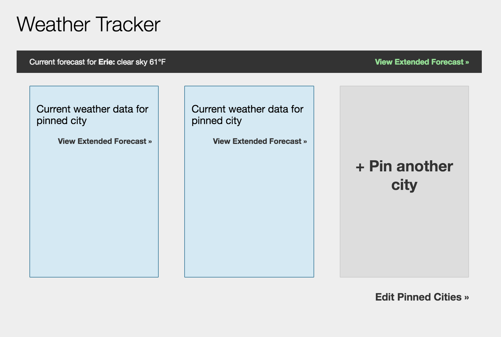
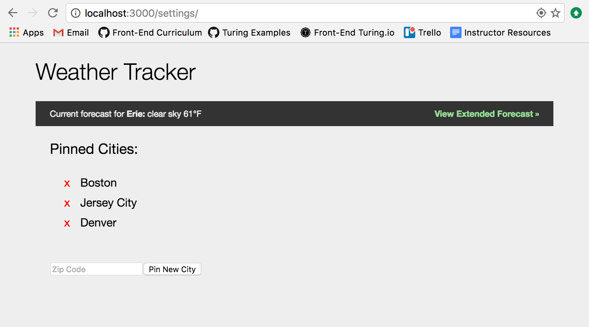
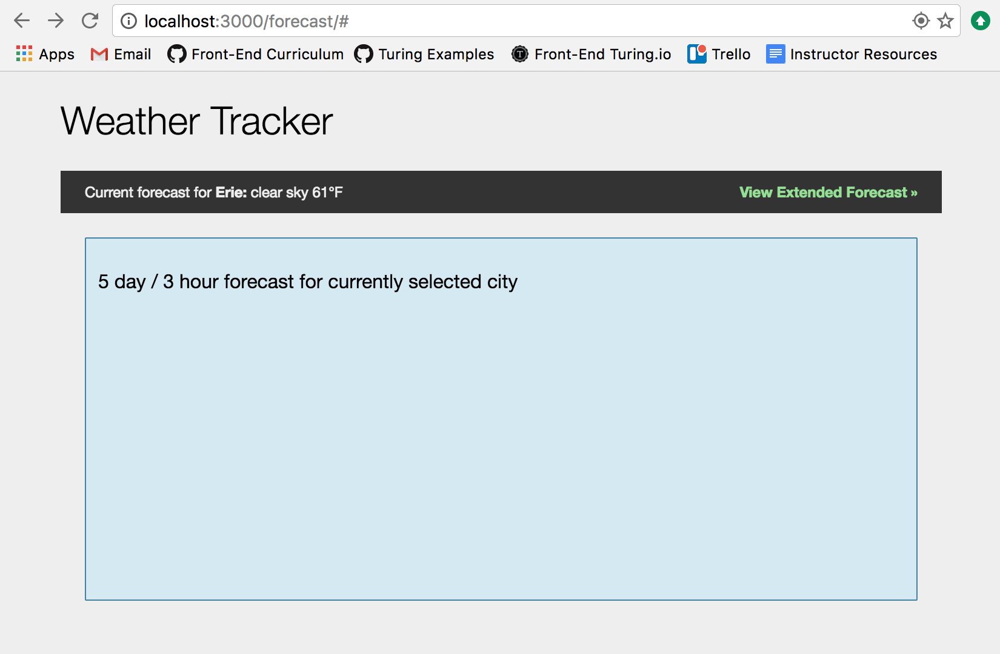

## Specification

### Overview

In this project you'll be building a react/redux weather app that allows you to see different forecast information for a given city, and set favorite cities to pin to the home page.

### Main Goals

  - Retrieve and display forecast data from the OpenWeatherMap API 
  - Use the Geolocation API to determine the weather in your current city 
  - Save "pinned" or favorite cities to display their weather 

## Setup

### Obtain an API Key

We'll be using the OpenWeatherMap API to retrieve weather data. You'll need to [sign up for an API key](http://openweathermap.org/appid) to make any data requests.

### Repo
Webpack and react dependencies have been setup for you in the [weather-app repo](https://github.com/turingschool-examples/weather-forecast). Fork this repo and follow the setup instructions in the README.

### General Requirements

  - Use the [Geolocation API](https://developer.mozilla.org/en-US/docs/Web/API/Geolocation/Using_geolocation) to determine your current city. You may be prompted by your browser to grant access to your location. This request can take some time, and it might not be 100% accurate, but it should provide you with enough information to get the weather forecast using the [OpenWeatherMap API](https://openweathermap.org/api).
  - Create a header bar that displays your current city's temperature (in Fahrenheit) and weather description (e.g. 'windy', 'rainy', 'sunny')
  - Create a `/settings` route that displays an input field to enter a city's zip code and save it as a "pinned" city
  - Create a dashboard/index page that shows the Current Weather for a maximum of 3 "pinned" cities. If there aren't 3 pinned cities, add a placeholder with a link to "Pin a new city"
  - Each pinned city forecast should include a link to display an extended 5 day/3 hour forecast. The route for the extended forecast should be something like `/forecast/<cityId>`.

### Wireframes
Dashboard Page:

Settings Page

Extended Forecast Page

## Rubric

### Specification Adherence

* 4 - The application meets all of the requirements listed above and implements one or more of the extensions.
* 3 - The application consists of one page with all of the major functionality being provided by React. No approach was taken that is counter to the spirit of the project and its learning goals. There are no features missing from above that make the application feel incomplete or hard to use.
* 2 - The application is in a usable state, but is missing 1 or more of the features outline in the specification above.
* 1 - The application is missing 3 or more smaller features or 1 major feature essential to having a complete application.
* 0 - The application is unusable.

### Component Architecture

* 4 - Application is broken out into small reusable React components. Complicated functionality is wrapped in parent components. There are zero cases where a complicated component can be broken down into smaller composite components.
* 3 - Application is broken in out into _at least_ 8 components that properly encapsulate functionality. There is no more than one component that could be broken down into composite parts.
* 2 - Application contains multiple components that could be broken down into composite parts.
* 1 - The application has many confusing methods and interactions and it is difficult for the instructor to get a sense of functionality lives where.

### User Interface

* 4 - The application is pleasant, logical, and easy to use. The application is fully responsive, and has clearly had special consideration around usability on devices. There no holes in functionality and the application stands on it own to be used by the instructor _without_ guidance from the developer.
* 3 - The application has many strong pages/interactions, but a few holes in lesser-used functionality.
* 2 - The application shows effort in the interface, but the result is not effective. The evaluator has some difficulty using the application when reviewing the features in the user stories.
* 1 - The application is confusing or difficult to use.

### CSS/Sass Style

- 4: Application has exceptionally well-factored CSS/Sass with little or no duplication and all styles separated out into logical stylesheets. There are zero instances where an instructor would recommend taking a different approach.
- 3:  Application is thoughtfully put together with some duplication and no major bugs. Developer can speak to choices made in the code and knows what every line of CSS/Sass is doing.
- 2:  Your application has some duplication and minor bugs. Developer can speak to most choices made in the code and knows what every line is doing.
- 1:  Your application has a significant amount of duplication and one or more major bugs. Developer cannot speak to most choices and does not know what every line of CSS/Sass is doing. Developer writes code with unnecessary selectors or tags which do not increase clarity.

### JavaScript Style

* 4 - Application has exceptionally well-factored code with little or no duplication and all components separated out into logical components. There _zero_ instances where an instructor would recommend taking a different approach.
* 3- Application is thoughtfully put together with some duplication and no major bugs. Developer can speak to choices made in the code and knows what every line of code is doing.
* 2 - Your application has some duplication and minor bugs. Developer can speak to most choices made in the code and knows what every line is doing.
* 1 - Your application has a significant amount of duplication and one or more major bugs. Developer cannot speak to most choices and does not know what every line of code is doing.
* 0 - Your client-side application does not function or the application does not make use of `localStorage` for updating information on the client. Developer writes code with unnecessary variables, operations, or steps which do not increase clarity.

### Testing

* 4 - Project has a running test suite that exercises the application using Enzyme. The test suite covers almost all aspects of the application (aside from logging in).
* 3 - Project has a running test suite that tests and multiple levels but fails to cover some features. All functionality is covered by tests. The application makes some use of feature testing.
* 2 - Project has sporadic use of tests and multiple levels. The application contains numerous holes in testing and/or many features are untested.
* 1 - There is little or no evidence of testing in this application.

### Workflow

* 4 - The developer effectively uses Git branches and many small, atomic commits that document the evolution of their application.
* 3 - The developer makes a series of small, atomic commits that document the evolution of their application. There are no formatting issues in the code base.
* 2 - The developer makes large commits covering multiple features that make it difficult for the evaluator to determine the evolution of the application.
* 1 - The developer committed the code to version control in only a few commits. The evaluator cannot determine the evolution of the application.
* 0 - The application was not checked into version control.

### Code Sanitation

The output from a code sanitizer (either JSHint or ESLint) shows…

* 4 - Zero complaints
* 3 - Five or fewer complaints
* 2 - Six to ten complaints
* 1 - More than ten complaints

### Design

* 4 - The application is visually appealing and shows thoughtful and effective use of typography, color, and layout. The application looks professional, with visuals enhancing the user's experience. The evaluator has very few recommended changes.
* 3 - The application has a strong approach to layout and content hierarchy, but typography and color choices are lacking. The evaluator has several recommended changes to improvement.
* 2 - Layout, content hierarchy, typography, and color choices show effort, but the result is not effective. The evaluator recommends significant changes.
* 1 - Layout, content hierarchy, typography, and color choices actively detract from the user's ability to use the application.
