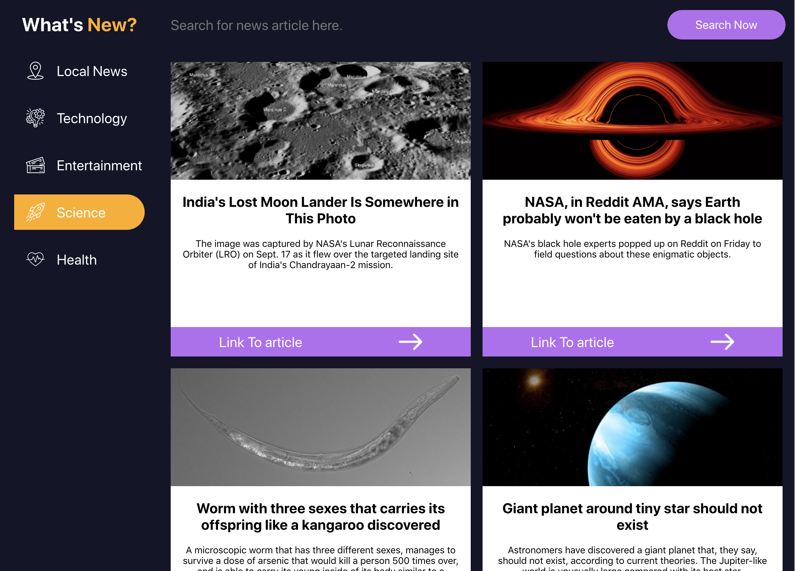

## Introduction

For this project, we are going to work on developing some muscle memory in building out simple React components and passing data down as props.  You will see the difference between class components and function components and start getting a sense of when to use one over the other.

## Prep Work

Get set up by cloning down [this repo](https://github.com/turingschool-examples/whats-new).

**Follow the set up instructions outlined in the repo's README!**

## Project Goals & Requirements:

1. Write **squeaky clean**, well refactored code using ES6 syntax.  
2. Learn to pass information between components using props.
3. Learn to write readable JSX (your render methods/return statements should be clean and simple).
4. Use `propTypes` for every component receiving props.  
5. Learn how to unit test React components including snapshot testing, methods, and changes in state.

## Specifications

### Iteration 0

Get set up (per the instructions above)!

We've provided a boilerplate for you to work with. Look through the file structure to get a sense of the app.

Notice that we have multiple stylesheets - one for each component. You are welcome to style this application however you'd like as long as it keeps the core functionality. We got you started with a little styling, but feel free to get creative. (Remember, though - most of your energy should be spent on learning React, not styling.)

### Iteration 1

Create a NewsContainer component, which will act as a container that renders each of our news articles. For now, the news articles being displayed will be "Local News". Figure out how to pass information from `App.js` to `NewsContainer.js`!

Then create a NewsArticle component. Each NewsArticle card will display: the image, the headline, the description, and the url (see the screenshot above for an idea).

In your NewsContainer component, create NewsArticle cards that have the information each needs to display properly.

**Test Your App with snapshot tests.**

### Iteration 2

Take a look at the `data` directory and inspect the other news data that is included.  There is an `entertainment.js`, `health.js`, `science.js`, and `technology.js` file.  Import the data and put it in `App's` state.  Create a Menu component that has navigation to display the different news articles.  When selecting a navigation link, it should display the relevant news articles in the NewsContainer component.  How can you reuse components?

**Add/Update any snapshot tests necessary.  Also add tests for any new methods you have created or changes in state** 

### Iteration 3 (extension - do not attempt until iterations 0 - 2 are completed)

Add in the functionality so that a user can search through the news articles.  After a user has typed a search query, a user should either be able to press `Enter` or `Search` to filter out the correct news articles.  The search functionality should only filter through the selected news articles.

**Add/Update any tests necessary.  Remember to include tests for any new methods you have created or changes in state** 

### Iteration 4 (extension - do not attempt until iterations 0 - 3 are completed)

Instead of importing the news data from the data directory, use the [Fetch API](https://developer.mozilla.org/en-US/docs/Web/API/Fetch_API/Using_Fetch) to get the data.  Read this [article](https://www.robinwieruch.de/react-fetching-data) on where you should fetch your data in React.

Here is what the endpoint looks like to get the news data.

| Purpose | URL | Verb | Request Body | Sample Success Response |
|----|----|----|----|----|
| Get all news data | `https://whats-new-api.herokuapp.com/api/v1/news_data` | GET | none | `{ "message": "Hello, I am Dr. Watson..." }` |

**Note: This will likely break some of your previous tests.  No worries, we will discuss testing async functionality in a future lesson.**

## Evaluation

Projects will be due on Monday of Week 2 by 8am. The instructors will go through projects that morning and then go over common mistakes we saw as a class.

----------------------------------------------------------

## Rubric 

### Specification Adherence

* 1 - The application is missing multiple features outlined above and in it's current state is non-functioning. Developer did minimal to no CSS for this project.
* 2 - The application is in a usable state, but is missing part of one or more of the features outlined above. There are one or more major bugs and the evaluator has multiple recommendations for design changes.
* 3 - The application completes all iterations above without error. Evaluator has minimal recommendations for design changes.
* 4 - The application completes all iterations above and implements one or more of the extensions.  The evaluator has no recommendations for design changes.

### Project Professionalism

* 1 - Either the README is incomplete, no project management system was utilized, or more than 10 linter errors are present. Git history does not show evolution of project with many large and inconsistent commits. 
* 2 -  README has been updated but is missing setup, project management tool used, tech used, application images, or etc.  A project management tool was started, but was not utilized throughout the entire project. Project has more than 5 linter errors. Developer makes large infrequent git commits. 
* 3 - The codebase has less than 5 linter errors and README has been fully updated.  A project management tool was continuously used from the beginning of the project.  All git commits are atomic, made first to branches, and use descriptive and concise commit messages. 
* 4 - Codebase has zero linter errors/warnings and README is well documented with images of how the app works, setup, and purpose of application. Developer uses a rebase workflow, taking advantage of GitHub issues to track work.

### React Architecture

* 1 - PropTypes are substantially unused. Project shows little understanding of React and significant refactoring is required including but not limited to component structure, knowing when to use class vs functional components, mutation of props, or etc.  Unnecessary data is being passed down to child components through props. File structure is not modular.
* 2 - PropType functionality is complete.  There are no unnecessary props being passed down to child components.  However, there are still methods that are being created inside of functional components instead of being passed down through props from a class component. 
* 3 - React architecture is clean and organized.  Logic is kept out of return statements.  There are multiple functions that are doing similar pieces of functionality that could continue to be refactored.
* 4 - Functions have been refactored to be reusable for multiple queries.  Evaluator has no recommendations for refactoring.

### Testing

* 1 - There is little or no evidence of testing in the application.  There are some UI tests including snapshot tests, but snapshots have not been updated and there are major gaps in unit testing functionality.
* 2 - Snapshot tests are up to date but don't cover all scenarios. Components have some event simulation tests and tests on class methods but many are still failing. 
* 3 - Snapshot tests cover all scenarios of what the UI can look like including classes.  Tests are passing but there are gaps still in testing all functionality
* 4 - Components are full tested including snapshots, class methods, and event simulation tests. Evaluator has no recommendations for testing.